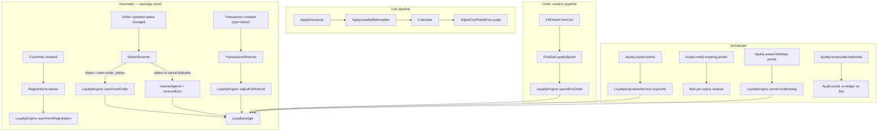

# Loyalty Plugin

Activate this skill when:

- Changing `packages/loyalty` (services, models, pipelines, observers, calculators, commands, config)
- Debugging loyalty balance drift, spend/earn issues, or cart redemption problems
- Adding new earn events, calculators, or adjustment scenarios
- Working on Filament loyalty resources or the `ManageOrder` extension
- Writing or fixing tests in `tests/loyalty/`

## Before You Start

1. Read `packages/loyalty/LOYALTY_PLUGIN.md` for the full reference — it is kept in sync with the code.
2. Treat **this repo's code** as source of truth — not any external loyalty package docs.
3. **Never update `loyalty_accounts.balance` directly.** All balance mutations must go through `LoyaltyLedger`. The only exception is `RecalculateBalancesCommand --fix`.

## Package Layout

| Area | Path |
|------|------|
| Config | `packages/loyalty/config/loyalty.php` → merged as `lunar.loyalty` |
| ServiceProvider | `LoyaltyServiceProvider` — pipelines, validators, observers, schedule, mixins, order relations |
| Plugin | `LoyaltyPlugin` — Filament panel registration |
| Models | `Models/LoyaltyAccount`, `Models/LoyaltyTransaction` |
| Enum | `Enums/LoyaltyTransactionType` (`Earn`, `Spend`, `Expire`, `Adjust`) |
| Services | `LoyaltyLedger`, `LoyaltyEngine`, `LoyaltyRedeemer`, `LoyaltyAccountManager`, `LoyaltyExpirationService` |
| Facade | `Facades/Loyalty` → proxies `LoyaltyEngine` |
| Calculators | `Calculators/OrderTotalCalculator`, `Calculators/FixedPointsCalculator` |
| Calculator contract | `Contracts/EarnCalculator` |
| Cart pipelines | `Pipelines/Cart/ApplyLoyaltyRedemption` (after `ApplyDiscounts`), `Pipelines/Cart/AdjustCartTotalsForLoyalty` (after `Calculate`) |
| Order pipeline | `Pipelines/Order/Creation/FinalizeLoyaltySpend` (after `FillOrderFromCart`) |
| Observers | `Observers/OrderObserver` (on `Order`), `Observers/TransactionObserver` (on `Transaction`) |
| Listener | `Listeners/RegistrationListener` (on `Customer::created`) |
| Mixin | `Mixins/CustomerMixin` — adds `loyaltyAccount()` to `Customer` |
| Support | `Support/LoyaltyEventKey`, `Support/OrderLoyaltySummary` |
| Validation | `Validation/Cart/LoyaltyRedemptionValidator` |
| Console | `Console/{ExpireLoyaltyPointsCommand, NotifyExpiringLoyaltyPointsCommand, AwardBirthdayPointsCommand, RecalculateBalancesCommand}` |
| Filament | `Filament/Resources/LoyaltyTransactionResource`, `Filament/Resources/CustomerResource`, `Filament/Extensions/ManageOrderExtension` |
| Exceptions | `Exceptions/InsufficientLoyaltyPointsException` |
| Tests | `tests/loyalty/` |

## Architecture

**Automatic (no host wiring needed):** Order status changes, transaction refunds, and customer registration are observed by the package itself.

**Host must call for cart redemption:** `LoyaltyRedeemer::applyToCart($cart, $points)` — the pipeline handles the rest.

## Services

### `LoyaltyLedger`

The sole balance writer. All four write methods (`earn`, `spend`, `expire`, `adjust`) run inside a `DB::transaction` with `lockForUpdate` on the account. Each checks `findByEventKey` for idempotency before writing.

- `earn(account, points, eventKey, options)` — creates earn lot with `remaining_points`, increments `balance` and `lifetime_earned`
- `spend(account, points, eventKey, options)` — FIFO lot allocation, decrements `balance`, increments `lifetime_spent`; throws `InsufficientLoyaltyPointsException` if lots insufficient
- `expire(earnLot, eventKey)` — zeroes `remaining_points` on the lot, decrements `balance`
- `adjust(account, signedPoints, eventKey, options)` — positive restores allocations from spend transaction, negative decrements earn lot or does FIFO; increments `balance` by signed value

### `LoyaltyEngine`

Orchestrates business events. All methods check `isEnabled()` first.

- `earnFromOrder(Order)` — uses `order_completed` calculator + multiplier; uses `$order->total` as `order_total_minor`
- `earnFromRegistration(Customer)` — uses `FixedPointsCalculator` with `events.registration.points`
- `earnFromBirthday(Customer, year)` — uses `scheduled_rewards.birthday.points`
- `spendForOrder(Order, points)` — delegates to ledger
- `reverseSpendForCancelledOrder(Order)` — positive adjust restoring the spend; checks `cancel.reverse_spend` config
- `reverseEarnForCancelledOrder(Order)` — negative adjust clawing back earn lot
- `adjustForRefund(Order, Transaction, refundNumber)` — proportional clawback: `floor((refundMinor / orderTotalMinor) * earnedPoints)`, capped to `earnTransaction->remaining_points`
- `manualAdjust(account, signedPoints, reason)` — positive uses `ledger->earn`; negative uses `ledger->adjust`; uses UUID event key (not idempotent)
- `estimateCartPoints(cart)` / `estimateOrderPoints(order)` — read-only, same calculator path, no DB writes

### `LoyaltyRedeemer`

Storefront-facing. Validates and persists redemption intent to cart meta; does not write to the ledger.

- `applyToCart(cart, points)` — validates, writes `loyalty_points_to_redeem` and `loyalty_discount_minor` to `cart.meta`, recalculates
- `clearFromCart(cart)` — removes loyalty meta keys, recalculates
- `clearCartMeta(cart)` — removes meta without recalculating (used by pipeline)
- `validateRedemption(cart, points)` — checks enabled, customer_id, min_redeem, available balance, max_redeem_percent
- `calculateDiscountMinor(points)` — `points * redeem_ratio`
- `getEligibleSubtotal(cart)` — sum of `subTotalDiscounted ?? subTotal` across lines

### `LoyaltyAccountManager`

- `firstOrCreateForCustomer(customer)` — used by engine when earning/spending
- `findForCustomer(customer)` — used by redeemer (returns null if no account)

### `LoyaltyExpirationService`

- `findExpiredLots()` — earn rows with `remaining_points > 0` and `expires_at <= now()`
- `findLotsExpiringWithinDays(days)` — earn rows with `expires_at` in `[now, now+days]`
- `expireAll()` — calls `LoyaltyEngine::expireLot` for each expired lot; returns count

## Cart Pipeline Detail

### `ApplyLoyaltyRedemption` (after `ApplyDiscounts`)

1. Reads `loyalty_points_to_redeem` from `cart.meta`.
2. Calculates `discountMinor = points * redeem_ratio`.
3. Caps to `floor(eligibleSubtotal * max_redeem_percent / 100)`.
4. If capped, recalculates points to match capped discount; if result falls below `min_redeem`, clears meta and skips.
5. Distributes discount proportionally across eligible lines into `subTotalDiscounted` and `discountTotal`.

### `AdjustCartTotalsForLoyalty` (after `Calculate`)

1. Reads `loyalty_discount_minor` from `cart.meta`.
2. Converts ex-tax discount to inc-tax using `Calculate::convertExTaxAmountToIncTaxUsingLines`.
3. Sets `cart->loyaltyTotalIncTax` and adjusts `cart->total` = `subTotalDiscountedWithoutCouponIncTax + shippingTotal - couponTotalIncTax - loyaltyIncTax`.

### `FinalizeLoyaltySpend` (after `FillOrderFromCart`)

Calls `LoyaltyEngine::spendForOrder` — writes the spend to the ledger. If validation fails (e.g. insufficient points), throws before the order is saved.

## Event Keys

All event keys from `Support/LoyaltyEventKey`:

| Event | Key |
|---|---|
| Order earn | `order:{id}:earn` |
| Order spend | `order:{id}:spend` |
| Cancel spend reversal | `order:{id}:cancel:spend` |
| Cancel earn reversal | `order:{id}:cancel:earn` |
| Refund clawback | `order:{id}:refund:{n}` |
| Registration bonus | `customer:{id}:registration` |
| Birthday bonus | `customer:{id}:birthday:{year}` |
| Manual adjust | `adjust:{uuid}` (unique UUID — not idempotent) |
| Lot expiry | `expire:{earnLotId}` |

## Filament Admin

### `LoyaltyTransactionResource`
- Permission: `sales:loyalty:manage`
- Read-only; no create/edit pages
- Registered by `LoyaltyPlugin::make()` in the panel

### `LoyaltyAccountRelationManager` (on Customer page)
- Shows balance stats and all transactions
- **Create account** action: creates account if none exists
- **Adjust** action: form with signed integer `points` and required `reason`; calls `Loyalty::manualAdjust`

### `ManageOrderExtension`
- `extendOrderDiscountBreakdownLines` — appends loyalty redemption line via `OrderLoyaltySummary::fromOrder`
- `extendHiddenOrderMetaKeys` — hides `loyalty_points_to_redeem` and `loyalty_discount_minor` from order meta display

## Making Changes

1. **Respect the enabled gate** — every entry point checks `config('lunar.loyalty.enabled', true)`. Never bypass it.
2. **Use `LoyaltyLedger` for all balance writes** — never `$account->balance = x` or `update(['balance' => ...])` outside the ledger or repair command.
3. **Event key idempotency** — `LoyaltyLedger` checks `findByEventKey` before each write. All system-generated keys are deterministic. Manual adjust keys are UUID-based and deliberately not idempotent.
4. **FIFO lot integrity** — `spend` and negative `adjust` decrement `remaining_points` via `allocateFifo`. Restoring spend (`restoreAllocations`) iterates allocations in reverse. Do not bypass these methods.
5. **Cancel reversal order** — `OrderObserver` calls `reverseSpend` before `reverseEarn`. Both are guarded by `findByEventKey` so they are safe to call even if no prior transaction exists.
6. **Refund clawback cap** — always cap `pointsToReverse` to `earnTransaction->remaining_points` (customer may have spent or had a prior cancel). See `LoyaltyEngine::adjustForRefund`.
7. **Cart pipeline positions** — pipelines are injected at provider boot, not config. Do not add them to config manually.
8. **Expiry notification mailable** — the mailable is instantiated with `($lot, $user, $days)`. The host must provide the class. Sent tokens are stored in `lot.meta.notifications` to prevent re-sending.
9. **`refund.statuses` config** — this key exists but is NOT read by the current `TransactionObserver`, which triggers on `$transaction->type === 'refund'` (the Lunar Transaction model type field).
10. **Birthday attribute** — `AwardBirthdayPointsCommand` reads `$customer->attribute_data->get($attributeHandle)->getValue()` and parses it as a date. The attribute must exist and be parseable by Carbon.

## Testing

Follow `.ai/skills/pest-testing/SKILL.md`. Loyalty-specific:

- Test suite: `tests/loyalty/` with `Lunar\Tests\Loyalty\TestCase`.
- Use `LoyaltyAccountFactory` and `LoyaltyTransactionFactory` for setup.
- Most tests use `RefreshDatabase`.
- Test `LoyaltyLedger` methods directly with pre-created accounts and transactions.
- For pipeline tests, build a cart with `Cart::factory()`, set meta, and run `$cart->calculate()`.
- For observer tests, create an `Order` and update its status — assert transactions created.
- For command tests, create earn lots with past `expires_at` and assert `expire` transactions.
- Assert `loyalty_accounts.balance` after mutations to verify ledger consistency.
- Do not test Filament resources unless explicitly requested.

## Exceptions

- `InsufficientLoyaltyPointsException` — thrown by `LoyaltyLedger::spend` and `LoyaltyLedger::adjust` (negative) when lots have insufficient remaining points; also by `LoyaltyRedeemer::validateRedemption`.

## Common Pitfalls

- Calling `LoyaltyLedger` methods from storefront code — use `LoyaltyRedeemer` and accessors instead.
- Adding a second earn for the same order — `event_key` uniqueness in `LoyaltyLedger` prevents duplicates; the existing transaction is returned silently.
- Expecting `refund.statuses` config to gate refund clawback — it is not read; the trigger is `Transaction::type === 'refund'`.
- Assuming `manualAdjust` with positive points uses an `adjust` type — it uses `earn` type, which creates a spendable lot and increments `lifetime_earned`.
- Assuming schedule is registered unconditionally — each cron key must exist in `config('lunar.loyalty.schedule')` and `enabled` must be true.
- Assuming `available_balance` and `display_balance` always match — they diverge when points expire or are spent; checkout must use `available_balance`.

## Reference

- Full reference doc (kept in sync): `packages/loyalty/LOYALTY_PLUGIN.md`
- Config defaults: `packages/loyalty/config/loyalty.php`
