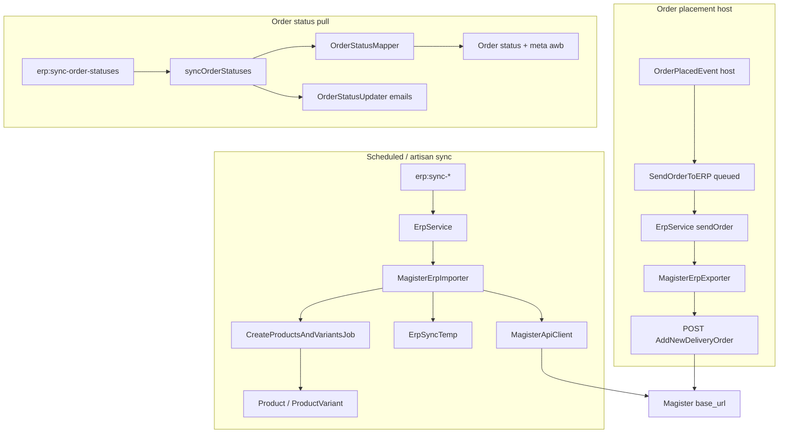

# Magister Integration

Activate this skill when:

- Changing `packages/ERP/src/Providers/Magister/*` (client, importer, exporter, requests, `OrderStatusMapper`, jobs)
- Debugging product/stock/order-status sync, order export to Magister, or inbound status/AWB updates
- Adjusting `lunar.erp` / `lunar.erp.magister` config or host-published `config/lunar/erp/magister.php`
- Working on `SendOrderToERP`, `erp:sync-*` commands, or `ErpSyncTemp` / variant `erp_id`
- Writing or fixing tests under `tests/ERP/Unit/Providers/Magister/` or Magister cases in `tests/ERP/Unit/Services/ErpServiceTest.php`

## Before You Start

1. Read `docs/system/CODE_MAP.md` (ERP / Magister rows) and `docs/design/order_processing.md` (ERP order export, inbound status sync).
2. Treat **this repo’s code** as source of truth — not upstream Lunar PHP and not external Magister API documentation beyond what the Saloon requests implement.
3. Magister handles **import/sync** (products, stock, order statuses, localities, attributes) and **order export** (`send_order`). **Billing/invoicing is Smartbill** — `MagisterErpExporter::generateInvoice()` / `downloadInvoicePDF()` and `MagisterApiClient` billing methods are stubs (empty array / `null`).

## Package Layout


| Area                             | Path                                                                                                                              |
| -------------------------------- | --------------------------------------------------------------------------------------------------------------------------------- |
| Provider config (publish source) | `packages/ERP/src/Providers/Magister/config.php` → host `config/lunar/erp/magister.php`                                           |
| Global ERP config                | `packages/ERP/config/erp.php` → `lunar.erp`                                                                                       |
| Provider registry                | `MagisterErpProvider` (implements `SupportsLocalities`)                                                                           |
| API client                       | `MagisterApiClient` (Saloon `Connector`, `ErpApiClientInterface`)                                                                 |
| Import/sync logic                | `MagisterErpImporter` (`ErpDataImporterInterface`)                                                                                |
| Order export                     | `MagisterErpExporter` (`ErpDataExporterInterface`)                                                                                |
| HTTP requests                    | `Requests/`* (one Saloon request per endpoint)                                                                                    |
| Status mapping                   | `OrderStatusMapper`                                                                                                               |
| Product creation job             | `Jobs/CreateProductsAndVariantsJob`                                                                                               |
| Placement listener               | `Listeners/SendOrderToERP.php` (class in package; **host registers** on `OrderPlacedEvent`)                                       |
| Event                            | `Events/OrderPlacedEvent` (**not dispatched** in this repo)                                                                       |
| Temp staging                     | `Models/ErpSyncTemp`, `Models/ErpSyncLog`                                                                                         |
| Status emails on sync            | `Support/OrderStatusUpdater`                                                                                                      |
| Orchestration                    | `Services/ErpService.php`                                                                                                         |
| Console                          | `SyncErpProductsCommand` (`erp:sync-products`), `SyncErpOrdersCommand` (`erp:sync-order-statuses`), `SyncErpStockCommand` (`erp:sync-stock`), `SyncLocalitiesCommand` (`erp:sync-localities`), `SyncAttributesCommand` (`erp:sync-attributes`) |
| Tests                            | `tests/ERP/Unit/Providers/Magister/`, `tests/ERP/Unit/Listeners/SendOrderToERPTest.php`                                           |
| Overview (may lag code)          | `packages/ERP/ERP_PLUGIN.md`                                                                                                      |


## Architecture




## Host Configuration (required)

Only `packages/ERP/config/erp.php` is merged at boot (`lunar.erp`). Package defaults leave `providers`, `sync.*`, and `actions.*` **empty**. Magister settings live in `packages/ERP/src/Providers/Magister/config.php` as the publish source; the host must publish to `config/lunar/erp/magister.php` (`php artisan vendor:publish --tag=lunar.erp.config`) and list `magister` under `lunar.erp.providers`.

Typical host setup (see `packages/ERP/ERP_PLUGIN.md`):

```php
// config/lunar/erp.php
'providers' => ['magister', 'smartbill'],
'sync' => [
    'products' => ['magister'],
    'orders' => ['magister'],
    'stock' => ['magister'],
    'localities' => ['magister'],
    'attributes' => ['magister'],
],
'actions' => [
    'send_order' => ['magister'],
    'billing' => ['smartbill'],
],
```

```env
ERP_ENABLED=true
MAGISTER_ENABLED=true
MAGISTER_BASE_URL=...
MAGISTER_APP_ID=...
MAGISTER_SHOP_ID=...
```

`ErpServiceProvider::registerErpProviders()` binds `MagisterErpProvider` with `new MagisterErpProvider(new MagisterApiClient)` when `magister` is listed and enabled.

## Configuration (`lunar.erp.magister`)


| Key              | ENV                 | Role                                 |
| ---------------- | ------------------- | ------------------------------------ |
| `enabled`        | `MAGISTER_ENABLED`  | Provider toggle                      |
| `provider_class` | —                   | `MagisterErpProvider`                |
| `importer_class` | —                   | `MagisterErpImporter`                |
| `exporter_class` | —                   | `MagisterErpExporter`                |
| `client_class`   | —                   | `MagisterApiClient`                  |
| `base_url`       | `MAGISTER_BASE_URL` | Saloon connector base URL            |
| `app_id`         | `MAGISTER_APP_ID`   | Path segment on most endpoints       |
| `shop_id`        | `MAGISTER_SHOP_ID`  | Used in articles + confirm receiving |


Global gates: `lunar.erp.enabled` plus per-feature lists under `lunar.erp.sync.*` and `lunar.erp.actions.send_order`.

## HTTP API (this repo)

All requests use JSON headers (`Accept` / `Content-Type: application/json`). Paths are relative to `base_url` (no shared auth helper in code — auth is assumed to be handled by the Magister deployment URL/credentials).


| Request class                     | Method | Endpoint pattern                                                               |
| --------------------------------- | ------ | ------------------------------------------------------------------------------ |
| `GetNextModifiedArticlesRequest`  | GET    | `/GetNextModifiedArticles/{app_id}/{shop_id}`                                  |
| `ConfirmReceivingDataRequest`     | POST   | `/%22ConfirmReceivingDataByTypeOf%22/{app_id}/{typeOf}/{shop_id}/{recVersion}` |
| `GetModifiedStockByShopRequest`   | GET    | `/GetNextModifiedStockByShop/{app_id}`                                         |
| `GetArticleStockByShop`           | GET    | `/GetArticleStockByShop/{app_id}/1/{articleId}` (type `1` = ERP article id)    |
| `GetModifiedDeliveryOrderRequest` | GET    | `/GetModifiedDeliveryOrder/{app_id}`                                           |
| `SendOrderRequest`                | POST   | `/%22AddNewDeliveryOrder%22/{app_id}`                                          |
| `GetLocalitiesRequest`            | GET    | `/GetAllLocalities/{app_id}/RO`                                                |
| `GetAttributesRequest`            | GET    | `/GetAllAttributes/{app_id}`                                                   |


**Confirm `typeOf` values used in importer:**


| typeOf | Used after                                     |
| ------ | ---------------------------------------------- |
| `101`  | Product/article batch (`syncProducts`)         |
| `1`    | Stock batch (`syncStock`)                      |
| `2`    | Modified delivery orders (`syncOrderStatuses`) |


**Response shape:** Importer/provider code expects `response['result'][0]['DATASET']` arrays with Magister field names (`IDSMARTCASH`, `SALECODE`, `ORDER_NUMBER`, `STATUS`, etc.).

## ErpService Entry Points


| Method              | Guard                | Delegates to                                          |
| ------------------- | -------------------- | ----------------------------------------------------- |
| `syncProducts`      | `sync.products`      | `MagisterErpImporter::syncProducts`                   |
| `syncOrderStatuses` | `sync.orders`        | `MagisterErpImporter::syncOrderStatuses`              |
| `syncStock`         | `sync.stock`         | `MagisterErpImporter::syncStock`                      |
| `getLocalities`     | `sync.localities`    | `MagisterErpProvider::getLocalities` via `ErpManager` |
| `getAttributes`     | `sync.attributes`    | `MagisterErpProvider::getAttributes` via `ErpManager` |
| `sendOrder`         | `actions.send_order` | `MagisterErpExporter::sendOrder`                      |


Sync commands call `getAllowedProviders()` for the relevant feature and prompt for provider choice.

## Product Sync (`MagisterErpImporter::syncProducts`)

1. Create `ErpSyncLog` (`provider: magister`, `sync_type: products`).
2. **Loop** `getProductList()` until empty `DATASET`:
  - Skip rows without `SALECODE`.
  - `ErpSyncTemp::updateOrCreate` by `erp_id` + `sku` (price × 100, categories, `provider_data`, `attributes`).
  - `confirmReceivingData(101, RECVERSION)`.
3. `syncStockToTempTable()` — for each temp row with `stock <= 0`, call `getArticleStockByShop(erp_id)`:
  - Use dataset row where `NRSHOP === 98` (webshop); delete temp row if no stock or `STOCK <= 0`.
4. `createProductsAndVariantsFromTemp()` — articles with `stock > 0` plus generic parents of stocked variants; sort by `article_kind` (0, 1, 2); dispatch `CreateProductsAndVariantsJob` per article.
5. Mark sync log completed.

**`provider_data` on temp rows** (via `getProviderSpecificData`):

- `article_kind` ← `ARTICLE_KIND` (0 standard, 1 generic, 2 variant)
- `generic_article_id` ← `IDSMARTCASH_GENERIC_ARTICLE`
- `recversion` ← `RECVERSION`

## Stock Sync (`syncStock`)

Separate command path: loops `getStock()` until empty, updates `ProductVariant` where `erp_id` matches `IDSMARTCASH`:

- Skips items with `NRSHOP === 1`.
- Skips save when stock unchanged (avoids events/jobs).
- `confirmReceivingData(1, RECVERSION)` per batch.

Does **not** call `updateTempTableStock()` (that protected method exists but is unused).

## Order Status Sync (`syncOrderStatuses`)

1. `getModifiedOrders()` once per run.
2. Match `Order::where('reference', ORDER_NUMBER)`.
3. Map `STATUS` + `STATUS_SUBTYPE` via `OrderStatusMapper`.
4. If status changed:
  - Optional `meta.awb` ← `SHIPPING_DOC`
  - Load `lunar.orders.statuses.{status}.mailers`
  - Save new status, then `OrderStatusUpdater::handle()` (admin `UpdatesOrderStatus` trait — customer emails + activity log).
5. `confirmReceivingData(2, RECVERSION)` when version present.

## OrderStatusMapper

Maps Magister `(STATUS, STATUS_SUBTYPE)` → Lunar order status string:


| External | Sub    | Internal           |
| -------- | ------ | ------------------ |
| 1        | *      | `created`          |
| 2        | 21     | `awaiting-payment` |
| 2        | 22     | `payment-received` |
| 2        | other  | `created`          |
| 3        | *      | `confirmed`        |
| 4        | 41, 42 | `prepare-shipment` |
| 4        | 43     | `dispatched`       |
| 4        | 44     | `returned`         |
| 4        | 45     | `completed`        |
| 4        | other  | `completed`        |
| 5        | *      | `returned`         |
| 6        | *      | `canceled`         |
| other    | *      | `created`          |


Customize mapping in `OrderStatusMapper` when host status slugs differ from defaults in `packages/core/config/orders.php`.

## Order Export (`sendOrder`)

**Trigger:** Host dispatches `OrderPlacedEvent` → `SendOrderToERP` (`ShouldQueue`).

**Listener behavior:** If `lunar.erp.enabled`, loops `ErpService::getEnabledProviders()` and calls `sendOrder()` for each. `ErpService::sendOrder` still no-ops unless provider is in `actions.send_order` (so Smartbill is skipped when only Magister is listed there).

**Payload** (`MagisterApiClient::prepareOrderData` → `SendOrderRequest`):

- `NRSHOP` ← `shop_id`
- `ORDER_NUMBER` ← `order.reference`
- `ORDER_DATE` ← `created_at` format `Y.m.d`
- `ORDER_OBS` ← shipping `delivery_instructions`
- `STATUS` `2`, `STATUS_SUBTYPE` `22`, `TYPEOF_DELIVERY` `2` (fixed in code)
- `TYPEOF_PAYMENT`: `1` if `meta.payment_option === 'cash-on-delivery'`, else `2` (all other payment keys → card/online)
- Billing + delivery address fields; country codes hardcoded `'RO'`
- `IDEXTAPP_CUSTOMER` when `user_id` set
- `INVOICE_COMPANY_NAME` / `INVOICE_VAT_NUMBER` when billing `company_name` set
- `ITEMS[]`: `IDSMARTCASH_ARTICLE` ← `purchasable.erp_id`, `IDEXTAPP_ARTICLE` ← sku, `NAME`, `QTY`, `PRICE` (unit price value / 100, 2 decimals)

**Exporter success:** `MagisterErpExporter::sendOrder` returns true only when API JSON has `'success' => true`.

## CreateProductsAndVariantsJob

Queued per temp article (with related variants collection). Switches on `provider_data.article_kind`:

- `0` → `updateOrCreateStandardProduct()`
- `1` → `updateOrCreateGenericProduct()` (variants with stock)
- `2` → skipped at job level (handled via generic parent)

Uses RON currency, default tax class, `AdvancedAmountOff` discounts from ERP discount field, product options from `ITEM_ATTRIBUTES`. Cleans up processed `ErpSyncTemp` rows after run.

Requires `lunar_product_variants.erp_id` migration from ERP package.

## Localities & Attributes

**`MagisterErpProvider::getLocalities`:** Parses `DATASET` → `countyCode`, `countyName`, `localityName`. Throws `ErpSyncException` on failure.

**`getAttributes`:** Parses attribute `NAME` + `ITEMS[].NAME` into `optionName` / `optionValues`.

**`erp:sync-localities`:** Uses `ErpService::getLocalities`, writes `packages/locations` `County` / `Locality` models (Romania `iso2` RO required).

Attributes command consumes `getAttributes` for product option setup (see command implementation in `SyncAttributesCommand`).

## Console Commands


| Command                   | Feature config    | Magister implementation             |
| ------------------------- | ----------------- | ----------------------------------- |
| `erp:sync-products`       | `sync.products`   | `syncProducts`                      |
| `erp:sync-order-statuses` | `sync.orders`     | `syncOrderStatuses`                 |
| `erp:sync-stock`          | `sync.stock`      | `syncStock`                         |
| `erp:sync-localities`     | `sync.localities` | `getLocalities` + locations package |
| `erp:sync-attributes`     | `sync.attributes` | `getAttributes`                     |


Scheduled in `ErpServiceProvider` when `lunar.erp.enabled` and the matching `sync.`* array is non-empty (cron from `lunar.erp.schedule`).

## Making Changes

1. **Respect feature flags** — every sync/send path checks `lunar.erp.enabled`, provider `enabled`, and the relevant `sync.`* / `actions.send_order` list.
2. **RECVERSION batches** — always confirm receiving after processing a non-empty `DATASET`; wrong `typeOf` leaves Magister queue stuck.
3. **NRSHOP rules** — webshop stock uses `98` in temp sync; live variant stock sync ignores `NRSHOP === 1`.
4. **Variant linkage** — export and stock updates need `ProductVariant.erp_id` populated (product sync job).
5. **Order reference** — inbound sync matches `order.reference` to Magister `ORDER_NUMBER`; export sends the same field.
6. **Payment meta** — `order.meta.payment_option` must be set at checkout; only `cash-on-delivery` maps to Magister cash (`TYPEOF_PAYMENT` 1).
7. **Do not use Magister for billing** — keep `actions.billing` on Smartbill only; Magister invoice methods are stubs.
8. **Host wiring** — register `SendOrderToERP` on `OrderPlacedEvent` in lunar-frontend; event is not fired from this repo.
9. **Status mailers** — inbound sync uses `lunar.orders.statuses.{status}.mailers`; ensure mapped statuses exist in host config.

## Testing

Follow `.ai/skills/pest-testing/SKILL.md`. Magister-specific:

- Suite: `tests/ERP/Unit` with `Lunar\Tests\ERP\TestCase`.
- Never call the real Magister API.
- Fake Saloon with `MockClient` / `MockResponse` on `MagisterApiClient` (see `MagisterApiClientTest`, `Requests/RequestsTest`).
- Importer tests: mock `MagisterApiClient`, assert `confirmReceivingData` args, `Bus::fake()` for `CreateProductsAndVariantsJob`.
- `OrderStatusMapperTest` documents full status matrix.
- `SendOrderToERPTest` documents listener queue + `getEnabledProviders` loop.
- Set `lunar.erp.magister.app_id`, `shop_id`, `base_url` in `beforeEach`.

## Exceptions

- `InvalidErpResponseException` — non-success HTTP from `MagisterApiClient`.
- `ErpSyncException` — importer/provider sync failures (localities, attributes, product/stock/order sync).
- `ErpInitializationException` — ERP disabled, provider disabled, or missing importer/client class.

`getArticleStockByShop` failures are reported via `SilentException` + `report()` but return empty JSON (no throw).

## Common Pitfalls

- `TYPEOF_PAYMENT` is binary (COD vs non-COD), not a full payment driver map (contrast Smartbill `PaymentSlugMapper`).
- Hardcoded RO country codes and fixed `STATUS` / `STATUS_SUBTYPE` on export — changing fulfillment workflow requires code changes.
- Empty `lunar.erp.providers` / `sync.`* in package defaults — sync commands exit early until host publishes config.
- Listing Magister under `actions.billing` would call stub `generateInvoice` and write empty billing meta — use Smartbill for billing.
- `updateTempTableStock` in importer is dead code; stock-to-temp uses `getArticleStockByShop` + NRSHOP 98 only.
- Inbound status `4` + unknown substatus maps to `completed` — verify against host AWB/shipping expectations.
- Product sync skips articles without `SALECODE` (discount/non-product rows in Magister feed).


