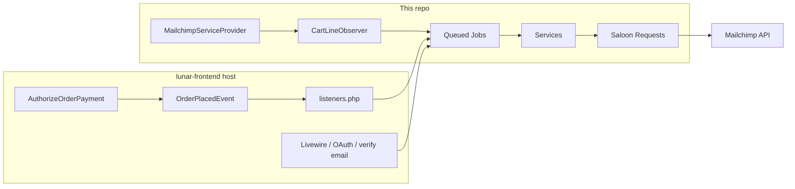

# Mailchimp Integration

Activate this skill when:

- Changing `packages/mailchimp` (services, jobs, requests, observers, commands, config)
- Debugging Mailchimp sync failures or queue jobs
- Adding or adjusting merge fields, event tracking, or bulk sync commands
- Writing or fixing tests in `tests/mailchimp`

## Before You Start

1. Read `docs/system/CODE_MAP.md` (Mailchimp section) and `docs/system/PROJECT_SPECIFICATION.md` (`OrderPlacedEvent` / host wiring).
2. Treat **this repo’s code** as source of truth — not upstream Lunar PHP and not `packages/mailchimp/MAILCHIMP_PLUGIN.md` (may describe lunar-frontend paths inaccurately).
3. Storefront triggers (email verification, OAuth, Livewire event tracking) live in **`lunar-frontend`**; the engine package provides services, jobs, and `CartLineObserver`.

## Package Layout

| Area | Path |
|------|------|
| Config | `packages/mailchimp/config/mailchimp.php` → merged as `lunar.mailchimp` |
| Connector | `Connectors/MailchimpConnector.php` (Saloon, Basic auth, `https://{server}.api.mailchimp.com/3.0/`) |
| Requests | `Requests/*` — one Saloon request per API endpoint |
| Services | `MailchimpService`, `MailchimpEcommerceService`, `MailchimpSubscriberService` |
| Jobs | `Jobs/Sync*ToMailchimp.php`, `SyncAllProductsToMailchimp` |
| Observer | `Observers/CartLineObserver.php` (registered in `MailchimpServiceProvider`) |
| Listener | `Listeners/SyncOrderOnPlacement.php` (**not** registered in package provider) |
| Trait | `Traits/TrackRemoveFromCart.php` (used from lunar-frontend) |
| Tests | `tests/mailchimp/` (Saloon `MockClient`; not in root `phpunit.xml` or CI matrix yet) |

## Architecture

**Engine (automatic):** `CartLine` create/update/delete → `SyncCartToMailchimp` when `enabled` + `sync_carts` and cart has `user_id`.

**Host (must wire):** `OrderPlacedEvent` → `SyncOrderOnPlacement` → `SyncOrderToMailchimp`. Subscriber sync on registration/OAuth and event tracking (`begin_checkout`, `view_item`, `remove_from_cart`) are dispatched from lunar-frontend, not from this package’s provider.

## Configuration (`lunar.mailchimp`)

| Key | Env | Role |
|-----|-----|------|
| `enabled` | `MAILCHIMP_ENABLED` | Master switch; jobs/observers no-op when false |
| `api_key`, `server`, `list_id`, `store_id` | `MAILCHIMP_*` | API credentials; `MailchimpService` requires `api_key` + `list_id` |
| `automatic_subscription` | `MAILCHIMP_AUTOMATIC_SUBSCRIPTION` | Host-controlled opt-in behavior |
| `sync_subscribers` | `MAILCHIMP_SYNC_SUBSCRIBERS` | Subscriber merge-field updates during order sync |
| `sync_products` | `MAILCHIMP_SYNC_PRODUCTS` | Product ecommerce sync |
| `sync_orders` | `MAILCHIMP_SYNC_ORDERS` | Order sync on placement / bulk command |
| `sync_carts` | `MAILCHIMP_SYNC_CARTS` | Abandoned-cart ecommerce carts |
| `track_events` | `MAILCHIMP_TRACK_EVENTS` | Custom member events (default **true** in config) |
| `merge_fields`, `option_fields` | — | Tag mapping; `option_fields` drives custom merge fields from variant options |
| `retry.max_attempts`, `retry.backoff` | `MAILCHIMP_MAX_ATTEMPTS` | Job retries (default 4; backoff 60s, 300s, 3600s) |

Ecommerce operations call `MailchimpService::ensureStoreIdIsSet()` — set `MAILCHIMP_STORE_ID` or run `php artisan mailchimp:create-store`.

## Services

### `MailchimpService`

- Builds `MailchimpConnector`, exposes `getListId()`, `getStoreId()`, `getConnector()`.
- `getCustomerIdFromEmail(string $email): string` → `md5(strtolower(trim($email)))` — **always** use this for ecommerce customer IDs (guest and registered same email → same ID).
- `createStore()` / `getStore()` for store setup commands.

### `MailchimpEcommerceService`

- **`syncProduct`**: PUT product + variants; unavailable products → `deleteProduct`. Prices from default currency, inc tax; image from primary media.
- **`syncCustomer`**: Requires `Customer` with linked user.
- **`syncOrder`**: `syncCustomerAfterOrder` (user or billing `contact_email`) → optional subscriber + merge fields if `sync_subscribers` → PUT order. On 400, syncs line products and retries.
- **`syncCart`**: Logged-in users only; `refresh()` + `recalculate()`; POST cart, on 400 sync products and retry, then PATCH if cart exists. `checkout_url` uses `route('lfp.checkout.details')` — that named route is registered by the host storefront (`lunar-frontend`), not this package.
- **`deleteCart` / `deleteProduct`**: Treat 404 as success.
- **`calculateOrderData`**: Builds merge fields from order lines — `PREFCAT` / `PREFSUBCAT` (collection frequency), configured `option_fields`, phone/address from shipping or billing.

### `MailchimpSubscriberService`

- **`subscribe($email)`**: `status_if_new` = `pending` (double opt-in); re-subscribes unsubscribed/cleaned as `pending`.
- **`syncSubscriber(Customer)`** / **`syncSubscriberByEmail`**: `status_if_new` = `subscribed` + merge fields (FNAME, LNAME from config tags).
- **`trackEvent`**: POST member event; on 404, syncs subscriber from `Customer` by email then retries.
- **`setupMergeFields`**: Creates/updates PREFCAT, PREFSUBCAT, and `option_fields` entries (skips default FNAME/LNAME/PHONE/ADDRESS).

## Jobs

| Job | Unique | Guards | Delegates to |
|-----|--------|--------|----------------|
| `SyncCartToMailchimp` | — | `enabled`, `sync_carts`, `user_id`, non-empty lines (else delete cart) | `syncCart` |
| `SyncOrderToMailchimp` | per order id | `enabled`, `sync_orders` | `syncOrder`; deletes ecommerce cart when `order.cart_id` set |
| `SyncProductToMailchimp` | — | `enabled`, `sync_products`; `ProductEventType` CREATE/UPDATE/DELETE | `syncProduct` / `deleteProduct` |
| `SyncSubscriberToMailchimp` | — | `enabled` only | `syncSubscriber` |
| `SyncCustomerToMailchimp` | — | `enabled` + `sync_customers.enabled` (**not** in default config — host must define if used) |
| `SyncAllProductsToMailchimp` | — | bulk | iterates products |

All sync jobs use `retry` config for `$tries` and `$backoff`. Failures wrap in `FailedMailchimpSyncException`.

## Artisan Commands

| Command | Purpose |
|---------|---------|
| `mailchimp:create-store` | Create Mailchimp ecommerce store |
| `mailchimp:setup-merge-fields` | Audience merge fields from config |
| `mailchimp:sync-all-users` | Bulk subscriber sync |
| `mailchimp:sync-all-orders` | Bulk orders where `status = completed` (verify host order statuses — core defaults may not include `completed`) |
| `mailchimp:sync-all-products` | Dispatches product sync jobs |

## HTTP Layer

- Add new endpoints as Saloon `Request` classes under `Requests/`, sent via `MailchimpConnector`.
- Do not call Mailchimp from controllers in this package; dispatch jobs or call services from listeners/host code.
- Auth: Basic with username `anystring` and password = API key.

## Making Changes

1. **Respect feature flags** — every entry path checks `lunar.mailchimp.enabled` and the relevant `sync_*` / `track_events` flag.
2. **Keep customer IDs consistent** — use `getCustomerIdFromEmail()` for any ecommerce customer reference.
3. **Order placement** — if changing post-checkout Mailchimp behavior, update `SyncOrderOnPlacement` and confirm host still registers it on `OrderPlacedEvent`.
4. **Cart sync** — only authenticated carts (`cart.user_id`); observer runs after DB commit.
5. **Guest orders** — email from `order.billingAddress.contact_email` when no `user_id`.
6. **Product/cart/order 400 handling** — existing pattern: sync missing products, retry POST, then PATCH for carts.
7. **Event tracking** — failures in host/Livewire should use `SilentException` + `report()` (see `TrackRemoveFromCart`); subscriber 404 auto-sync is in `trackEvent`.
8. **Avoid widening package scope** — storefront UX and listener registration belong in lunar-frontend unless explicitly moving wiring into this repo.

## Testing

Follow `.ai/skills/pest-testing/SKILL.md` for general rules. Mailchimp-specific:

- Never hit the real Mailchimp API.
- Fake Saloon with `MockClient` / `MockResponse` on the connector (see `tests/mailchimp/Services/MailchimpServiceTest.php`).
- Set config in `beforeEach`: `lunar.mailchimp.api_key`, `list_id`, `store_id`, `server`.
- Assert dispatched jobs, request payloads, and config guards — not live API responses.
- When adding substantial tests, register a `mailchimp` testsuite in `phpunit.xml` and CI (see `docs/system/TESTING.md`).

## Exceptions

- `MissingMailchimpConfigurationException` — missing `api_key`/`list_id` or store id for ecommerce.
- `FailedMailchimpSyncException` — API or job failure (rethrown from jobs).

## Common Pitfalls

- Assuming `SyncOrderOnPlacement` is auto-registered — **host** `config/lunar-frontend/listeners.php`.
- Assuming `OrderPlacedEvent` fires from core/ERP — dispatched from `AuthorizeOrderPayment` in lunar-frontend.
- `mailchimp:sync-all-orders` filters `status = completed` — may not match host-published statuses.
- `MAILCHIMP_PLUGIN.md` documents lunar-frontend file paths; verify in the frontend repo before editing triggers there.
- `SyncSubscriberToMailchimp` does not check `sync_subscribers`; order path does via `syncCustomerAfterOrder`.

## Reference

- Package overview (may be stale on host paths): `packages/mailchimp/MAILCHIMP_PLUGIN.md`
- Config defaults: `packages/mailchimp/config/mailchimp.php`
