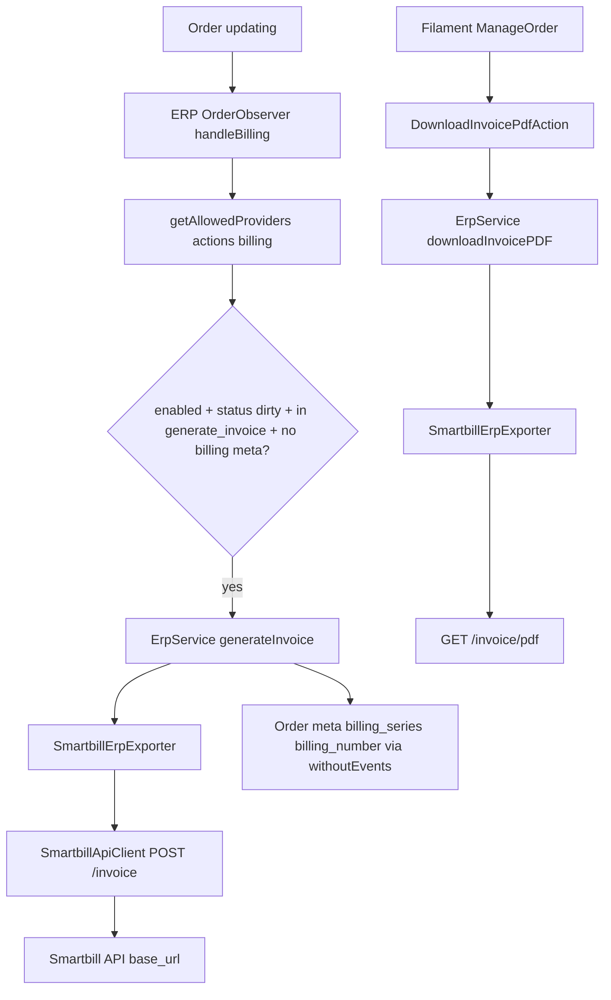

# Smartbill Integration

Activate this skill when:

- Changing `packages/ERP/src/Providers/Smartbill/*` (client, exporter, DTOs, requests, `PaymentSlugMapper`)
- Debugging invoice generation, PDF download, or order `meta` billing fields
- Adjusting `lunar.erp` / `lunar.erp.smartbill` config or host-published `config/lunar/erp/smartbill.php`
- Working on `packages/ERP/src/Observers/OrderObserver.php` billing behavior
- Writing or fixing tests under `tests/ERP/Unit/Providers/Smartbill/` or Smartbill cases in `tests/ERP/Unit/Services/ErpServiceTest.php`

## Before You Start

1. Read `docs/system/CODE_MAP.md` (ERP / Smartbill rows) and `docs/design/order_processing.md` (ERP invoice observer section).
2. Treat **this repo’s code** as source of truth — not upstream Lunar PHP and not assumptions about Smartbill Cloud API docs beyond what the Saloon requests implement.
3. Smartbill here is **billing only** (invoice + PDF). Product/stock/order sync and `send_order` are **Magister** concerns. `SmartbillErpExporter::sendOrder()` always returns `false`; `SmartbillApiClient` sync methods return empty arrays.

## Package Layout

| Area | Path |
|------|------|
| Provider config (publish source) | `packages/ERP/src/Providers/Smartbill/config.php` → host `config/lunar/erp/smartbill.php` |
| Global ERP config | `packages/ERP/config/erp.php` → `lunar.erp` |
| Provider registry | `SmartbillErpProvider` |
| API client | `SmartbillApiClient` (Saloon `Connector`, implements `ErpApiClientInterface`) |
| Order → payload mapping | `SmartbillErpExporter` (implements `ErpDataExporterInterface`) |
| HTTP requests | `Requests/GenerateInvoiceRequest`, `Requests/DownloadInvoicePDFRequest` |
| DTOs | `DTOs/SmartbillClient`, `SmartbillProduct`, `SmartbillInvoiceRequestBody`, `SmartbillPrintRequestQuery` |
| Payment observations | `PaymentSlugMapper` |
| Invoice trigger | `packages/ERP/src/Observers/OrderObserver.php` |
| Orchestration | `packages/ERP/src/Services/ErpService.php` (`generateInvoice`, `downloadInvoicePDF`) |
| Admin PDF action | `packages/ERP/src/Filament/Actions/DownloadInvoicePdfAction.php` via `packages/ERP/src/Filament/Extensions/ShippingExtension.php` (ERP panel extension on `ManageOrder`, not `packages/shipping`) |
| Enum | `Enums/ErpProviderEnum::smartbill` |
| Tests | `tests/ERP/Unit/Providers/Smartbill/`, `tests/ERP/Unit/Services/ErpServiceTest.php` |
| Overview (may lag code) | `packages/ERP/ERP_PLUGIN.md` |

## Architecture



**Automatic (package):** On `Order::updating`, when billing is configured and guards pass, invoice is created and `meta` is updated.

**Not Smartbill:** `OrderPlacedEvent` → `SendOrderToERP` → `ErpService::sendOrder()` uses Magister when `lunar.erp.actions.send_order` lists `magister`. That path does not call Smartbill.

## Host Configuration (required)

Only `packages/ERP/config/erp.php` is merged at boot (`lunar.erp`). Package defaults leave `providers`, `sync.*`, and `actions.*` **empty**. Smartbill settings live in `packages/ERP/src/Providers/Smartbill/config.php` as the publish source; the host must publish to `config/lunar/erp/smartbill.php` (`php artisan vendor:publish --tag=lunar.erp.config`) so `config('lunar.erp.smartbill')` resolves, and list `smartbill` under `lunar.erp.providers`.

Typical host setup (see `packages/ERP/ERP_PLUGIN.md`):

```php
// config/lunar/erp.php
'providers' => ['magister', 'smartbill'],
'actions' => [
    'send_order' => ['magister'],
    'billing' => ['smartbill'],
],
```

```env
ERP_ENABLED=true
SMARTBILL_ENABLED=true
SMARTBILL_BASE_URL=...
SMARTBILL_EMAIL=...
SMARTBILL_TOKEN=...
SMARTBILL_COMPANY_VAT_CODE=...
SMARTBILL_SERIES_NAME=...
SMARTBILL_MEASURING_UNIT_NAME=buc
SMARTBILL_SAVE_TO_DB=false
```

(`measuring_unit_name` has no default in package config; set via env when publishing.)

`ErpServiceProvider::registerErpProviders()` binds each enabled entry in `lunar.erp.providers` using `provider_class` + `client_class` from `lunar.erp.{provider}`.

## Configuration (`lunar.erp.smartbill`)

| Key | ENV | Role |
|-----|-----|------|
| `enabled` | `SMARTBILL_ENABLED` | Provider toggle; observer and `ErpService` check this |
| `provider_class` | — | `SmartbillErpProvider` |
| `client_class` | — | `SmartbillApiClient` |
| `exporter_class` | — | `SmartbillErpExporter` |
| `base_url` | `SMARTBILL_BASE_URL` | Saloon connector base URL |
| `email`, `token` | `SMARTBILL_EMAIL`, `SMARTBILL_TOKEN` | HTTP Basic auth on both requests |
| `company_vat_code` | `SMARTBILL_COMPANY_VAT_CODE` | Company CIF on invoice body and PDF query |
| `series_name` | `SMARTBILL_SERIES_NAME` | Invoice series sent to API |
| `measuring_unit_name` | `SMARTBILL_MEASURING_UNIT_NAME` | Unit for **product** lines only |
| `save_to_db` | `SMARTBILL_SAVE_TO_DB` | Passed to client and line items in exporter |
| `tax_names` | — | Map tax **percentage string** → Smartbill label (defaults `'21' => 'Normala'`, `'11' => 'Redusa'`) |
| `generate_invoice` | — | Order statuses that trigger invoicing (default `['awaiting-payment']`) |

Global gates: `lunar.erp.enabled` and `lunar.erp.actions.billing` must include `smartbill`.

## Invoice Generation Flow

**Observer** (`OrderObserver::updating` → `handleBilling`):

1. `ErpService::getAllowedProviders('actions', 'billing')` — non-empty required.
2. Per provider: `lunar.erp.{provider}.enabled` must be true.
3. Skip if `meta.billing_series` and `meta.billing_number` already set.
4. Skip unless `status` is dirty.
5. Skip unless new `status` is in `lunar.erp.{provider}.generate_invoice`.
6. `ErpService::generateInvoice($provider, $order)`.
7. Filament success notification only when `! $order->reference` (after generation).

**Service** (`ErpService::generateInvoice`):

- Resolves `SmartbillErpExporter` with `SmartbillApiClient` from config classes.
- Persists API response via `Order::withoutEvents()`:
  - `meta['billing_series']` = `$response['series']`
  - `meta['billing_number']` = `$response['number']`

## SmartbillErpExporter — Payload Mapping

Loads: `billingAddress.country`, `productLines.purchasable.values`, `productLines.purchasable.product`.

**Client** (`SmartbillClient` from billing address):

- `name`: `company_name` if set, else `first_name` + `last_name`
- `vatCode`: `tax_identifier` if non-empty, else `'-'`
- `isTaxPayer`: always `false`
- Address fields from billing; `country` from related country **name**
- `email`: `contact_email`

**Product lines** (one `SmartbillProduct` per order product line):

- `name`: translated product name + variant option values (default language)
- `code`: `productLine->identifier`
- `measuringUnitName`: from config
- `price`: `unit_price_without_coupon->decimal`
- `isTaxIncluded`: `config('lunar.pricing.stored_inclusive_of_tax', false)`
- `taxName` / `taxPercentage`: from `tax_names[(string) (taxRate * 100)]` and `taxRate * 100`
- `isService`: `false`

**Shipping line** (if `shipping_total->decimal > 0`):

- `name`: `'Cost de livrare'`, `code`: `'SHIPPING'`
- `measuringUnitName`: hardcoded `'buc'` (not `measuring_unit_name` config)
- `price`: `shipping_total->decimal`
- Tax: from first shipping line tax breakdown percentage, else default tax class + default tax zone rate
- `isTaxIncluded`: `true` when shipping tax percentage exists, else `false`
- `isService`: `true`

**Coupon line** (if `$order->appliedCoupon`):

- Name: `'Cupon de reducere'` (+ optional coupon code suffix), code `'CUPON'`, negative `coupon_total->decimal`, default tax class rate, `isService`: `true`

**Observations** (`buildInvoiceObservations`):

Format: `#` + `{reference}` + `_` + `{paymentSlug}` + `_` + `{shippingSegment}`

- `reference`: trimmed `order.reference` (blank → empty segment, e.g. `#_ramburs_dpd`)
- `paymentSlug`: `PaymentSlugMapper` on `order.meta.payment_option`
- `shippingSegment`: first `shipping_breakdown` item `identifier` (empty if no items)

### PaymentSlugMapper

Hardcoded `match` on `order.meta.payment_option` (not config-driven):

| `payment_option` | Slug |
|------------------|------|
| `offline`, `cash-on-delivery` | `ramburs` |
| `hosted-payment`, `stripe-card` | `card` |
| other / missing | `''` |

To support new payment types, extend `PaymentSlugMapper` (and tests).

## HTTP API (this repo)

| Request | Method | Endpoint | Auth |
|---------|--------|----------|------|
| `GenerateInvoiceRequest` | POST | `/invoice` | Basic: email + token |
| `DownloadInvoicePDFRequest` | GET | `/invoice/pdf` | Basic; query: `seriesname`, `number`, `cif` |

`SmartbillApiClient`:

- `generateInvoice`: throws `FailedErpInvoiceGenerationException` on non-success HTTP
- `downloadInvoicePDF`: returns `Saloon\Http\Response` or throws same exception
- Exporter also throws if JSON lacks `series`/`number` (uses `errorText` when present)

## PDF Download (admin)

`ShippingExtension` adds `DownloadInvoicePdfAction` when `billing_series` and `billing_number` are non-empty in `meta`.

Action loops `getAllowedProviders('actions', 'billing')`, calls `downloadInvoicePDF`, streams body as `Invoice-{provider}-{number}.pdf` on success.

## Making Changes

1. **Respect ERP gates** — `lunar.erp.enabled`, `actions.billing`, `smartbill.enabled`, and `generate_invoice` status list.
2. **Idempotency** — observer skips when billing meta already exists; do not regenerate without clearing meta intentionally.
3. **Tax name keys** — `tax_names` keys must match `(string) (taxRate * 100)` for lines; missing keys cause runtime errors.
4. **Romanian labels** — shipping/coupon line names and default `tax_names` are RO-specific; align with Smartbill account setup.
5. **Order meta** — `payment_option` and `shipping_breakdown` drive observations; checkout must copy `payment_option` to order meta (see `PROJECT_SPECIFICATION.md`).
6. **Pricing config** — `lunar.pricing.stored_inclusive_of_tax` affects `isTaxIncluded` on product lines.
7. **Do not use Smartbill for sync** — no importer; listing `smartbill` under `sync.*` yields empty data (`getLocalities` test confirms no `SupportsLocalities`).
8. **Preserve `Order::withoutEvents`** when saving billing meta after invoice creation to avoid observer loops.

## Testing

Follow `.ai/skills/pest-testing/SKILL.md`. Smartbill-specific:

- Suite: `tests/ERP/Unit` (`Lunar\Tests\ERP\TestCase`, `RefreshDatabase`).
- Never call the real Smartbill API.
- API tests: Saloon `MockClient` on `SmartbillApiClient` (`SmartbillApiClientTest`, exporter integration tests).
- Exporter unit tests: mock `ErpApiClientInterface`, assert `payload->toArray()` including `observations`.
- Service tests: set full `lunar.erp.smartbill.*` + `actions.billing` like `ErpServiceTest` `beforeEach`.
- Set default `TaxClass` + `TaxZone` + `TaxRateAmount` when exporter resolves default tax for shipping/coupon lines.

**Note:** `SmartbillErpExporterTest` sets `lunar.erp.smartbill.observations.payment_map` — that key is **not read** by production code; payment slugs come only from `PaymentSlugMapper`.

## Exceptions

- `FailedErpInvoiceGenerationException` — HTTP failure, missing series/number, or wrapped exporter/client errors.
- `ErpInitializationException` — ERP disabled, provider disabled, or missing exporter/client class at boot.

