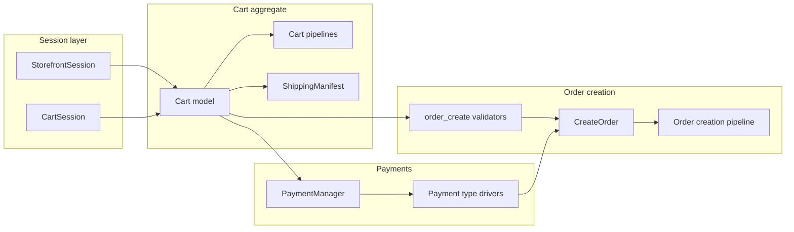

# Checkout — Software Design Document (Engine)

Last verified: 2026-06-03 against `lunarphp/lunar-minic` at repository HEAD.

## Purpose and scope

This document describes **checkout domain behavior implemented in this repository** (`lunarphp/lunar-minic`): the cart as checkout aggregate, session binding, calculation pipelines, shipping resolution, order creation from cart, and payment driver infrastructure.

This repo does **not** ship storefront HTTP routes, Livewire pages, or checkout UI. A host application (`minic/lunar-frontend`) consumes the engine through models, facades, and config. UI flow, payment finalization orchestration, and analytics live in the host — see [PROJECT_SPECIFICATION.md](../system/PROJECT_SPECIFICATION.md) § Host application integration.

For navigation, see [CODE_MAP.md](../system/CODE_MAP.md) § Cart & session, Orders, Payments, Table-rate shipping, Carrier shipping.

---

## High-level model

Checkout in the engine centers on a single mutable aggregate:

| Concept | Model / service | Role |
| --- | --- | --- |
| Checkout basket | `Lunar\Models\Cart` | Lines, addresses, shipping option, coupon, totals, `meta` JSON |
| Storefront context | `StorefrontSessionManager` | Channel, currency, customer groups, customer |
| Session binding | `CartSessionManager` | Maps HTTP session (or authenticated user) to cart ID |
| Totals | Cart calculation pipeline | Lines → shipping → discounts → tax → cart total |
| Shipping quotes | `ShippingManifest` + modifiers | Resolves `ShippingOption` instances for the cart |
| Order materialization | `CreateOrder` action + creation pipeline | Draft/completed `Order` from cart |
| Payment | `PaymentManager` + `PaymentTypes\*` | Driver registry; authorize/capture/refund contracts |



The host is responsible for **when** to call cart methods (addresses, `setShippingOption`, `recalculate`, `createOrder`, `Payments::driver()->authorize()`). The engine defines **what** those calls do and which invariants must hold.

---

## Session layer

### Cart session (`CartSession` / `CartSessionManager`)

**Path:** `packages/core/src/Managers/CartSessionManager.php`  
**Config:** `packages/core/config/cart_session.php`

| Behavior | Detail |
| --- | --- |
| Session key | `lunar_cart` stores active cart ID |
| Binding | Scoped service (not singleton) |
| Resolution | `current()` → `fetchOrCreate()`; can load user's active cart when session empty |
| Auth merge | On login, guest cart merged per `lunar.cart.auth_policy` (default: `merge`) |
| Shipping estimates | Optional `estimateShippingUsing()` meta in session (`shipping_estimate_meta`) |
| Forget | `forget()` removes session key; optional cart row delete per config |

### Storefront session (`StorefrontSession` / `StorefrontSessionManager`)

**Path:** `packages/core/src/Managers/StorefrontSessionManager.php`

| Stored context | Used for |
| --- | --- |
| Channel | Product visibility, cart channel_id |
| Currency | Price resolution, cart currency |
| Customer groups | Pricing, discounts, shipping eligibility |
| Customer | Cart `customer_id`, address ownership |

Initialized on each request from session keys under `lunar_storefront_*`.

---

## Cart aggregate API

**Path:** `packages/core/src/Models/Cart.php`  
**Config:** `packages/core/config/cart.php` (actions, validators, pipelines, eager loads)

Public cart operations delegate to configured action classes. Important checkout-related methods:

| Method | Action / behavior |
| --- | --- |
| `recalculate()` | Runs `lunar.cart.pipelines.cart` |
| `addAddress()` / `setShippingAddress()` / `setBillingAddress()` | `AddAddress` |
| `setShippingOption(ShippingOption)` | Validators → `SetShippingOption` → optional recalculate |
| `getShippingOption()` | Reads from `ShippingManifest` after calculate |
| `createOrder()` | Validators → `CreateOrder` |
| `canCreateOrder()` | Runs same validators without throwing |
| `isShippable()` | Any line purchasable is shippable |

Cart relations: `lines`, `shippingAddress`, `billingAddress`, `currency`, `channel`, `customer`, `user`, draft/completed `orders`.

### Cart `meta` JSON

The engine treats `meta` as opaque JSON on the cart. `FillOrderFromCart` copies it to `order.meta` unchanged.

Hosts typically persist checkout choices here (documented in [PROJECT_SPECIFICATION.md](../system/PROJECT_SPECIFICATION.md)):

| Key | Typical use in integrations |
| --- | --- |
| `payment_option` | Selected payment type key from `lunar.payments.types` |
| `shippingType` | `courier` or `locker` (`Lunar\Addons\Shipping\Enums\ShippingType`) |
| `isBillingSameAsShipping` | Billing mirrors shipping when true |
| `is_guest` | Guest vs registered checkout (host convention) |
| `language_locale` | Locale for transactional email (host convention) |

Address-level meta (e.g. `locker_id` on `CartAddress`) is used by carrier AWB logic in `packages/shipping`.

---

## Cart calculation pipeline

**Config:** `packages/core/config/cart.php` → `pipelines.cart`

Executed on `$cart->recalculate()` (and indirectly after many mutating actions):

| Order | Class | Responsibility |
| --- | --- | --- |
| 1 | `Pipelines\Cart\CalculateLines` | Line subtotals; per-line pipeline includes `GetUnitPrice` |
| 2 | `Pipelines\Cart\ApplyShipping` | Applies selected `ShippingOption` from manifest |
| 3 | `Pipelines\Cart\ApplyDiscounts` | `DiscountManager` — automatic + coupon (`AdvancedAmountOff`) |
| 4 | `Pipelines\Cart\CalculateTax` | Tax breakdown on lines and cart |
| 5 | `Pipelines\Cart\Calculate` | Cart-level total properties |

**Line pipeline:** `pipelines.cart_lines` → `Pipelines\CartLine\GetUnitPrice` (uses `PricingManager`).

Fork note: cart/order totals include coupon vs non-coupon breakdowns; discount default type is `AdvancedAmountOff` only. See [pricing_and_discounts.md](./pricing_and_discounts.md).

---

## Cart actions and validators

**Config:** `packages/core/config/cart.php`

### Actions

| Config key | Class | Checkout use |
| --- | --- | --- |
| `add_to_cart` | `AddOrUpdatePurchasable` | Pre-checkout |
| `add_address` | `AddAddress` | Billing/shipping `CartAddress` rows |
| `set_shipping_option` | `SetShippingOption` | Persist selected manifest option |
| `order_create` | `CreateOrder` | Materialize order from cart |

### Validators

| Hook | Default classes |
| --- | --- |
| `add_to_cart` / `update_cart_line` | `CartLineQuantity`, `CartLineStock` (stock optional via `lunar.cart.stock_check.enabled`) |
| `set_shipping_option` | `ShippingOptionValidator` |
| `order_create` | `ValidateCartForOrderCreation` |

### `ValidateCartForOrderCreation`

**Path:** `packages/core/src/Validation/Cart/ValidateCartForOrderCreation.php`

Fails when:

- Cart already has a **completed** order (`completedOrder` relation).
- **Billing address** missing or fails rules: `country_id`, `first_name`, `line_one`, `city`, `postcode` required.
- Cart is **shippable** and:
  - No shipping option on cart, or
  - Option is not collection (`collect`) but **shipping address** missing/invalid (same field rules).

Hosts may add validators to `lunar.cart.validators.order_create` for stricter checkout rules.

---

## Shipping at checkout

### Core manifest

**Classes:** `Lunar\Base\ShippingManifest`, `Lunar\DataTypes\ShippingOption`, `Lunar\Base\ShippingModifiers`

- Modifiers register via `ShippingModifiers` and contribute options for a calculated cart.
- `$cart->setShippingOption()` validates then stores selection; `getShippingOption()` reads it post-calculate.

### Table-rate shipping (`packages/table-rate-shipping`)

When `lunar.shipping-tables.enabled` is true, `ShippingModifier` adds zone/method/rate options.

**Resolution:** `Resolvers\ShippingRateResolver`, `ShipBy`

Considers: country/state/postcode, method enabled, customer groups, cut-off time, stock, exclusions, customer type (`AddressCustomerType`), discounted subtotal (excluding coupons) or cart weight, locker weight cap (20 kg).

**Config:** `packages/table-rate-shipping/config/shipping-tables.php` → `lunar.shipping-tables`

### Carrier add-on (`packages/shipping`)

Provides `ShippingType` enum (`courier`, `locker`), locker/county/city models, and provider integrations (Sameday, DPD, Pickup, InHouse).

AWB generation and tracking are **order lifecycle** concerns (order status observer), not cart calculation. Locker identifiers belong on address `meta` for AWB builders.

**Config:** `packages/shipping/config/shipping.php` merges into `lunar.shipping`

### Locations reference data (`packages/locations`)

`County` and `Locality` models for structured addresses. Migrations are **not** auto-loaded by the provider; the host must run them. Used by host UI, not enforced by core cart validators.

---

## Order creation from cart

### Entry point

```php
$order = $cart->createOrder(
    allowMultipleOrders: false,
    orderIdToUpdate: null,
);
```

1. `$cart->refresh()->recalculate()`
2. Run `lunar.cart.validators.order_create`
3. Execute `CreateOrder` action

### `CreateOrder` action

**Path:** `packages/core/src/Actions/Carts/CreateOrder.php`

| Step | Behavior |
| --- | --- |
| Transaction | Whole flow wrapped in `DB::transaction` |
| Draft reuse | Uses existing draft order for cart (`draftOrder()`) or new `Order` model |
| Completed guard | `DisallowMultipleCartOrdersException` if completed orders exist and not allowed |
| Fingerprint | Sets `cart_id`, `fingerprint` from cart |
| Pipeline | `config('lunar.orders.pipelines.creation')` |
| Post-job | `MarkAsNewCustomer::dispatch($order->id)` |
| Return | Refreshed `Order` |

Hosts may append pipeline stages in published `config/lunar/orders.php` (not defined in core alone).

### Creation pipeline (core default)

**Config:** `packages/core/config/orders.php` → `pipelines.creation`

| Stage | Class | Purpose |
| --- | --- | --- |
| 1 | `FillOrderFromCart` | Recalculates cart; copies totals, customer, channel, currency, **meta**; sets `draft_status`; generates `reference` |
| 2 | `CreateOrderLines` | Syncs lines from cart; matches existing order lines by purchasable + meta diff |
| 3 | `CreateOrderAddresses` | Copies cart billing/shipping to `OrderAddress` |
| 4 | `CreateShippingLine` | Shipping order line from selected option |
| 5 | `CleanUpOrderLines` | Removes order lines no longer in cart |
| 6 | `MapDiscountBreakdown` | Persists discount breakdown on order |

**Draft status:** `lunar.orders.draft_status` (core default: `awaiting-payment`).

**Statuses:** Core defines a minimal set in `packages/core/config/orders.php`; production hosts typically publish a larger list.

### Draft vs completed orders

- `Cart::draftOrder()` — incomplete order linked to cart (reused on repeat `createOrder`).
- `Cart::hasCompletedOrders()` / `completedOrder` — blocks duplicate creation unless `allowMultipleOrders` or `lunar.cart_session.allow_multiple_orders_per_cart`.
- Payment drivers in core/packages often call `createOrder()` during `authorize()` if no draft exists (`OfflinePayment`, `StripePaymentType`).

---

## Payments (engine)

### Payment manager

**Path:** `packages/core/src/Managers/PaymentManager.php`  
**Facade:** `Lunar\Facades\Payments`  
**Config:** `packages/core/config/payments.php`

| Concept | Detail |
| --- | --- |
| Registry | `Payments::extend($name, callable)` registers drivers |
| Default type | `cash-in-hand` → `offline` driver (`OfflinePayment`) |
| Type config | Each key maps `driver`, `authorized` status string, etc. |

### `OfflinePayment` (core)

**Path:** `packages/core/src/PaymentTypes/OfflinePayment.php`

- `authorize()` — creates or reuses draft order via `$cart->createOrder()`, merges meta, sets status from config/data, sets `placed_at`, dispatches `PaymentAttemptEvent`.
- `initiatePayment()` — returns redirect URL from `$this->data['successUrl']`.

### Payment packages in this repo

| Package | Registration | Notes |
| --- | --- | --- |
| `packages/stripe` | `Payments::extend('stripe')` | `StripePaymentType`, PaymentIntent, webhook route, `ProcessStripeWebhook` job |

Stripe webhook and 3DS Livewire live under `packages/stripe`; webhook path from `lunar.stripe.webhook_path`.

The engine exposes **contracts** (`authorize`, `capture`, `refund`, `initiatePayment` on payment types). Hosts commonly register **additional** payment type keys (e.g. `cash-on-delivery`, `stripe-card`) in published config — those driver classes are not in this repository.

### Transactions

**Model:** `Lunar\Models\Transaction`  
Card/offline flows may create transaction rows on the order (package-specific). Core order aggregate owns `transactions` relation.

---

## Package side effects relevant to checkout

Behaviors in this repo that touch checkout data but are not part of cart UI:

| Package | Trigger | Effect |
| --- | --- | --- |
| `packages/mailchimp` | `CartLineObserver` (after commit) | Queues `SyncCartToMailchimp` when enabled |
| `packages/mailchimp` | `SyncOrderOnPlacement` listener class | Listens for `OrderPlacedEvent` — **registration is host responsibility** |
| `packages/ERP` | `OrderPlacedEvent` class | Defined here; **dispatch is host responsibility** |
| `packages/ERP` | `OrderObserver` | Invoice generation on order update (Smartbill) |
| `packages/shipping` | `OrderObserver` | AWB when status matches `lunar.shipping.generate_awb_on_status` |

`PaymentAttemptEvent` is dispatched from core/package payment types on successful authorization.

---

## Exceptions

| Exception | When |
| --- | --- |
| `DisallowMultipleCartOrdersException` | `createOrder` with completed order on cart |
| `PurchasableNotFoundException` / `NonPurchasableItemException` | Invalid cart lines during session load |
| `InsufficientStockException` / `OutOfStockException` | When stock check enabled or host validates stock |
| Validation failures | `ValidateCartForOrderCreation`, shipping/line validators via `BaseValidator` |

---

## Extension points

| Goal | Mechanism |
| --- | --- |
| Cart total logic | `lunar.cart.pipelines.cart` / `cart_lines` |
| Stricter order readiness | `lunar.cart.validators.order_create` |
| Custom order fields/lines | Append `lunar.orders.pipelines.creation` |
| Shipping methods | Register `ShippingModifiers`; configure table-rate or carrier providers |
| Payment method | `Payments::extend()` + entry in `lunar.payments.types` |
| Replace models | `ModelManifest::addDirectory()` |
| Cart session policy | `lunar.cart.auth_policy`, `lunar.cart_session.*` |
| Stock at add-to-cart | `lunar.cart.stock_check.enabled` |

Preserve fork conventions: coupon-aware totals, `cart.meta` → `order.meta` copy, and customer group visibility on purchasables.

---

## Key source locations (this repo)

| Area | Path |
| --- | --- |
| Cart model | `packages/core/src/Models/Cart.php` |
| Cart config | `packages/core/config/cart.php`, `cart_session.php` |
| Cart session | `packages/core/src/Managers/CartSessionManager.php` |
| Storefront session | `packages/core/src/Managers/StorefrontSessionManager.php` |
| Cart pipelines | `packages/core/src/Pipelines/Cart/`, `Pipelines/CartLine/` |
| Cart actions | `packages/core/src/Actions/Carts/` |
| Cart validation | `packages/core/src/Validation/Cart/`, `Validation/CartLine/` |
| Order creation | `packages/core/src/Actions/Carts/CreateOrder.php` |
| Order pipelines | `packages/core/config/orders.php`, `packages/core/src/Pipelines/Order/Creation/` |
| Discounts in cart | `packages/core/src/Pipelines/Cart/ApplyDiscounts.php`, `Managers/DiscountManager.php` |
| Pricing | `packages/core/src/Managers/PricingManager.php`, `config/pricing.php` |
| Payments core | `packages/core/src/Managers/PaymentManager.php`, `PaymentTypes/OfflinePayment.php`, `config/payments.php` |
| Stripe | `packages/stripe/src/` |
| Table-rate shipping | `packages/table-rate-shipping/src/ShippingModifier.php`, `Resolvers/` |
| Carrier shipping | `packages/shipping/src/` |
| Locations | `packages/locations/src/Models/` |
| Mailchimp cart sync | `packages/mailchimp/src/Observers/CartLineObserver.php` |
| Tests | `tests/core/` (cart, order creation pipelines) |

---

## Consumer integration (boundary)

Hosts typically:

1. Bind cart to session via `CartSession::current()`.
2. Mutate cart (addresses, `meta`, `coupon_code`, `setShippingOption`).
3. Call `$cart->recalculate()` before displaying totals.
4. On commit: `Payments::driver(...)->cart($cart)->initiatePayment()` / `authorize()`, which may call `$cart->createOrder()`.
5. Dispatch `Lunar\ERP\Events\OrderPlacedEvent` after successful placement (not done by core `CreateOrder`).

Storefront routes, Livewire checkout, payment gateway wrappers, and `OrderPlacedEvent` listener registration are **out of scope** for this document.

