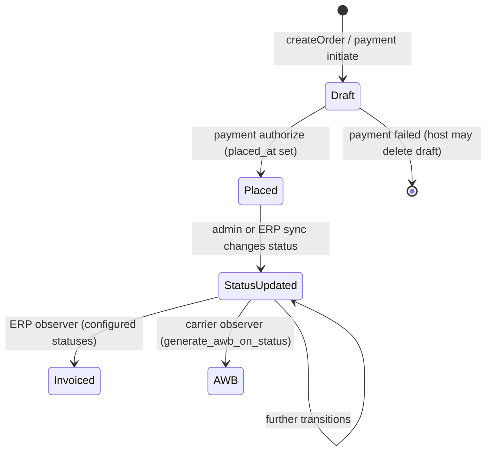
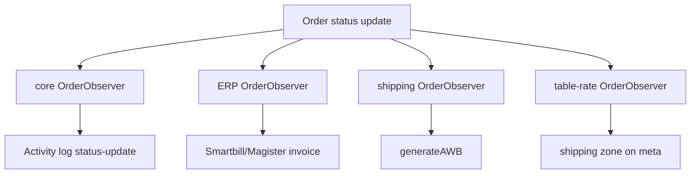

# Order Processing — Software Design Document (Engine)

Last verified: 2026-06-03 against `lunarphp/lunar-minic` at repository HEAD.

## Purpose and scope

This document describes **order lifecycle behavior after (and including) materialization from a cart** in this repository: the `Order` aggregate, placement semantics, status transitions, payment recording, fulfillment integrations (carriers, ERP), admin operations, and background sync.

**Order creation from cart** (pipelines, validators, draft reuse) is documented in [checkout.md](./checkout.md). This document starts where that flow leaves off and covers processing through fulfillment-related side effects.

This repo does not implement host-specific stock adjustments on status change, storefront payment orchestration, or `OrderPlacedEvent` dispatch — those are host responsibilities (see [Consumer integration (boundary)](#consumer-integration-boundary)).

For navigation, see [CODE_MAP.md](../system/CODE_MAP.md) § Orders, ERP, Carrier shipping, Payments.

---

## High-level lifecycle

| Phase | Indicator | Engine responsibility |
| --- | --- | --- |
| Draft | `placed_at` is null; status typically `awaiting-payment` | Creation pipeline, payment drivers may create/update draft |
| Placed | `placed_at` set; status from payment config or driver | Payment types, Stripe webhook job, transaction rows |
| Operational | Status changes after placement | Observers, ERP import sync, admin actions, AWB/invoice |

---

## Order aggregate

**Model:** `Lunar\Models\Order` (`packages/core/src/Models/Order.php`)  
**Related:** `OrderLine`, `OrderAddress`, `Transaction`, `Cart` (optional `cart_id`)

### Structure

| Area | Detail |
| --- | --- |
| Lines | `physical`, `digital`, `shipping` types via `OrderLine` |
| Addresses | `shippingAddress`, `billingAddress` (`OrderAddress`) |
| Money | `sub_total`, `discount_total`, `shipping_total`, `tax_total`, `total` as `Price` casts |
| Breakdowns | `discount_breakdown`, `shipping_breakdown`, `tax_breakdown` |
| Meta | JSON (`AsArrayObject`); copied from cart at creation; extended by integrations |
| Search | `Searchable` trait; table-rate package adds `shipping_zone` at index time |

### Draft vs placed

| Method | Meaning |
| --- | --- |
| `isDraft()` / `isPlaced()` | Based on `placed_at` nullability |
| `draftOrder()` on cart | Reuses in-progress order for same cart |

Placement is not automatic on `createOrder()`. Payment drivers (or host authorization logic) set `placed_at` and update `status` when payment succeeds.

### Fork-specific accessors

Computed on `Order` for reporting and integrations:

- `coupon_total`, `discount_total_without_coupon`, `sub_total_discounted_without_coupon_inc_tax`
- `package_weight` (kg from line purchasables; throws `UnsupportedWeightUnitException` for unknown units)
- `applied_coupon`
- `getActivitiesByStatuses()` — status history from activity log

---

## Status configuration

**Config:** `packages/core/config/orders.php` → `draft_status`, `statuses`

Core defaults include: `awaiting-payment`, `payment-offline`, `payment-received`, `dispatched`.

Each status entry may define:

| Key | Purpose |
| --- | --- |
| `label` | Admin display |
| `color` | Admin UI |
| `mailers` | Mailable classes sent when status is applied (admin or ERP sync) |
| `notifications` | Filament notifications |
| `favourite` | Admin filter |

Production hosts typically **publish** a larger status set (`prepare-shipment`, `canceled`, `completed`, `failed-awb-generation`, etc.). Engine observers reference status **strings** from config; missing published statuses break AWB/invoice triggers if not aligned.

---

## Creation aftermath (engine)

Dispatched by `CreateOrder` after the creation pipeline (see [checkout.md](./checkout.md)):

### `MarkAsNewCustomer` job

**Path:** `packages/core/src/Jobs/Orders/MarkAsNewCustomer.php`

Queued once per new order. Compares billing email to prior **placed** orders; sets `order.new_customer` boolean. Uses `saveQuietly()` inside a transaction.

Hosts may append pipeline stages in published `config/lunar/orders.php` (`pipelines.creation`); those classes live outside core unless added in a package.

---

## Placement and payments

Payment finalization sets `placed_at` and transitions `status`. Core and in-repo packages:

### `OfflinePayment` (core)

**Path:** `packages/core/src/PaymentTypes/OfflinePayment.php`

On `authorize()`: creates draft order if needed, merges meta, sets status from `lunar.payments.types.*.authorized` or `$data['authorized']`, sets `placed_at`, dispatches `PaymentAttemptEvent`.

### Stripe package (`packages/stripe`)

| Component | Role |
| --- | --- |
| `StripePaymentType` | PaymentIntent create/capture; order create/reuse |
| `UpdateOrderFromIntent` | Maps intent status → `lunar.stripe.status_mapping`; sets `placed_at` on success; optional address sync |
| `ProcessStripeWebhook` | Queued webhook handler; `authorize()` on order or cart |
| Webhook route | `packages/stripe/routes/webhooks.php` |

Host apps may use a separate Stripe integration; this repo’s package registers driver key `stripe` via `StripePaymentsServiceProvider`.

### Transactions

**Model:** `Lunar\Models\Transaction`  
**Observer:** `TransactionObserver` — logs activity on transaction `created` (amount, type, status, card meta, reference).

Payment drivers create `capture` / `intent` rows; admin can inspect via order relations (`captures`, `intents`, `refunds`).

---

## `OrderPlacedEvent` and queued export

**Event:** `Lunar\ERP\Events\OrderPlacedEvent` (`packages/ERP/src/Events/OrderPlacedEvent.php`)

Carries the placed `Order` model. **Not dispatched by any provider in this repository** — the host must fire it after successful payment authorization.

### Listener in this repo

**`SendOrderToERP`** (`packages/ERP/src/Listeners/SendOrderToERP.php`)

- Implements `ShouldQueue`
- When `lunar.erp.enabled` and providers configured in `lunar.erp.actions.send_order`
- Calls `ErpService::sendOrder()` per enabled provider

**Magister** exporter: `MagisterErpExporter::sendOrder()` via API client.  
**Smartbill** exporter: `sendOrder()` may no-op or delegate per implementation.

### Order Placement Integrations

The host application may trigger:
- ERP export
- Mailchimp order synchronization

See:
- `packages/ERP/` — Magister/Smartbill sync, `SendOrderToERP`, invoice observers
- `packages/mailchimp/` — `SyncOrderOnPlacement`, cart line observer, `MAILCHIMP_PLUGIN.md`

---

## Status change reactions (observers)

Multiple `OrderObserver` classes register on the same model for different packages.

### Core — activity log

**Path:** `packages/core/src/Observers/OrderObserver.php`  
**Event:** `updating`

When `status` changes, writes Spatie activity `status-update` with `previous` and `new` values. `causedBy(auth()->user())` when admin-driven.

### ERP — invoice generation

**Path:** `packages/ERP/src/Observers/OrderObserver.php`  
**Event:** `updating` → `handleBilling()`

For each provider in `lunar.erp.actions.billing`:

1. Provider enabled in `lunar.erp.{provider}.enabled`
2. Skip if `meta.billing_series` and `meta.billing_number` already set
3. `status` is dirty and in `lunar.erp.{provider}.generate_invoice` array

Calls `ErpService::generateInvoice()` → exporter (e.g. Smartbill) → saves `billing_series`, `billing_number` on order meta via `Order::withoutEvents()`.

Filament success notification when invoice generated.

Typical host config: Smartbill billing on `awaiting-payment` (see PROJECT_SPECIFICATION).

### Carrier add-on — AWB generation

**Path:** `packages/shipping/src/Observers/OrderObserver.php`  
**Event:** `updated`

When `lunar.shipping.enabled` and:

- `status` is dirty
- New status equals `lunar.shipping.generate_awb_on_status` (default env: `prepare-shipment`)
- `meta.awb` not already set

Calls `ShippingService::generateAWB()`:

- Resolves provider from `shipping_breakdown` identifier
- Provider `generateAWB()` API call
- On success: stores `meta.awb` without re-firing observers
- On `FailedAWBGenerationException`: sets status `failed-awb-generation` via query builder (`withoutEvents`)
- Filament notifications for success/failure

Also supports `downloadAWBPDF()`, `getTrackingUrl()` for admin/integrations.

### Table-rate shipping — zone attribution

**Path:** `packages/table-rate-shipping/src/Observers/OrderObserver.php`  
**Events:** `created`, `updated`

Resolves shipping zone from order (or cart) shipping postcode via `Shipping::zones()->postcode()`. Syncs `shippingZone` relation and `meta.shipping_zone`; `indexing()` exposes zone to Scout.

---

## Inbound order status sync (ERP)

**Command:** `erp:sync-order-statuses`  
**Implementation:** `MagisterErpImporter::syncOrderStatuses()` (when Magister listed in `lunar.erp.sync.orders`)

Flow:

1. Fetch modified orders from Magister API
2. Match by `order.reference` = external `ORDER_NUMBER`
3. Map external status/substatus via `OrderStatusMapper`
4. Optionally merge `SHIPPING_DOC` into `meta.awb`
5. Update `order.status` and invoke `OrderStatusUpdater` with mailers from `lunar.orders.statuses.{status}.mailers`

**`OrderStatusUpdater`** (`packages/ERP/src/Support/OrderStatusUpdater.php`) reuses admin trait `UpdatesOrderStatus` to queue customer emails and log `email-notification` activities — same path as manual admin status changes.

Scheduled when `lunar.erp.enabled` and cron configured in `lunar.erp.schedule.orders`.

---

## Admin order management

**Resource:** `packages/admin/src/Filament/Resources/OrderResource.php`

Staff can view/edit orders, lines, addresses, transactions. Status updates use **`UpdatesOrderStatus`** trait (`packages/admin/src/Support/Actions/Traits/UpdatesOrderStatus.php`):

- Sets `status`
- Optionally queues configured **mailers** for that status to customer emails
- Stores rendered email HTML in activity log
- Filament notifications

Carrier and ERP packages extend order UI (e.g. `ShippingExtension` for AWB download, ERP invoice actions).

---

## Review reminders

**Command:** `review:request-email` (`packages/review/src/Console/ReviewRequestEmailCommand.php`)

Selects orders where:

- `status` = `lunar.review.order_status_for_review_reminder`
- `updated_at` in configured delay windows (first/second reminder)

Sends configured mailable to order user. **Not scheduled** in package providers — host must schedule the command.

---

## Order line integrity

**Observer:** `packages/core/src/Observers/OrderLineObserver.php`

On `creating` / `updating`: ensures `purchasable_type` implements `Purchasable`; otherwise `NonPurchasableItemException`.

Admin order line tables may show current variant stock vs `meta.stock_level` captured at purchase (display only in admin).

---

## Order `meta` keys (processing)

| Key | Set by | Purpose |
| --- | --- | --- |
| *(cart copy)* | `FillOrderFromCart` | `payment_option`, `shippingType`, etc. — see [checkout.md](./checkout.md) |
| `awb` | Carrier `generateAWB` or Magister sync | Tracking / label number |
| `billing_series`, `billing_number` | ERP `generateInvoice` | Smartbill (or other) invoice identity |
| `shipping_zone` | Table-rate observer | Admin search / reporting |
| Host-only keys | Host after placement | e.g. analytics IDs — not set by core |

---

## Configuration reference

Important configuration affecting order processing:
- lunar.orders.statuses
- lunar.erp.actions.billing
- lunar.shipping.generate_awb_on_status

---

## Extension points

| Goal | Mechanism |
| --- | --- |
| Post-create order logic | Append `lunar.orders.pipelines.creation` |
| React to placement | Listen for `OrderPlacedEvent` (host dispatches) or `PaymentAttemptEvent` |
| React to status change | Register `Order` observer; or use status `mailers` in config |
| Invoice on status | Configure `lunar.erp.{provider}.generate_invoice` + `actions.billing` |
| AWB on status | Set `lunar.shipping.generate_awb_on_status` |
| Inbound status from ERP | Enable Magister in `lunar.erp.sync.orders`; customize `OrderStatusMapper` |
| Custom fulfillment | Extend `ShippingProviderInterface` or ERP exporter |
| Admin emails per status | `lunar.orders.statuses.{status}.mailers` |

Avoid assuming upstream Lunar status sets or that `OrderPlacedEvent` fires automatically.

---

## Primary Entry Points

- Order model
- Core OrderObserver
- ERP OrderObserver
- Shipping OrderObserver
- UpdatesOrderStatus trait
- ErpService
- ShippingService

---

## Consumer integration (boundary)

The host application typically owns:

| Concern | Notes |
| --- | --- |
| **`OrderPlacedEvent` dispatch** | After payment authorization; triggers ERP export and Mailchimp when listeners registered |
| **Stock decrease/increase on status** | Not in this repo; host `config/lunar-frontend/orders.php` (e.g. `prepare-shipment`, `canceled`) |
| **Extended order statuses** | Published `config/lunar/orders.php` must align with AWB and invoice triggers |
| **Payment drivers** | Host may register `cash-on-delivery`, `stripe-card` separate from core `stripe` / `cash-in-hand` |
| **Draft order deletion on payment failure** | Host responsibility |
| **Order confirmation / notification emails on placement** | Host listeners (e.g. `SendOrderPlacedNotification` in `lunar-frontend`) |

Engine code provides observers, listeners, commands, and services; the host wires event dispatch, schedules, and config arrays.
