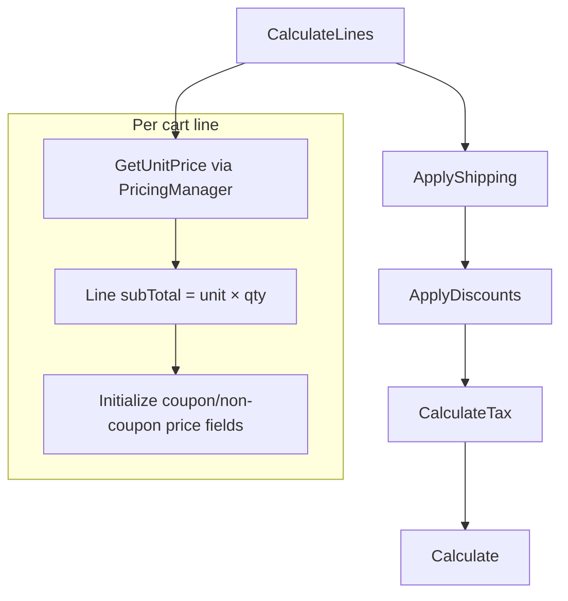
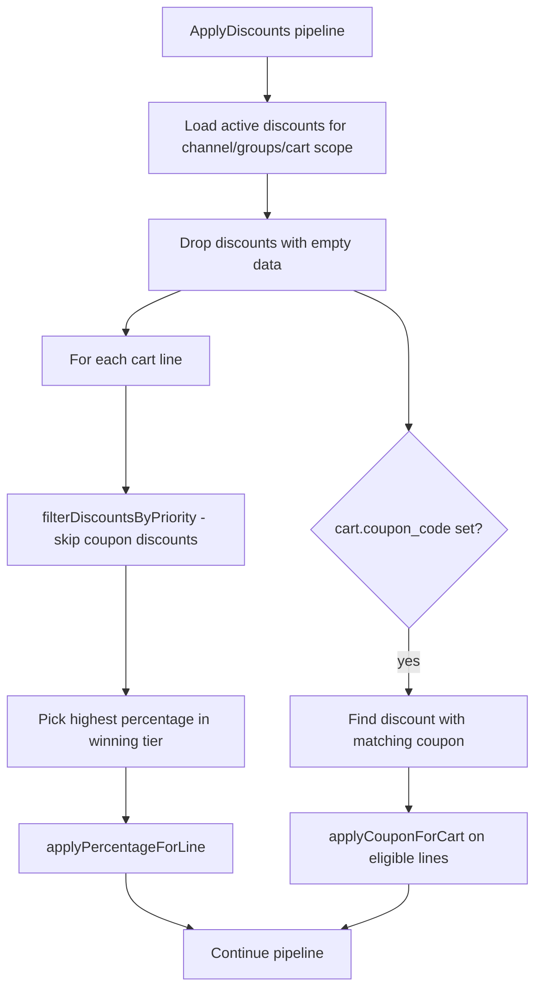

# Pricing and Discounts — Software Design Document (Engine)

Last verified: 2026-06-03 against `lunarphp/lunar-minic` at repository HEAD.

## Purpose and scope

This document explains how **unit prices are resolved** and how **discounts are evaluated and applied** in this repository, including fork-specific coupon vs non-coupon totals.

**In scope:** `Price` records, `PricingManager`, cart calculation pipelines, `DiscountManager`, `AdvancedAmountOff`, tax interaction, catalog display helpers, and integration touchpoints (shipping tiers, order snapshots).

**Documented elsewhere (not repeated here):**

- Full cart/checkout flow — [checkout.md](./checkout.md)
- Order placement and post-create lifecycle — [order_processing.md](./order_processing.md)
- File-level navigation — [CODE_MAP.md](../system/CODE_MAP.md) § Pricing & tax, Discounts
- Storefront checkout wiring — `minic/lunar-frontend` (referenced briefly where it extends engine behavior)

---

## Pricing architecture

### Price model

Purchasable items (typically `ProductVariant`) own morph `Price` rows with:

| Dimension | Behavior |
| --- | --- |
| **Currency** | One price set per `currency_id`; missing currency prices throw `MissingCurrencyPriceException` |
| **Customer group** | Optional `customer_group_id`; `null` means available to all groups |
| **Quantity** | `min_quantity` (default tier at `1`); higher `min_quantity` values act as **quantity breaks** when cart line qty qualifies |
| **Compare price** | Optional list/strike price (display; not used in cart pipeline logic reviewed) |
| **`max_quantity`** | Fork column on `prices` (nullable); used outside cart pricing (e.g. table-rate tier logic per PROJECT_SPECIFICATION) |

There is **no per-channel price row** in core. **Channels** constrain product/discount *eligibility* (`HasChannels`), not which `Price` row is selected.

### Price resolution (`PricingManager`)

Entry point: `Pricing` facade → `PricingManager::for($purchasable)->get()`.

Resolution inputs (fluent setters): purchasable, currency, quantity, customer groups, optional authenticated user.

**Customer group selection order:**

1. Explicit `customerGroups()` on the manager, else default customer group
2. If a Lunar user is set and has customers, **replace** with that user’s customers’ groups

**Matching algorithm** (same currency, filtered by customer groups, sorted by ascending `price`):

1. Base: `min_quantity = 1` and no customer group
2. Override with cheapest **customer-group** price at `min_quantity = 1` if any
3. Override with cheapest **quantity break** where `min_quantity > 1` and `qty >= min_quantity`

Returns a `PricingResponse` DTO: `matched`, `base`, `priceBreaks`, `customerGroupPrices`.

Optional **`lunar.pricing.pipelines`** can transform the manager before the response is returned (empty by default).

### Tax interaction (pricing)

Controlled by `lunar.pricing.stored_inclusive_of_tax` (`LUNAR_STORE_INCLUSIVE_OF_TAX`):

| Mode | Stored prices | Display / cart line unit |
| --- | --- | --- |
| Exclusive (default) | Ex tax | `GetUnitPrice` sets `unitPrice` (ex) and `unitPriceInclTax` via purchasable tax rate |
| Inclusive | Inc tax | Tax helpers short-circuit; line totals treat stored values as tax-inclusive where `prices_inc_tax()` applies |

Tax **amounts** on carts are computed later in `CalculateTax` via `TaxManager` / `Taxes` facade (addresses, purchasable tax class, discounted subtotals).

### Catalog display pricing

`HasDiscount` on purchasables exposes `getOriginalPrices()`, `getDiscountedPrices()`, and inc-tax variants for **storefront/catalog display**, using the same `DiscountManager::getDiscountForPurchasable()` priority rules and `AdvancedAmountOff::calculateDiscountedPrice()` for preview amounts. This path is separate from cart recalculation but shares discount selection logic.

---

## Discount architecture

### Discount model

`Discount` records represent promotions. Notable attributes:

| Area | Behavior |
| --- | --- |
| **Type** | PHP class name (active: `AdvancedAmountOff`) |
| **`data` JSON** | Reward config: `percentage`, optional `fixed_value` / `fixed_values`, `min_prices` per currency |
| **Coupon** | Optional code (`CouponString` cast, uppercased) |
| **Schedule** | `starts_at` / `ends_at`; `scopeActive()` |
| **Usage** | `uses`, `max_uses`, `max_uses_per_user` (+ user pivot) |
| **Priority** | SQL `orderBy priority desc` when loading candidates |
| **Limitations** | `discountables` (product/variant), `collections`, `brands` with pivot `type` (`condition`, `limitation`, `exclusion`) |
| **Audience** | `HasChannels`, `HasCustomerGroups`, optional `customers` relation |
| **Status attribute** | Computed: `active`, `pending`, `expired`, `scheduled` |

### Enabled discount types (fork)

`DiscountManager` registers **only** `AdvancedAmountOff`. `AmountOff` and `BuyXGetY` exist in the codebase but are **commented out** (“disabled for security”).

`CouponValidator` still queries all three class names for coupon existence checks.

### Discount manager

Entry point: `Discounts` facade → **scoped** `DiscountManager` (`LunarServiceProvider` binds `DiscountManagerInterface` scoped, not singleton). The manager caches the loaded discount collection for the remainder of that request until `resetDiscounts()` clears it — `lunar-frontend` calls `resetDiscounts()` when applying or removing coupons (`HandlesDiscounts`).

Responsibilities:

- Scope discounts by channel, customer group, cart contents (products, variants, collections)
- Pick **one automatic discount per cart line** via priority rules
- Apply **one coupon discount** when `cart.coupon_code` matches
- Track `discountBreakdown` and applied discount types on the cart during calculation

Configurable: `lunar.discounts.coupon_validator` (default `CouponValidator`). The production storefront does **not** replace this class; `lunar-frontend` adds Livewire rules `CouponIsCorrect` (delegates to `Discounts::validateCoupon()`) and `MaxUsesPerUser` before a coupon is saved on the cart (`HandlesDiscounts`).

### Conditions and rewards (`AdvancedAmountOff` + `AbstractDiscountType`)

**Conditions** (`checkDiscountConditions`):

| Rule | Effect |
| --- | --- |
| Customer allow-list | If discount has `customers`, cart must have matching `customer_id` |
| Coupon match | If discount has a coupon, cart `coupon_code` must match (case-insensitive) |
| Min spend | `min_prices[currency]` compared to sum of **eligible lines’** `subTotal` |
| Max uses | Global `uses < max_uses` when `max_uses` set |
| Max uses per user | Requires cart user; compares pivot use count |

**Automatic line reward:** percentage of line subtotal only (`applyPercentageForLine`); uses `subTotalDiscounted` as base if already reduced. Admin (`DiscountResource`) can configure `data.fixed_value`, but cart application and `getHighestValueDiscount` do not use fixed amounts for automatic selection.

**Coupon reward:** percentage applied only to **eligible lines** from `getEligibleLines()` (collection/brand/product limitation and exclusion filters). Coupon portion is separated in totals via `discountTotal` vs `discountTotalWithoutCoupon`.

**Static helper:** `calculateDiscountedPrice()` supports percentage or fixed amount per currency — used for **catalog preview** (`HasDiscount`), not for cart line application.

**Usage recording:** `markAsUsed()` increments `uses` and attaches the user pivot. Cart `apply()` does not call it. After successful payment, `lunar-frontend` `AuthorizeOrderPayment` runs `MarkDiscountsAsUsed`, which calls `markAsUsed()` for each discount in `order.discount_breakdown`.

---

## Price calculation flow

Cart recalculation runs `lunar.cart.pipelines.cart` (see [checkout.md](./checkout.md)). Pricing-related stages:

### Stage detail

| Stage | Pricing role |
| --- | --- |
| **CalculateLines** | Each line through `GetUnitPrice` → `PricingManager`; compute `subTotal`; seed discount-related line attributes (zero discount, “without coupon” mirrors) |
| **ApplyShipping** | Applies already-selected shipping option to breakdown (tier resolution happens in `ShippingManifest::getOptions`, not here) |
| **ApplyDiscounts** | Clears breakdown; `Discounts::apply($cart)` |
| **CalculateTax** | Tax on `subTotalDiscounted` when set; builds line/cart/shipping tax |
| **Calculate** | Sums line discounts; sets cart `subTotal`, `subTotalDiscounted`, `discountTotal`, `couponTotal`, `discountTotalWithoutCoupon`, inc-tax aggregates, and **final `total`** |

### Final cart total (fork)

`Calculate` sets:

`total = subTotalDiscountedWithoutCouponIncTax + shippingTotal − couponTotalIncTax`

Automatic discounts reduce the inc-tax subtotal base; coupon discount is subtracted again at cart level (coupon-aware aggregation).

### Order snapshot

On order creation, line unit prices and totals are copied from the cart; `MapDiscountBreakdown` persists cart `discountBreakdown` onto the order. Order/line accessors recompute coupon vs non-coupon views from stored breakdown (e.g. `Order::coupon_total`, `OrderLine::unit_price_without_coupon`).

---

## Discount application flow

### When discounts are evaluated

- On every `$cart->recalculate()` when the cart pipeline runs
- Catalog/display: when calling purchasable `getDiscountedPrices*` or `hasDiscount()`
- Not on raw `PricingManager::get()` alone (unit price is pre-discount)

### Eligibility (query phase)

`getDiscounts($cart)` returns discounts that are:

- `active()` and `usable()` (global use limits)
- In scope for manager’s channels and customer groups (defaults: default channel/group)
- Matching cart catalog scope (products, variants, or collections on lines) **or** unrestricted discountables query branch
- Ordered by `priority` desc, then `id`
- Excluding records with empty `data`

`Discount::scopeUsableByUser()` exists but is **not** used in `getDiscounts()`. Per-user limits are enforced at apply time via `checkDiscountConditions` (requires cart user). Coupon entry additionally validates in `lunar-frontend` via `MaxUsesPerUser` before `cart.coupon_code` is set.

### Multiple discounts interaction

| Layer | Rule |
| --- | --- |
| **Per line (automatic)** | At most **one** non-coupon discount: highest **priority tier**, then highest **`percentage`** within tier |
| **Priority tiers** | 1) variant discountable → 2) product → 3) collection → 4) “global” (no discountables/collections) |
| **Coupons** | Separate pass; can stack on top of line automatic discounts; only lines passing `getEligibleLines()` |
| **Coupon codes** | Only one `cart.coupon_code`; first matching discount in loaded set wins |
| **Between automatic discounts** | No stacking — single winner per line |

Coupons are excluded from automatic priority selection (`filterDiscountsByPriority` skips `coupon` not empty).

---

## Business rules

Rules verified in code that change runtime behavior:

1. **Only `AdvancedAmountOff` is applied at checkout** — other discount type classes are disabled in `DiscountManager`.
2. **Unit price selection prefers lowest matching price** after customer-group and quantity-break rules.
3. **Authenticated users** can shift pricing/discount customer groups to groups linked via their customers.
4. **Percentage automatic discounts** apply to line subtotal; if a line already has `subTotalDiscounted`, that value is the base for further percentage off.
5. **Coupon discounts** apply only to eligible lines; cart totals split coupon vs non-coupon amounts for shipping and display.
6. **Tax** is calculated on post-discount line subtotals (`subTotalDiscounted`) where present.
7. **Cart `total`** uses inc-tax subtotal excluding coupon, plus shipping, minus coupon inc-tax component (fork formula in `Calculate`).
8. **Table-rate `ShipBy`** thresholds use `subTotalDiscountedWithoutCouponIncTax` per line (fallback `subTotal`). Tier **qualification** runs inside `ShippingManifest::getOptions()` (shipping-modifier pipeline), which is separate from cart `recalculate()`. The storefront loads options after `recalculate()` (`ShippingOptions`, `cart.updated`), so automatic discounts from the latest recalculation are reflected. Within one `recalculate()`, `ApplyShipping` still runs before `ApplyDiscounts`, but that stage only applies an already-chosen option, not re-resolve tiers.
9. **Automatic discount winner** uses **percentage only** in `getHighestValueDiscount`. Admin may set `fixed_value`, but cart automatic/coupon application paths use percentage only; fixed amounts affect catalog preview via `calculateDiscountedPrice()`.
10. **Discounts without `data`** never apply (filtered at load).
11. **Coupon validation** — core `CouponValidator` checks active discounts (including disabled types `AmountOff` / `BuyXGetY` in its query). Storefront `CouponIsCorrect` wraps `Discounts::validateCoupon()`; `MaxUsesPerUser` adds guest/login and per-user cap checks before apply.
12. **Product channel visibility** is independent of price rows — unavailable products should be excluded before pricing via `Product::scopeAvailable()`, not `PricingManager`.

---

## Extension points

| Goal | Mechanism |
| --- | --- |
| Transform resolved unit price | Register class in `lunar.pricing.pipelines` |
| Custom coupon rules | Replace `lunar.discounts.coupon_validator`, and/or add host validation (as in `lunar-frontend` `CouponIsCorrect` / `MaxUsesPerUser`) |
| Add discount type | Implement `DiscountTypeInterface`, `DiscountManager::addType()` (fork currently restricts to `AdvancedAmountOff` in constructor) |
| Cart total logic | Append/replace stages in `lunar.cart.pipelines.cart` |
| Tax behavior | Tax driver config (`lunar.taxes`) and `stored_inclusive_of_tax` |
| Catalog strike pricing | `HasDiscount` on purchasable models |

Entry points: `PricingManager`, `DiscountManager`, `Pipelines\CartLine\GetUnitPrice`, `Pipelines\Cart\ApplyDiscounts`, `DiscountTypes\AdvancedAmountOff`.
