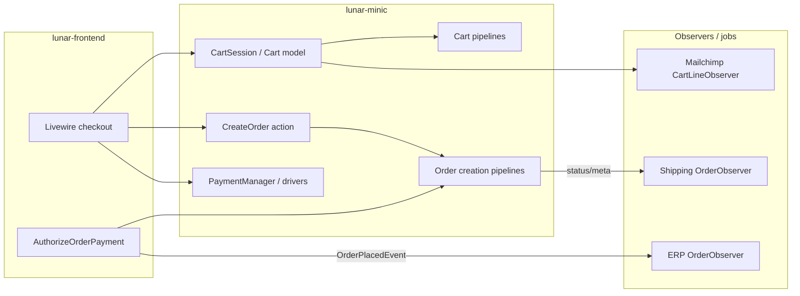

# Code Map

Navigation guide for developers and AI coding agents working in this repository.

**Primary context:** [PROJECT_SPECIFICATION.md](./PROJECT_SPECIFICATION.md) — domain rules, host integration, meta conventions, and risks. This document focuses on *where* code lives and *how* to reach it; it does not repeat full business-flow narratives from the spec.

**Design documents (engine-only):** [checkout.md](../design/checkout.md) — cart, shipping, order creation, and payment infrastructure; [order_processing.md](../design/order_processing.md) — placement, status transitions, AWB/ERP/invoice side effects; [pricing_and_discounts.md](../design/pricing_and_discounts.md) — price resolution, discounts, cart totals (excludes `lunar-frontend` orchestration).

---

## High-Level Architecture

### Role in the stack

| Layer          | Repository                                                | Responsibility                                                                                                                                       |
| -------------- | --------------------------------------------------------- | ---------------------------------------------------------------------------------------------------------------------------------------------------- |
| Engine + admin | **This repo** (`lunarphp/lunar-minic`)                    | Eloquent domain, cart/order/pricing pipelines, Filament admin, integrations (ERP, carriers, Mailchimp, payments), migrations, config under `lunar.`* |
| Storefront     | `**minic/lunar-frontend`** (sibling: `../lunar-frontend`) | Customer HTTP routes, Livewire checkout, payment authorization, Algolia catalog filter, published config overrides                                   |

There is no storefront REST API in this repo. Commerce behavior is consumed by the host via models, facades/managers, config pipelines, and a small HTTP surface (payment webhooks, admin panel, 3DS routes).

### Relationship with Lunar PHP

- Fork of [Lunar PHP](https://lunarphp.com/) 1.x with large divergence (custom packages, migrations, discounts, shipping, ERP, etc.).
- Package discovery registers providers in root `composer.json` → `extra.laravel.providers`.
- Treat **this codebase** as authoritative; upstream docs are orientation only.
- Local `upstream/1.x` may exist for merges; behavior here overrides upstream assumptions (see spec § “Areas Where Standard Lunar Assumptions Are Unsafe”).

### Relationship with `lunar-frontend`

Verified integration patterns (host repo present at `../lunar-frontend`):

1. **Composer dependency** — Host depends on `lunarphp/lunar-minic` and registers the same service providers.
2. **Direct domain API** — `Lunar\Models\`*, `CartSession`, `StorefrontSession`, `Payments`, `Pricing`, `Discounts`, shipping manifest/modifiers, ERP/Mailchimp services.
3. **Config extension** — Published `config/lunar/`* and `config/lunar-frontend/`*; host appends `OrderCreatedPipeline` to `lunar.orders.pipelines.creation` in `lunar-frontend/config/lunar/orders.php`.
4. **Post-payment orchestration** — `Minic\LunarFrontend\Domains\Payment\Actions\AuthorizeOrderPayment` dispatches `Lunar\ERP\Events\OrderPlacedEvent`; listeners (ERP, Mailchimp, notifications) are registered in the host (`config/lunar-frontend/listeners.php`), not in this repo’s providers.
5. **Search split** — Admin/global indexing: `packages/search` + Scout (`lunar.search`). Storefront catalog: Algolia in `lunar-frontend` (not `packages/search` engines).

### Request and data flow (storefront path)

**Cart calculation:** `Cart::calculate()` → `config('lunar.cart.pipelines.cart')` (see `packages/core/config/cart.php`).

**Order creation:** `Cart::createOrder()` → validators → `Lunar\Actions\Carts\CreateOrder` → `config('lunar.orders.pipelines.creation')` → `MarkAsNewCustomer` job.

**Payment:** Drivers registered via `Payments::extend()` in payment package providers; host registers additional types in `lunar-frontend` config.

**Order meta:** `FillOrderFromCart` copies `cart.meta` → `order.meta` unchanged (checkout meta keys documented in PROJECT_SPECIFICATION).

---

## Repository Structure

| Path                                   | Purpose                                                                                                            |
| -------------------------------------- | ------------------------------------------------------------------------------------------------------------------ |
| `packages/core`                        | Domain models, managers, facades, actions, pipelines, payment types, validation, observers, core config/migrations |
| `packages/admin`                       | Filament panel (`LunarPanelManager`), resources, admin events → `sync_with_search()`, staff auth                   |
| `packages/table-rate-shipping`         | Table-rate zones/methods/rates; `ShippingModifier`; Filament shipping resources                                    |
| `packages/shipping`                    | Carrier add-on (Sameday, DPD, Pickup, InHouse): AWB, lockers, geocoding                                            |
| `packages/ERP`                         | Magister/Smartbill providers, sync commands, invoice on order update                                               |
| `packages/search`                      | `SearchManager` — DB / Meilisearch / Typesense faceted admin search                                                |
| `packages/meilisearch`                 | `lunar:meilisearch:setup` command                                                                                  |
| `packages/stripe`   | Payment drivers, routes, webhooks (Stripe), Livewire (Stripe)                                                      |
| `packages/mailchimp`                   | Saloon client, ecommerce sync jobs, cart line observer                                                             |
| `packages/blog`, `review`, `locations` | Content, reviews, Romanian county/locality data                                                                    |
| `tests/*`                              | Pest suites per package/domain                                                                                     |
| `workbench/`                           | Orchestra Testbench app for local/package dev                                                                      |
| `docs/database/schema.dbml`            | Database schema reference (not runtime code)                                                                       |
| `docs/system/PROJECT_SPECIFICATION.md`                    | Full system specification                                                                                          |
| `docs/design/checkout.md`                               | Checkout flow design (engine scope only; storefront lives in `lunar-frontend`)                                     |
| `docs/design/order_processing.md`                       | Order lifecycle after creation: placement, status, AWB, ERP, admin (engine only)                                   |
| `docs/design/pricing_and_discounts.md`                  | Price resolution, discount application, coupon vs non-coupon totals (engine only)                                  |

Root `composer.json` maps PSR-4 namespaces and lists all Laravel auto-discovered providers.

---

## Domain Map

Only domains with code in this repository are listed. Admin UI for a domain is generally under `packages/admin/src/Filament/Resources/` unless noted.

### Catalog (`packages/core`)

|                         |                                                                                                                                                                                     |
| ----------------------- | ----------------------------------------------------------------------------------------------------------------------------------------------------------------------------------- |
| **Purpose**             | Products, variants, options, collections, brands, attributes, URLs, channels, tags                                                                                                  |
| **Models**              | `Product`, `ProductVariant`, `ProductType`, `ProductOption`, `ProductOptionValue`, `Collection`, `CollectionGroup`, `Brand`, `Tag`, `Attribute`, `AttributeGroup`, `Url`, `Channel` |
| **Services / managers** | `PricingManager` (variant prices), `AttributeManifest`, `FieldTypeManifest`                                                                                                         |
| **Actions**             | `Lunar\Actions\Collections\*` (sort products in collections)                                                                                                                        |
| **Jobs**                | `Jobs\Collections\RebuildCollectionTree`, `UpdateProductPositions`; `Jobs\Products\Associations\*`                                                                                  |
| **Events**              | `ProductCreatedEvent`, `ProductUpdatedEvent`, `ProductDeletedEvent`, `ProductPublished`, `ProductVariant*Event`                                                                     |
| **Observers**           | `ProductObserver`, `ProductVariantObserver`, `ProductOptionObserver`, `ProductOptionValueObserver`, `CollectionObserver`, `UrlObserver`                                             |
| **APIs**                | `Pricing` facade; `Product::scopeAvailable()` for storefront visibility                                                                                                             |
| **Entry points**        | `packages/admin/.../ProductResource.php`, `ProductVariantResource.php`; config `lunar.products`                                                                                     |

### Pricing & tax (`packages/core`)

|                  |                                                                                             |
| ---------------- | ------------------------------------------------------------------------------------------- |
| **Purpose**      | Price resolution, tax zones/rates, cart line unit prices                                    |
| **Models**       | `Price`, `Currency`, `TaxClass`, `TaxZone`, `TaxRate`, `TaxRateAmount`, related zone models |
| **Managers**     | `PricingManager`, `TaxManager`                                                              |
| **Pipelines**    | `lunar.pricing.pipelines`; cart line: `Pipelines\CartLine\GetUnitPrice`                     |
| **Actions**      | `Actions\Currencies\CreateCurrencyPrices`; tax zone helpers under `Actions\Taxes\`          |
| **Jobs**         | `Jobs\Currencies\SyncPriceCurrencies`, `CreateCurrencyPrices`                               |
| **Observers**    | `PriceObserver`, `CurrencyObserver`                                                         |
| **Config**       | `packages/core/config/pricing.php`, `taxes.php`                                             |
| **Entry points** | `packages/core/src/Managers/PricingManager.php`; admin `CurrencyResource`, `Tax*Resource`   |

### Cart & session (`packages/core`)

|                  |                                                                                                   |
| ---------------- | ------------------------------------------------------------------------------------------------- |
| **Purpose**      | Mutable checkout cart, session binding, storefront context                                        |
| **Models**       | `Cart`, `CartLine`, `CartAddress`                                                                 |
| **Managers**     | `CartSessionManager`, `StorefrontSessionManager` (scoped, not singleton)                          |
| **Facades**      | `CartSession`, `StorefrontSession`                                                                |
| **Actions**      | `packages/core/src/Actions/Carts/*` (add line, addresses, merge, `CreateOrder`, etc.)             |
| **Pipelines**    | `Pipelines\Cart\*`, `Pipelines\CartLine\GetUnitPrice`                                             |
| **Validation**   | `Validation\CartLine\*`, `Validation\Cart\*` (wired in `config/cart.php`)                         |
| **Listeners**    | `Listeners\CartSessionAuthListener` (login/logout merge)                                          |
| **Observers**    | `CartLineObserver`                                                                                |
| **Config**       | `packages/core/config/cart.php`, `cart_session.php`                                               |
| **Entry points** | `packages/core/src/Models/Cart.php` (delegates to config actions); host uses `CartSession` facade |

### Orders (`packages/core` + host pipeline)

|                  |                                                                                              |
| ---------------- | -------------------------------------------------------------------------------------------- |
| **Purpose**      | Orders from carts, lines, addresses, shipping line, references                               |
| **Models**       | `Order`, `OrderLine`, `OrderAddress`, `Transaction`                                          |
| **Actions**      | `Actions\Carts\CreateOrder`, `Actions\Orders\GenerateOrderReference`                         |
| **Pipelines**    | `Pipelines\Order\Creation\*` — configured in `packages/core/config/orders.php`               |
| **Jobs**         | `Jobs\Orders\MarkAsNewCustomer`; `Jobs\SendOrderConfirmation`                                |
| **Observers**    | `OrderObserver`, `OrderLineObserver`, `TransactionObserver`                                  |
| **Config**       | `packages/core/config/orders.php` (statuses, `draft_status`, creation pipeline)              |
| **Entry points** | `CreateOrder.php`; admin `OrderResource`; host adds `OrderCreatedPipeline` after core stages |

### Customers (`packages/core`)

|                  |                                                                                                                     |
| ---------------- | ------------------------------------------------------------------------------------------------------------------- |
| **Purpose**      | B2C/B2B customers, groups, addresses, staff users                                                                   |
| **Models**       | `Customer`, `CustomerGroup`, `Address`, `AddressCustomerType`, `LunarUser` (contract), admin `Staff`                |
| **Observers**    | `CustomerObserver`, `CustomerGroupObserver`, `AddressObserver`                                                      |
| **Entry points** | Admin `CustomerResource`, `CustomerGroupResource`, `StaffResource`; `StorefrontSessionManager` for default customer |

### Discounts (`packages/core`)

|                  |                                                                                                   |
| ---------------- | ------------------------------------------------------------------------------------------------- |
| **Purpose**      | Promotions, coupons, line/cart discount breakdowns                                                |
| **Models**       | `Discount`, `Discountable`                                                                        |
| **Managers**     | `DiscountManager` (scoped) — default types restricted to `AdvancedAmountOff` in manager code      |
| **Types**        | `DiscountTypes\AdvancedAmountOff` (active); `AmountOff`, `BuyXGetY` exist but disabled in manager |
| **Pipelines**    | `Pipelines\Cart\ApplyDiscounts`                                                                   |
| **Events**       | `DiscountUpdatedEvent`; admin discount limitation events                                          |
| **Observers**    | `DiscountObserver`                                                                                |
| **Config**       | `packages/core/config/discounts.php`                                                              |
| **Entry points** | `Managers/DiscountManager.php`; admin `DiscountResource`                                          |

### Payments (`packages/core` + payment packages)

|                  |                                                                                          |
| ---------------- | ---------------------------------------------------------------------------------------- |
| **Purpose**      | Payment driver registry, offline default, card/wallet integrations                       |
| **Core**         | `PaymentManager`, `PaymentTypes\OfflinePayment`, `PaymentAttemptEvent`                   |
| **Packages**     | Stripe (`StripePaymentType`, webhook, Livewire `stripe.payment`),                        |
| **Routes**       | `packages/stripe/routes/webhooks.php`; `routes/web.php` |
| **Middleware**   | `StripeWebhookMiddleware`                                                                |
| **Jobs**         | `stripe/.../ProcessStripeWebhook`                                                        |
| **Config**       | `packages/core/config/payments.php`; per-package `config/*.php` merged into `lunar.*`    |
| **Entry points** | `Payments` facade; `*ServiceProvider` `Payments::extend(...)`                            |

Storefront payment finalization and extra drivers: `**lunar-frontend`** (`AuthorizeOrderPayment`, `config/lunar-frontend/payment.php`).

### Table-rate shipping (`packages/table-rate-shipping`)

|               |                                                                                                                        |
| ------------- | ---------------------------------------------------------------------------------------------------------------------- |
| **Purpose**   | Zones, methods, rates, exclusions, checkout shipping options                                                           |
| **Models**    | `ShippingZone`, `ShippingMethod`, `ShippingRate`, `ShippingExclusion`, `ShippingExclusionList`, `ShippingZonePostcode` |
| **Managers**  | `ShippingManager` (package)                                                                                            |
| **Modifier**  | `ShippingModifier` registered in `Lunar\Shipping\ShippingServiceProvider` when `lunar.shipping-tables.enabled`         |
| **Resolvers** | `Resolvers\ShippingRateResolver`, zone resolver (see `tests/shipping/`)                                                |
| **Events**    | `ShippingOptionResolvedEvent`                                                                                          |
| **Observers** | `OrderObserver` (package — table-rate specific relations)                                                              |
| **Filament**  | `ShippingZoneResource`, `ShippingMethodResource`, `ShippingExclusionListResource`                                      |
| **Config**    | `packages/table-rate-shipping/config/shipping-tables.php` → `lunar.shipping-tables`                                    |
| **Facade**    | `Lunar\Shipping\Facades\Shipping`                                                                                      |

### Carrier shipping (`packages/shipping`)

|               |                                                                                                                           |
| ------------- | ------------------------------------------------------------------------------------------------------------------------- |
| **Purpose**   | AWB generation, lockers, county/city sync, carrier APIs                                                                   |
| **Models**    | `ShippingLocker`, `ShippingCounty`, `ShippingCity`, `ShippingProviderCredentials`                                         |
| **Services**  | `ShippingService`, `ShippingManager` (addon)                                                                              |
| **Providers** | `Providers\Sameday\`, `Dpd\`, `Pickup\`, `InHouse\`                                                                       |
| **Commands**  | `lunar:sync-shipping-lockers`, `lunar:sync-shipping-counties`, `lunar:sync-shipping-cities`                               |
| **Observers** | `Observers\OrderObserver` — AWB when `status === config('lunar.shipping.generate_awb_on_status')`                         |
| **Schedule**  | Daily locker sync 03:00 when enabled                                                                                      |
| **Config**    | `packages/shipping/config/shipping.php` → merges into `lunar.shipping` (shared namespace with core shipping measurements) |
| **Filament**  | `Filament\Extensions\ShippingExtension` on order resource                                                                 |

### ERP (`packages/ERP`)

|               |                                                                                                                |
| ------------- | -------------------------------------------------------------------------------------------------------------- |
| **Purpose**   | Product/stock/order-status/locality/attribute sync; Smartbill invoicing                                        |
| **Models**    | `ErpSyncLog`, `ErpSyncTemp`                                                                                    |
| **Services**  | `ErpService`, `ErpManager`                                                                                     |
| **Providers** | `Providers\Magister\*`, `Providers\Smartbill\*` (Saloon clients/requests)                                      |
| **Commands**  | `erp:sync-products`, `erp:sync-order-statuses`, `erp:sync-stock`, `erp:sync-localities`, `erp:sync-attributes` |
| **Jobs**      | `Providers\Magister\Jobs\CreateProductsAndVariantsJob`                                                         |
| **Events**    | `Events\OrderPlacedEvent` (class lives here; **dispatched by host**)                                           |
| **Listeners** | `Listeners\SendOrderToERP` (class exists; **host registers** against `OrderPlacedEvent`)                       |
| **Observers** | `Observers\OrderObserver` — invoice generation on order `updating` when billing actions configured             |
| **Config**    | `packages/ERP/config/erp.php`                                                                                  |
| **Schedule**  | Cron from `lunar.erp.schedule` when `lunar.erp.enabled`                                                        |

### Mailchimp (`packages/mailchimp`)

|               |                                                                                                                                                               |
| ------------- | ------------------------------------------------------------------------------------------------------------------------------------------------------------- |
| **Purpose**   | Audience, subscriber, ecommerce store, cart/product/order sync                                                                                                |
| **Services**  | `MailchimpService`, `MailchimpSubscriberService`, `MailchimpEcommerceService`                                                                                 |
| **Jobs**      | `SyncCartToMailchimp`, `SyncOrderToMailchimp`, `SyncProductToMailchimp`, `SyncCustomerToMailchimp`, `SyncSubscriberToMailchimp`, `SyncAllProductsToMailchimp` |
| **Listeners** | `Listeners\SyncOrderOnPlacement` (listens to `OrderPlacedEvent`; **not registered in package provider**)                                                      |
| **Observers** | `Observers\CartLineObserver` → queues cart sync when enabled                                                                                                  |
| **Commands**  | `mailchimp:create-store`, `mailchimp:setup-merge-fields`, `mailchimp:sync-all-users`, `mailchimp:sync-all-orders`, `mailchimp:sync-all-products`              |
| **Config**    | `packages/mailchimp/config/mailchimp.php`                                                                                                                     |

### Search (`packages/search` + `packages/meilisearch`)

|                  |                                                                                                                              |
| ---------------- | ---------------------------------------------------------------------------------------------------------------------------- |
| **Purpose**      | Admin faceted search abstraction (not storefront Algolia)                                                                    |
| **Core**         | `SearchManager`, `Facades\Search`, helpers `sync_with_search()`, `get_search_builder()` in `packages/search/src/helpers.php` |
| **Config**       | `packages/search/config/search.php` → `lunar.search` (merged with core `search` config)                                      |
| **Commands**     | Core `lunar:search:index` (`ScoutIndexerCommand`); Meilisearch `lunar:meilisearch:setup`                                     |
| **Entry points** | Admin `LunarPanelProvider` event listeners call `sync_with_search($event->model)`                                            |

### Blog (`packages/blog`)

|              |                                            |
| ------------ | ------------------------------------------ |
| **Purpose**  | Blog categories and posts with URLs        |
| **Models**   | `BlogCategory`, `BlogPost`                 |
| **Commands** | Blog seed command in `BlogServiceProvider` |
| **Filament** | `BlogCategoryResource`, `BlogPostResource` |

### Reviews (`packages/review`)

|              |                                                                  |
| ------------ | ---------------------------------------------------------------- |
| **Purpose**  | Product/order reviews, media, reminder emails                    |
| **Models**   | `Review`                                                         |
| **Events**   | `ReviewCreatedEvent`, `ReviewUpdatedEvent`, `ReviewDeletedEvent` |
| **Policies** | `Policies\ReviewPolicy`                                          |
| **Commands** | `review:request-email`; `lunar:seed-review`                      |
| **Filament** | `ReviewResource`; extended `OrderResource` in package            |

### Locations (`packages/locations`)

|              |                                                                                                       |
| ------------ | ----------------------------------------------------------------------------------------------------- |
| **Purpose**  | County/locality reference data (Romania-oriented)                                                     |
| **Models**   | `County`, `Locality`                                                                                  |
| **Seeder**   | `Database\Seeders\CountySeeder`                                                                       |
| **Data**     | `database/locality_insert.sql`                                                                        |
| **Provider** | `LocationsServiceProvider` — **only** `ModelManifest::addDirectory()`; migrations **not** auto-loaded |

---

## Entry Points

### Service providers (boot order via Composer)

Registered in `composer.json` → `extra.laravel.providers`:

| Provider                                        | Package             |
| ----------------------------------------------- | ------------------- |
| `Lunar\LunarServiceProvider`                    | core                |
| `Lunar\Admin\LunarPanelProvider`                | admin               |
| `Lunar\ERP\ErpServiceProvider`                  | ERP                 |
| `Lunar\Blog\BlogServiceProvider`                | blog                |
| `Lunar\Review\ReviewServiceProvider`            | review              |
| `Lunar\Locations\LocationsServiceProvider`      | locations           |
| `Lunar\Mailchimp\MailchimpServiceProvider`      | mailchimp           |
| `Lunar\Addons\Shipping\ShippingServiceProvider` | carrier shipping    |
| `Lunar\Shipping\ShippingServiceProvider`        | table-rate shipping |
| `Lunar\Search\SearchServiceProvider`            | search              |
| `Lunar\Meilisearch\MeilisearchServiceProvider`  | meilisearch         |
| `Lunar\Stripe\StripePaymentsServiceProvider`    | stripe              |

Core registration highlights: `packages/core/src/LunarServiceProvider.php` — config merge, managers, `ModelManifest`, observers, cart prune schedule, auth listeners.

Admin panel: `packages/admin/src/LunarPanelProvider.php` registers `lunar-panel` scoped service; `LunarPanelManager::register()` builds Filament panel (path `lunar`, guard `staff`).

### Routes (in this repo)

| Route               | File                                                                     |
| ------------------- | ------------------------------------------------------------------------ |
| Stripe webhook POST | `packages/stripe/routes/webhooks.php` → `WebhookController`              |
| Admin PDF download  | `LunarPanelManager` → `DownloadPdfController` when PDF streaming enabled |

**No storefront `routes/web.php`** — lives in `lunar-frontend`.

### Controllers

- `packages/stripe/src/Http/Controllers/WebhookController.php`
- `packages/admin/src/Http/Controllers/DownloadPdfController.php`

### Livewire

| Component                  | Location                                         |
| -------------------------- | ------------------------------------------------ |
| `stripe.payment`           | `packages/stripe/src/Components/PaymentForm.php` |
| Admin activity log / table | `packages/admin/src/Livewire/Components/*`       |

Storefront checkout Livewire: `**lunar-frontend/src/Livewire/Checkout/**`.

### Middleware

- Filament panel stack: `LunarPanelManager::defaultPanel()` (`EncryptCookies`, `StartSession`, `Authenticate`, etc.)
- `packages/stripe/src/Http/Middleware/StripeWebhookMiddleware.php`

### Console commands

| Command                   | Class / package                     |
| ------------------------- | ----------------------------------- |
| `lunar:install`           | `InstallLunar` (core)               |
| `lunar:search:index`      | `ScoutIndexerCommand` (core)        |
| `lunar:prune:carts`       | `PruneCarts` (core)                 |
| `lunar:meilisearch:setup` | `MeilisearchSetup`                  |
| `erp:sync-*`              | `packages/ERP/src/Console/*`        |
| `lunar:sync-shipping-*`   | `packages/shipping/src/Console/*`   |
| `mailchimp:*`             | `packages/mailchimp/src/Commands/*` |
| `review:request-email`    | review package                      |
| `lunar:make-admin`        | `MakeLunarAdminCommand` (admin)     |

### Scheduled tasks

| Task                                      | Where                                                             |
| ----------------------------------------- | ----------------------------------------------------------------- |
| `lunar:prune:carts` daily                 | `LunarServiceProvider` when `lunar.cart.prune_tables.enabled`     |
| `erp:sync-*` cron                         | `ErpServiceProvider` when `lunar.erp.enabled`                     |
| `lunar:sync-shipping-lockers` daily 03:00 | `ShippingServiceProvider` (addon) when shipping + lockers enabled |

Review reminder scheduling: **not found** in package providers (command exists).

### Extension manifests (core)

- `Lunar\Base\ModelManifest` — model binding, morph map, route model binding
- `ShippingModifiers` — table-rate `ShippingModifier`
- `CartModifiers`, `CartLineModifiers`, `OrderModifiers`
- `Lunar\Admin\LunarPanelManager::extensions()` — admin UI hooks

---

## Integration Map

| Integration                          | Purpose                       | Main classes                                                                                | Jobs / async                     | Events                         | Config                                              |
| ------------------------------------ | ----------------------------- | ------------------------------------------------------------------------------------------- | -------------------------------- | ------------------------------ | --------------------------------------------------- |
| **Stripe**                           | Card payments, webhooks       | `StripePaymentType`, `WebhookController`, `StripeManager`                                   | `ProcessStripeWebhook`           | Webhook cart-missing event     | `lunar.stripe` (package config)                     |
| **Sameday / DPD / Pickup / InHouse** | AWB, lockers, tracking        | `*ShippingProvider`, `*ApiClient`, Saloon requests under `packages/shipping/src/Providers/` | Locker sync via command schedule | —                              | `lunar.shipping` (+ per-provider published configs) |
| **Magister**                         | ERP import/sync, order export | `MagisterErpProvider`, `MagisterApiClient`, sync commands                                   | `CreateProductsAndVariantsJob`   | —                              | `lunar.erp` + `lunar/erp/magister.php`              |
| **Smartbill**                        | Invoicing, PDF                | `SmartbillErpProvider`, `SmartbillApiClient`                                                | —                                | —                              | `lunar.erp` + `lunar/erp/smartbill.php`             |
| **Mailchimp**                        | Marketing ecommerce API       | `MailchimpConnector`, `*Service`, Saloon `Requests/`                                        | `Sync*ToMailchimp` jobs          | Uses `OrderPlacedEvent` (host) | `lunar.mailchimp`                                   |
| **Meilisearch / Typesense / DB**     | Admin search engines          | `Lunar\Search\SearchManager`, engine classes in `packages/search`                           | Scout indexing via core command  | —                              | `lunar.search` (core + search package merge)        |
| **Scout**                            | Model indexing                | `ProductIndexer`, model `Searchable` trait                                                  | `lunar:search:index`             | Admin model update events      | `lunar.search` in core                              |
| **Nominatim**                        | Geocoding (shipping)          | Request classes under shipping package                                                      | —                                | —                              | Via shipping provider setup                         |
| **DomPDF**                           | PDFs (invoices, admin)        | barryvdh/laravel-dompdf                                                                     | —                                | —                              | `lunar.panel.pdf_rendering`                         |

**Cross-cutting data flow (order placed):**

1. Host `AuthorizeOrderPayment` authorizes payment and sets order status.
2. Host dispatches `Lunar\ERP\Events\OrderPlacedEvent`.
3. Host listeners: `SendOrderToERP`, `SyncOrderOnPlacement`, notifications (see `lunar-frontend/config/lunar-frontend/listeners.php`).
4. Separately, order **status** changes trigger `packages/shipping` AWB observer and `packages/ERP` billing observer.

---

## Quick Navigation Guide

| Task                                      | Start here                                                                                                                                                              |
| ----------------------------------------- | ----------------------------------------------------------------------------------------------------------------------------------------------------------------------- |
| **Checkout / cart behavior (engine)**     | [checkout.md](../design/checkout.md) (engine-only design doc); `packages/core/src/Models/Cart.php`, `packages/core/config/cart.php` (actions, pipelines, validators)      |
| **Checkout UI / payment finalize**        | `../lunar-frontend` only — `src/Livewire/Checkout/`, `Domains/Payment/Actions/AuthorizeOrderPayment.php` (not covered by `docs/design/checkout.md`)                       |
| **Pricing / unit prices**                 | [pricing_and_discounts.md](../design/pricing_and_discounts.md); `PricingManager`, `GetUnitPrice` pipeline                                                                   |
| **Discounts / coupons**                   | [pricing_and_discounts.md](../design/pricing_and_discounts.md); `DiscountManager`, `AdvancedAmountOff`, `ApplyDiscounts` pipeline                                         |
| **Order creation from cart**              | [checkout.md](../design/checkout.md); `packages/core/src/Actions/Carts/CreateOrder.php`, `packages/core/config/orders.php` → `pipelines.creation`                       |
| **Order processing (post-create)**        | [order_processing.md](../design/order_processing.md); observers in `packages/ERP`, `packages/shipping`, `packages/core`                                                 |
| **Host-only post-create order logic**     | `lunar-frontend/src/Domains/Order/Pipelines/OrderCreatedPipeline.php`, host `config/lunar/orders.php`                                                                   |
| **Order statuses / labels**               | Core defaults: `packages/core/config/orders.php`; production set: host published `config/lunar/orders.php`                                                              |
| **Payment drivers**                       | `packages/core/src/Managers/PaymentManager.php`, `PaymentTypes/OfflinePayment.php`; extend via `Payments::extend` in stripe providers + host `payment.php` |
| **Stripe webhooks**                       | `packages/stripe/routes/webhooks.php`, `Http/Controllers/WebhookController.php`                                                                                         |
| **Table-rate shipping at checkout**       | `packages/table-rate-shipping/src/ShippingModifier.php`, `Resolvers/ShippingRateResolver.php`, `config/shipping-tables.php`                                             |
| **AWB / lockers / carriers**              | `packages/shipping/src/Observers/OrderObserver.php`, `Services/ShippingService.php`, `Providers/{Sameday,Dpd,...}/`                                                     |
| **ERP product/stock sync**                | `packages/ERP/src/Console/SyncErp*.php`, `Providers/Magister/MagisterErpImporter.php`                                                                                   |
| **ERP order export / placement**          | `packages/ERP/src/Listeners/SendOrderToERP.php` (wired in host); trigger: host dispatches `OrderPlacedEvent`                                                            |
| **Smartbill invoices**                    | `packages/ERP/src/Observers/OrderObserver.php`, `Providers/Smartbill/`                                                                                                  |
| **Mailchimp cart sync**                   | `packages/mailchimp/src/Observers/CartLineObserver.php`, `Jobs/SyncCartToMailchimp.php`                                                                                 |
| **Mailchimp order on placement**          | `packages/mailchimp/src/Listeners/SyncOrderOnPlacement.php` + host listener registration                                                                                |
| **Customer / group pricing & visibility** | `CustomerGroup` relations, `Product::scopeAvailable()`, `StorefrontSessionManager`                                                                                      |
| **Admin product CRUD**                    | `packages/admin/src/Filament/Resources/ProductResource.php`                                                                                                             |
| **Admin order management**                | `packages/admin/src/Filament/Resources/OrderResource.php`                                                                                                               |
| **Admin search index refresh**            | `packages/admin/src/LunarPanelProvider.php` (events → `sync_with_search`), `packages/search/src/helpers.php`                                                            |
| **Replace / extend models**               | `packages/core/src/Base/ModelManifest.php`, package `ModelManifest::addDirectory()`                                                                                     |
| **Filament admin extensions**             | `Lunar\Admin\LunarPanelManager::extensions()`, addon `Filament/Extensions/*`                                                                                            |
| **County/locality data**                  | `packages/locations/src/Models/`, seeders/SQL; host must run migrations                                                                                                 |
| **Tests for a change**                    | `tests/core`, `tests/admin`, `tests/ERP`, `tests/shipping`, `tests/shippingAddon`, `tests/mailchimp`, etc.                                                              |

For behavioral detail, meta keys, and risk notes, see [PROJECT_SPECIFICATION.md](./PROJECT_SPECIFICATION.md). Engine design docs: [checkout.md](../design/checkout.md), [order_processing.md](../design/order_processing.md), [pricing_and_discounts.md](../design/pricing_and_discounts.md). Storefront UI and event dispatch wiring live in `lunar-frontend`.