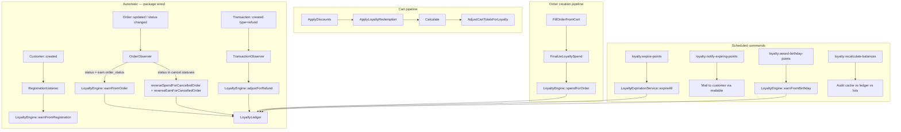

# Loyalty Plugin

> **The ledger is the source of truth; `balance` is a performance optimization and can always be rebuilt from transactions.**

## Overview

The `lunarphp/loyalty` package provides an event-driven loyalty points engine with:

- Ledger-based point tracking (`loyalty_transactions`)
- Cached balance on `loyalty_accounts` (maintained exclusively by `LoyaltyLedger`)
- FIFO lot tracking via `remaining_points` on earn rows
- Spend at order create, earn on order completed
- Cart redemption pipeline and validation
- Automatic schedule registration from config

## Package Layout

| Area | Path |
|------|------|
| Config | `packages/loyalty/config/loyalty.php` → merged as `lunar.loyalty` |
| ServiceProvider | `LoyaltyServiceProvider` — registers pipelines, validators, observers, schedule, mixins, relations |
| Plugin | `LoyaltyPlugin` — Filament panel registration (navigation group + `LoyaltyTransactionResource`) |
| Models | `Models/LoyaltyAccount`, `Models/LoyaltyTransaction` |
| Model contracts | `Models/Contracts/LoyaltyAccount`, `Models/Contracts/LoyaltyTransaction` |
| Enum | `Enums/LoyaltyTransactionType` (`Earn`, `Spend`, `Expire`, `Adjust`) |
| Services | `LoyaltyLedger`, `LoyaltyEngine`, `LoyaltyRedeemer`, `LoyaltyAccountManager`, `LoyaltyExpirationService` |
| Facade | `Facades/Loyalty` → proxies `LoyaltyEngine` |
| Calculators | `Calculators/OrderTotalCalculator`, `Calculators/FixedPointsCalculator` |
| Calculator contract | `Contracts/EarnCalculator` |
| Cart pipelines | `Pipelines/Cart/ApplyLoyaltyRedemption`, `Pipelines/Cart/AdjustCartTotalsForLoyalty` |
| Order pipeline | `Pipelines/Order/Creation/FinalizeLoyaltySpend` |
| Observers | `Observers/OrderObserver` (on `Order`), `Observers/TransactionObserver` (on `Transaction`) |
| Listener | `Listeners/RegistrationListener` (on `Customer::created`) |
| Mixin | `Mixins/CustomerMixin` — adds `loyaltyAccount()` relation to `Customer` |
| Support | `Support/LoyaltyEventKey`, `Support/OrderLoyaltySummary` |
| Validation | `Validation/Cart/LoyaltyRedemptionValidator` — appended to `order_create` validators |
| Console | `Console/ExpireLoyaltyPointsCommand`, `NotifyExpiringLoyaltyPointsCommand`, `AwardBirthdayPointsCommand`, `RecalculateBalancesCommand` |
| Filament resources | `Filament/Resources/LoyaltyTransactionResource`, `Filament/Resources/CustomerResource` |
| Filament relation mgr | `Filament/Resources/CustomerResource/RelationManagers/LoyaltyAccountRelationManager` |
| Filament extension | `Filament/Extensions/ManageOrderExtension` |
| Exceptions | `Exceptions/InsufficientLoyaltyPointsException` |
| Migrations | `database/migrations/2026_06_10_100000_create_loyalty_accounts_table`, `…100001_create_loyalty_transactions_table` |
| Factories | `database/factories/LoyaltyAccountFactory`, `LoyaltyTransactionFactory` |
| Permissions state | `database/state/EnsureLoyaltyPermissions` |
| Tests | `tests/loyalty/` |

## Installation

The package is included in the monorepo. Register the Filament plugin in your panel config:

```php
use Lunar\Loyalty\LoyaltyPlugin;

->plugin(LoyaltyPlugin::make())
```

Publish config:

```bash
php artisan vendor:publish --tag=lunar.loyalty.config
```

## Architecture



**Engine (automatic):**
- `Customer::created` → `RegistrationListener` → `LoyaltyEngine::earnFromRegistration` (if `events.registration` config is set)
- `Order::updated` + `status` changed to `earn.order_status` → `LoyaltyEngine::earnFromOrder`
- `Order::updated` + `status` in `cancel.statuses` → reverses spend and earn
- `Transaction::created` with `type = 'refund'` → `LoyaltyEngine::adjustForRefund`

**Host (must wire for cart redemption):** Call `LoyaltyRedeemer::applyToCart` from checkout UI. The rest of the pipeline is automatic once the cart has `loyalty_points_to_redeem` in meta.

## Configuration (`lunar.loyalty`)

| Key | Default | ENV | Role |
|-----|---------|-----|------|
| `enabled` | `true` | `LOYALTY_ENABLED` | Master switch; all entry points check this |
| `currency.earn_ratio` | `100` | — | Minor units per 1 point earned |
| `currency.redeem_ratio` | `1` | — | Minor units discounted per 1 point spent |
| `currency.min_redeem` | `100` | — | Minimum points required for redemption |
| `currency.max_redeem_percent` | `50` | — | Maximum % of eligible subtotal that can be discounted |
| `earn.order_status` | `'completed'` | — | Order status that triggers earn |
| `events.order_completed.calculator` | `OrderTotalCalculator::class` | — | Calculator for order earn |
| `events.order_completed.multiplier` | `1` | — | Multiplier applied to base calculator result |
| `events.registration.calculator` | `FixedPointsCalculator::class` | — | Calculator for registration bonus |
| `events.registration.points` | `500` | — | Points passed as `context['points']` to `FixedPointsCalculator` |
| `scheduled_rewards.birthday.enabled` | `false` | — | Enables birthday awards command |
| `scheduled_rewards.birthday.points` | `1000` | — | Birthday bonus points |
| `scheduled_rewards.birthday.attribute_handle` | `'birthday'` | — | Customer attribute handle read for birthday date |
| `expiration.months` | `12` | — | Earn lot TTL in months; `0` or negative = no expiration |
| `expiration.notify_windows` | `{30: '30_days', 7: '7_days'}` | — | Days before expiry → notification token |
| `expiration.notification_mailer` | `null` | — | Mailer config key; must be set for expiry emails |
| `expiration.notification_mailable` | `null` | — | FQCN of mailable class; host must provide |
| `cancel.statuses` | `['canceled']` | — | Order statuses triggering spend/earn reversal |
| `cancel.reverse_spend` | `true` | — | Whether to reverse spend on cancellation |
| `refund.statuses` | `['returned']` | — | Config key exists but **not read** by current code |
| `schedule.expire` | `'0 2 * * *'` | — | Cron for `loyalty:expire-points` |
| `schedule.notify` | `'0 9 * * *'` | — | Cron for `loyalty:notify-expiring-points` |
| `schedule.birthday` | `'0 8 * * *'` | — | Cron for `loyalty:award-birthday-points` |
| `schedule.recalculate_balances` | `'0 3 * * 0'` | — | Cron for `loyalty:recalculate-balances` |

Schedule entries are only registered when the key exists in `config('lunar.loyalty.schedule')` and `lunar.loyalty.enabled` is true.

## Balance Reads

| Accessor / method | Source | Use case |
| --- | --- | --- |
| `$account->display_balance` | Cached `balance` column | Storefront, admin UI, customer account page |
| `$account->available_balance` | `SUM(remaining_points)` on non-expired earn lots | Checkout authorization, redemption validation |
| `getBalanceForDisplay()` | Same as `display_balance` | Package internals, Filament |
| `getAvailableBalance()` | Same as `available_balance` | Package internals, ledger |

**Storefront rule:** use accessors (`display_balance`, `available_balance`) in Blade/Livewire — do not call ledger methods or query `LoyaltyTransaction` directly.

In a healthy system both values match. If drift occurs, checkout must trust the lots, not the cache.

## Signed Adjust Convention

| Scenario | type | points |
|---|---|---|
| Cancel spend reversal | `adjust` | positive (restores lot allocations, decrements `lifetime_spent`) |
| Cancel earn reversal | `adjust` | negative (decrements earn lot `remaining_points`, decrements `lifetime_earned`) |
| Refund clawback | `adjust` | negative (decrements earn lot `remaining_points`, decrements `lifetime_earned`) |
| Staff credit (manual) | `earn` | positive (creates lot, increments `lifetime_earned`) |
| Staff debit (manual) | `adjust` | negative (signed, FIFO deduction, does NOT update `lifetime_spent`) |

`earn`, `spend`, and `expire` store unsigned positive `points`. `adjust` stores **signed** `points`.

## Currency Convention

All calculators use **`order_total_minor`** (integer minor currency units). Never reference specific currencies in package code.

```php
'currency' => [
    'earn_ratio' => 100,   // 1 point per 100 minor units (e.g. 1 RON = 1 point if stored in bani)
    'redeem_ratio' => 1,   // 1 minor unit discounted per point spent
    'min_redeem' => 100,   // minimum 100 points to redeem
    'max_redeem_percent' => 50, // max 50% of eligible subtotal
],
```

## Earn Calculators

### `OrderTotalCalculator`

`floor(order_total_minor / earn_ratio)` — earns 1 point per `earn_ratio` minor units.

### `FixedPointsCalculator`

Returns `context['points']` directly — used for registration and birthday bonuses.

### Custom calculators

Implement `Contracts/EarnCalculator`:

```php
interface EarnCalculator
{
    public function calculate(array $context): int;
}
```

Register in config under `events.{event}.calculator`.

## Cart Redemption Flow

1. Host calls `LoyaltyRedeemer::applyToCart($cart, $points)`.
2. This validates and writes `loyalty_points_to_redeem` and `loyalty_discount_minor` to `cart.meta`, then recalculates.
3. On each calculate: `ApplyLoyaltyRedemption` distributes the discount proportionally across eligible lines (into `subTotalDiscounted` and `discountTotal`).
4. `AdjustCartTotalsForLoyalty` converts the ex-tax discount to inc-tax and adjusts `cart->total`.
5. On order creation: `FinalizeLoyaltySpend` calls `LoyaltyEngine::spendForOrder`, which writes a `spend` transaction via `LoyaltyLedger`.
6. `LoyaltyRedemptionValidator` re-validates at order create to catch stale redemptions.

```php
app(LoyaltyRedeemer::class)->applyToCart($cart, $points);
app(LoyaltyRedeemer::class)->clearFromCart($cart);
```

## Refund Rounding

Proportional clawback of earned points on refund (always floor, customer-favourable):

```
pointsToReverse = floor((refundAmountMinor / orderTotalMinor) * earnedPoints)
```

Capped to `earnTransaction->remaining_points` (customer may have already spent points or a prior cancel reversed them). Written as `adjust` with negative signed `points` and `event_key = order:{id}:refund:{n}`.

## Event Keys

All event keys are generated by `Support/LoyaltyEventKey`:

| Event | Key format |
|---|---|
| Order earn | `order:{id}:earn` |
| Order spend | `order:{id}:spend` |
| Cancel spend reversal | `order:{id}:cancel:spend` |
| Cancel earn reversal | `order:{id}:cancel:earn` |
| Refund clawback | `order:{id}:refund:{n}` |
| Registration bonus | `customer:{id}:registration` |
| Birthday bonus | `customer:{id}:birthday:{year}` |
| Manual adjust | `adjust:{uuid}` (unique per call — not idempotent) |
| Lot expiry | `expire:{earnLotId}` |

`LoyaltyLedger` checks `event_key` uniqueness before writing every transaction.

## Filament Admin

### `LoyaltyTransactionResource`

- Listed under navigation group `loyalty` (translated `lunarpanel.loyalty::plugin.navigation.group`)
- Icon: `heroicon-o-gift`
- Permission: `sales:loyalty:manage`
- Read-only table; no create/edit pages

### `CustomerResource` extension

Registered via `LunarPanelManager::extensions` as an override of the admin `CustomerResource`. Adds `LoyaltyAccountRelationManager` tab to the customer detail page with:
- Balance stats (display_balance, available_balance, lifetime_earned, lifetime_spent)
- Transaction table (all types, with event_key toggleable)
- **Create account** action (when no account exists)
- **Adjust** action (manual adjust form: points integer + reason text)

### `ManageOrderExtension`

Extends `ManageOrder` page via `ViewPageExtension`:
- `extendOrderDiscountBreakdownLines` — appends loyalty redemption line (points + discount amount) using `OrderLoyaltySummary::fromOrder`
- `extendHiddenOrderMetaKeys` — hides `loyalty_points_to_redeem` and `loyalty_discount_minor` from the additional info section

## Commands

| Command | Purpose |
|---|---|
| `loyalty:expire-points` | Expire past-due earn lots |
| `loyalty:notify-expiring-points` | Send expiration window notification emails |
| `loyalty:award-birthday-points` | Award scheduled birthday points |
| `loyalty:recalculate-balances` | Audit cache vs ledger vs lots; `--fix` rebuilds cache from ledger |

## Repair Command

```bash
php artisan loyalty:recalculate-balances
php artisan loyalty:recalculate-balances --account=1
php artisan loyalty:recalculate-balances --fix
```

Reports per account:
- **cache vs ledger** — sum of earn/spend/expire/adjust transactions
- **cache vs lots** — sum of `remaining_points` on non-expired earn rows
- **lifetime_earned** and **lifetime_spent** counter drift

`--fix` updates `balance`, `lifetime_earned`, and `lifetime_spent` from ledger. Lot drift is reported but not auto-fixed.

## Expiry Notifications

`loyalty:notify-expiring-points` requires two config keys to send emails:

```php
'expiration' => [
    'notification_mailer' => 'smtp',          // mailer config name
    'notification_mailable' => App\Mail\LoyaltyExpiryNotification::class, // host-provided
],
```

The mailable is instantiated as `new $mailableClass($lot, $user, $days)`. Sent notifications are tracked in `meta.notifications` on the earn lot to prevent duplicates per window token.

## Storefront API (`lunar-frontend`)

Public integration surface. Do not import `LoyaltyLedger`, `LoyaltyEngine`, or query loyalty tables directly from the storefront.

### Account balances

```php
$account = $customer->loyaltyAccount;

$account->display_balance;   // cached balance for UI
$account->available_balance; // spendable points (lot sum)
```

### Earn estimates (read-only, no DB writes)

```php
use Lunar\Loyalty\Facades\Loyalty;

Loyalty::estimateCartPoints($cart);   // checkout: "you will earn ~X points"
Loyalty::estimateOrderPoints($order); // order confirmation emails
```

Uses the same `order_completed` calculator and multiplier as real earn; returns `0` when loyalty is disabled.

### Order ledger relations

```php
$order->loyaltyEarnTransaction?->points ?? 0;  // points earned (set after order completed)
$order->loyaltySpendTransaction?->points ?? 0;  // points spent (set at order creation)
```

Relations are registered on `Order` via `LoyaltyServiceProvider` and keyed by `event_key`.

### Cart redemption

```php
app(LoyaltyRedeemer::class)->applyToCart($cart, $points);
app(LoyaltyRedeemer::class)->clearFromCart($cart);
```

## Host Follow-Up Checklist

1. Register `LoyaltyPlugin::make()` in the Filament panel
2. Publish `config/lunar/loyalty.php` and adjust ratios, statuses, and expiration months
3. Implement checkout UI — `LoyaltyRedeemer::applyToCart` / `clearFromCart`
4. Use `display_balance`, `available_balance`, `Loyalty::estimateCartPoints()`, and order relations in Blade/Livewire
5. Schedule `loyalty:expire-points`, `loyalty:notify-expiring-points`, `loyalty:award-birthday-points`, and optionally `loyalty:recalculate-balances`
6. Provide `notification_mailable` class for expiry emails (takes `$lot, $user, $days`)
7. Ensure order statuses in `earn.order_status` and `cancel.statuses` match published `lunar/orders.php`
8. If birthday rewards needed, set `scheduled_rewards.birthday.enabled = true` and ensure customers have a `birthday` attribute

## Sole Balance Writer

All balance mutations go through `LoyaltyLedger`. Never update `loyalty_accounts.balance` directly. The only exception is `RecalculateBalancesCommand` with `--fix`, which uses a raw `lockForUpdate()` update.
