# Klaviyo Marketing Integration Coexisting with Mailchimp

## Requirements

- Enable shops to use Klaviyo as an additional marketing destination alongside the existing Mailchimp integration without breaking Mailchimp-only deployments.
- Sync customer marketing profiles (subscribe / profile update) and placed orders to Klaviyo using the same storefront lifecycle moments Mailchimp already consumes.
- Track key storefront behavioral events to Klaviyo when enabled, without forcing Mailchimp shops to change behavior.
- Preserve full backwards compatibility of `packages/mailchimp` public APIs, config keys, jobs, observer behavior, and host dispatch sites.
- Keep the first delivery scoped to the smallest safe coexistence path: sibling Klaviyo package + thin shared marketing lifecycle events + reuse of `OrderPlacedEvent`; defer Klaviyo cart/product catalog parity and a full marketing provider interface.

## Entities

```mermaid
classDiagram
direction TB

class OrderPlacedEvent {
    +Order order
}

class CustomerMarketingOptInRequested {
    +string email
    +bool doubleOptIn
}

class CustomerMarketingProfileSyncRequested {
    +Customer customer
    +array mergeFields
    +bool languageOnly
}

class StorefrontMarketingEventTracked {
    +string email
    +string eventName
    +array properties
}

class Customer {
    +int id
    +users()
}

class Order {
    +int id
    +int|null user_id
    +int|null cart_id
    +user
    +billingAddress
    +productLines
}

class User {
    +string email
    +string|null first_name
    +string|null last_name
    +string|null locale
}

class MailchimpSubscriberService {
    +subscribe(email) array
    +syncSubscriber(customer, mergeFields) array
    +trackEvent(email, eventName, properties) array
}

class MailchimpEcommerceService {
    +syncOrder(order) array
    +deleteCart(cartId) bool
}

class SyncOrderOnPlacement {
    +handle(OrderPlacedEvent) void
}

class SyncSubscriberToMailchimp {
    +Customer user
    +bool languageOnly
    +handle() void
}

class KlaviyoService {
    +getConnector() KlaviyoConnector
    +ensureConfigured() void
}

class KlaviyoProfileService {
    +subscribe(email) array
    +syncProfile(customer, properties) array
    +syncProfileByEmail(email, firstName, lastName, properties) array
    +trackEvent(email, eventName, properties) array
}

class KlaviyoEcommerceService {
    +syncOrder(order) array
}

class SyncOrderToKlaviyo {
    +Order order
    +uniqueId() string
    +handle() void
}

class SyncProfileToKlaviyo {
    +Customer customer
    +array properties
    +bool languageOnly
    +handle() void
}

class SyncOrderOnPlacementKlaviyo {
    +handle(OrderPlacedEvent) void
}

OrderPlacedEvent --> Order : carries
OrderPlacedEvent --> SyncOrderOnPlacement : Mailchimp listener
OrderPlacedEvent --> SyncOrderOnPlacementKlaviyo : Klaviyo listener
CustomerMarketingOptInRequested --> MailchimpSubscriberService : via Mailchimp listener
CustomerMarketingOptInRequested --> KlaviyoProfileService : via Klaviyo listener
CustomerMarketingProfileSyncRequested --> SyncSubscriberToMailchimp : via Mailchimp listener
CustomerMarketingProfileSyncRequested --> SyncProfileToKlaviyo : via Klaviyo listener
StorefrontMarketingEventTracked --> MailchimpSubscriberService : via Mailchimp listener
StorefrontMarketingEventTracked --> KlaviyoProfileService : via Klaviyo listener
Customer "1" -- "0..*" User : has
Order "0..1" --> User : placed by
SyncOrderToKlaviyo --> KlaviyoEcommerceService : delegates
SyncProfileToKlaviyo --> KlaviyoProfileService : delegates
```

## Approach

1. Package coexistence strategy:
   - Add `packages/klaviyo` as a sibling Lunar addon mirroring Mailchimp’s Saloon → service → queued job shape.
   - Leave `packages/mailchimp` public surface unchanged (config keys, job FQCNs, services, `CartLineObserver`, `SyncOrderOnPlacement`).
   - Do not introduce a heavyweight `MarketingProviderInterface` or fold providers into a single `packages/marketing` package in v1.
   - Independent master switches: `lunar.mailchimp.enabled` and `lunar.klaviyo.enabled` (Klaviyo defaults **off**).

2. Technical implementation:
   - HTTP: Saloon connector (`KlaviyoConnector`) with Klaviyo private API key auth and revision header; one Request class per endpoint.
   - Async: queued jobs with `lunar.klaviyo.retry` tries/backoff; order job `ShouldBeUnique` with unique id `klaviyo-order-sync-{orderId}`.
   - Shared lifecycle events in `packages/core` under `Lunar\Events\Marketing\*` for opt-in, profile sync, and storefront event tracking — host dispatches these instead of (or in addition to) Mailchimp-specific jobs over time.
   - Mailchimp additive adapters: new listeners in `packages/mailchimp` that map marketing events onto existing Mailchimp jobs/services without renaming existing entry points.
   - Order sync: both packages continue to use `Lunar\ERP\Events\OrderPlacedEvent`; host registers both listener classes when desired.
   - v1 Klaviyo scope: profiles (subscribe/sync), order placed sync, behavioral events. **Defer** Klaviyo abandoned-cart and product catalog sync so Mailchimp `CartLineObserver` stays untouched.
   - Exceptions: package-local `FailedKlaviyoSyncException` / `MissingKlaviyoConfigurationException`; event tracking failures use `SilentException` + `report()` at host/trait call sites (same pattern as Mailchimp).
   - No database migrations or sync-state tables in v1.
   - Tests: Pest + Saloon `MockClient` under `tests/klaviyo/`; register suite when substantial coverage exists.

3. Business logic:
   - Feature flags gate every job/listener (`enabled` + relevant `sync_*` / `track_events` / `automatic_subscription`).
   - Subscribe vs profile sync remain distinct: opt-in path respects consent (`automatic_subscription` / double-opt-in intent); profile sync updates identity properties without inventing Mailchimp merge-field tags inside Klaviyo (map to Klaviyo profile properties: email, first_name, last_name, locale/language, preference properties from order data when syncing after order).
   - Guest orders: billing `contact_email`; registered: user email — same extraction rules as Mailchimp ecommerce path.
   - Failures in one provider must not block the other (independent queued listeners/jobs).
   - Unsubscribe outbound remains out of scope for v1 (parity with Mailchimp package today).

## Structure

### Inheritance Relationships

1. `KlaviyoConnector` extends `Saloon\Http\Connector`.
2. Each `Lunar\Klaviyo\Requests\*` class extends `Saloon\Http\Request` (JSON body where applicable).
3. `FailedKlaviyoSyncException` and `MissingKlaviyoConfigurationException` extend `Exception`.
4. `SyncOrderToKlaviyo` implements `ShouldQueue` and `ShouldBeUnique`.
5. `SyncProfileToKlaviyo` and related sync jobs implement `ShouldQueue`.
6. `SyncOrderOnPlacement` (Klaviyo) implements `ShouldQueue` and handles `OrderPlacedEvent`.
7. Marketing domain events in core use `Dispatchable`, `InteractsWithSockets`, `SerializesModels` (same pattern as `Lunar\Events\ProductCreatedEvent`).

### Dependencies

1. Host storefront dispatches `CustomerMarketingOptInRequested`, `CustomerMarketingProfileSyncRequested`, `StorefrontMarketingEventTracked`, and (already) `OrderPlacedEvent`.
2. Mailchimp marketing listeners call existing `SyncSubscriberToMailchimp` / `MailchimpSubscriberService` — no rewrite of ecommerce services.
3. Klaviyo marketing listeners dispatch `SyncProfileToKlaviyo` or call `KlaviyoProfileService` for events.
4. `SyncOrderOnPlacement` (Klaviyo) dispatches `SyncOrderToKlaviyo` → `KlaviyoEcommerceService` → Saloon requests.
5. `KlaviyoProfileService` / `KlaviyoEcommerceService` depend on `KlaviyoService` for connector and config validation.
6. Root `composer.json` autoloads `Lunar\Klaviyo\` and requires `lunarphp/klaviyo` as `self.version` (same monorepo pattern as mailchimp).

### Layered Architecture

1. Host / storefront layer: decides when opt-in, profile sync, and track events fire; registers order listeners in `listeners.php`.
2. Domain event layer (`packages/core`): provider-agnostic marketing intents.
3. Provider listener/job layer (`packages/mailchimp`, `packages/klaviyo`): config-gated fan-out to vendor APIs.
4. Service layer: map Lunar `Customer` / `Order` / email into vendor payloads.
5. HTTP layer: Saloon connector + request classes.
6. Exception layer: vendor-specific sync/config exceptions; silent reporting for non-blocking track failures.

## Operations

### Create Package Skeleton - `packages/klaviyo`

1. Responsibility: New Lunar addon package parallel to Mailchimp.
2. Files:
   - `composer.json` (`lunarphp/klaviyo`, PSR-4 `Lunar\Klaviyo\`, auto-discover `KlaviyoServiceProvider`)
   - `config/klaviyo.php` merged as `lunar.klaviyo`
   - `src/KlaviyoServiceProvider.php`
3. Provider boot:
   - `mergeConfigFrom` → `lunar.klaviyo`
   - Publish config tag `lunar.klaviyo.config`
   - Register console commands when running in console
   - Do **not** register a `CartLineObserver` in v1
   - Do **not** auto-register `OrderPlacedEvent` listener (host wires it)
4. Root monorepo updates:
   - Autoload `Lunar\\Klaviyo\\` → `packages/klaviyo/src/`
   - Require `lunarphp/klaviyo`: `self.version`
5. Constraints: Defaults keep integration disabled; no Mailchimp file renames.

### Create Config - `lunar.klaviyo`

1. Responsibility: Independent feature flags and credentials.
2. Keys:
   - `enabled` ← `KLAVIYO_ENABLED` default `false`
   - `api_key` ← `KLAVIYO_API_KEY`
   - `api_revision` ← `KLAVIYO_API_REVISION` (default current Klaviyo revision string used by connector)
   - `list_id` ← `KLAVIYO_LIST_ID` (optional; used when subscribe should add to a list)
   - `automatic_subscription` ← `KLAVIYO_AUTOMATIC_SUBSCRIPTION` default `false`
   - `sync_subscribers` ← `KLAVIYO_SYNC_SUBSCRIBERS` default `false`
   - `sync_orders` ← `KLAVIYO_SYNC_ORDERS` default `false`
   - `track_events` ← `KLAVIYO_TRACK_EVENTS` default `true`
   - `profile_properties` map (language key → Klaviyo property name; default `language` → `$locale` or custom property name chosen in config)
   - `retry.max_attempts`, `retry.backoff` mirrors Mailchimp defaults `[60, 300, 3600]`
3. Constraints: Do not nest under `lunar.mailchimp`; do not add `sync_customers.enabled` footgun.

### Create Domain Events - `Lunar\Events\Marketing\*`

1. Responsibility: Provider-agnostic intents for host fan-out.
2. Events:
   - `CustomerMarketingOptInRequested(string $email, bool $doubleOptIn = true)`
   - `CustomerMarketingProfileSyncRequested(Customer $customer, array $mergeFields = [], bool $languageOnly = false)`
   - `StorefrontMarketingEventTracked(string $email, string $eventName, array $properties = [])`
3. Constraints: Do not replace `OrderPlacedEvent`; do not put these events inside the Mailchimp package.
4. Host migration note (document in package README/skill): prefer dispatching these events from verify-email / OAuth / Livewire; existing direct `SyncSubscriberToMailchimp` dispatches remain valid for BC.

### Create Mailchimp Adapters - Listeners on marketing events

1. Responsibility: Additive BC bridge so Mailchimp reacts to shared events.
2. Listeners (registered in `MailchimpServiceProvider` or documented for host registration — prefer package registration for these new listeners only):
   - `SubscribeOnMarketingOptIn`: if `lunar.mailchimp.enabled` and (`automatic_subscription` or caller intent), call `MailchimpSubscriberService::subscribe($email)` or dispatch equivalent work on queue.
   - `SyncSubscriberOnMarketingProfileSync`: if enabled, dispatch existing `SyncSubscriberToMailchimp` with customer / mergeFields / languageOnly.
   - `TrackEventOnStorefrontMarketingEvent`: if `enabled` + `track_events`, call `MailchimpSubscriberService::trackEvent(...)`.
3. Constraints: Do not remove or rename `SyncOrderOnPlacement`, jobs, or `TrackRemoveFromCart`; trait may later dispatch `StorefrontMarketingEventTracked` in a coordinated host change — optional follow-up, not required to break trait BC in v1.

### Implement Connector - `KlaviyoConnector`

1. Responsibility: Saloon HTTP client for Klaviyo REST API.
2. Methods:
   - `resolveBaseUrl(): string` → `https://a.klaviyo.com/api/`
   - `defaultHeaders(): array` → Accept/Content-Type `application/json`, `revision` from config
   - `defaultAuth()` → Klaviyo private-key header auth (`Klaviyo-API-Key {api_key}`)
3. Constraints: Never call live API from tests; inject/mock via Saloon MockClient.

### Implement Service - `KlaviyoService`

1. Responsibility: Config validation and connector access.
2. Constructor: read `api_key`; throw `MissingKlaviyoConfigurationException` when empty and service is used while enabled paths run.
3. Methods:
   - `getConnector(): KlaviyoConnector`
   - `ensureConfigured(): void`
4. Dependency Injection: constructed by container when resolving profile/ecommerce services.

### Implement Service - `KlaviyoProfileService`

1. Responsibility: Profile upsert, list subscribe, and event track.
2. Core methods:
   - `subscribe(string $email): array`
     - Input Validation: non-empty email
     - Business Logic: create/update profile; if `list_id` set, add profile to list with consent appropriate to `automatic_subscription` / double-opt-in intent; do not invent Mailchimp `pending` status literals in Klaviyo payloads — use Klaviyo subscription semantics
     - Exception Handling: wrap API failures in `FailedKlaviyoSyncException`
   - `syncProfile(Customer $customer, array $properties = []): array`
     - Resolve user via `$customer->users()?->first()`; fail if missing (same rule as Mailchimp)
     - Delegate to `syncProfileByEmail`
   - `syncProfileByEmail(string $email, string $firstName, string $lastName, array $properties = []): array`
     - Upsert profile with email, names, filtered non-empty properties (language/locale + caller properties)
   - `syncProfileLanguage(Customer $customer): ?array`
     - Only language/locale property; return null when nothing to sync
   - `trackEvent(string $email, string $eventName, array $properties = []): array`
     - POST metric event for profile; on missing profile, upsert profile then retry once (parity with Mailchimp 404 handling)
3. Dependency Injection: `KlaviyoService`
4. Transaction Management: none (external API only)

### Implement Service - `KlaviyoEcommerceService`

1. Responsibility: Place order payloads into Klaviyo (v1).
2. Core methods:
   - `syncOrder(Order $order): array`
     - Ensure configured
     - Extract email/name from user or billing address (guest-safe)
     - Upsert profile via `KlaviyoProfileService` when `sync_subscribers` true (include language + order preference properties if calculable; prefer reusing preference extraction concepts from Mailchimp’s `calculateOrderData` only by shared private helper **or** duplicated focused mapping in Klaviyo — do not couple Klaviyo service to Mailchimp classes)
     - Create/upsert Klaviyo placed-order event or order metric with line items, totals, currency, order id, processed timestamp
     - Exception Handling: `FailedKlaviyoSyncException`
3. Dependency Injection: `KlaviyoService`, `KlaviyoProfileService`
4. Constraints: No cart delete/product sync in v1.

### Create Saloon Requests - `Lunar\Klaviyo\Requests\*`

1. Responsibility: One class per Klaviyo endpoint used in v1.
2. Minimum set:
   - `UpsertProfileRequest`
   - `SubscribeProfileToListRequest` (if list_id used)
   - `CreateEventRequest` (behavioral + placed order metrics as applicable)
3. Constraints: Match Klaviyo JSON:API-ish payload shapes required by revision; keep request classes free of Lunar model types (accept arrays).

### Create Jobs - Sync to Klaviyo

1. `SyncProfileToKlaviyo`
   - Props: `Customer $customer`, `array $properties = []`, `bool $languageOnly = false`
   - Guards: `enabled`; for full sync also respect caller path (listener may check `sync_subscribers`)
   - Delegates to `KlaviyoProfileService`
   - Retry from `lunar.klaviyo.retry`
2. `SyncOrderToKlaviyo` implements `ShouldBeUnique`
   - Props: `Order $order`
   - `uniqueId(): string` → `klaviyo-order-sync-'.$order->id`
   - Guards: `enabled` && `sync_orders`
   - Delegates to `KlaviyoEcommerceService::syncOrder`
3. Constraints: Wrap failures in `FailedKlaviyoSyncException` with order/customer context.

### Create Listener - `SyncOrderOnPlacement` (Klaviyo namespace)

1. Responsibility: Queue order sync when `OrderPlacedEvent` fires.
2. Class: `Lunar\Klaviyo\Listeners\SyncOrderOnPlacement`
3. `handle(OrderPlacedEvent $event): void`
   - Return early if `!config('lunar.klaviyo.enabled')`
   - If `sync_orders`, dispatch `SyncOrderToKlaviyo`
4. Constraints: Not auto-registered in provider; host `listeners.php` wires it like Mailchimp.

### Create Listeners - Klaviyo marketing event fan-out

1. `SubscribeOnMarketingOptIn` → `KlaviyoProfileService::subscribe` when enabled + automatic_subscription / intent
2. `SyncProfileOnMarketingProfileSync` → `SyncProfileToKlaviyo`
3. `TrackEventOnStorefrontMarketingEvent` → `trackEvent` when `track_events`
4. Registration: register these in `KlaviyoServiceProvider` (safe because events are new and no-op when disabled).

### Create Exceptions

1. `FailedKlaviyoSyncException extends Exception`
2. `MissingKlaviyoConfigurationException extends Exception`

### Create Commands (v1 minimal)

1. `klaviyo:sync-all-users` — bulk profile sync for customers with users (mirror Mailchimp command intent)
2. `klaviyo:sync-all-orders` — bulk order sync; document status filter explicitly (do not silently copy `completed` without host alignment; prefer configurable status list or host-documented status)
3. Constraints: No create-store / merge-fields commands (Mailchimp-specific).

### Create Trait (optional additive) - `TrackStorefrontMarketingEvent`

1. Responsibility: Host Livewire can dispatch `StorefrontMarketingEventTracked` once for both providers.
2. Method: `trackStorefrontMarketingEvent(string $eventName, array $properties): void` with auth + SilentException pattern.
3. Constraints: Do not delete `TrackRemoveFromCart`; host may migrate later.

### Create Tests - `tests/klaviyo`

1. Connector/service tests with Saloon MockClient
2. Job guard tests (disabled flags no-op)
3. Listener tests for `OrderPlacedEvent` and marketing events
4. Assert Mailchimp package tests still pass unchanged
5. Constraints: Never hit live Klaviyo API

### Documentation updates (engine)

1. Add `.ai/skills/klaviyo/SKILL.md` following Mailchimp skill structure
2. Update `docs/system/CODE_MAP.md` marketing row to include Klaviyo
3. Do not treat `MAILCHIMP_PLUGIN.md` as host source of truth

### Explicitly out of scope (v1 Operations)

1. Klaviyo `CartLineObserver` / abandoned cart sync
2. Klaviyo product catalog sync jobs
3. Outbound unsubscribe APIs for Mailchimp or Klaviyo
4. Filament admin settings UI for credentials
5. Refactoring Mailchimp into a provider interface
6. Database migrations / sync ledger tables

## Norms

1. Package layout: Mirror `packages/mailchimp` directories (`Connectors`, `Requests`, `Services`, `Jobs`, `Listeners`, `Exceptions`, `Commands`, `config`).
2. Namespace: `Lunar\Klaviyo\...`; config keyspace `lunar.klaviyo`.
3. Dependency injection: Resolve services via container in jobs (`app(KlaviyoProfileService::class)` or constructor injection consistent with sibling package style).
4. Exception handling:
   - API/job failures → `FailedKlaviyoSyncException`
   - Missing credentials when executing sync → `MissingKlaviyoConfigurationException`
   - Non-blocking track failures at UI edge → `SilentException` + `report()`
5. Feature flags: Every public entry path checks `enabled` and the specific `sync_*` / `track_events` flag before network I/O.
6. Logging: Include order id / customer id / email (where safe) in exception messages; do not log API keys.
7. PHP: Explicit types, curly braces, PHPDoc array shapes for property maps; Pint-compliant style.
8. HTTP: Saloon only — no ad-hoc Guzzle in services.
9. Backwards compatibility: Additive changes to Mailchimp only (new listeners); no renames of existing Mailchimp classes or config keys.
10. Documentation: Prefer skill + CODE_MAP over stale PLUGIN.md narratives.
11. Tests: Pest; Saloon MockClient; config set in `beforeEach`.

## Safeguards

1. Functional Constraints:
   - Mailchimp-only shops with existing env/config continue working with zero required changes.
   - Klaviyo remains disabled unless `KLAVIYO_ENABLED=true`.
   - Both providers may be enabled simultaneously; each processes events independently.
   - v1 does not register a second cart observer.
2. Performance Constraints:
   - Order sync jobs must be unique per order id to avoid duplicate Klaviyo order events under retries.
   - Prefer queued work for profile/order sync; keep track-event path non-blocking for request lifecycle.
3. Security Constraints:
   - Store API keys only in env/config; never commit secrets.
   - Do not expose API response bodies containing secrets to end users.
4. Integration Constraints:
   - Reuse `Lunar\ERP\Events\OrderPlacedEvent` for order placement; do not invent a parallel order-placed event.
   - Host remains responsible for registering order listeners.
   - Do not depend on `Lunar\Mailchimp\*` classes from Klaviyo package.
5. Business Rule Constraints:
   - Guest orders without billing email must fail the Klaviyo order sync with a clear exception (no silent wrong profile).
   - Profile sync requires an associated user for Customer-based sync (parity with Mailchimp).
   - Consent: respect `automatic_subscription`; do not force-subscribe when false.
   - Unsubscribe outbound is not implemented in v1.
6. Exception Handling Constraints:
   - Vendor failures surface as package exceptions with actionable messages.
   - One provider’s failure must not prevent the other provider’s queued job from running.
7. Technical Constraints:
   - PHP 8.2+ / Laravel conventions of this monorepo.
   - No new DB tables in v1.
   - No rewrite of Mailchimp Saloon requests/services as part of this feature.
8. Data Constraints:
   - Email identifiers trimmed/normalized consistently for profile identity.
   - Property maps filter empty keys/values before API send.
9. API Constraints:
   - All Klaviyo HTTP calls go through Saloon request classes and honor configured API revision header.
   - Tests must mock Saloon — no live network calls in CI.
)
