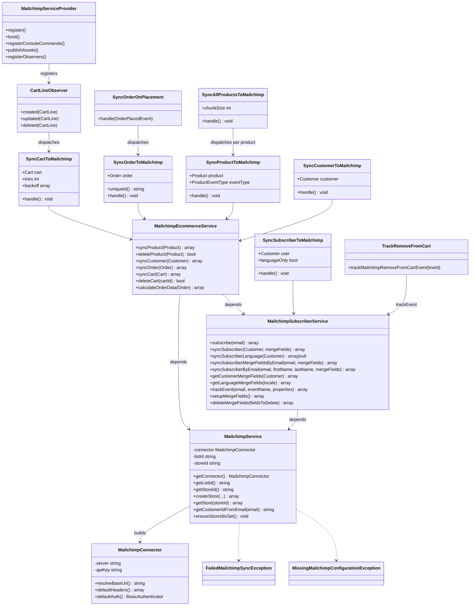
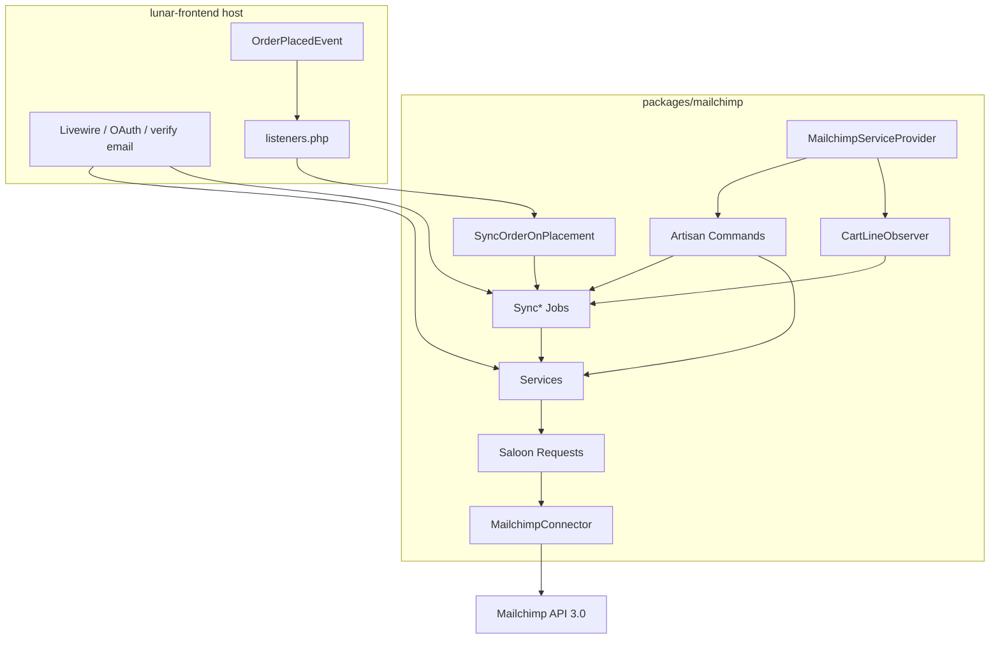

# Mailchimp Integration (packages/mailchimp)

Codified from the existing `lunarphp/mailchimp` package. Describes current behavior only — not a redesign.

## Requirements

- Enable marketing and ecommerce data sync between the Lunar store and Mailchimp so operators can run audience campaigns, abandoned-cart automations, and purchase-triggered flows.
- Keep all outbound Mailchimp work behind a master enable flag and per-capability sync flags so environments can disable integration without removing the package.
- Sync authenticated carts to Mailchimp ecommerce carts when cart lines change, supporting abandoned-cart email flows.
- Sync placed orders (guest and registered) to Mailchimp ecommerce orders, including ecommerce customer upsert and optional audience merge-field updates derived from the order.
- Sync products and variants into the Mailchimp ecommerce catalog; remove unavailable products from Mailchimp.
- Sync customers as audience members with merge fields (name, language, order preferences, address/phone when available).
- Support double-opt-in subscription and resubscription of previously unsubscribed/cleaned members via a pending status path.
- Track custom member events (e.g. `remove_from_cart`) for automations when event tracking is enabled.
- Provide Artisan commands for store creation, merge-field setup, and bulk backfill of users, languages, orders, and products.
- Process sync work asynchronously via queued jobs with configurable retries and backoff.
- Isolate HTTP details in Saloon request classes; expose domain operations through services only.
- Leave storefront-specific triggers (email verification, OAuth, Livewire checkout/product-view tracking, `OrderPlacedEvent` listener registration) to the host application (`lunar-frontend`); this package supplies services, jobs, observer, listener class, and commands.

## Entities

### Configuration shape (`lunar.mailchimp`)

| Key | Source | Default / notes |
|-----|--------|-----------------|
| `enabled` | `MAILCHIMP_ENABLED` | `false` |
| `api_key` | `MAILCHIMP_API_KEY` | required for service construction |
| `server` | `MAILCHIMP_SERVER` | `us1` |
| `list_id` | `MAILCHIMP_LIST_ID` | required for service construction |
| `store_id` | `MAILCHIMP_STORE_ID` | required for ecommerce ops via `ensureStoreIdIsSet()` |
| `automatic_subscription` | `MAILCHIMP_AUTOMATIC_SUBSCRIPTION` | `false` (host-interpreted; not enforced inside package jobs) |
| `sync_subscribers` | `MAILCHIMP_SYNC_SUBSCRIBERS` | `false` — gates subscriber merge sync during order path |
| `sync_products` | `MAILCHIMP_SYNC_PRODUCTS` | `false` |
| `sync_orders` | `MAILCHIMP_SYNC_ORDERS` | `false` |
| `sync_carts` | `MAILCHIMP_SYNC_CARTS` | `false` |
| `track_events` | `MAILCHIMP_TRACK_EVENTS` | `true` |
| `merge_fields` | static map | FNAME, LNAME, PHONE, ADDRESS, PREFCAT, PREFSUBCAT, LANGUAGE |
| `option_fields` | static map | empty by default; tag → `{handle, name, type, ...}` |
| `retry.max_attempts` | `MAILCHIMP_MAX_ATTEMPTS` | `4` |
| `retry.backoff` | static | `[60, 300, 3600]` |

Note: `SyncCustomerToMailchimp` also reads `lunar.mailchimp.sync_customers.enabled`, which is **not** present in the packaged default config.

### Saloon request inventory

| Request | Method | Endpoint pattern |
|---------|--------|------------------|
| `CreateStoreRequest` | POST | `/ecommerce/stores` |
| `GetStoreRequest` | GET | `/ecommerce/stores/{storeId}` |
| `SyncProductRequest` | PUT | `/ecommerce/stores/{storeId}/products/{productId}` |
| `DeleteProductRequest` | DELETE | `/ecommerce/stores/{storeId}/products/{productId}` |
| `SyncCustomerRequest` | PUT | `/ecommerce/stores/{storeId}/customers/{customerId}` |
| `UpdateOrCreateOrderRequest` | PUT | `/ecommerce/stores/{storeId}/orders/{orderId}` |
| `CreateCartRequest` | POST | `/ecommerce/stores/{storeId}/carts` |
| `UpdateCartRequest` | PATCH | `/ecommerce/stores/{storeId}/carts/{cartId}` |
| `DeleteCartRequest` | DELETE | `/ecommerce/stores/{storeId}/carts/{cartId}` |
| `SyncSubscriberRequest` | PUT | `/lists/{listId}/members/{subscriberHash}` |
| `TrackEventRequest` | POST | `/lists/{listId}/members/{subscriberHash}/events` |
| `ListMergeFieldsRequest` | GET | `/lists/{listId}/merge-fields` |
| `CreateMergeFieldRequest` | POST | `/lists/{listId}/merge-fields` |
| `UpdateMergeFieldRequest` | PATCH | `/lists/{listId}/merge-fields/{mergeId}` |
| `DeleteMergeFieldRequest` | DELETE | `/lists/{listId}/merge-fields/{mergeId}` |

### Domain models consumed (from Lunar core)

- `Cart`, `CartLine`, `Order`, `Product`, `Customer`, `Currency`
- Event: `Lunar\ERP\Events\OrderPlacedEvent`
- Enum: `Lunar\Enums\ProductEventType` (CREATE, UPDATE, DELETE)
- Exception: `Lunar\Exceptions\SilentException` (used for non-fatal product URL / event-tracking failures)

## Approach

- **Package layout**: Dedicated Composer package `lunarphp/mailchimp` under `packages/mailchimp`, auto-discovered via `MailchimpServiceProvider`.
- **HTTP client**: Saloon connector with Basic auth (username `anystring`, password = API key) against `https://{server}.api.mailchimp.com/3.0/`.
- **Layering**: Provider / observer / listener / commands → queued jobs → services → Saloon requests → Mailchimp API.
- **Service split**: Thin `MailchimpService` (credentials, connector, store helpers, email→customer ID hashing); `MailchimpEcommerceService` (products, customers, carts, orders, preference calculation); `MailchimpSubscriberService` (audience members, events, merge fields).
- **Async boundary**: Model/observer and host events enqueue jobs; bulk user/order commands call services synchronously in chunks; product bulk command dispatches a fan-out job.
- **Idempotent ecommerce upserts**: Products and customers use PUT; orders use PUT; carts try POST then product-heal retry then PATCH on continued 400.
- **Customer identity**: Ecommerce customer IDs are always `md5(strtolower(trim(email)))` so guest and registered users with the same email share one Mailchimp customer.
- **Host/engine split**: Package registers only `CartLineObserver` and Artisan commands. `SyncOrderOnPlacement` exists in-package but must be registered by the host on `OrderPlacedEvent`. Subscriber signup and most event tracking are invoked from the host.
- **Feature flags**: Jobs and observer early-return when master or capability flags are off; failed syncs do not run when disabled.

### Known divergences

- `packages/mailchimp/MAILCHIMP_PLUGIN.md` describes an older single-service / lunar-frontend-path layout; the live package uses three services and paths under `Lunar\Mailchimp\`. Treat code as source of truth.
- `SyncSubscriberToMailchimp` checks only `enabled`, not `sync_subscribers`. Order-time subscriber updates honor `sync_subscribers` inside `syncCustomerAfterOrder`.
- `SyncCustomerToMailchimp` depends on `sync_customers.enabled`, which is absent from default config (job no-ops unless the host defines it).
- Job constructor property on `SyncSubscriberToMailchimp` is named `$user` but typed as `Customer`.
- Bulk order command filters `Order::where('status', 'completed')`, which may not match host-published order statuses.
- Cart/order tax totals multiply order/cart total by the first line purchasable’s tax rate (approximate, not Lunar’s computed tax total).
- `automatic_subscription` is documented in config but not read by package jobs/services themselves.

## Structure

### Dependency direction

1. Requests and Connector — leaf HTTP adapters
2. `MailchimpService` — config + connector factory
3. `MailchimpSubscriberService` → `MailchimpService`
4. `MailchimpEcommerceService` → `MailchimpService` + `MailchimpSubscriberService`
5. Jobs / Commands / Observer / Listener / Trait → services
6. Provider wires config merge, command registration, CartLine observer

### Package registration

- Config merged as `lunar.mailchimp`; publishable tag `lunar.mailchimp.config` → `config/lunar/mailchimp.php`
- Commands registered only when `runningInConsole()`
- No event listener registration inside the provider

## Operations

### MailchimpServiceProvider

- Responsibility: bootstrap package config, commands, and CartLine observer.
- `register`: merge `config/mailchimp.php` into `lunar.mailchimp`.
- `boot`: register console commands, publish config, observe `CartLine` with `CartLineObserver`.

### MailchimpConnector

- Responsibility: Saloon base client for Mailchimp Marketing API v3.
- Base URL from constructor `server`; Accept/Content-Type JSON; Basic auth with fixed username `anystring` and API key password.

### MailchimpService

- Responsibility: validate credentials, expose connector/list/store IDs, store create/get, customer ID hashing, store-ID guard.
- Constructor throws `MissingMailchimpConfigurationException` if `api_key` or `list_id` empty; `store_id` may be empty string until ecommerce use.
- `getCustomerIdFromEmail(email)` returns MD5 of lowercased trimmed email.
- `createStore` / `getStore` send Saloon requests; non-success throws `FailedMailchimpSyncException`.
- `ensureStoreIdIsSet` throws `MissingMailchimpConfigurationException` when store ID empty.

### MailchimpEcommerceService

- Responsibility: ecommerce catalog, customer, cart, and order sync plus order preference merge-field calculation.

#### `syncProduct(Product)`

- Ensures store ID; loads variants, collections, brand, media.
- If product not available: `deleteProduct` and return empty array.
- Builds product URL from `app.url` + first `localeUrl` slug; missing URL reported via `SilentException` without aborting.
- Primary large image from media collection `images` with `primary` true.
- Variants: id, title from product name, URL, SKU, price from default-currency inc-tax price / 100, stock, image, visibility from product published status.
- Product payload includes description (stripped HTML), vendor brand name, subcategory name as `type`, ISO8601 `published_at_foreign`.
- PUT via `SyncProductRequest`; failure throws `FailedMailchimpSyncException`.

#### `deleteProduct(Product)`

- DELETE; treats HTTP 404 as success; other failures throw.

#### `syncCustomer(Customer)`

- Requires an associated user; otherwise throws.
- PUT ecommerce customer with email-hash ID, email, `opt_in_status` true, first/last name.

#### `syncOrder(Order)`

- Ensures store ID; runs `syncCustomerAfterOrder` for customer (and optional subscriber) sync.
- Maps product lines to Mailchimp line items (line id, product id, variant id, quantity, unit price from line total/quantity).
- Tax total = order decimal total × first product line purchasable tax rate; shipping from order shipping total decimal.
- PUT via `UpdateOrCreateOrderRequest`.
- On HTTP 400: sync all order products (`syncOrderProducts`, per-product failures logged as warnings), then retry same PUT once.
- Non-success after retry throws.

#### `syncCustomerAfterOrder(Order)` (protected)

- Registered order: email/name from user; guest: from billing address contact email / names.
- Upserts ecommerce customer via `syncCustomerByEmail` (400 treated as success).
- If `sync_subscribers`: merges language merge fields (registered only) with `calculateOrderData`, then `syncSubscriberByEmail`.
- Returns customer stub array for the order payload (id, email, names) — note order PUT customer object omits `opt_in_status` unlike cart path.

#### `syncCart(Cart)`

- Requires `user_id`; else throws.
- Refreshes and recalculates cart; builds lines and tax similarly to orders; customer object includes email-hash ID, email, `opt_in_status` true.
- `checkout_url` from `resolveCheckoutUrl`: prefers localized named route `lfp.{locale}.checkout.details` if registered, else `lfp.checkout.details` (host routes).
- POST create cart; on 400 sync cart products then retry POST; on still 400 PATCH update; else throw on failure.

#### `deleteCart(cartId)`

- DELETE; 404 is success.

#### `calculateOrderData` / preference extractors

- Collapses category preferences (most frequent root collection → PREFCAT; child collection → PREFSUBCAT), configured `option_fields` most-frequent option values, and phone/address from shipping address falling back to billing.
- Address merge field is Mailchimp address object (`addr1`, `addr2`, `city`, `state`, `zip`, `country` iso2) when any of line_one/city/postcode present.
- Empty tags/values filtered out.

### MailchimpSubscriberService

- Responsibility: audience member upsert, language/merge-field maintenance, member events, merge-field schema setup/delete.

#### `subscribe(email)`

- PUT member with `status_if_new` = `pending`.
- If returned status is `unsubscribed` or `cleaned`, second PUT sets `status` = `pending` for reconfirmation.

#### `syncSubscriber(Customer, mergeFields)`

- Requires linked user; merges `getCustomerMergeFields` with extra fields; delegates to `syncSubscriberByEmail`.

#### `syncSubscriberByEmail`

- PUT with `status_if_new` = `subscribed` and merge fields including configured first/last name tags plus cleaned extras (non-empty keys and filled values).

#### `syncSubscriberLanguage` / `syncSubscriberMergeFieldsByEmail`

- Language-only path builds LANGUAGE merge field from user locale; no-ops (returns null) when nothing to sync.
- Merge-fields-only PUT without status change; throws if cleaned map empty.

#### `trackEvent(email, eventName, properties)`

- POST member event with name, properties, `occurred_at` ISO8601.
- On 404: find Customer by user email, `syncSubscriber`, retry event once; missing customer throws.
- Other failures throw.

#### `setupMergeFields`

- Lists existing merge fields once.
- Creates/updates PREFCAT, PREFSUBCAT, LANGUAGE (from config tags) and each `option_fields` entry; skips default FNAME/LNAME/PHONE/ADDRESS.
- Per-field failures recorded in result map rather than aborting the whole run.

#### `deleteMergeFields`

- Lists once; deletes by tag → merge_id; missing tags reported as successful no-op.

### CartLineObserver

- Implements `ShouldHandleEventsAfterCommit`.
- On created/updated/deleted: if `enabled` and `sync_carts`, and cart has `user_id`, dispatch `SyncCartToMailchimp`.

### SyncOrderOnPlacement

- Queued listener for `OrderPlacedEvent`.
- If `enabled` and `sync_orders`, dispatch `SyncOrderToMailchimp` with event order.
- **Not** registered by package provider — host must wire it.

### TrackRemoveFromCart (trait)

- Intended for host/Livewire cart UI.
- If `enabled` and `track_events` and authenticated user and line purchasable found: call `trackEvent` with `remove_from_cart` and product/price/quantity properties from datalayer prices.
- Failures reported as `SilentException` without rethrowing.

### Jobs

#### SyncCartToMailchimp

- Tries/backoff from retry config.
- Guards: `enabled`, `sync_carts` (job default true if config missing), requires `user_id`.
- Empty lines: attempt `deleteCart`, swallow exceptions, return.
- Else `syncCart`; wrap failures in `FailedMailchimpSyncException`.

#### SyncOrderToMailchimp

- Implements `ShouldBeUnique` with unique id `mailchimp-order-sync-{orderId}`.
- Guards: `enabled`, `sync_orders`.
- `syncOrder` then `deleteCart` for `order.cart_id` when set.
- Failures wrapped in `FailedMailchimpSyncException`.

#### SyncProductToMailchimp

- Guards: `enabled`, `sync_products`.
- CREATE/UPDATE → `syncProduct`; DELETE → `deleteProduct`.

#### SyncSubscriberToMailchimp

- Guards: `enabled` only.
- `languageOnly` true → `syncSubscriberLanguage`; else `syncSubscriber` with optional merge fields.
- Constructor parameter typed `Customer` named `$user`.

#### SyncCustomerToMailchimp

- Guards: `enabled` and `sync_customers.enabled` (default false / undefined).
- Delegates to `syncCustomer`.

#### SyncAllProductsToMailchimp

- Fixed `$tries = 3` (does not use mailchimp retry config).
- Chunks products that have stock > 0 or backorder; for each available product dispatches `SyncProductToMailchimp` with UPDATE.

### Artisan commands

| Command | Behavior |
|---------|----------|
| `mailchimp:create-store` | Requires enabled; interactive store create via `MailchimpService::createStore`; auto-generates store id from domain; validates alphanumeric/_/- max 50; then `setupMergeFields`; prints `MAILCHIMP_STORE_ID` hint |
| `mailchimp:setup-merge-fields` | Requires enabled; runs `setupMergeFields`; table of per-tag results; fails if any tag failed |
| `mailchimp:sync-all-users` | Requires enabled; chunks all Customers; syncs each via `syncSubscriber` synchronously; confirms before run |
| `mailchimp:sync-user-languages` | Requires enabled; customers with non-empty user locale; `syncSubscriberLanguage`; tracks skipped/null |
| `mailchimp:sync-all-orders` | Requires enabled + `sync_orders`; filters `status = completed`; synchronous `syncOrder` in chunks |
| `mailchimp:sync-all-products` | Requires enabled + `sync_products`; dispatches `SyncAllProductsToMailchimp` job only |

### Exceptions

- `FailedMailchimpSyncException`: API or job failure wrapper (empty subclass of Exception).
- `MissingMailchimpConfigurationException`: missing API/list or store configuration (empty subclass of Exception).

## Norms

- Namespace: `Lunar\Mailchimp\` with PSR-4 root `packages/mailchimp/src`.
- Config key prefix: `lunar.mailchimp.*`; env vars `MAILCHIMP_*`.
- HTTP: one Saloon `Request` class per endpoint; JSON body via `HasJsonBody` where applicable; no direct HTTP from controllers in this package.
- Services resolved via Laravel container (`app(Service::class)` in jobs; constructor injection in ecommerce/subscriber services and commands).
- Jobs implement `ShouldQueue`; use `Dispatchable`, `InteractsWithQueue`, `Queueable`, `SerializesModels`; most read tries/backoff from config in constructor.
- Feature-flag early returns rather than throwing when disabled.
- API failures typically throw `FailedMailchimpSyncException` with response body text; product heal paths log warnings and continue.
- Non-fatal UX paths use `SilentException` + `report()`.
- Subscriber hash and ecommerce customer ID both derive from MD5 of lowercased email (subscriber hash does not trim; customer ID does trim).
- Tests live under `tests/mailchimp/` using Saloon `MockClient` (per skill/docs); package skill notes they are not yet in root phpunit/CI matrix.
- Naming: sync jobs `Sync{Entity}ToMailchimp`; requests named by action (`Create*`, `Update*`, `Delete*`, `Sync*`, `Track*`).
- Inconsistency: some job config fallbacks use `true` for sync flags when config key missing (`sync_carts`, `sync_orders`, `sync_products`) while packaged defaults are `false` when env unset — behavior depends on whether config is fully merged.

## Safeguards

### Functional

- Master `enabled` flag must be true for observer, listener, jobs, and commands to perform work.
- Cart sync only for carts with `user_id` (guest carts never sync).
- Empty carts delete remote cart instead of upserting empty ecommerce carts.
- Unavailable products are deleted from Mailchimp rather than upserted.
- Order sync unique job key prevents duplicate concurrent queues per order id.
- Cart line observer runs after DB commit to avoid racing uncommitted line state.
- Delete cart/product treat 404 as success (idempotent cleanup).
- Guest orders require billing contact email path via billing address (no alternate guest email source in package).
- `syncCustomer` / `syncSubscriber` require Customer→User association; guest flows use by-email helpers instead.

### Configuration / data

- Service construction requires `api_key` and `list_id`.
- Ecommerce methods require non-empty `store_id`.
- Store ID format in create command: alphanumeric plus `_`/`-`, max 50 characters.
- Merge field setup skips empty tags; option fields require tag, name, and handle.
- Merge field values filtered to non-empty keys and filled values before PUT.

### Integration

- Checkout URL depends on host-registered named routes; localized route preferred when present.
- Order placement Mailchimp sync depends on host registering `SyncOrderOnPlacement` for `OrderPlacedEvent`.
- Cart/product/order 400 handling assumes missing products may be the cause and heals by syncing referenced products before retry.
- Subscriber event tracking auto-heals missing members only when a Customer with matching user email exists.

### Performance / reliability

- Job retries: default 4 attempts with backoff 60s, 300s, 3600s (except `SyncAllProductsToMailchimp` tries=3).
- Bulk commands chunk (users/languages default 100, orders default 50, products chunk option forwarded to job).
- Product sync-on-heal swallows per-product exceptions as warnings to avoid failing entire cart/order heal loop on one bad product.
- Event tracking and remove-from-cart trait failures must not break the storefront request (silent report).

### Security

- API key only in config/env; passed as Basic auth password to Mailchimp.
- No Mailchimp credentials logged intentionally in services (errors include API response bodies which may contain Mailchimp error detail).
- Customer identifiers exposed to Mailchimp as email MD5 hashes, not raw emails as IDs.

### Business rules

- Double opt-in path: `subscribe` uses `pending` for new and for re-opt-in of unsubscribed/cleaned.
- Programmatic sync path: `syncSubscriberByEmail` uses `status_if_new` = `subscribed`.
- Order preference merge fields reflect most frequent category/subcategory/option values on that order’s lines.
- Language merge field sourced from user locale when present.
- After successful order sync, associated ecommerce cart is deleted when `cart_id` is set.
)
