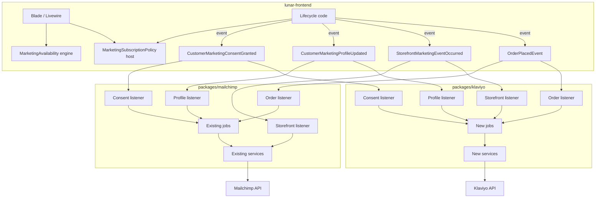

# Marketing Lifecycle Events + Klaviyo Coexistence (Mailchimp BC)

Updated REASONS Canvas replacing `GGQPA-XXX-202608251338-[Feat]-service-klaviyo-alongside-mailchimp.md`.

Architecture mandate: host emits provider-neutral lifecycle events; Mailchimp and Klaviyo packages register thin listeners that dispatch provider-specific jobs. No `MarketingProviderInterface`. No provider enablement logic in the host.

**Revision notes (review feedback applied):**
1. Consent adapters branch on explicit `MarketingSubscriptionMode` (not hidden `source` switches).
2. Storefront: producer `uniqueKey` → stable `eventId` / Klaviyo `unique_id`; else generate **once** at construction and preserve across retries — never per attempt.
3. Provider UI gating uses engine `MarketingAvailability` — Blade never ORs provider configs.
4. `CustomerMarketingConsentGranted` is emitted only when the app authorizes subscription **processing**; shop automatic-subscription policy ≠ explicit customer consent.
5. **Split availability vs policy:** engine `MarketingAvailability` owns provider/capability checks only; host owns registration-subscription **policy** (`MarketingSubscriptionPolicy` in lunar-frontend). Engine must not read `lunar-frontend.*` config.

## Requirements

- Refactor host/client marketing integration so Lunar Frontend never dispatches Mailchimp- or Klaviyo-specific jobs/services and never branches on which provider is enabled.
- Introduce provider-neutral marketing lifecycle events in `packages/core` that describe **what happened** in the application (subscription processing authorized / profile updated / storefront event occurred), not integration actions.
- Add thin adapter listeners in `packages/mailchimp` and `packages/klaviyo` that gate on their own config and translate neutral payloads into existing/new provider jobs.
- Add `packages/klaviyo` for profiles, consent/subscription, behavioral events, and order placement sync — without Mailchimp cart/catalog/store/merge-field parity in v1.
- Preserve functional backwards compatibility of existing Mailchimp jobs, services, requests, commands, config keys, cart observer, and retry behavior; reuse them from new Mailchimp adapters.
- Migrate each host lifecycle point completely (no permanent mixed direct-dispatch + event path for the same point).
- Keep order placement on existing `OrderPlacedEvent`; move listener registration into provider packages so the host no longer names Mailchimp/Klaviyo in `listeners.php` for that concern.
- Leave product-catalog and abandoned-cart sync as Mailchimp-owned (provider-specific) until a later Klaviyo-mapped phase.

## Entities

```mermaid
classDiagram
direction TB

class MarketingConsentSource {
    <<enumeration>>
    Registration
    OAuth
    Newsletter
    Checkout
}

class MarketingSubscriptionMode {
    <<enumeration>>
    CustomerRegistration
    ExplicitOptIn
}

class CustomerMarketingConsentGranted {
    +string email
    +Customer|null customer
    +MarketingConsentSource source
    +MarketingSubscriptionMode subscriptionMode
    +array context
}

class CustomerMarketingProfileUpdated {
    +Customer customer
    +array properties
}

class StorefrontMarketingEventOccurred {
    +string email
    +string eventName
    +array properties
    +string eventId
}

class MarketingAvailability {
    +newsletterSubscriptionAvailable() bool
}

class MarketingSubscriptionPolicy {
    <<host-owned lunar-frontend>>
    +automaticRegistrationSubscriptionProcessingEnabled() bool
}

class OrderPlacedEvent {
    +Order order
}

class Customer {
    +int id
}

class Order {
    +int id
}

class SubscribeCustomerOnMarketingConsentGranted {
    +handle(CustomerMarketingConsentGranted) void
}

class SyncCustomerOnMarketingProfileUpdated {
    +handle(CustomerMarketingProfileUpdated) void
}

class TrackEventOnStorefrontMarketingEventOccurred {
    +handle(StorefrontMarketingEventOccurred) void
}

class SyncOrderOnPlacement {
    +handle(OrderPlacedEvent) void
}

class SyncSubscriberToMailchimp {
    +Customer user
    +array mergeFields
    +bool languageOnly
    +handle() void
}

class SyncOrderToMailchimp {
    +Order order
    +handle() void
}

class MailchimpSubscriberService {
    +subscribe(email) array
    +syncSubscriber(customer, mergeFields) array
    +trackEvent(email, name, properties) array
}

class SubscribeProfileOnMarketingConsentGranted {
    +handle(CustomerMarketingConsentGranted) void
}

class SyncProfileOnMarketingProfileUpdated {
    +handle(CustomerMarketingProfileUpdated) void
}

class TrackEventOnStorefrontMarketingEventOccurredKlaviyo {
    +handle(StorefrontMarketingEventOccurred) void
}

class SyncOrderOnPlacementKlaviyoNs {
    +handle(OrderPlacedEvent) void
}

class SubscribeProfileToKlaviyo {
    +string email
    +Customer|null customer
    +array context
    +handle() void
}

class SyncProfileToKlaviyo {
    +Customer customer
    +array properties
    +handle() void
}

class TrackEventToKlaviyo {
    +string email
    +string eventName
    +array properties
    +string eventId
    +handle() void
}

class SyncOrderToKlaviyo {
    +Order order
    +uniqueId() string
    +handle() void
}

class KlaviyoProfileService {
    +subscribe(email, subscriptionMode, context) array
    +upsertProfile(email, attributes) array
    +trackEvent(email, eventName, properties, eventId) array
}

class KlaviyoOrderService {
    +syncPlacedOrder(order) array
}

CustomerMarketingConsentGranted --> SubscribeCustomerOnMarketingConsentGranted : Mailchimp
CustomerMarketingConsentGranted --> SubscribeProfileOnMarketingConsentGranted : Klaviyo
CustomerMarketingProfileUpdated --> SyncCustomerOnMarketingProfileUpdated : Mailchimp
CustomerMarketingProfileUpdated --> SyncProfileOnMarketingProfileUpdated : Klaviyo
StorefrontMarketingEventOccurred --> TrackEventOnStorefrontMarketingEventOccurred : Mailchimp
StorefrontMarketingEventOccurred --> TrackEventOnStorefrontMarketingEventOccurredKlaviyo : Klaviyo
OrderPlacedEvent --> SyncOrderOnPlacement : Mailchimp
OrderPlacedEvent --> SyncOrderOnPlacementKlaviyoNs : Klaviyo
SubscribeCustomerOnMarketingConsentGranted --> MailchimpSubscriberService : or queued subscribe job
SyncCustomerOnMarketingProfileUpdated --> SyncSubscriberToMailchimp
SyncOrderOnPlacement --> SyncOrderToMailchimp
SubscribeProfileOnMarketingConsentGranted --> SubscribeProfileToKlaviyo
SyncProfileOnMarketingProfileUpdated --> SyncProfileToKlaviyo
TrackEventOnStorefrontMarketingEventOccurredKlaviyo --> TrackEventToKlaviyo
SyncOrderOnPlacementKlaviyoNs --> SyncOrderToKlaviyo
SyncProfileToKlaviyo --> KlaviyoProfileService
TrackEventToKlaviyo --> KlaviyoProfileService
SyncOrderToKlaviyo --> KlaviyoOrderService
```



### Provider-neutral event design (complete)

| Event | Namespace | Meaning |
|-------|-----------|---------|
| `CustomerMarketingConsentGranted` | `Lunar\Events\Marketing` | Application has determined that marketing consent/subscription processing should run for this email/customer (see emission rules below — **not** synonymous with shop `automatic_subscription` config alone) |
| `CustomerMarketingProfileUpdated` | `Lunar\Events\Marketing` | Marketing-relevant customer information changed (e.g. language preference) |
| `StorefrontMarketingEventOccurred` | `Lunar\Events\Marketing` | Behavioral/storefront marketing-relevant action occurred |
| `OrderPlacedEvent` | `Lunar\ERP\Events` | **Existing** order placement event — reused; not renamed |

### Exact event payloads

#### Enums (provider-neutral intent)

```php
namespace Lunar\Enums\Marketing;

enum MarketingConsentSource: string
{
    case Registration = 'registration';
    case OAuth = 'oauth';
    case Newsletter = 'newsletter';
    case Checkout = 'checkout';
}

enum MarketingSubscriptionMode: string
{
    /**
     * Known-customer subscription path (verified account).
     * Provider may upsert/subscribe as an identified customer.
     * Does NOT by itself prove the human ticked a consent checkbox —
     * the host must only emit ConsentGranted when shop policy + product
     * rules authorize subscription processing for this registration.
     */
    case CustomerRegistration = 'customer_registration';

    /**
     * Explicit opt-in path (newsletter form, checkout checkbox, etc.).
     * Provider may use double-opt-in / pending / list-subscribe semantics.
     */
    case ExplicitOptIn = 'explicit_opt_in';
}
```

`MarketingSubscriptionMode` is the **explicit provider-mapping intent**. `MarketingConsentSource` is provenance for analytics/context only — **not** a hidden switch that alone chooses provider API paths.

#### `CustomerMarketingConsentGranted`

```php
public function __construct(
    public string $email,
    public MarketingConsentSource $source,
    public MarketingSubscriptionMode $subscriptionMode,
    public ?Customer $customer = null,
    public array $context = [], // provider-neutral extras only, e.g. ['locale' => 'hu']
) {}
```

**Emission rules (critical — read before implementing):**

This event must **only** be emitted when the application has already determined that **valid marketing consent/subscription processing should occur** for this person.

It is **not** a raw signal that “a config flag is true.”

| Situation | Emit ConsentGranted? | Why |
|-----------|----------------------|-----|
| Customer explicitly opts in (newsletter checkbox, footer form, checkout newsletter) | **Yes** — `ExplicitOptIn` | Clear affirmative action |
| Registration/OAuth completes and shop policy authorizes automatic subscription processing for new accounts | **Yes** — `CustomerRegistration` **only if** product/legal rules treat that policy as sufficient authorization to process subscription | Host decided processing should run; event records that decision |
| Registration completes and `automatic_subscription` / shop policy is **false** | **No** | No authorization to process subscription |
| Registration completes and policy is true, but implementer only checks `config('…automatic…')` without treating it as “processing authorized” | Wrong framing | `automatic_subscription = true` means **shop policy may authorize processing**, not “customer granted GDPR consent” in the checkbox sense |
| Language change, profile update, browse, cart | **No** | Use ProfileUpdated / StorefrontEvent instead |

**Semantic distinction (must not collapse):**

```
Customer explicitly checked newsletter checkbox
        ≠
Application configuration automatically subscribes new customers
```

Both may eventually emit `CustomerMarketingConsentGranted` when the **application layer** has decided subscription processing is allowed — but they use different `subscriptionMode` values and must not be treated as the same consent story in docs, UX, or compliance assumptions.

Providers never decide “was consent valid?” — they only execute subscription APIs when they receive this event and their own `enabled` flags are on. Host owns the authorization decision **before** emit.

Host emit examples:

```php
// Registration completed AND application determined subscription processing is authorized
// (e.g. shop automatic-subscription policy is on — NOT "config alone = consent")
event(new CustomerMarketingConsentGranted(
    email: $user->email,
    source: MarketingConsentSource::Registration,
    subscriptionMode: MarketingSubscriptionMode::CustomerRegistration,
    customer: $user->customers()->first(),
    context: ['locale' => $user->locale],
));

// Customer explicitly opted in (checkbox / newsletter form)
event(new CustomerMarketingConsentGranted(
    email: $email,
    source: MarketingConsentSource::Newsletter, // or Checkout
    subscriptionMode: MarketingSubscriptionMode::ExplicitOptIn,
));
```

Forbidden in payload: `mergeFields`, `list_id`, `status`, `pending`, `languageOnly`, Mailchimp/Klaviyo API field names. Do **not** encode provider behavior in free-form `source` strings.

#### `CustomerMarketingProfileUpdated`

```php
public function __construct(
    public Customer $customer,
    public array $properties = [], // e.g. ['language' => 'hu', 'preferences' => [...]]
) {}
```

Forbidden: `mergeFields`, `languageOnly`. Providers map `properties['language']` → Mailchimp LANGUAGE / Klaviyo profile attribute themselves.

#### `StorefrontMarketingEventOccurred`

```php
public function __construct(
    public string $email,
    public string $eventName,      // e.g. 'begin_checkout', 'view_item', 'add_to_cart', 'remove_from_cart'
    public array $properties = [], // business properties (product_id, sku, price, ...)
    public string $eventId,        // stable id for the logical occurrence — always set in constructor
) {}
```

Preferred construction helper / constructor pattern:

```php
public function __construct(
    string $email,
    string $eventName,
    array $properties = [],
    ?string $uniqueKey = null, // optional deterministic key from the producer
) {
    $this->email = $email;
    $this->eventName = $eventName;
    $this->properties = $properties;
    // uniqueKey wins when provided; otherwise generate ONCE here for this logical event.
    // This value is serialized onto queued jobs and must survive retries unchanged.
    $this->eventId = $uniqueKey ?? (string) \Illuminate\Support\Str::uuid();
}
```

`eventId` / `uniqueKey` rules (Klaviyo reliability — non-negotiable):

1. If the producer has a **deterministic** identity for the logical action, pass it as `uniqueKey` (e.g. `begin_checkout:cart:{cartId}`, `remove_from_cart:line:{lineId}:{occurredAtIso}`). That value becomes `eventId` and Klaviyo API `unique_id`.
2. If no deterministic key exists, generate an ID **once** for this logical event when the event (or the outbound job) is **constructed**, assign it to `eventId`, and rely on Laravel job serialization so **retries reuse the same `eventId`**.
3. Klaviyo Create Event must always send `unique_id = $event->eventId` (or the job’s copy of that same string).
4. **Forbidden:** generating a new UUID (or any new id) inside `handle()` / per queue attempt. That causes duplicates when attempt 1 succeeds at Klaviyo and the worker crashes before the job is marked complete.
5. Mailchimp may ignore `eventId` for API purposes but should still receive/log the same stable value.

#### `OrderPlacedEvent` (unchanged)

```php
public function __construct(public Order $order) {}
```

#### UI capability vs host policy (decided — split ownership)

Host Blade/Livewire **must not** OR provider configs inline.

**Engine** owns provider/capability availability only. **Host** owns shop subscription policy. Do **not** put host policy methods on the engine class — that would force `packages/core` to depend on `lunar-frontend.*` config (wrong direction).

```
ENGINE (packages/core)
──────────────────────
MarketingAvailability
  - newsletterSubscriptionAvailable()
  - (future) other provider/capability checks only

LUNAR-FRONTEND (host)
─────────────────────
MarketingSubscriptionPolicy
  - automaticRegistrationSubscriptionProcessingEnabled()
```

##### Engine — `MarketingAvailability`

```php
namespace Lunar\Marketing;

final class MarketingAvailability
{
    /**
     * Whether any marketing package can accept newsletter / explicit opt-in subscription.
     * Reads only lunar.* provider package configs — never lunar-frontend.*.
     */
    public function newsletterSubscriptionAvailable(): bool
    {
        return (bool) config('lunar.mailchimp.enabled', false)
            || (bool) config('lunar.klaviyo.enabled', false);
    }
}
```

Flow:

```
Blade / Livewire (provider capability)
    → MarketingAvailability
        → lunar.mailchimp.enabled / lunar.klaviyo.enabled (internal only)
```

Not:

```
Blade → mailchimp.enabled || klaviyo.enabled
```

This is **not** a `MarketingProviderInterface`. It is a tiny provider-capability facade. Adding a third provider changes only this class (or a later registry of “subscription capable” packages), not every Blade file. Engine must **never** read `lunar-frontend.*`.

##### Host — `MarketingSubscriptionPolicy` (documented here; implemented in lunar-frontend)

```php
namespace Minic\LunarFrontend\Domains\Marketing;

final class MarketingSubscriptionPolicy
{
    /**
     * Shop POLICY: whether new registrations may trigger subscription *processing*.
     * NOT equivalent to "the customer granted GDPR/marketing consent via checkbox".
     * Host-owned config; may temporarily alias legacy lunar.mailchimp.automatic_subscription.
     */
    public function automaticRegistrationSubscriptionProcessingEnabled(): bool
    {
        $host = config('lunar-frontend.marketing.automatic_registration_subscription');

        if ($host !== null) {
            return (bool) $host;
        }

        // Temporary BC alias — lives in the HOST, not in MarketingAvailability.
        return (bool) config('lunar.mailchimp.automatic_subscription', false);
    }
}
```

`automaticRegistrationSubscriptionProcessingEnabled()` answers: “May the host emit ConsentGranted with `CustomerRegistration` after signup?” — **not** “Did the customer grant consent?”

Host combines both where needed (example — registration checkbox):

```
newsletterSubscriptionAvailable()
&& !automaticRegistrationSubscriptionProcessingEnabled()
```

## Approach

1. Decoupling strategy:
   - Primary mechanism = provider-neutral domain events + per-package thin listeners.
   - No central provider resolver; no large `MarketingProviderInterface`.
   - Host only answers “what happened?”; packages answer “should we act / how?”.

2. Technical implementation:
   - Events live in `packages/core/src/Events/Marketing/`.
   - Mailchimp listeners registered in `MailchimpServiceProvider` (Event::listen or `$listen` discovery).
   - Klaviyo listeners registered in `KlaviyoServiceProvider`.
   - `OrderPlacedEvent` listeners also registered **inside** each provider package; host removes `SyncOrderOnPlacement` from `listeners.php`.
   - Jobs remain queued with provider retry/backoff config.
   - Klaviyo HTTP via Saloon + revision header; profile upsert, subscribe profiles, create event endpoints.
   - Newsletter UX must stop depending on synchronous Mailchimp member `status` in the response (async event path); use generic success copy.

3. Business logic:
   - Consent ≠ profile update ≠ behavioral event ≠ order placed — four distinct paths.
   - `CustomerMarketingConsentGranted` is emitted only after the **application** decides subscription processing is authorized (explicit opt-in **or** shop registration-subscription policy). It does **not** mean `automatic_subscription` config alone equals customer consent.
   - Consent intent for providers is explicit via `MarketingSubscriptionMode`:
     - `CustomerRegistration` → known-customer subscription path (Mailchimp: existing `SyncSubscriberToMailchimp`; Klaviyo: subscribe/upsert registered profile)
     - `ExplicitOptIn` → explicit opt-in path (Mailchimp: `subscribe()` pending/double-opt-in; Klaviyo: list subscribe with Klaviyo consent semantics)
   - `MarketingConsentSource` is provenance only; adapters **must not** branch solely on source when `subscriptionMode` already conveys intent.
   - Newsletter provider capability: engine `MarketingAvailability` — never Blade reading provider packages.
   - Whether registration may trigger subscription processing: host `MarketingSubscriptionPolicy` — never on the engine class; never engine reading `lunar-frontend.*`.
   - Double opt-in / pending / Klaviyo subscription objects stay inside provider services.
   - Klaviyo behavioral events include profile identity (email) in the Create Event payload; **do not** copy Mailchimp’s 404→syncSubscriber→retry unless Klaviyo API requires it.
   - Idempotency: if producer supplies `uniqueKey`, that is the stable Klaviyo `unique_id`; otherwise generate once at event/job construction and preserve across retries. **Never** regenerate per attempt.

### Structure flowchart



## Structure

### Inheritance / contracts

1. Marketing events in core: `Dispatchable`, `InteractsWithSockets`, `SerializesModels`.
2. Provider listeners: thin classes; prefer `ShouldQueue` only if translation is heavy — default **sync listener → async job** so enablement checks run quickly and work is queued.
3. Klaviyo connector extends Saloon `Connector`.
4. Exceptions: `FailedKlaviyoSyncException`, `MissingKlaviyoConfigurationException`.
5. Existing Mailchimp exceptions/jobs unchanged.

### Dependencies

1. Host → core marketing events / `OrderPlacedEvent` / engine `MarketingAvailability` (provider capability) + host-owned `MarketingSubscriptionPolicy` (registration policy).
2. Mailchimp listeners → existing Mailchimp jobs/services (no HTTP in listeners); branch on `subscriptionMode`.
3. Klaviyo listeners → Klaviyo jobs → Klaviyo services → Saloon requests; branch on `subscriptionMode`.
4. Klaviyo must not import `Lunar\Mailchimp\*`.
5. Shared events must not import provider packages.

### Layered architecture

1. Host lifecycle layer — emit neutral events; no provider FQCNs for migrated points.
2. Host UI capability layer — engine `MarketingAvailability` for provider capability; host `MarketingSubscriptionPolicy` for registration-subscription policy.
3. Domain event layer — core marketing events + existing order event.
4. Adapter listener layer — enablement + capability flags + map `subscriptionMode`/properties → job.
5. Job layer — retries, uniqueness, stable idempotency keys from event/job construction.
6. Service layer — provider API mapping.
7. HTTP layer — Saloon requests/connectors.

### Provider enablement behavior

| Condition | Mailchimp | Klaviyo |
|-----------|-----------|---------|
| Package `enabled=false` | All marketing listeners no-op | All listeners no-op |
| Consent + `CustomerRegistration` | When `enabled` → `SyncSubscriberToMailchimp` (preserve today’s subscribed upsert) | When `enabled` → subscribe/upsert registered profile |
| Consent + `ExplicitOptIn` | When `enabled` → `MailchimpSubscriberService::subscribe` (pending / re-opt-in) | When `enabled` (+ list if required) → Klaviyo subscribe profiles |
| Profile updated | Dispatch `SyncSubscriberToMailchimp` when `enabled` (parity with today’s job guard) | Dispatch profile job when `enabled` && `sync_subscribers` |
| Storefront event | When `enabled` && `track_events` | When `enabled` && `track_events` |
| Order placed | When `enabled` && `sync_orders` | When `enabled` && `sync_orders` |
| Both enabled | Both process | Both process |
| Neither enabled | No work | No work |

Host must not `if (mailchimp) / if (klaviyo)`. Provider capability uses `MarketingAvailability`; registration policy uses host `MarketingSubscriptionPolicy`.

## Operations

### 1. Host/client integration points that must be refactored

Identified in `lunar-frontend` (sibling app). Map each migrated point to one neutral event; remove direct Mailchimp calls after migration.

| # | Location | Current behavior | Target event | Notes |
|---|----------|------------------|--------------|-------|
| H1 | `VerifyUserEmailController` | If mailchimp enabled + automatic_subscription → `SyncSubscriberToMailchimp::dispatch` | `CustomerMarketingConsentGranted` (`Registration` + `CustomerRegistration`) | Emit **only if** host `MarketingSubscriptionPolicy::automaticRegistrationSubscriptionProcessingEnabled()` (shop authorizes processing — not “config = consent”); no provider FQCNs |
| H2 | `OAuthController` | Same as H1 | ConsentGranted (`OAuth` + `CustomerRegistration`) | Same emission rule as H1 |
| H3 | `NewsletterSubscription` trait | If mailchimp enabled → `subscribe()`; toast on Mailchimp status | ConsentGranted (`Newsletter` + `ExplicitOptIn`) | Gate emit with engine `newsletterSubscriptionAvailable()`; generic toast; async providers |
| H4 | `RegistrationForm` + blade | UI gated on `lunar.mailchimp.enabled` && !automatic_subscription | Show checkbox when `newsletterSubscriptionAvailable() && !automaticRegistrationSubscriptionProcessingEnabled()` | Combine engine availability + host policy; Blade must not OR provider configs |
| H5 | `Checkout/Summary` + blade | Newsletter at checkout; UI gated on mailchimp | ConsentGranted (`Checkout` + `ExplicitOptIn`) | UI: engine `newsletterSubscriptionAvailable()`; emit via H3 |
| H6 | `LanguageSwitcher` | `SyncSubscriberToMailchimp::dispatch(..., languageOnly: true)` | `CustomerMarketingProfileUpdated` with `properties: ['language' => $locale]` | Remove Mailchimp job import |
| H7 | `Checkout::trackMailchimpCheckoutEvent` | Direct `trackEvent('begin_checkout')` + mailchimp flags | `StorefrontMarketingEventOccurred` with stable `eventId` | e.g. `begin_checkout:cart:{id}` |
| H8 | `ProductView::trackMailchimpViewItemEvent` | Direct `trackEvent('view_item')` | StorefrontEvent + stable `eventId` | Same |
| H9 | `AddToCart::trackMailchimpAddToCartEvent` | Direct `trackEvent('add_to_cart')` | StorefrontEvent + stable `eventId` | Same |
| H10 | `Cart` / `ItemsList` + `TrackRemoveFromCart` | Trait calls Mailchimp service | StorefrontEvent (`remove_from_cart`) + stable `eventId` | Neutral helper constructs `eventId` once |
| H11 | `listeners.php` → `SyncOrderOnPlacement` | Host registers Mailchimp listener | Remove entry; package self-registers | Keep ERP/notification listeners |

#### Intentionally **not** migrated to shared marketing events in v1 (remain Mailchimp-specific)

| # | Location | Why |
|---|----------|-----|
| P1–Pn | Product create/update/delete/pricing/media/channel listeners + `ProductVariantObserver` dispatching `SyncProductToMailchimp` | Catalog sync excluded from Klaviyo v1; still Mailchimp-owned |
| C1 | `CartLineObserver` in mailchimp package | Abandoned cart excluded from Klaviyo v1; already provider-owned |

Document these as remaining provider-specific surfaces; do not pretend they are neutral.

### 2. Create core events and enums

- `packages/core/src/Enums/Marketing/MarketingConsentSource.php`
- `packages/core/src/Enums/Marketing/MarketingSubscriptionMode.php`
- `packages/core/src/Events/Marketing/CustomerMarketingConsentGranted.php`
- `packages/core/src/Events/Marketing/CustomerMarketingProfileUpdated.php`
- `packages/core/src/Events/Marketing/StorefrontMarketingEventOccurred.php`
- `packages/core/src/Marketing/MarketingAvailability.php` (provider-capability facade only — no host policy methods, no `lunar-frontend.*` reads)
- Host (lunar-frontend, not this package): `MarketingSubscriptionPolicy` for `automaticRegistrationSubscriptionProcessingEnabled()`

### 3. Mailchimp listeners / adapters

Register in `MailchimpServiceProvider`.

| Listener | Event | Guards | Dispatches / calls |
|----------|-------|--------|--------------------|
| `SubscribeCustomerOnMarketingConsentGranted` | ConsentGranted | `lunar.mailchimp.enabled` | **Branch on `subscriptionMode` only**: `CustomerRegistration` → `SyncSubscriberToMailchimp::dispatch($customer)` (requires customer); `ExplicitOptIn` → queued `SubscribeEmailToMailchimp` / `MailchimpSubscriberService::subscribe($email)`. Do **not** `if ($source === Registration)` as the primary switch. |
| `SyncCustomerOnMarketingProfileUpdated` | ProfileUpdated | `enabled` | Map `properties` → Mailchimp merge field tags via `merge_fields` config; if only `language` present set `languageOnly=true` when calling existing `SyncSubscriberToMailchimp`; else pass mapped merge fields |
| `TrackEventOnStorefrontMarketingEventOccurred` | StorefrontEvent | `enabled` && `track_events` | Flatten properties if needed; `MailchimpSubscriberService::trackEvent` (sync or queued job); keep existing 404 heal inside service; `eventId` unused by Mailchimp API but must still be carried for logging |
| `SyncOrderOnPlacement` | OrderPlacedEvent | existing | Register in provider (move registration from host); keep class |

Listener rules: no HTTP; no business preference calculation beyond property→merge-field mapping; no hidden `source`-string switches.

### 4. Klaviyo package + listeners

#### Config `lunar.klaviyo`

| Key | Env | Default |
|-----|-----|---------|
| `enabled` | `KLAVIYO_ENABLED` | `false` |
| `api_key` | `KLAVIYO_API_KEY` | — |
| `api_revision` | `KLAVIYO_API_REVISION` | pin a current revision (e.g. `2024-10-15` or newer at implement time) |
| `list_id` | `KLAVIYO_LIST_ID` | optional; required for list subscribe |
| `sync_subscribers` | `KLAVIYO_SYNC_SUBSCRIBERS` | `false` |
| `sync_orders` | `KLAVIYO_SYNC_ORDERS` | `false` |
| `track_events` | `KLAVIYO_TRACK_EVENTS` | `true` |
| `profile_attributes` | static map | e.g. `language` → chosen Klaviyo property key |
| `retry.max_attempts` / `retry.backoff` | | `4` / `[60,300,3600]` |

No `sync_customers.enabled` footgun. No Mailchimp merge-field commands.

#### Listeners (register in `KlaviyoServiceProvider`)

| Listener | Event | Guards | Job |
|----------|-------|--------|-----|
| `SubscribeProfileOnMarketingConsentGranted` | ConsentGranted | `enabled` | `SubscribeProfileToKlaviyo` (maps `subscriptionMode` to Klaviyo semantics) |
| `SyncProfileOnMarketingProfileUpdated` | ProfileUpdated | `enabled` && `sync_subscribers` | `SyncProfileToKlaviyo` |
| `TrackEventOnStorefrontMarketingEventOccurred` | StorefrontEvent | `enabled` && `track_events` | `TrackEventToKlaviyo` |
| `SyncOrderOnPlacement` (`Lunar\Klaviyo\Listeners`) | OrderPlacedEvent | `enabled` && `sync_orders` | `SyncOrderToKlaviyo` |

### 5. Job and service flow

#### Mailchimp (reuse)

```
ConsentGranted + CustomerRegistration → SyncSubscriberToMailchimp → MailchimpSubscriberService::syncSubscriber*
ConsentGranted + ExplicitOptIn → SubscribeEmailToMailchimp → MailchimpSubscriberService::subscribe
ProfileUpdated → SyncSubscriberToMailchimp → MailchimpSubscriberService
StorefrontEvent → trackEvent → MailchimpSubscriberService (existing 404 heal OK)
OrderPlaced → SyncOrderToMailchimp → MailchimpEcommerceService (unchanged)
```

Cart/product paths unchanged and Mailchimp-only.

#### Klaviyo (new)

```
ConsentGranted + CustomerRegistration|ExplicitOptIn → SubscribeProfileToKlaviyo
    → KlaviyoProfileService maps mode to Klaviyo subscription/profile semantics
ProfileUpdated → SyncProfileToKlaviyo → KlaviyoProfileService::upsertProfile
StorefrontEvent → TrackEventToKlaviyo(eventId) → KlaviyoProfileService::trackEvent(..., unique_id: eventId)
OrderPlaced → SyncOrderToKlaviyo → KlaviyoOrderService::syncPlacedOrder (unique_id: order.id)
```
### 6. Klaviyo API mapping

| Capability | Klaviyo API | Mapping notes |
|------------|-------------|---------------|
| Profile upsert | Create or Update Profile (`POST /api/profile-import/` or equivalent create-or-update profile endpoint for pinned revision) | Identify by email; set attributes from neutral `properties` + first/last name from Customer/User |
| Consent / subscribe | Bulk Subscribe Profiles (`POST /api/profile-subscription-bulk-create-jobs/` or Subscribe Profiles for revision) | Requires `list_id` when adding to a list; use Klaviyo `subscriptions` object — **not** Mailchimp `pending` |
| Behavioral events | Create Event (`POST /api/events/`) | Metric `name` = eventName; include `profile.attributes.email`; properties = event properties; **`unique_id` = event `eventId`** (stable across retries) |
| Placed order | Create Event with metric `Placed Order` (or config override) | Profile by email; properties: order_id, lines, totals, currency; `value` + `value_currency`; **`unique_id` = `(string) order.id`** for dedupe on retry |
| Event+profile | Create Event accepts profile attributes | Prefer single call with profile identity; **do not** implement Mailchimp-style missing-member heal unless API error proves necessary |
| Catalog / carts | — | **Excluded v1** |

Auth: `Authorization: Klaviyo-API-Key {key}` + `revision` header.

### 7. Idempotency and retry strategy

| Operation | Queue | Idempotency |
|-----------|-------|-------------|
| Mailchimp profile/subscriber upsert | Existing job retries | PUT member by email hash — naturally upsert |
| Mailchimp subscribe pending | Retries | Re-PUT pending is acceptable; avoid duplicate confirmation spam by not re-emitting ConsentGranted on refresh |
| Mailchimp order | `ShouldBeUnique` + PUT order | Remote PUT upsert |
| Mailchimp track event | Retries | Mailchimp events are not strongly deduped — rely on host not re-emitting the same logical `eventId`; providers may log `eventId` |
| Klaviyo profile upsert | Job retries | Create-or-update by email — upsert |
| Klaviyo subscribe | Job retries | Subscribe profiles is upsert-ish; still avoid duplicate ConsentGranted emits |
| Klaviyo behavioral event | Job retries | Always send API `unique_id` = stable `eventId`. If producer passed `uniqueKey`, that becomes `eventId`. If not, UUID (or equivalent) is created **once** in the event/job constructor and serialized. **Forbidden:** new id inside `handle()` / per attempt — that duplicates events when attempt 1 succeeds at Klaviyo and the worker dies before job completion. |
| Klaviyo Placed Order | `ShouldBeUnique` `klaviyo-order-sync-{id}` **and** event `unique_id=order.id` | Queue uniqueness ≠ enough; API `unique_id` prevents duplicate metrics on worker retry after successful send |

Failures must not break checkout/registration/cart/admin — listeners/jobs catch and report; storefront tracking uses `SilentException` pattern at emit site if needed (prefer `event(...)` with queued listeners/jobs).

### 8. Migration steps (ordered)

1. **M1 — Engine events + enums + MarketingAvailability**: Add consent/profile/storefront events, `MarketingConsentSource`, `MarketingSubscriptionMode`, and engine `MarketingAvailability` (provider capability only); tests.
2. **M2 — Mailchimp adapters**: Listeners branch on `subscriptionMode`; register marketing listeners + `SyncOrderOnPlacement` in `MailchimpServiceProvider`; keep old public jobs.
3. **M3 — Host UI/policy cutover** (lunar-frontend): Add host `MarketingSubscriptionPolicy` + `lunar-frontend.marketing.automatic_registration_subscription` (alias legacy Mailchimp automatic flag **inside the host policy class only**). Replace Blade/Livewire provider config gates with `MarketingAvailability::newsletterSubscriptionAvailable()`; registration checkbox combines availability **and** `!policy.automaticRegistrationSubscriptionProcessingEnabled()`. Document that this policy authorizes **subscription processing**, not checkbox consent. Engine must not gain host-policy methods.
4. **M4 — Host migrate consent points H1–H5**: Emit ConsentGranted with explicit `source` + `subscriptionMode`; delete Mailchimp job/service calls and provider enablement branches.
5. **M5 — Host migrate profile H6**: Emit `CustomerMarketingProfileUpdated`.
6. **M6 — Host migrate storefront H7–H10**: Emit `StorefrontMarketingEventOccurred` with required stable `eventId`; replace/neutralize `TrackRemoveFromCart`.
7. **M7 — Host order H11**: Remove Mailchimp listener from `listeners.php` after provider self-registration verified.
8. **M8 — Klaviyo package**: Config, connector, services, jobs, listeners, tests (default disabled).
9. **M9 — Host tests**: Assert events / availability helper; stop asserting Mailchimp FQCNs for migrated points.
10. **M10 — Docs/skills**: Update Mailchimp skill + new Klaviyo skill + CODE_MAP; mark older Feat canvases superseded.

For each H* point: land event emit and remove direct call in the **same** change set for that point.

### 9. Functionality intentionally excluded from v1

- Klaviyo remote cart / abandoned cart
- Klaviyo product catalog sync
- Klaviyo store creation / Mailchimp merge-field setup equivalents
- Outbound unsubscribe APIs
- Filament credential UI
- `MarketingProviderInterface` / central provider manager
- Migrating product sync host listeners to neutral events (remain Mailchimp-specific)
- Shared preference-extraction helper across providers (duplicate small mappers if order properties needed for Klaviyo profiles)

### 10. Engine trait change

Replace Mailchimp-specific `TrackRemoveFromCart` with a neutral helper that builds properties, assigns a **stable `eventId` once**, and dispatches `StorefrontMarketingEventOccurred`. Prefer complete migration at H10 (no long-lived Mailchimp wrapper).

### 11. Tests (engine)

- Core: event + enum construction; `MarketingAvailability` provider-capability behavior (no host-config assertions)
- Mailchimp: listeners map `CustomerRegistration` vs `ExplicitOptIn` correctly; no-op when disabled
- Klaviyo: Saloon MockClient; `unique_id` equals `eventId` / order id; retry does not change ids; no Mailchimp heal loop
- Regression: existing Mailchimp service/job tests still pass

### 12. Documentation deliverables before code generation review

This canvas is the review artifact. Do **not** implement until approved.

## Norms

1. Event names describe domain facts, never “Sync/Requested/TrackToProvider”.
2. Shared payloads use business property bags (`properties`, `context`) — never Mailchimp merge field tags or Klaviyo subscription schema.
3. Consent adapters branch on `MarketingSubscriptionMode`, not on free-form or provenance-only `source` switches.
4. Emit `CustomerMarketingConsentGranted` only after the application authorizes subscription processing; never equate config flags alone with “customer granted consent.”
5. Storefront: `uniqueKey` (if any) or one-time generated `eventId` — always stable across retries; never regenerated per attempt.
6. Host provider-capability gates go through engine `MarketingAvailability`; registration-subscription policy goes through host `MarketingSubscriptionPolicy`. Never `config('lunar.mailchimp.enabled') || config('lunar.klaviyo.enabled')` in Blade. Engine never reads `lunar-frontend.*`.
7. Listeners: enablement → capability → map → dispatch job. No Saloon in listeners.
8. Provider packages register their own lifecycle listeners.
9. Host must not import `Lunar\Mailchimp\Jobs\*` or `Lunar\Klaviyo\Jobs\*` for migrated points.
10. Reuse Mailchimp services/jobs/config/retry; additive listeners only for Mailchimp refactor.
11. Klaviyo mirrors package layout (`Connectors`, `Requests`, `Services`, `Jobs`, `Listeners`, `Exceptions`, `Commands`, `config`).
12. Saloon-only HTTP; Pest + MockClient; Pint; PHP 8.2+ types.
13. Silent/report for storefront tracking failures at the edge; failed jobs use provider Failed*Exception.
14. Prefer complete per-lifecycle-point migration over dual-path compatibility shims.

## Safeguards

1. Functional: Mailchimp-only shops keep working when Klaviyo disabled; both may run; neither yields no-ops.
2. BC: Do not rename Mailchimp jobs/services/config env keys; do not break cart observer; product sync host paths may remain Mailchimp-specific in v1.
3. No mixed path: after a host point is migrated, direct Mailchimp call at that point is deleted.
4. No provider selection in host Blade/controllers; no large marketing interface — only tiny engine `MarketingAvailability` plus host-owned `MarketingSubscriptionPolicy`.
5. Explicit opt-in ≠ automatic registration subscription policy; do not collapse them in docs, UX, or compliance assumptions.
6. Consent/subscription processing authorization is decided **before** emit; providers do not invent consent.
7. Klaviyo must not inherit Mailchimp 404-heal or merge-field concepts.
8. Klaviyo behavioral/order dedupe via stable API `unique_id` (`eventId` from `uniqueKey` or once-generated id / order id); never per-attempt ids.
9. Newsletter UX must not require synchronous provider API response status.
10. Guest order email from billing address; missing email fails Klaviyo/Mailchimp order sync clearly inside provider job.
11. Secrets only in env; never log API keys.
12. Implementation blocked until this canvas is reviewed.
)
