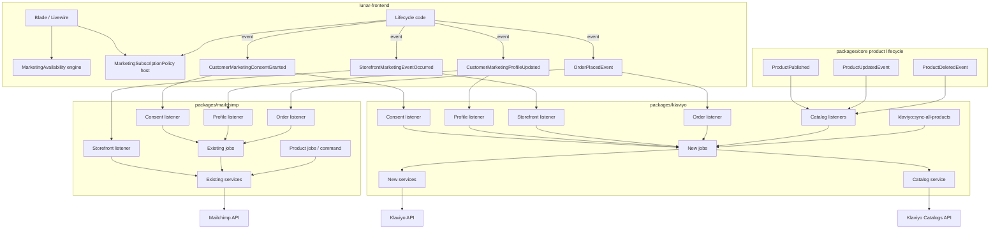

# Marketing Lifecycle Events + Klaviyo Coexistence (Mailchimp BC)

Updated REASONS Canvas replacing `GGQPA-XXX-202608251338-[Feat]-service-klaviyo-alongside-mailchimp.md`.

Architecture mandate: host emits provider-neutral lifecycle events; Mailchimp and Klaviyo packages register thin listeners that dispatch provider-specific jobs. No `MarketingProviderInterface`. No provider enablement logic in the host.

**Revision notes (review feedback applied):**
1. Consent adapters branch on explicit `MarketingSubscriptionMode` (not hidden `source` switches).
2. Storefront: producer `uniqueKey` → stable `eventId` / Klaviyo `unique_id`; else generate **once** at construction and preserve across retries — never per attempt.
3. Provider UI gating uses engine `MarketingAvailability` — Blade never ORs provider configs.
4. `CustomerMarketingConsentGranted` is emitted only when the app authorizes subscription **processing**; shop automatic-subscription policy ≠ explicit customer consent.
5. **Split availability vs policy:** engine `MarketingAvailability` owns provider/capability checks only; host owns registration-subscription **policy** (`MarketingSubscriptionPolicy` in lunar-frontend). Engine must not read `lunar-frontend.*` config.
6. **Klaviyo consent must branch by mode (fixes suppressed / wrong consent state):** `ExplicitOptIn` (footer, registration checkbox, checkout newsletter) → list double opt-in so the profile receives Klaviyo’s confirmation email and is **not** marked fully subscribed until confirmed. `CustomerRegistration` (automatic registration policy **or** automatic subscription on order placement) → immediate list subscribe with marketing consent granted, **without** confirmation email — Mailchimp `status_if_new=subscribed` / order-time subscriber sync parity. Never use the same Klaviyo subscribe payload for both modes.
7. **Klaviyo Catalog API (product recommendations):** Marketing needs the full product catalog in Klaviyo so email product-recommendation blocks work. Mirror Mailchimp’s catalog outcome (all sellable products present remotely) via Klaviyo Catalogs API — **not** via provider-neutral marketing events. Automatic sync when a product is **published**; Artisan backfill command for existing products; keep catalog current on subsequent updates/deletes.

## Requirements

- Refactor host/client marketing integration so Lunar Frontend never dispatches Mailchimp- or Klaviyo-specific jobs/services and never branches on which provider is enabled.
- Introduce provider-neutral marketing lifecycle events in `packages/core` that describe **what happened** in the application (subscription processing authorized / profile updated / storefront event occurred), not integration actions.
- Add thin adapter listeners in `packages/mailchimp` and `packages/klaviyo` that gate on their own config and translate neutral payloads into existing/new provider jobs.
- Add `packages/klaviyo` for profiles, consent/subscription, behavioral events, order placement sync, **and product catalog sync** (Klaviyo Catalogs API for email product recommendations) — without Mailchimp cart/store/merge-field parity.
- Preserve functional backwards compatibility of existing Mailchimp jobs, services, requests, commands, config keys, cart observer, product sync, and retry behavior; reuse them from new Mailchimp adapters.
- Migrate each host lifecycle point completely (no permanent mixed direct-dispatch + event path for the same point).
- Keep order placement on existing `OrderPlacedEvent`; move listener registration into provider packages so the host no longer names Mailchimp/Klaviyo in `listeners.php` for that concern.
- When shop automatic-subscription policy is enabled and a customer places an order, authorize immediate list subscription (no confirmation email) for Klaviyo with consent granted — same functional outcome Mailchimp already provides via order-time `syncSubscriberByEmail` (`status_if_new=subscribed`).
- Sync the full product catalog to Klaviyo (Catalogs API items + variants) so Marketing can use Klaviyo product recommendations in emails: (a) Artisan command to backfill all currently available products; (b) automatic sync when a product becomes **published**; (c) keep remote catalog current on later product updates / unavailability / deletion — Mailchimp `SyncProductToMailchimp` / `mailchimp:sync-all-products` functional parity, Klaviyo-native API.
- Leave abandoned-cart sync as Mailchimp-owned (provider-specific); do **not** migrate product catalog to shared marketing events — catalog remains provider-owned in each package (Mailchimp ecommerce products; Klaviyo Catalogs API).

## Entities

```mermaid
classDiagram
direction TB

class MarketingConsentSource {
    <<enumeration>>
    Registration
    OAuth
    Newsletter
    Checkout
    Order
}

class MarketingSubscriptionMode {
    <<enumeration>>
    CustomerRegistration
    ExplicitOptIn
}

class CustomerMarketingConsentGranted {
    +string email
    +Customer|null customer
    +MarketingConsentSource source
    +MarketingSubscriptionMode subscriptionMode
    +array context
}

class CustomerMarketingProfileUpdated {
    +Customer customer
    +array properties
}

class StorefrontMarketingEventOccurred {
    +string email
    +string eventName
    +array properties
    +string eventId
}

class MarketingAvailability {
    +newsletterSubscriptionAvailable() bool
}

class MarketingSubscriptionPolicy {
    <<host-owned lunar-frontend>>
    +automaticRegistrationSubscriptionProcessingEnabled() bool
    +automaticOrderSubscriptionProcessingEnabled() bool
}

class OrderPlacedEvent {
    +Order order
}

class Customer {
    +int id
}

class Order {
    +int id
}

class Product {
    +int id
    +string status
    +isAvailable() bool
}

class ProductPublished {
    +Product product
}

class ProductUpdatedEvent {
    +Product product
}

class ProductDeletedEvent {
    +Product product
}

class ProductEventType {
    <<enumeration>>
    CREATE
    UPDATE
    DELETE
}

class SubscribeCustomerOnMarketingConsentGranted {
    +handle(CustomerMarketingConsentGranted) void
}

class SyncCustomerOnMarketingProfileUpdated {
    +handle(CustomerMarketingProfileUpdated) void
}

class TrackEventOnStorefrontMarketingEventOccurred {
    +handle(StorefrontMarketingEventOccurred) void
}

class SyncOrderOnPlacement {
    +handle(OrderPlacedEvent) void
}

class SyncSubscriberToMailchimp {
    +Customer user
    +array mergeFields
    +bool languageOnly
    +handle() void
}

class SyncOrderToMailchimp {
    +Order order
    +handle() void
}

class SyncProductToMailchimp {
    +Product product
    +ProductEventType eventType
    +handle() void
}

class SyncAllProductsToMailchimp {
    +int chunkSize
    +handle() void
}

class MailchimpSubscriberService {
    +subscribe(email) array
    +syncSubscriber(customer, mergeFields) array
    +trackEvent(email, name, properties) array
}

class MailchimpEcommerceService {
    +syncProduct(product) array
    +deleteProduct(product) bool
}

class SubscribeProfileOnMarketingConsentGranted {
    +handle(CustomerMarketingConsentGranted) void
}

class SyncProfileOnMarketingProfileUpdated {
    +handle(CustomerMarketingProfileUpdated) void
}

class TrackEventOnStorefrontMarketingEventOccurredKlaviyo {
    +handle(StorefrontMarketingEventOccurred) void
}

class SyncOrderOnPlacementKlaviyoNs {
    +handle(OrderPlacedEvent) void
}

class SubscribeProfileToKlaviyo {
    +string email
    +MarketingSubscriptionMode subscriptionMode
    +Customer|null customer
    +array context
    +handle() void
}

class SyncProfileToKlaviyo {
    +Customer customer
    +array properties
    +handle() void
}

class TrackEventToKlaviyo {
    +string email
    +string eventName
    +array properties
    +string eventId
    +handle() void
}

class SyncOrderToKlaviyo {
    +Order order
    +uniqueId() string
    +handle() void
}

class SyncProductOnPublished {
    +handle(ProductPublished) void
}

class SyncProductOnUpdated {
    +handle(ProductUpdatedEvent) void
}

class SyncProductOnDeleted {
    +handle(ProductDeletedEvent) void
}

class SyncProductToKlaviyo {
    +Product product
    +ProductEventType eventType
    +handle() void
}

class SyncAllProductsToKlaviyo {
    +int chunkSize
    +handle() void
}

class KlaviyoProfileService {
    +subscribe(email, subscriptionMode, context) array
    +upsertProfile(email, attributes) array
    +trackEvent(email, eventName, properties, eventId) array
}

class KlaviyoOrderService {
    +syncPlacedOrder(order) array
}

class KlaviyoCatalogService {
    +syncProduct(product) array
    +deleteProduct(product) bool
    +ensureCategory(externalId, name) array
}

CustomerMarketingConsentGranted --> SubscribeCustomerOnMarketingConsentGranted : Mailchimp
CustomerMarketingConsentGranted --> SubscribeProfileOnMarketingConsentGranted : Klaviyo
CustomerMarketingProfileUpdated --> SyncCustomerOnMarketingProfileUpdated : Mailchimp
CustomerMarketingProfileUpdated --> SyncProfileOnMarketingProfileUpdated : Klaviyo
StorefrontMarketingEventOccurred --> TrackEventOnStorefrontMarketingEventOccurred : Mailchimp
StorefrontMarketingEventOccurred --> TrackEventOnStorefrontMarketingEventOccurredKlaviyo : Klaviyo
OrderPlacedEvent --> SyncOrderOnPlacement : Mailchimp
OrderPlacedEvent --> SyncOrderOnPlacementKlaviyoNs : Klaviyo
ProductPublished --> SyncProductOnPublished : Klaviyo
ProductUpdatedEvent --> SyncProductOnUpdated : Klaviyo
ProductDeletedEvent --> SyncProductOnDeleted : Klaviyo
SubscribeCustomerOnMarketingConsentGranted --> MailchimpSubscriberService : or queued subscribe job
SyncCustomerOnMarketingProfileUpdated --> SyncSubscriberToMailchimp
SyncOrderOnPlacement --> SyncOrderToMailchimp
SyncProductToMailchimp --> MailchimpEcommerceService
SyncAllProductsToMailchimp --> SyncProductToMailchimp
SubscribeProfileOnMarketingConsentGranted --> SubscribeProfileToKlaviyo
SyncProfileOnMarketingProfileUpdated --> SyncProfileToKlaviyo
TrackEventOnStorefrontMarketingEventOccurredKlaviyo --> TrackEventToKlaviyo
SyncOrderOnPlacementKlaviyoNs --> SyncOrderToKlaviyo
SyncProductOnPublished --> SyncProductToKlaviyo
SyncProductOnUpdated --> SyncProductToKlaviyo
SyncProductOnDeleted --> SyncProductToKlaviyo
SyncAllProductsToKlaviyo --> SyncProductToKlaviyo
SyncProfileToKlaviyo --> KlaviyoProfileService
TrackEventToKlaviyo --> KlaviyoProfileService
SyncOrderToKlaviyo --> KlaviyoOrderService
SyncProductToKlaviyo --> KlaviyoCatalogService
```



### Provider-neutral event design (complete)

| Event | Namespace | Meaning |
|-------|-----------|---------|
| `CustomerMarketingConsentGranted` | `Lunar\Events\Marketing` | Application has determined that marketing consent/subscription processing should run for this email/customer (see emission rules below — **not** synonymous with shop `automatic_subscription` config alone) |
| `CustomerMarketingProfileUpdated` | `Lunar\Events\Marketing` | Marketing-relevant customer information changed (e.g. language preference) |
| `StorefrontMarketingEventOccurred` | `Lunar\Events\Marketing` | Behavioral/storefront marketing-relevant action occurred |
| `OrderPlacedEvent` | `Lunar\ERP\Events` | **Existing** order placement event — reused; not renamed |

### Exact event payloads

#### Enums (provider-neutral intent)

```php
namespace Lunar\Enums\Marketing;

enum MarketingConsentSource: string
{
    case Registration = 'registration';
    case OAuth = 'oauth';
    case Newsletter = 'newsletter';
    case Checkout = 'checkout';
    case Order = 'order';
}

enum MarketingSubscriptionMode: string
{
    /**
     * Known-customer / shop-policy subscription path (verified account, or
     * automatic subscription after order when shop policy authorizes it).
     * Provider must subscribe immediately with marketing consent granted —
     * no confirmation / double-opt-in email (Mailchimp: status_if_new=subscribed).
     * Does NOT by itself prove the human ticked a consent checkbox —
     * the host must only emit ConsentGranted when shop policy + product
     * rules authorize subscription processing for this registration or order.
     */
    case CustomerRegistration = 'customer_registration';

    /**
     * Explicit opt-in path (newsletter footer form, registration checkbox,
     * checkout newsletter checkbox, etc.).
     * Provider must use double-opt-in / pending semantics so the person
     * receives a confirmation email and is not fully subscribed until confirmed
     * (Mailchimp: pending; Klaviyo: Bulk Subscribe without historical_import,
     * respecting the list’s double opt-in setting).
     */
    case ExplicitOptIn = 'explicit_opt_in';
}
```

`MarketingSubscriptionMode` is the **explicit provider-mapping intent**. `MarketingConsentSource` is provenance for analytics/context only — **not** a hidden switch that alone chooses provider API paths.

#### `CustomerMarketingConsentGranted`

```php
public function __construct(
    public string $email,
    public MarketingConsentSource $source,
    public MarketingSubscriptionMode $subscriptionMode,
    public ?Customer $customer = null,
    public array $context = [], // provider-neutral extras only, e.g. ['locale' => 'hu']
) {}
```

**Emission rules (critical — read before implementing):**

This event must **only** be emitted when the application has already determined that **valid marketing consent/subscription processing should occur** for this person.

It is **not** a raw signal that “a config flag is true.”

| Situation | Emit ConsentGranted? | Why |
|-----------|----------------------|-----|
| Customer explicitly opts in (newsletter checkbox, footer form, checkout newsletter, registration checkbox when automatic policy is off) | **Yes** — `ExplicitOptIn` | Clear affirmative action; providers must send confirmation / double opt-in |
| Registration/OAuth completes and shop policy authorizes automatic subscription processing for new accounts | **Yes** — `CustomerRegistration` **only if** product/legal rules treat that policy as sufficient authorization to process subscription | Host decided processing should run; providers subscribe immediately (no confirmation email) |
| Order is placed and shop policy authorizes automatic subscription processing on purchase | **Yes** — `Order` source + `CustomerRegistration` mode **only if** policy authorizes it | Mailchimp already effectively list-subscribes on order when subscriber sync is on; Klaviyo must get the same immediate consented subscribe via this event |
| Registration completes and `automatic_subscription` / shop policy is **false** | **No** | No authorization to process subscription |
| Order is placed and automatic order-subscription policy is **false** | **No** (for consent); still may emit/reuse `OrderPlacedEvent` for ecommerce/metric sync | Order sync ≠ marketing list subscribe |
| Registration completes and policy is true, but implementer only checks `config('…automatic…')` without treating it as “processing authorized” | Wrong framing | `automatic_subscription = true` means **shop policy may authorize processing**, not “customer granted GDPR consent” in the checkbox sense |
| Language change, profile update, browse, cart | **No** | Use ProfileUpdated / StorefrontEvent instead |

**Semantic distinction (must not collapse):**

```
Customer explicitly checked newsletter checkbox / footer / registration opt-in
        ≠
Application configuration automatically subscribes new customers or purchasers
```

Both may eventually emit `CustomerMarketingConsentGranted` when the **application layer** has decided subscription processing is allowed — but they use different `subscriptionMode` values and must not be treated as the same consent story in docs, UX, provider API payloads, or compliance assumptions.

Providers never decide “was consent valid?” — they only execute subscription APIs when they receive this event and their own `enabled` flags are on. Host owns the authorization decision **before** emit. **Klaviyo must map modes to different Bulk Subscribe payloads** (confirmation vs immediate consented) — collapsing them is a defect (causes wrong consent state / suppressed-profile warnings).

Host emit examples:

```php
// Registration completed AND application determined subscription processing is authorized
// (e.g. shop automatic-subscription policy is on — NOT "config alone = consent")
event(new CustomerMarketingConsentGranted(
    email: $user->email,
    source: MarketingConsentSource::Registration,
    subscriptionMode: MarketingSubscriptionMode::CustomerRegistration,
    customer: $user->customers()->first(),
    context: ['locale' => $user->locale],
));

// Order placed AND shop automatic-subscription policy authorizes purchase-time list subscribe
event(new CustomerMarketingConsentGranted(
    email: $email,
    source: MarketingConsentSource::Order,
    subscriptionMode: MarketingSubscriptionMode::CustomerRegistration,
    customer: $customer, // null for guests OK when email present
    context: ['order_id' => $order->id, 'consented_at' => $order->placed_at],
));

// Customer explicitly opted in (checkbox / newsletter form / footer) — confirmation email required
event(new CustomerMarketingConsentGranted(
    email: $email,
    source: MarketingConsentSource::Newsletter, // or Checkout / Registration when checkbox
    subscriptionMode: MarketingSubscriptionMode::ExplicitOptIn,
));
```

Forbidden in payload: `mergeFields`, `list_id`, `status`, `pending`, `languageOnly`, Mailchimp/Klaviyo API field names. Do **not** encode provider behavior in free-form `source` strings.

#### `CustomerMarketingProfileUpdated`

```php
public function __construct(
    public Customer $customer,
    public array $properties = [], // e.g. ['language' => 'hu', 'preferences' => [...]]
) {}
```

Forbidden: `mergeFields`, `languageOnly`. Providers map `properties['language']` → Mailchimp LANGUAGE / Klaviyo profile attribute themselves.

#### `StorefrontMarketingEventOccurred`

```php
public function __construct(
    public string $email,
    public string $eventName,      // e.g. 'begin_checkout', 'view_item', 'add_to_cart', 'remove_from_cart'
    public array $properties = [], // business properties (product_id, sku, price, ...)
    public string $eventId,        // stable id for the logical occurrence — always set in constructor
) {}
```

Preferred construction helper / constructor pattern:

```php
public function __construct(
    string $email,
    string $eventName,
    array $properties = [],
    ?string $uniqueKey = null, // optional deterministic key from the producer
) {
    $this->email = $email;
    $this->eventName = $eventName;
    $this->properties = $properties;
    // uniqueKey wins when provided; otherwise generate ONCE here for this logical event.
    // This value is serialized onto queued jobs and must survive retries unchanged.
    $this->eventId = $uniqueKey ?? (string) \Illuminate\Support\Str::uuid();
}
```

`eventId` / `uniqueKey` rules (Klaviyo reliability — non-negotiable):

1. If the producer has a **deterministic** identity for the logical action, pass it as `uniqueKey` (e.g. `begin_checkout:cart:{cartId}`, `remove_from_cart:line:{lineId}:{occurredAtIso}`). That value becomes `eventId` and Klaviyo API `unique_id`.
2. If no deterministic key exists, generate an ID **once** for this logical event when the event (or the outbound job) is **constructed**, assign it to `eventId`, and rely on Laravel job serialization so **retries reuse the same `eventId`**.
3. Klaviyo Create Event must always send `unique_id = $event->eventId` (or the job’s copy of that same string).
4. **Forbidden:** generating a new UUID (or any new id) inside `handle()` / per queue attempt. That causes duplicates when attempt 1 succeeds at Klaviyo and the worker crashes before the job is marked complete.
5. Mailchimp may ignore `eventId` for API purposes but should still receive/log the same stable value.

#### `OrderPlacedEvent` (unchanged)

```php
public function __construct(public Order $order) {}
```

#### UI capability vs host policy (decided — split ownership)

Host Blade/Livewire **must not** OR provider configs inline.

**Engine** owns provider/capability availability only. **Host** owns shop subscription policy. Do **not** put host policy methods on the engine class — that would force `packages/core` to depend on `lunar-frontend.*` config (wrong direction).

```
ENGINE (packages/core)
──────────────────────
MarketingAvailability
  - newsletterSubscriptionAvailable()
  - (future) other provider/capability checks only

LUNAR-FRONTEND (host)
─────────────────────
MarketingSubscriptionPolicy
  - automaticRegistrationSubscriptionProcessingEnabled()
```

##### Engine — `MarketingAvailability`

```php
namespace Lunar\Marketing;

final class MarketingAvailability
{
    /**
     * Whether any marketing package can accept newsletter / explicit opt-in subscription.
     * Reads only lunar.* provider package configs — never lunar-frontend.*.
     */
    public function newsletterSubscriptionAvailable(): bool
    {
        return (bool) config('lunar.mailchimp.enabled', false)
            || (bool) config('lunar.klaviyo.enabled', false);
    }
}
```

Flow:

```
Blade / Livewire (provider capability)
    → MarketingAvailability
        → lunar.mailchimp.enabled / lunar.klaviyo.enabled (internal only)
```

Not:

```
Blade → mailchimp.enabled || klaviyo.enabled
```

This is **not** a `MarketingProviderInterface`. It is a tiny provider-capability facade. Adding a third provider changes only this class (or a later registry of “subscription capable” packages), not every Blade file. Engine must **never** read `lunar-frontend.*`.

##### Host — `MarketingSubscriptionPolicy` (documented here; implemented in lunar-frontend)

```php
namespace Minic\LunarFrontend\Domains\Marketing;

final class MarketingSubscriptionPolicy
{
    /**
     * Shop POLICY: whether new registrations may trigger subscription *processing*.
     * NOT equivalent to "the customer granted GDPR/marketing consent via checkbox".
     * Host-owned config; may temporarily alias legacy lunar.mailchimp.automatic_subscription.
     */
    public function automaticRegistrationSubscriptionProcessingEnabled(): bool
    {
        $host = config('lunar-frontend.marketing.automatic_registration_subscription');

        if ($host !== null) {
            return (bool) $host;
        }

        // Temporary BC alias — lives in the HOST, not in MarketingAvailability.
        return (bool) config('lunar.mailchimp.automatic_subscription', false);
    }

    /**
     * Shop POLICY: whether placing an order may trigger immediate list subscription
     * processing (no confirmation email). Same legacy automatic_subscription flag
     * unless a dedicated host key is introduced later.
     */
    public function automaticOrderSubscriptionProcessingEnabled(): bool
    {
        $host = config('lunar-frontend.marketing.automatic_order_subscription');

        if ($host !== null) {
            return (bool) $host;
        }

        // Default: same policy as registration automatic subscription (Mailchimp
        // config comment: register OR place an order).
        return $this->automaticRegistrationSubscriptionProcessingEnabled();
    }
}
```

`automaticRegistrationSubscriptionProcessingEnabled()` answers: “May the host emit ConsentGranted with `CustomerRegistration` after signup?” — **not** “Did the customer grant consent?”

`automaticOrderSubscriptionProcessingEnabled()` answers: “May the host emit ConsentGranted with `Order` + `CustomerRegistration` after purchase?” — same non-checkbox semantics.

Host combines both where needed (example — registration checkbox):

```
newsletterSubscriptionAvailable()
&& !automaticRegistrationSubscriptionProcessingEnabled()
```
## Approach

1. Decoupling strategy:
   - Primary mechanism = provider-neutral domain events + per-package thin listeners.
   - No central provider resolver; no large `MarketingProviderInterface`.
   - Host only answers “what happened?”; packages answer “should we act / how?”.

2. Technical implementation:
   - Events live in `packages/core/src/Events/Marketing/`.
   - Mailchimp listeners registered in `MailchimpServiceProvider` (Event::listen or `$listen` discovery).
   - Klaviyo listeners registered in `KlaviyoServiceProvider`.
   - `OrderPlacedEvent` listeners also registered **inside** each provider package; host removes `SyncOrderOnPlacement` from `listeners.php`.
   - Jobs remain queued with provider retry/backoff config.
   - Klaviyo HTTP via Saloon + revision header; profile upsert, subscribe profiles, create event endpoints.
   - Newsletter UX must stop depending on synchronous Mailchimp member `status` in the response (async event path); use generic success copy.

3. Business logic:
   - Consent ≠ profile update ≠ behavioral event ≠ order placed — four distinct paths.
   - `CustomerMarketingConsentGranted` is emitted only after the **application** decides subscription processing is authorized (explicit opt-in **or** shop registration/order automatic-subscription policy). It does **not** mean `automatic_subscription` config alone equals customer consent.
   - Consent intent for providers is explicit via `MarketingSubscriptionMode`:
     - `CustomerRegistration` → immediate subscribed path (Mailchimp: existing `SyncSubscriberToMailchimp` / `status_if_new=subscribed`; Klaviyo: Bulk Subscribe with marketing consent granted **and** `historical_import=true` plus a past `consented_at` so the list’s double opt-in confirmation email is **bypassed** — Mailchimp automatic / order-time subscribed parity)
     - `ExplicitOptIn` → confirmation / double-opt-in path (Mailchimp: `subscribe()` pending / re-opt-in; Klaviyo: Bulk Subscribe with marketing consent requested **without** `historical_import`, so a double-opt-in list sends Klaviyo’s confirmation email and the profile stays pending until confirmed)
   - **Forbidden defect:** Klaviyo using one identical subscribe payload for both modes (current bug — causes wrong consent / suppressed warnings instead of confirmation vs immediate subscribe).
   - `MarketingConsentSource` is provenance only; adapters **must not** branch solely on source when `subscriptionMode` already conveys intent. `Order` source is provenance for purchase-time automatic subscribe; mode remains `CustomerRegistration`.
   - Newsletter provider capability: engine `MarketingAvailability` — never Blade reading provider packages.
   - Whether registration/order may trigger subscription processing: host `MarketingSubscriptionPolicy` — never on the engine class; never engine reading `lunar-frontend.*`.
   - Double opt-in / pending / Klaviyo `historical_import` + `subscriptions` objects stay inside provider services.
   - Klaviyo behavioral events include profile identity (email) in the Create Event payload; **do not** copy Mailchimp’s 404→syncSubscriber→retry unless Klaviyo API requires it.
   - Idempotency: if producer supplies `uniqueKey`, that is the stable Klaviyo `unique_id`; otherwise generate once at event/job construction and preserve across retries. **Never** regenerate per attempt.
   - **Klaviyo catalog (provider-owned, not a shared marketing event):** Marketing uses Klaviyo Catalogs API so email product-recommendation blocks can resolve the full catalog. Parity target is Mailchimp’s outcome (products present remotely), not Mailchimp’s ecommerce PUT shape.
     - Automatic path: when a product becomes **published**, core already dispatches `ProductPublished` — Klaviyo package listens and queues `SyncProductToKlaviyo`. Also listen to `ProductUpdatedEvent` / `ProductDeletedEvent` so price/media/status/stock changes and deletes keep the remote catalog current (unavailable / unpublished → delete remote item, same idea as Mailchimp `syncProduct` → `deleteProduct` when `!isAvailable()`).
     - Backfill path: Artisan `klaviyo:sync-all-products` dispatches `SyncAllProductsToKlaviyo`, which chunks available products and dispatches per-product jobs — mirror `mailchimp:sync-all-products` / `SyncAllProductsToMailchimp`.
     - Register catalog listeners + command inside `KlaviyoServiceProvider` (do not rely on host `listeners.php` for Klaviyo catalog). Mailchimp product sync host wiring may remain as today; do not invent a neutral “ProductSyncedForMarketing” event.
     - Catalog HTTP stays in Saloon requests under `packages/klaviyo`; service maps Lunar `Product` + variants → Klaviyo catalog-item + catalog-variant (+ ensure categories).

### Structure flowchart



## Structure

### Inheritance / contracts

1. Marketing events in core: `Dispatchable`, `InteractsWithSockets`, `SerializesModels`.
2. Provider listeners: thin classes; prefer `ShouldQueue` only if translation is heavy — default **sync listener → async job** so enablement checks run quickly and work is queued.
3. Klaviyo connector extends Saloon `Connector`.
4. Exceptions: `FailedKlaviyoSyncException`, `MissingKlaviyoConfigurationException`.
5. Existing Mailchimp exceptions/jobs unchanged.

### Dependencies

1. Host → core marketing events / `OrderPlacedEvent` / engine `MarketingAvailability` (provider capability) + host-owned `MarketingSubscriptionPolicy` (registration policy).
2. Mailchimp listeners → existing Mailchimp jobs/services (no HTTP in listeners); branch on `subscriptionMode`.
3. Klaviyo listeners → Klaviyo jobs → Klaviyo services → Saloon requests; branch on `subscriptionMode`.
4. Klaviyo catalog listeners → `SyncProductToKlaviyo` → `KlaviyoCatalogService` → Catalogs API Saloon requests; gated by `enabled` && `sync_products`.
5. Klaviyo must not import `Lunar\Mailchimp\*`.
6. Shared marketing events must not import provider packages. Catalog sync uses existing core product events (`ProductPublished`, `ProductUpdatedEvent`, `ProductDeletedEvent`) — not new neutral marketing events.

### Layered architecture

1. Host lifecycle layer — emit neutral marketing events; no provider FQCNs for migrated points.
2. Host UI capability layer — engine `MarketingAvailability` for provider capability; host `MarketingSubscriptionPolicy` for registration-subscription policy.
3. Domain event layer — core marketing events + existing order event + existing product lifecycle events for catalog.
4. Adapter listener layer — enablement + capability flags + map `subscriptionMode`/properties → job (marketing); product event → catalog job (Klaviyo package-owned).
5. Job layer — retries, uniqueness, stable idempotency keys from event/job construction.
6. Service layer — provider API mapping (profiles/orders/events + catalog).
7. HTTP layer — Saloon requests/connectors.

### Provider enablement behavior

| Condition | Mailchimp | Klaviyo |
|-----------|-----------|---------|
| Package `enabled=false` | All marketing listeners no-op | All listeners no-op |
| Consent + `CustomerRegistration` | When `enabled` → `SyncSubscriberToMailchimp` (preserve today’s subscribed upsert) | When `enabled` → Bulk Subscribe **immediate** consented path (`historical_import` + past `consented_at`; no confirmation email) |
| Consent + `ExplicitOptIn` | When `enabled` → `MailchimpSubscriberService::subscribe` (pending / re-opt-in confirmation) | When `enabled` (+ list required) → Bulk Subscribe **double-opt-in** path (no `historical_import`; confirmation email when list is DOI) |
| Profile updated | Dispatch `SyncSubscriberToMailchimp` when `enabled` (parity with today’s job guard) | Dispatch profile job when `enabled` && `sync_subscribers` |
| Storefront event | When `enabled` && `track_events` | When `enabled` && `track_events` |
| Order placed (metric / ecommerce) | When `enabled` && `sync_orders` | When `enabled` && `sync_orders` (Placed Order event only) |
| Order placed + automatic subscription policy | Host emits ConsentGranted (`Order` + `CustomerRegistration`); Mailchimp listener uses subscribed upsert; existing order-path `sync_subscribers` merge sync may still run | Host emits same ConsentGranted; Klaviyo consent listener uses immediate consented subscribe |
| Product published / updated / deleted (catalog) | Existing Mailchimp product job / host wiring when `enabled` && `sync_products` | When `enabled` && `sync_products`: package listeners on `ProductPublished` / `ProductUpdatedEvent` / `ProductDeletedEvent` → `SyncProductToKlaviyo`; command `klaviyo:sync-all-products` for backfill |
| Both enabled | Both process | Both process |
| Neither enabled | No work | No work |

Host must not `if (mailchimp) / if (klaviyo)`. Provider capability uses `MarketingAvailability`; registration policy uses host `MarketingSubscriptionPolicy`. Catalog remains provider-owned in each package.

## Operations

### 1. Host/client integration points that must be refactored

Identified in `lunar-frontend` (sibling app). Map each migrated point to one neutral event; remove direct Mailchimp calls after migration.

| # | Location | Current behavior | Target event | Notes |
|---|----------|------------------|--------------|-------|
| H1 | `VerifyUserEmailController` | If mailchimp enabled + automatic_subscription → `SyncSubscriberToMailchimp::dispatch` | `CustomerMarketingConsentGranted` (`Registration` + `CustomerRegistration`) | Emit **only if** host `MarketingSubscriptionPolicy::automaticRegistrationSubscriptionProcessingEnabled()` (shop authorizes processing — not “config = consent”); no provider FQCNs |
| H2 | `OAuthController` | Same as H1 | ConsentGranted (`OAuth` + `CustomerRegistration`) | Same emission rule as H1 |
| H3 | `NewsletterSubscription` trait | If mailchimp enabled → `subscribe()`; toast on Mailchimp status | ConsentGranted (`Newsletter` + `ExplicitOptIn`) | Gate emit with engine `newsletterSubscriptionAvailable()`; generic toast; async providers |
| H4 | `RegistrationForm` + blade | UI gated on `lunar.mailchimp.enabled` && !automatic_subscription | Show checkbox when `newsletterSubscriptionAvailable() && !automaticRegistrationSubscriptionProcessingEnabled()` | Combine engine availability + host policy; Blade must not OR provider configs |
| H5 | `Checkout/Summary` + blade | Newsletter at checkout; UI gated on mailchimp | ConsentGranted (`Checkout` + `ExplicitOptIn`) | UI: engine `newsletterSubscriptionAvailable()`; emit via H3 |
| H6 | `LanguageSwitcher` | `SyncSubscriberToMailchimp::dispatch(..., languageOnly: true)` | `CustomerMarketingProfileUpdated` with `properties: ['language' => $locale]` | Remove Mailchimp job import |
| H7 | `Checkout::trackMailchimpCheckoutEvent` | Direct `trackEvent('begin_checkout')` + mailchimp flags | `StorefrontMarketingEventOccurred` with stable `eventId` | e.g. `begin_checkout:cart:{id}` |
| H8 | `ProductView::trackMailchimpViewItemEvent` | Direct `trackEvent('view_item')` | StorefrontEvent + stable `eventId` | Same |
| H9 | `AddToCart::trackMailchimpAddToCartEvent` | Direct `trackEvent('add_to_cart')` | StorefrontEvent + stable `eventId` | Same |
| H10 | `Cart` / `ItemsList` + `TrackRemoveFromCart` | Trait calls Mailchimp service | StorefrontEvent (`remove_from_cart`) + stable `eventId` | Neutral helper constructs `eventId` once |
| H11 | `listeners.php` → `SyncOrderOnPlacement` | Host registers Mailchimp listener | Remove entry; package self-registers | Keep ERP/notification listeners |
| H12 | Order placement (alongside `OrderPlacedEvent`) | Mailchimp order path may list-subscribe via `sync_subscribers` + `status_if_new=subscribed` | Also emit `CustomerMarketingConsentGranted` (`Order` + `CustomerRegistration`) when `automaticOrderSubscriptionProcessingEnabled()` | Guests: email from billing; registered: user email + customer when available; `context.consented_at` = order `placed_at` (past). Do **not** emit ExplicitOptIn here |

#### Intentionally **not** migrated to shared marketing events (remain provider-specific)

| # | Location | Why |
|---|----------|-----|
| P1–Pn | Product create/update/delete/pricing/media/channel listeners + `ProductVariantObserver` dispatching `SyncProductToMailchimp` (host / Mailchimp) | Catalog sync stays provider-owned: Mailchimp ecommerce products unchanged; Klaviyo adds its **own** package listeners on core `ProductPublished` / `ProductUpdatedEvent` / `ProductDeletedEvent` + `klaviyo:sync-all-products` — do **not** invent a neutral marketing catalog event |
| C1 | `CartLineObserver` in mailchimp package | Abandoned cart excluded from Klaviyo; already provider-owned |

Document these as remaining provider-specific surfaces; do not pretend they are neutral.

### 2. Create core events and enums

- `packages/core/src/Enums/Marketing/MarketingConsentSource.php`
- `packages/core/src/Enums/Marketing/MarketingSubscriptionMode.php`
- `packages/core/src/Events/Marketing/CustomerMarketingConsentGranted.php`
- `packages/core/src/Events/Marketing/CustomerMarketingProfileUpdated.php`
- `packages/core/src/Events/Marketing/StorefrontMarketingEventOccurred.php`
- `packages/core/src/Marketing/MarketingAvailability.php` (provider-capability facade only — no host policy methods, no `lunar-frontend.*` reads)
- Host (lunar-frontend, not this package): `MarketingSubscriptionPolicy` for `automaticRegistrationSubscriptionProcessingEnabled()` and `automaticOrderSubscriptionProcessingEnabled()`
- Core enum: add `MarketingConsentSource::Order`
### 3. Mailchimp listeners / adapters

Register in `MailchimpServiceProvider`.

| Listener | Event | Guards | Dispatches / calls |
|----------|-------|--------|--------------------|
| `SubscribeCustomerOnMarketingConsentGranted` | ConsentGranted | `lunar.mailchimp.enabled` | **Branch on `subscriptionMode` only**: `CustomerRegistration` → `SyncSubscriberToMailchimp::dispatch($customer)` (requires customer; guest Order consent with null customer no-ops here — Mailchimp guest list sync remains via existing order `sync_subscribers` path); `ExplicitOptIn` → queued `SubscribeEmailToMailchimp` / `MailchimpSubscriberService::subscribe($email)`. Do **not** `if ($source === Registration)` as the primary switch. |
| `SyncCustomerOnMarketingProfileUpdated` | ProfileUpdated | `enabled` | Map `properties` → Mailchimp merge field tags via `merge_fields` config; if only `language` present set `languageOnly=true` when calling existing `SyncSubscriberToMailchimp`; else pass mapped merge fields |
| `TrackEventOnStorefrontMarketingEventOccurred` | StorefrontEvent | `enabled` && `track_events` | Flatten properties if needed; `MailchimpSubscriberService::trackEvent` (sync or queued job); keep existing 404 heal inside service; `eventId` unused by Mailchimp API but must still be carried for logging |
| `SyncOrderOnPlacement` | OrderPlacedEvent | existing | Register in provider (move registration from host); keep class |

Listener rules: no HTTP; no business preference calculation beyond property→merge-field mapping; no hidden `source`-string switches.

### 4. Klaviyo package + listeners

#### Config `lunar.klaviyo`

| Key | Env | Default |
|-----|-----|---------|
| `enabled` | `KLAVIYO_ENABLED` | `false` |
| `api_key` | `KLAVIYO_API_KEY` | — |
| `api_revision` | `KLAVIYO_API_REVISION` | pin a current revision (e.g. `2024-10-15` or newer at implement time) |
| `list_id` | `KLAVIYO_LIST_ID` | optional; required for list subscribe |
| `sync_subscribers` | `KLAVIYO_SYNC_SUBSCRIBERS` | `false` |
| `sync_orders` | `KLAVIYO_SYNC_ORDERS` | `false` |
| `sync_products` | `KLAVIYO_SYNC_PRODUCTS` | `false` — catalog sync for product recommendations |
| `track_events` | `KLAVIYO_TRACK_EVENTS` | `true` |
| `profile_attributes` | static map | e.g. `language` → chosen Klaviyo property key |
| `catalog.default_category_external_id` | optional | fallback category external_id when product has no collections (alphanumeric only — Klaviyo strips special chars on categories) |
| `retry.max_attempts` / `retry.backoff` | | `4` / `[60,300,3600]` |

No `sync_customers.enabled` footgun. No Mailchimp merge-field commands.

#### Listeners (register in `KlaviyoServiceProvider`)

| Listener | Event | Guards | Job |
|----------|-------|--------|-----|
| `SubscribeProfileOnMarketingConsentGranted` | ConsentGranted | `enabled` | `SubscribeProfileToKlaviyo` — job/service **must** branch on `subscriptionMode` (immediate vs confirmation); never one shared payload |
| `SyncProfileOnMarketingProfileUpdated` | ProfileUpdated | `enabled` && `sync_subscribers` | `SyncProfileToKlaviyo` |
| `TrackEventOnStorefrontMarketingEventOccurred` | StorefrontEvent | `enabled` && `track_events` | `TrackEventToKlaviyo` |
| `SyncOrderOnPlacement` (`Lunar\Klaviyo\Listeners`) | OrderPlacedEvent | `enabled` && `sync_orders` | `SyncOrderToKlaviyo` (Placed Order metric only — list subscribe comes from ConsentGranted H12, not inventing consent inside the order job) |
| `SyncProductOnPublished` | `ProductPublished` | `enabled` && `sync_products` | `SyncProductToKlaviyo` with `ProductEventType::CREATE` (or UPDATE) — **primary automatic path** when status becomes published |
| `SyncProductOnUpdated` | `ProductUpdatedEvent` | `enabled` && `sync_products` | `SyncProductToKlaviyo` with `UPDATE` — keeps title/price/media/stock/URL current; service deletes remote item when product is not available / not published |
| `SyncProductOnDeleted` | `ProductDeletedEvent` | `enabled` && `sync_products` | `SyncProductToKlaviyo` with `DELETE` |

#### Catalog command (register in `KlaviyoServiceProvider`)

| Command | Behavior |
|---------|----------|
| `klaviyo:sync-all-products {--chunk=100}` | Requires `enabled` && `sync_products`. Dispatches `SyncAllProductsToKlaviyo` which chunks products (eager-load variants/collections/brand/media), and for each product that passes `isAvailable()` (and is published / sellable — same availability spirit as Mailchimp bulk), dispatches `SyncProductToKlaviyo` with `UPDATE`. Used to backfill the existing catalog so Marketing recommendations have the full set. |

### 5. Job and service flow

#### Mailchimp (reuse)

```
ConsentGranted + CustomerRegistration → SyncSubscriberToMailchimp → MailchimpSubscriberService::syncSubscriber*
ConsentGranted + ExplicitOptIn → SubscribeEmailToMailchimp → MailchimpSubscriberService::subscribe
ProfileUpdated → SyncSubscriberToMailchimp → MailchimpSubscriberService
StorefrontEvent → trackEvent → MailchimpSubscriberService (existing 404 heal OK)
OrderPlaced → SyncOrderToMailchimp → MailchimpEcommerceService (unchanged)
```

Cart/product paths unchanged and Mailchimp-only for Mailchimp; Klaviyo catalog is separate (below).

#### Klaviyo (new)

```
ConsentGranted + ExplicitOptIn → SubscribeProfileToKlaviyo
    → KlaviyoProfileService::subscribe (confirmation / DOI path — no historical_import)
ConsentGranted + CustomerRegistration → SubscribeProfileToKlaviyo
    → KlaviyoProfileService::subscribe (immediate consented path — historical_import + past consented_at)
    (sources: Registration, OAuth, Order — mode drives API, not source)
ProfileUpdated → SyncProfileToKlaviyo → KlaviyoProfileService::upsertProfile
StorefrontEvent → TrackEventToKlaviyo(eventId) → KlaviyoProfileService::trackEvent(..., unique_id: eventId)
OrderPlaced → SyncOrderToKlaviyo → KlaviyoOrderService::syncPlacedOrder (unique_id: order.id)
    (metric only; automatic list subscribe is H12 ConsentGranted, not buried in order sync)
ProductPublished → SyncProductToKlaviyo(CREATE|UPDATE) → KlaviyoCatalogService::syncProduct
ProductUpdated → SyncProductToKlaviyo(UPDATE) → syncProduct or deleteProduct when unavailable
ProductDeleted → SyncProductToKlaviyo(DELETE) → KlaviyoCatalogService::deleteProduct
klaviyo:sync-all-products → SyncAllProductsToKlaviyo → SyncProductToKlaviyo(UPDATE) per available product
```

### 6. Klaviyo API mapping

| Capability | Klaviyo API | Mapping notes |
|------------|-------------|---------------|
| Profile upsert | Create or Update Profile (`POST /api/profile-import/` or equivalent create-or-update profile endpoint for pinned revision) | Identify by email; set attributes from neutral `properties` + first/last name from Customer/User. **Do not** set marketing `subscriptions` on upsert — consent only via Subscribe Profiles |
| Consent / subscribe — `ExplicitOptIn` | Bulk Subscribe Profiles (`POST /api/profile-subscription-bulk-create-jobs/`) | Requires `list_id`. Payload: email + `subscriptions.email.marketing.consent = SUBSCRIBED`. **Do not** set `historical_import`. List must be double opt-in so Klaviyo sends the confirmation email; profile remains pending until confirmed. This is the footer / registration-checkbox / checkout-newsletter path |
| Consent / subscribe — `CustomerRegistration` | Same Bulk Subscribe endpoint | Requires `list_id`. Payload: email + `subscriptions.email.marketing.consent = SUBSCRIBED`, **`historical_import = true`**, and per-profile `consented_at` in the **past** (from `context.consented_at`, order `placed_at`, or registration time — never a future stamp). Bypasses DOI confirmation and “Added to list” DOI wait so the profile is marketing-subscribed immediately — Mailchimp automatic / order `status_if_new=subscribed` parity. Optional `custom_source` from provenance for Klaviyo consent records |
| Behavioral events | Create Event (`POST /api/events/`) | Metric `name` = eventName; include `profile.attributes.email`; properties = event properties; **`unique_id` = event `eventId`** (stable across retries) |
| Placed order | Create Event with metric `Placed Order` (or config override) | Profile by email; properties: order_id, lines, totals, currency; `value` + `value_currency`; **`unique_id` = `(string) order.id`** for dedupe on retry. Does **not** by itself grant list marketing consent |
| Event+profile | Create Event accepts profile attributes | Prefer single call with profile identity; **do not** implement Mailchimp-style missing-member heal unless API error proves necessary |
| Catalog category | Create Catalog Category (`POST /api/catalog-categories/`) | Ensure category before item create. Prefer Lunar collection external_id = `(string) collection.id` (alphanumeric-safe) + name from translated collection attribute. If product has no collections, ensure config `catalog.default_category_external_id` (or a fixed `uncategorized` id). Treat duplicate/409 as already-exists success. Compound Klaviyo id: `$custom:::$default:::{external_id}` |
| Catalog item | Create / Update / Delete Catalog Item (`POST|PATCH|DELETE /api/catalog-items/` …) | Item `external_id` = first non-empty variant **SKU** (fallback: `(string) product.id` if no SKU; `/` replaced with `-`). **Must differ** from variant external_ids. Required: title, description, url, categories relationship. Optional: image_full_url / thumbnail, published=true when sellable. No single upsert endpoint — create then on conflict/duplicate update (GET-by-id or 409 → PATCH). Price on item optional; prefer prices on variants. Delete also removes legacy product-id external_id items when SKU-based id differs |
| Catalog variant | Create / Update / Delete Catalog Variant | One variant per Lunar variant; `external_id` = `(string) variant.id`. Required: title, description, url, sku, inventory_quantity, relationship to parent item id `$custom:::$default:::{product.id}`. Set `price` from default-currency inc-tax (same pricing spirit as Mailchimp). Images from primary product media when variant has none |
| Catalog sync product | Service orchestration | Load variants/collections/brand/media. Build storefront URL like Mailchimp (`app.url` + locale slug). If `!product->isAvailable()` or status is not published → `deleteProduct` (404 = success). Else ensure categories → upsert item → upsert each variant. Failures wrap `FailedKlaviyoSyncException` |
| Catalog bulk backfill | Command + chunk job | Same eligibility as Mailchimp bulk (`isAvailable()`); do not use async Klaviyo bulk-create jobs as the only path for v1 single-product sync — per-product queued jobs are fine and mirror Mailchimp; optional later optimization to Klaviyo bulk item/variant jobs (≤100 per request) |
| Abandoned carts | — | **Excluded** |

Auth: `Authorization: Klaviyo-API-Key {key}` + `revision` header. Catalog write requires API key scope `catalogs:write`.

**Operational prerequisite:** the configured Klaviyo `list_id` should use **double opt-in** so ExplicitOptIn produces a confirmation email. CustomerRegistration still bypasses that DOI via `historical_import` when shop policy authorizes immediate subscribe.

**Catalog operational prerequisite:** private API key must include catalog scopes; account must use **API catalog** (not a conflicting custom CSV feed-only mode) for these endpoints to populate recommendation-eligible items.

### 7. Idempotency and retry strategy

| Operation | Queue | Idempotency |
|-----------|-------|-------------|
| Mailchimp profile/subscriber upsert | Existing job retries | PUT member by email hash — naturally upsert |
| Mailchimp subscribe pending | Retries | Re-PUT pending is acceptable; avoid duplicate confirmation spam by not re-emitting ConsentGranted on refresh |
| Mailchimp order | `ShouldBeUnique` + PUT order | Remote PUT upsert |
| Mailchimp track event | Retries | Mailchimp events are not strongly deduped — rely on host not re-emitting the same logical `eventId`; providers may log `eventId` |
| Klaviyo profile upsert | Job retries | Create-or-update by email — upsert |
| Klaviyo subscribe (`ExplicitOptIn`) | Job retries | Re-subscribe without `historical_import` is acceptable; avoid duplicate ConsentGranted emits so confirmation emails are not spammed |
| Klaviyo subscribe (`CustomerRegistration`) | Job retries | Immediate path with stable past `consented_at`; avoid duplicate ConsentGranted emits |
| Klaviyo behavioral event | Job retries | Always send API `unique_id` = stable `eventId`. If producer passed `uniqueKey`, that becomes `eventId`. If not, UUID (or equivalent) is created **once** in the event/job constructor and serialized. **Forbidden:** new id inside `handle()` / per attempt — that duplicates events when attempt 1 succeeds at Klaviyo and the worker dies before job completion. |
| Klaviyo Placed Order | `ShouldBeUnique` `klaviyo-order-sync-{id}` **and** event `unique_id=order.id` | Queue uniqueness ≠ enough; API `unique_id` prevents duplicate metrics on worker retry after successful send |
| Klaviyo catalog product sync | Job retries; optional `ShouldBeUnique` `klaviyo-product-sync-{id}` | Upsert by stable external_id (`product.id` / `variant.id`); delete treats 404 as success; re-running sync converges to same remote state |
| Klaviyo catalog backfill | `SyncAllProductsToKlaviyo` chunks + per-product jobs | Same as Mailchimp bulk: dispatch many UPDATE jobs; uniqueness on per-product job avoids stampede duplicates |

Failures must not break checkout/registration/cart/admin — listeners/jobs catch and report; storefront tracking uses `SilentException` pattern at emit site if needed (prefer `event(...)` with queued listeners/jobs). Catalog sync failures must not block Filament product save — queued job + report/exception inside job only.

### 8. Migration steps (ordered)

1. **M1 — Engine events + enums + MarketingAvailability**: Add consent/profile/storefront events, `MarketingConsentSource`, `MarketingSubscriptionMode`, and engine `MarketingAvailability` (provider capability only); tests.
2. **M2 — Mailchimp adapters**: Listeners branch on `subscriptionMode`; register marketing listeners + `SyncOrderOnPlacement` in `MailchimpServiceProvider`; keep old public jobs.
3. **M3 — Host UI/policy cutover** (lunar-frontend): Add host `MarketingSubscriptionPolicy` + `lunar-frontend.marketing.automatic_registration_subscription` (alias legacy Mailchimp automatic flag **inside the host policy class only**). Replace Blade/Livewire provider config gates with `MarketingAvailability::newsletterSubscriptionAvailable()`; registration checkbox combines availability **and** `!policy.automaticRegistrationSubscriptionProcessingEnabled()`. Document that this policy authorizes **subscription processing**, not checkbox consent. Engine must not gain host-policy methods.
4. **M4 — Host migrate consent points H1–H5 + H12**: Emit ConsentGranted with explicit `source` + `subscriptionMode`; for H12 emit `Order` + `CustomerRegistration` only when `automaticOrderSubscriptionProcessingEnabled()`; delete Mailchimp job/service calls and provider enablement branches at migrated points.
5. **M5 — Host migrate profile H6**: Emit `CustomerMarketingProfileUpdated`.
6. **M6 — Host migrate storefront H7–H10**: Emit `StorefrontMarketingEventOccurred` with required stable `eventId`; replace/neutralize `TrackRemoveFromCart`.
7. **M7 — Host order H11**: Remove Mailchimp listener from `listeners.php` after provider self-registration verified.
8. **M8 — Klaviyo package (profiles/events/orders)**: Config, connector, services, jobs, listeners, tests (default disabled).
9. **M9 — Host tests**: Assert events / availability helper; stop asserting Mailchimp FQCNs for migrated points.
10. **M10 — Docs/skills**: Update Mailchimp skill + new Klaviyo skill + CODE_MAP; mark older Feat canvases superseded.
11. **M11 — Klaviyo catalog**: Add `sync_products` config; `KlaviyoCatalogService` + Saloon catalog category/item/variant requests; `SyncProductToKlaviyo` / `SyncAllProductsToKlaviyo`; listeners on `ProductPublished` / `ProductUpdatedEvent` / `ProductDeletedEvent`; Artisan `klaviyo:sync-all-products`; Pest + MockClient coverage; update Klaviyo skill. Run backfill command in ops after enabling `KLAVIYO_SYNC_PRODUCTS`.

For each H* point: land event emit and remove direct call in the **same** change set for that point.

### 9. Functionality intentionally excluded

- Klaviyo remote cart / abandoned cart
- Klaviyo store creation / Mailchimp merge-field setup equivalents
- Outbound unsubscribe APIs
- Filament credential UI
- `MarketingProviderInterface` / central provider manager
- Migrating product sync to **provider-neutral** marketing events (Mailchimp host product listeners and Klaviyo package product listeners remain provider-specific)
- Shared preference-extraction helper across providers (duplicate small mappers if order properties needed for Klaviyo profiles)
- Requiring Klaviyo async bulk catalog jobs as the only sync mechanism (per-product jobs are the baseline; bulk Klaviyo jobs optional later)

### 10. Engine trait change

Replace Mailchimp-specific `TrackRemoveFromCart` with a neutral helper that builds properties, assigns a **stable `eventId` once**, and dispatches `StorefrontMarketingEventOccurred`. Prefer complete migration at H10 (no long-lived Mailchimp wrapper).

### 11. Tests (engine)

- Core: event + enum construction; `MarketingAvailability` provider-capability behavior (no host-config assertions)
- Mailchimp: listeners map `CustomerRegistration` vs `ExplicitOptIn` correctly; no-op when disabled
- Klaviyo: Saloon MockClient; assert **different** Bulk Subscribe bodies for `ExplicitOptIn` (no `historical_import`) vs `CustomerRegistration` (`historical_import` true + past `consented_at`); `unique_id` equals `eventId` / order id; retry does not change ids; no Mailchimp heal loop
- Klaviyo catalog: listeners no-op when `enabled`/`sync_products` false; `ProductPublished` dispatches `SyncProductToKlaviyo`; unavailable/unpublished sync path deletes; create-or-update item/variant payloads use distinct product vs variant external_ids; command dispatches bulk job when flags on; 404 on delete is success
- Regression: existing Mailchimp service/job tests still pass

### 12. Documentation deliverables before code generation review

This canvas is the review artifact. Do **not** implement until approved.

## Norms

1. Event names describe domain facts, never “Sync/Requested/TrackToProvider”.
2. Shared payloads use business property bags (`properties`, `context`) — never Mailchimp merge field tags or Klaviyo subscription schema.
3. Consent adapters branch on `MarketingSubscriptionMode`, not on free-form or provenance-only `source` switches.
4. Emit `CustomerMarketingConsentGranted` only after the application authorizes subscription processing; never equate config flags alone with “customer granted consent.”
5. Klaviyo `KlaviyoProfileService::subscribe` **must** produce mode-specific Bulk Subscribe payloads (`ExplicitOptIn` ≠ `CustomerRegistration`); treating them identically is a specification violation.
6. Storefront: `uniqueKey` (if any) or one-time generated `eventId` — always stable across retries; never regenerated per attempt.
7. Host provider-capability gates go through engine `MarketingAvailability`; registration/order-subscription policy goes through host `MarketingSubscriptionPolicy`. Never `config('lunar.mailchimp.enabled') || config('lunar.klaviyo.enabled')` in Blade. Engine never reads `lunar-frontend.*`.
8. Listeners: enablement → capability → map → dispatch job. No Saloon in listeners.
9. Provider packages register their own lifecycle listeners (including Klaviyo catalog product listeners).
10. Host must not import `Lunar\Mailchimp\Jobs\*` or `Lunar\Klaviyo\Jobs\*` for migrated **marketing** points; Klaviyo catalog jobs are dispatched only from the Klaviyo package (listeners/command), never from host marketing Blade/controllers.
11. Reuse Mailchimp services/jobs/config/retry; additive listeners only for Mailchimp refactor. Do not change Mailchimp product sync to satisfy Klaviyo catalog — parallel package path.
12. Klaviyo mirrors package layout (`Connectors`, `Requests`, `Services`, `Jobs`, `Listeners`, `Exceptions`, `Commands`, `config`).
13. Saloon-only HTTP; Pest + MockClient; Pint; PHP 8.2+ types.
14. Silent/report for storefront tracking failures at the edge; failed jobs use provider Failed*Exception.
15. Prefer complete per-lifecycle-point migration over dual-path compatibility shims.
16. Catalog item `external_id` = first variant SKU (fallback product id); variant `external_id` = variant id — **never** reuse the same external_id for item and variant (Klaviyo catalog-tag ambiguity).

## Safeguards

1. Functional: Mailchimp-only shops keep working when Klaviyo disabled; both may run; neither yields no-ops.
2. BC: Do not rename Mailchimp jobs/services/config env keys; do not break cart observer; Mailchimp product sync host paths may remain as today while Klaviyo catalog is added in parallel.
3. No mixed path: after a host point is migrated, direct Mailchimp call at that point is deleted.
4. No provider selection in host Blade/controllers; no large marketing interface — only tiny engine `MarketingAvailability` plus host-owned `MarketingSubscriptionPolicy`.
5. Explicit opt-in ≠ automatic registration/order subscription policy; do not collapse them in docs, UX, compliance assumptions, **or Klaviyo API payloads**.
6. Consent/subscription processing authorization is decided **before** emit; providers do not invent consent (order list-subscribe must come from ConsentGranted H12 / mode mapping — not a silent side effect inside Klaviyo Placed Order sync alone).
7. Klaviyo must not inherit Mailchimp 404-heal or merge-field concepts.
8. Klaviyo behavioral/order dedupe via stable API `unique_id` (`eventId` from `uniqueKey` or once-generated id / order id); never per-attempt ids.
9. Newsletter UX must not require synchronous provider API response status.
10. Guest order email from billing address; missing email fails Klaviyo/Mailchimp order sync clearly inside provider job.
11. Secrets only in env; never log API keys.
12. **Klaviyo ExplicitOptIn:** never set `historical_import`; confirmation email must be possible via list DOI; do not mark the profile fully subscribed before confirmation.
13. **Klaviyo CustomerRegistration (registration automatic + order automatic):** use `historical_import` + past `consented_at` so consent is granted immediately without confirmation email; `consented_at` must be in the past (Klaviyo rejects invalid/future stamps — common cause of consent/suppression warnings).
14. **Klaviyo catalog:** gated by `enabled` && `sync_products`; unpublished/unavailable products must not remain recommendation-visible — delete (or unpublish) remote catalog item; missing product URL may report Soft/Silent and skip or fail clearly without crashing admin save; respect Catalogs API rate limits via queue retries/backoff; category external_ids must avoid Klaviyo-stripped special-character collisions.
15. Implementation blocked until this canvas is reviewed.
)
