# Marketing Lifecycle Events + Klaviyo Coexistence (Mailchimp BC)

Updated REASONS Canvas replacing `GGQPA-XXX-202608251338-[Feat]-service-klaviyo-alongside-mailchimp.md`.

Architecture mandate: host emits provider-neutral lifecycle events; Mailchimp and Klaviyo packages register thin listeners that dispatch provider-specific jobs. No `MarketingProviderInterface`. No provider enablement logic in the host.

**Revision notes (review feedback applied):**
1. Consent adapters branch on explicit `MarketingSubscriptionMode` (not hidden `source` switches).
2. Storefront: producer `uniqueKey` → stable `eventId` / Klaviyo `unique_id`; else generate **once** at construction and preserve across retries — never per attempt.
3. Provider UI gating uses engine `MarketingAvailability` — Blade never ORs provider configs.
4. `CustomerMarketingConsentGranted` is emitted only when the app authorizes subscription **processing**; shop automatic-subscription policy ≠ explicit customer consent.
5. **Split availability vs policy:** engine `MarketingAvailability` owns provider/capability checks only; host owns registration-subscription **policy** (`MarketingSubscriptionPolicy` in lunar-frontend). Engine must not read `lunar-frontend.*` config.
6. **Klaviyo consent must branch by mode:** `ExplicitOptIn` (footer, registration checkbox, checkout newsletter) → **double opt-in list** so the profile receives Klaviyo’s confirmation email and is **not** marked fully subscribed until confirmed. `CustomerRegistration` (automatic registration policy **or** automatic subscription on order placement) → **single opt-in list** so consent is granted immediately **without** confirmation email — Mailchimp `status_if_new=subscribed` / order-time subscriber sync parity. Never use the same list/opt-in path for both modes.
7. **Klaviyo Catalog API (product recommendations):** Marketing needs the full product catalog in Klaviyo so email product-recommendation blocks work. Mirror Mailchimp’s catalog outcome (all sellable products present remotely) via Klaviyo Catalogs API — **not** via provider-neutral marketing events. Automatic sync when a product is **published**; Artisan backfill command for existing products; keep catalog current on subsequent updates/deletes/variant changes.
8. **Forbidden: live `historical_import` (review defect):** Do **not** use Bulk Subscribe `historical_import=true` (or invented past `consented_at`) for live registration/order subscriptions. Klaviyo documents `historical_import` for genuine historical consent imports only; misusing it can also **remove suppressions**. Immediate subscribe for `CustomerRegistration` must come from a **single opt-in** list (`automatic_list_id`), not from historical-import bypass on a DOI list.
9. **Catalog deletion reliability (review defect):** DELETE must not depend on re-resolving SKU from a deleted product’s variants (SKU gone → wrong/missing remote id). Capture catalog item `external_id`(s) as primitives at dispatch. DELETE jobs must not rely on restoring a force-deleted Eloquent model via `SerializesModels`. Job uniqueness must not discard DELETE when an upsert for the same product is already unique-locked (include event type / separate unique keys).
10. **Variant price/stock/SKU/delete (review defect):** Product-only listeners leave remote variants stale. Listen to core `ProductVariantCreated` / `ProductVariantUpdated` / `ProductVariantDeleted` (and admin pricing update when fired) and sync or delete the affected catalog variant / parent item.
11. **Order ↔ catalog identity (review defect):** `Placed Order` and per-line `Ordered Product` must use case-sensitive `ProductID` equal to the catalog **item** `external_id` algorithm and `VariantID` equal to the catalog variant `external_id`. `ProductId` / `VariantId` casing and raw Lunar product ids are forbidden when catalog identity differs.
12. **MarketingAvailability credentials (review defect):** `newsletterSubscriptionAvailable()` must require more than `enabled` — Mailchimp needs non-empty `api_key` + `list_id`; Klaviyo needs non-empty `api_key` + `list_id` (DOI list for ExplicitOptIn UI). Enabled-but-misconfigured must not show newsletter UI that queues silently failing consent jobs.
13. **API revision retirement (review defect):** Default `api_revision` must **not** be `2024-10-15` (retires **2026-10-15**). Pin a current GA revision with ≥12 months remaining support at implement time (e.g. `2026-01-15` or newer GA).
14. **Bulk Subscribe unsuppresses profiles (review defect):** Klaviyo Bulk Subscribe removes `UNSUBSCRIBE`, `SPAM_REPORT`, and `USER_SUPPRESSED` suppressions regardless of `historical_import`. `CustomerRegistration` / automatic order policy must never blindly call Bulk Subscribe for an existing opted-out or suppressed profile. Only a new profile or a fresh explicit opt-in may change consent; automatic paths must check application/provider consent state and skip/report suppressed profiles.
15. **Delete-time capture ordering (review defect):** `ProductDeletedEvent` is too late to derive SKU identity when the core observer has already deleted/force-deleted variants. Capture required catalog external ids in a pre-delete hook while variants still exist, persist an immutable mapping, or use an immutable scalar identity. A post-delete listener must not claim it can recover removed SKU data.
16. **Klaviyo JSON:API media type (review defect):** Every Klaviyo request must send `Accept: application/vnd.api+json`; every request with a body must also send `Content-Type: application/vnd.api+json`. Plain `application/json` is forbidden because Klaviyo may return HTTP 415.
17. **Availability errors are not unavailability (review defect):** A confirmed `isAvailable() === false` may delete/unpublish a remote item. An exception while evaluating availability must fail/retry the job and must never be converted to `false` followed by destructive deletion. Queue workers must evaluate availability in an explicit catalog channel/customer-group context.
18. **Order metric schema/casing (review defect):** Klaviyo ecommerce properties are case-sensitive: use `ProductID` / `VariantID`, not `ProductId` / `VariantId`. Emit aggregate `Placed Order` plus stable-id per-line `Ordered Product` events when purchase-driven recommendations/product filtering are required; both metrics must use identifiers matching catalog `external_id`.
19. **Admin catalog surfaces beyond product model dirty (implementation):** Price-only “Save variants”, collection attach/detach, media gallery, and URL/slug edits do not always dirty the product/variant model. Package listens to admin `ProductVariantPricingUpdated`, `ProductVariantOptionsUpdated`, `ProductCollectionsUpdated`, `ModelMediaUpdated`, and `ModelUrlsUpdated` (when admin package present) and queues parent catalog UPDATE.
20. **Catalog orphan variants (implementation):** After upserting current Lunar variants, list remote variants for the catalog item and delete orphans whose `external_id` is not a current Lunar variant id — prevents duplicate SKUs when variant ids change under the same SKU-keyed item.
21. **CatalogExternalIdStore (implementation):** Persist item `external_id` by product id (`Cache::forever`) on sync / product deleting / variant delete capture; DELETE reads the store; forget after successful product DELETE. Concrete realization of “persisted immutable mapping.”
22. **ShouldQueueAfterCommit (implementation):** `SyncProductToKlaviyo` and `DeleteCatalogVariantFromKlaviyo` implement `ShouldQueueAfterCommit` so admin transactional variant saves cannot race uncommitted soft-deletes (upsert recreating a just-deleted remote variant).
23. **Discount catalog price parity (implementation):** Catalog prices use `getCurrentPricesIncTax()`. Mirror Meta/Google merchant discount sync: skip coupon discounts; `DiscountUpdatedEvent` / limitation attach-detach / became-global|limited / delete → affected products or `SyncAllProductsToKlaviyo`. Shared via `ResolvesDiscountables`.
24. **Catalog wipe command (implementation):** `klaviyo:delete-all-products {--force}` lists remote catalog items and queues Klaviyo bulk-delete jobs (variants removed with parent items). Requires `enabled` only (not `sync_products`).
25. **Dedicated variant delete job (implementation):** `ProductVariantDeleted` → `DeleteCatalogVariantFromKlaviyo` (unique key `klaviyo-catalog-variant-delete-{externalId}`), then optional parent UPDATE/DELETE — not only via `SyncProductToKlaviyo`.
26. **Behavioral event ↔ catalog identity (implementation):** Neutral storefront events still emit Lunar DB ids in `product_id` / `product_id_{n}` / `variant_id` (Mailchimp keeps DB ids). Before Klaviyo Create Event, `TrackEventToKlaviyo` must rewrite those keys to SKU via `KlaviyoCatalogService::mapEventProductIdentifiers` — `product_id*` → catalog item external_id algorithm (first non-empty variant SKU); `variant_id*` → that line/viewed variant’s SKU (`sku` / `sku_{n}` hint or variant lookup). **Forbidden:** leaving raw Lunar product/variant DB ids on Klaviyo behavioral event properties when a SKU exists.

## Requirements

- Refactor host/client marketing integration so Lunar Frontend never dispatches Mailchimp- or Klaviyo-specific jobs/services and never branches on which provider is enabled.
- Introduce provider-neutral marketing lifecycle events in `packages/core` that describe **what happened** in the application (subscription processing authorized / profile updated / storefront event occurred), not integration actions.
- Add thin adapter listeners in `packages/mailchimp` and `packages/klaviyo` that gate on their own config and translate neutral payloads into existing/new provider jobs.
- Add `packages/klaviyo` for profiles, consent/subscription, behavioral events, order placement sync, **and product catalog sync** (Klaviyo Catalogs API for email product recommendations) — without Mailchimp cart/store/merge-field parity.
- Preserve functional backwards compatibility of existing Mailchimp jobs, services, requests, commands, config keys, cart observer, product sync, and retry behavior; reuse them from new Mailchimp adapters.
- Migrate each host lifecycle point completely (no permanent mixed direct-dispatch + event path for the same point).
- Keep order placement on existing `OrderPlacedEvent`; move listener registration into provider packages so the host no longer names Mailchimp/Klaviyo in `listeners.php` for that concern.
- When shop automatic-subscription policy is enabled and a customer places an order, authorize immediate list subscription (no confirmation email) for Klaviyo with consent granted — same functional outcome Mailchimp already provides via order-time `syncSubscriberByEmail` (`status_if_new=subscribed`). For Klaviyo this means Bulk Subscribe to a **single opt-in** list (`automatic_list_id`) — **never** `historical_import` on live traffic.
- Sync the full product catalog to Klaviyo (Catalogs API items + variants) so Marketing can use Klaviyo product recommendations in emails: (a) Artisan command to backfill all currently available products; (b) automatic sync when a product becomes **published**; (c) keep remote catalog current on later product updates / unavailability / deletion **and** variant price/stock/SKU create/update/delete — Mailchimp `SyncProductToMailchimp` / `mailchimp:sync-all-products` functional parity, Klaviyo-native API.
- Catalog DELETE / unavailability must identify remote items by **captured** `external_id` strings (not by re-reading deleted variants’ SKUs); DELETE jobs must survive force-delete and must not be dropped by upsert uniqueness.
- `Placed Order` and per-line `Ordered Product` properties must use case-sensitive `ProductID` / `VariantID` matching catalog item / variant `external_id` identity so purchase-driven recommendations resolve.
- Klaviyo behavioral events (`view_item`, `add_to_cart`, `remove_from_cart`, `begin_checkout`, …) must send SKU-based product/variant identifiers: rewrite neutral `product_id` / `product_id_{n}` / `variant_id` / `variant_id_{n}` before Create Event. Host/Mailchimp keep Lunar DB ids in the neutral payload.
- Engine `MarketingAvailability::newsletterSubscriptionAvailable()` must treat a provider as capable only when `enabled` **and** required credentials for subscribe are present (not enabled-alone).
- Klaviyo default API `revision` must be a GA pin that is not retired or retiring within months of implement time (`2024-10-15` is forbidden as default — retires 2026-10-15).
- Automatic `CustomerRegistration` / order policy must not use Bulk Subscribe when the profile is already unsubscribed, spam-suppressed, or user-suppressed. Bulk Subscribe itself removes suppressions; only a fresh explicit opt-in may intentionally re-subscribe.
- Product delete identity must be captured before core deletion removes variants, or come from a persisted/immutable scalar identity; post-delete SKU lookup is not a valid design.
- Klaviyo HTTP must use JSON:API media types (`Accept` and body `Content-Type`: `application/vnd.api+json`).
- Availability-check exceptions must retry/fail without remote deletion; only an authoritative unavailable result may delete.
- Order properties must use case-sensitive `ProductID` / `VariantID`. Emit `Ordered Product` events per line in addition to `Placed Order` when product-level purchase behavior is required.
- Leave abandoned-cart sync as Mailchimp-owned (provider-specific); do **not** migrate product catalog to shared marketing events — catalog remains provider-owned in each package (Mailchimp ecommerce products; Klaviyo Catalogs API).

## Entities

```mermaid
classDiagram
direction TB

class MarketingConsentSource {
    <<enumeration>>
    Registration
    OAuth
    Newsletter
    Checkout
    Order
}

class MarketingSubscriptionMode {
    <<enumeration>>
    CustomerRegistration
    ExplicitOptIn
}

class CustomerMarketingConsentGranted {
    +string email
    +Customer|null customer
    +MarketingConsentSource source
    +MarketingSubscriptionMode subscriptionMode
    +array context
}

class CustomerMarketingProfileUpdated {
    +Customer customer
    +array properties
}

class StorefrontMarketingEventOccurred {
    +string email
    +string eventName
    +array properties
    +string eventId
}

class MarketingAvailability {
    +newsletterSubscriptionAvailable() bool
    %% true only when a provider is enabled AND has subscribe credentials
}

class MarketingSubscriptionPolicy {
    <<host-owned lunar-frontend>>
    +automaticRegistrationSubscriptionProcessingEnabled() bool
    +automaticOrderSubscriptionProcessingEnabled() bool
}

class OrderPlacedEvent {
    +Order order
}

class Customer {
    +int id
}

class Order {
    +int id
}

class Product {
    +int id
    +string status
    +isAvailable() bool
}

class ProductPublished {
    +Product product
}

class ProductUpdatedEvent {
    +Product product
}

class ProductDeletedEvent {
    +Product product
}

class ProductVariantCreatedEvent {
    +ProductVariant productVariant
}

class ProductVariantUpdatedEvent {
    +ProductVariant productVariant
}

class ProductVariantDeletedEvent {
    +ProductVariant productVariant
}

class ProductEventType {
    <<enumeration>>
    CREATE
    UPDATE
    DELETE
}

class SubscribeCustomerOnMarketingConsentGranted {
    +handle(CustomerMarketingConsentGranted) void
}

class SyncCustomerOnMarketingProfileUpdated {
    +handle(CustomerMarketingProfileUpdated) void
}

class TrackEventOnStorefrontMarketingEventOccurred {
    +handle(StorefrontMarketingEventOccurred) void
}

class SyncOrderOnPlacement {
    +handle(OrderPlacedEvent) void
}

class SyncSubscriberToMailchimp {
    +Customer user
    +array mergeFields
    +bool languageOnly
    +handle() void
}

class SyncOrderToMailchimp {
    +Order order
    +handle() void
}

class SyncProductToMailchimp {
    +Product product
    +ProductEventType eventType
    +handle() void
}

class SyncAllProductsToMailchimp {
    +int chunkSize
    +handle() void
}

class MailchimpSubscriberService {
    +subscribe(email) array
    +syncSubscriber(customer, mergeFields) array
    +trackEvent(email, name, properties) array
}

class MailchimpEcommerceService {
    +syncProduct(product) array
    +deleteProduct(product) bool
}

class SubscribeProfileOnMarketingConsentGranted {
    +handle(CustomerMarketingConsentGranted) void
}

class SyncProfileOnMarketingProfileUpdated {
    +handle(CustomerMarketingProfileUpdated) void
}

class TrackEventOnStorefrontMarketingEventOccurredKlaviyo {
    <<Lunar\Klaviyo\Listeners\TrackEventOnStorefrontMarketingEventOccurred>>
    +handle(StorefrontMarketingEventOccurred) void
}

class SyncOrderOnPlacementKlaviyo {
    <<Lunar\Klaviyo\Listeners\SyncOrderOnPlacement>>
    +handle(OrderPlacedEvent) void
}

class SubscribeProfileToKlaviyo {
    +string email
    +MarketingSubscriptionMode subscriptionMode
    +Customer|null customer
    +array context
    +handle() void
}

class SyncProfileToKlaviyo {
    +Customer customer
    +array properties
    +handle() void
}

class TrackEventToKlaviyo {
    +string email
    +string eventName
    +array properties
    +string eventId
    +handle() void
}

class SyncOrderToKlaviyo {
    +Order order
    +uniqueId() string
    +handle() void
}

class SyncProductOnPublished {
    +handle(ProductPublished) void
}

class SyncProductOnUpdated {
    +handle(ProductUpdatedEvent) void
}

class SyncProductOnDeleted {
    +handle(ProductDeletedEvent) void
}

class CaptureCatalogIdentityOnProductDeleting {
    +handle(Product) void
}

class SyncProductOnVariantCreated {
    +handle(ProductVariantCreatedEvent) void
}

class SyncProductOnVariantUpdated {
    +handle(ProductVariantUpdatedEvent) void
}

class SyncProductOnVariantDeleted {
    +handle(ProductVariantDeletedEvent) void
}

class SyncProductOnVariantPricingUpdated {
    +handle(ProductVariantPricingUpdated) void
}

class SyncProductOnVariantOptionsUpdated {
    +handle(ProductVariantOptionsUpdated) void
}

class SyncProductOnCollectionsUpdated {
    +handle(ProductCollectionsUpdated) void
}

class SyncProductOnMediaUpdated {
    +handle(ModelMediaUpdated) void
}

class SyncProductOnUrlsUpdated {
    +handle(ModelUrlsUpdated) void
}

class SyncProductsOnDiscountUpdated {
    +handle(DiscountUpdatedEvent) void
}

class SyncProductsOnDiscountBecameLimited {
    +handle(BeforeDiscountLimitationAttached) void
}

class SyncProductsOnDiscountLimitationChanged {
    +handle(DiscountLimitationAttached|Detached) void
}

class SyncProductsOnDiscountBecameGlobal {
    +handle(DiscountLimitationDetached) void
}

class SyncProductsOnDiscountDeleted {
    +handle(DiscountDeleted) void
}

class ResolvesDiscountables {
    <<trait>>
    +isGlobalDiscount(discount) bool
    +discountHasCoupon(discount) bool
    +getAffectedProductIds(discount) Collection
    +dispatchProductSyncs(productIds) void
    +dispatchFullCatalogSync() void
}

class CatalogExternalIdStore {
    +remember(productId, itemExternalId) void
    +rememberIfAbsent(productId, itemExternalId) void
    +get(productId) string|null
    +forget(productId) void
}

class SyncProductToKlaviyo {
    <<ShouldBeUnique + ShouldQueueAfterCommit>>
    +int productId
    +ProductEventType eventType
    +string|null itemExternalId
    +list~string~ additionalExternalIds
    +fromProduct(product, eventType) self
    +uniqueId() string
    +handle() void
}

class DeleteCatalogVariantFromKlaviyo {
    <<ShouldBeUnique + ShouldQueueAfterCommit>>
    +string variantExternalId
    +int|null productId
    +uniqueId() string
    +handle() void
}

class SyncAllProductsToKlaviyo {
    +int chunkSize
    +handle() void
}

class DeleteAllProductsFromKlaviyoCommand {
    +klaviyo:delete-all-products --force --page-size
}

class KlaviyoProfileService {
    +subscribe(email, subscriptionMode, context, customer) array
    +upsertProfile(email, attributes) array
    +trackEvent(email, eventName, properties, eventId, value, valueCurrency) array
    +mayAutomaticallySubscribe(email) bool
}

class KlaviyoOrderService {
    +syncPlacedOrder(order) array
}

class KlaviyoCatalogService {
    +syncProduct(product) array
    +deleteProductByExternalIds(externalIds) bool
    +deleteCatalogVariant(variantExternalId) bool
    +deleteOrphanCatalogVariants(itemCompoundId, expectedVariantIds) array
    +deleteAllCatalogItems(pageSize) array
    +captureExternalIdsForProduct(product) list~string~
    +captureExternalIdsForProductId(productId, itemExternalId, additional) list~string~
    +upsertCatalogVariant(product, variant) array
    +resolveItemExternalId(product) string
    +mapEventProductIdentifiers(properties) array
    +resolveEventProductIdentifier(productId) string
    +resolveEventVariantIdentifier(variantId, skuHint) string
    +ensureCategory(externalId, name) array
}

CustomerMarketingConsentGranted --> SubscribeCustomerOnMarketingConsentGranted : Mailchimp
CustomerMarketingConsentGranted --> SubscribeProfileOnMarketingConsentGranted : Klaviyo
CustomerMarketingProfileUpdated --> SyncCustomerOnMarketingProfileUpdated : Mailchimp
CustomerMarketingProfileUpdated --> SyncProfileOnMarketingProfileUpdated : Klaviyo
StorefrontMarketingEventOccurred --> TrackEventOnStorefrontMarketingEventOccurred : Mailchimp
StorefrontMarketingEventOccurred --> TrackEventOnStorefrontMarketingEventOccurredKlaviyo : Klaviyo
OrderPlacedEvent --> SyncOrderOnPlacement : Mailchimp
OrderPlacedEvent --> SyncOrderOnPlacementKlaviyo : Klaviyo
ProductPublished --> SyncProductOnPublished : Klaviyo
ProductUpdatedEvent --> SyncProductOnUpdated : Klaviyo
ProductDeletedEvent --> SyncProductOnDeleted : Klaviyo
ProductVariantCreatedEvent --> SyncProductOnVariantCreated : Klaviyo
ProductVariantUpdatedEvent --> SyncProductOnVariantUpdated : Klaviyo
ProductVariantDeletedEvent --> SyncProductOnVariantDeleted : Klaviyo
SubscribeCustomerOnMarketingConsentGranted --> MailchimpSubscriberService : or queued subscribe job
SyncCustomerOnMarketingProfileUpdated --> SyncSubscriberToMailchimp
SyncOrderOnPlacement --> SyncOrderToMailchimp
SyncProductToMailchimp --> MailchimpEcommerceService
SyncAllProductsToMailchimp --> SyncProductToMailchimp
SubscribeProfileOnMarketingConsentGranted --> SubscribeProfileToKlaviyo
SyncProfileOnMarketingProfileUpdated --> SyncProfileToKlaviyo
TrackEventOnStorefrontMarketingEventOccurredKlaviyo --> TrackEventToKlaviyo
SyncOrderOnPlacementKlaviyo --> SyncOrderToKlaviyo
SyncProductOnPublished --> SyncProductToKlaviyo
SyncProductOnUpdated --> SyncProductToKlaviyo
SyncProductOnDeleted --> SyncProductToKlaviyo
CaptureCatalogIdentityOnProductDeleting --> CatalogExternalIdStore
SyncProductOnVariantCreated --> SyncProductToKlaviyo
SyncProductOnVariantUpdated --> SyncProductToKlaviyo
SyncProductOnVariantDeleted --> DeleteCatalogVariantFromKlaviyo
SyncProductOnVariantPricingUpdated --> SyncProductToKlaviyo
SyncProductOnVariantOptionsUpdated --> SyncProductToKlaviyo
SyncProductOnCollectionsUpdated --> SyncProductToKlaviyo
SyncProductOnMediaUpdated --> SyncProductToKlaviyo
SyncProductOnUrlsUpdated --> SyncProductToKlaviyo
SyncProductsOnDiscountUpdated --> ResolvesDiscountables
SyncProductsOnDiscountLimitationChanged --> ResolvesDiscountables
DeleteCatalogVariantFromKlaviyo --> KlaviyoCatalogService
DeleteCatalogVariantFromKlaviyo --> SyncProductToKlaviyo : parent UPDATE|DELETE
SyncAllProductsToKlaviyo --> SyncProductToKlaviyo
DeleteAllProductsFromKlaviyoCommand --> KlaviyoCatalogService
SyncProfileToKlaviyo --> KlaviyoProfileService
TrackEventToKlaviyo --> KlaviyoCatalogService : mapEventProductIdentifiers
TrackEventToKlaviyo --> KlaviyoProfileService
SyncOrderToKlaviyo --> KlaviyoOrderService
SyncProductToKlaviyo --> KlaviyoCatalogService
SyncProductToKlaviyo --> CatalogExternalIdStore
KlaviyoCatalogService --> CatalogExternalIdStore
```



### Provider-neutral event design (complete)

| Event | Namespace | Meaning |
|-------|-----------|---------|
| `CustomerMarketingConsentGranted` | `Lunar\Events\Marketing` | Application has determined that marketing consent/subscription processing should run for this email/customer (see emission rules below — **not** synonymous with shop `automatic_subscription` config alone) |
| `CustomerMarketingProfileUpdated` | `Lunar\Events\Marketing` | Marketing-relevant customer information changed (e.g. language preference) |
| `StorefrontMarketingEventOccurred` | `Lunar\Events\Marketing` | Behavioral/storefront marketing-relevant action occurred |
| `OrderPlacedEvent` | `Lunar\ERP\Events` | **Existing** order placement event — reused; not renamed |

### Exact event payloads

#### Enums (provider-neutral intent)

```php
namespace Lunar\Enums\Marketing;

enum MarketingConsentSource: string
{
    case Registration = 'registration';
    case OAuth = 'oauth';
    case Newsletter = 'newsletter';
    case Checkout = 'checkout';
    case Order = 'order';
}

enum MarketingSubscriptionMode: string
{
    /**
     * Known-customer / shop-policy subscription path (verified account, or
     * automatic subscription after order when shop policy authorizes it).
     * Provider must subscribe immediately with marketing consent granted —
     * no confirmation / double-opt-in email (Mailchimp: status_if_new=subscribed;
     * Klaviyo: Bulk Subscribe to a **single opt-in** list — never historical_import).
     * Does NOT by itself prove the human ticked a consent checkbox —
     * the host must only emit ConsentGranted when shop policy + product
     * rules authorize subscription processing for this registration or order.
     */
    case CustomerRegistration = 'customer_registration';

    /**
     * Explicit opt-in path (newsletter footer form, registration checkbox,
     * checkout newsletter checkbox, etc.).
     * Provider must use double-opt-in / pending semantics so the person
     * receives a confirmation email and is not fully subscribed until confirmed
     * (Mailchimp: pending; Klaviyo: Bulk Subscribe to a **double opt-in** list,
     * without historical_import).
     */
    case ExplicitOptIn = 'explicit_opt_in';
}
```

`MarketingSubscriptionMode` is the **explicit provider-mapping intent**. `MarketingConsentSource` is provenance for analytics/context only — **not** a hidden switch that alone chooses provider API paths.

#### `CustomerMarketingConsentGranted`

```php
public function __construct(
    public string $email,
    public MarketingConsentSource $source,
    public MarketingSubscriptionMode $subscriptionMode,
    public ?Customer $customer = null,
    public array $context = [], // provider-neutral extras only, e.g. ['locale' => 'hu']
) {}
```

**Emission rules (critical — read before implementing):**

This event must **only** be emitted when the application has already determined that **valid marketing consent/subscription processing should occur** for this person.

It is **not** a raw signal that “a config flag is true.”

| Situation | Emit ConsentGranted? | Why |
|-----------|----------------------|-----|
| Customer explicitly opts in (newsletter checkbox, footer form, checkout newsletter, registration checkbox when automatic policy is off) | **Yes** — `ExplicitOptIn` | Clear affirmative action; providers must send confirmation / double opt-in |
| Registration/OAuth completes and shop policy authorizes automatic subscription processing for new accounts | **Yes** — `CustomerRegistration` **only if** product/legal rules treat that policy as sufficient authorization to process subscription | Host decided processing should run; providers subscribe immediately (no confirmation email) |
| Order is placed and shop policy authorizes automatic subscription processing on purchase | **Yes** — `Order` source + `CustomerRegistration` mode **only if** policy authorizes it | Mailchimp already effectively list-subscribes on order when subscriber sync is on; Klaviyo must get the same immediate consented subscribe via this event |
| Registration completes and `automatic_subscription` / shop policy is **false** | **No** | No authorization to process subscription |
| Order is placed and automatic order-subscription policy is **false** | **No** (for consent); still may emit/reuse `OrderPlacedEvent` for ecommerce/metric sync | Order sync ≠ marketing list subscribe |
| Registration completes and policy is true, but implementer only checks `config('…automatic…')` without treating it as “processing authorized” | Wrong framing | `automatic_subscription = true` means **shop policy may authorize processing**, not “customer granted GDPR consent” in the checkbox sense |
| Language change, profile update, browse, cart | **No** | Use ProfileUpdated / StorefrontEvent instead |

**Semantic distinction (must not collapse):**

```
Customer explicitly checked newsletter checkbox / footer / registration opt-in
        ≠
Application configuration automatically subscribes new customers or purchasers
```

Both may eventually emit `CustomerMarketingConsentGranted` when the **application layer** has decided subscription processing is allowed — but they use different `subscriptionMode` values and must not be treated as the same consent story in docs, UX, provider API payloads, or compliance assumptions.

Providers never decide “was consent valid?” — they only execute subscription APIs when they receive this event and their own `enabled` flags are on. Host owns the authorization decision **before** emit. **Klaviyo must map modes to different lists / opt-in settings** (DOI confirmation vs single-opt-in immediate) — collapsing them onto one DOI list with `historical_import` is a defect (unsafe consent / suppression side effects).

Host emit examples:

```php
// Registration completed AND application determined subscription processing is authorized
// (e.g. shop automatic-subscription policy is on — NOT "config alone = consent")
event(new CustomerMarketingConsentGranted(
    email: $user->email,
    source: MarketingConsentSource::Registration,
    subscriptionMode: MarketingSubscriptionMode::CustomerRegistration,
    customer: $user->customers()->first(),
    context: ['locale' => $user->locale],
));

// Order placed AND shop automatic-subscription policy authorizes purchase-time list subscribe
event(new CustomerMarketingConsentGranted(
    email: $email,
    source: MarketingConsentSource::Order,
    subscriptionMode: MarketingSubscriptionMode::CustomerRegistration,
    customer: $customer, // null for guests OK when email present
    context: ['order_id' => $order->id], // optional provenance only — not for historical_import
));

// Customer explicitly opted in (checkbox / newsletter form / footer) — confirmation email required
event(new CustomerMarketingConsentGranted(
    email: $email,
    source: MarketingConsentSource::Newsletter, // or Checkout / Registration when checkbox
    subscriptionMode: MarketingSubscriptionMode::ExplicitOptIn,
));
```

Forbidden in payload: `mergeFields`, `list_id`, `status`, `pending`, `languageOnly`, Mailchimp/Klaviyo API field names. Do **not** encode provider behavior in free-form `source` strings.

#### `CustomerMarketingProfileUpdated`

```php
public function __construct(
    public Customer $customer,
    public array $properties = [], // e.g. ['language' => 'hu', 'preferences' => [...]]
) {}
```

Forbidden: `mergeFields`, `languageOnly`. Providers map `properties['language']` → Mailchimp LANGUAGE / Klaviyo profile attribute themselves.

#### `StorefrontMarketingEventOccurred`

```php
public function __construct(
    public string $email,
    public string $eventName,      // e.g. 'begin_checkout', 'view_item', 'add_to_cart', 'remove_from_cart'
    public array $properties = [], // business properties (product_id, sku, price, ...)
    public string $eventId,        // stable id for the logical occurrence — always set in constructor
) {}
```

Preferred construction helper / constructor pattern:

```php
public function __construct(
    string $email,
    string $eventName,
    array $properties = [],
    ?string $uniqueKey = null, // optional deterministic key from the producer
) {
    $this->email = $email;
    $this->eventName = $eventName;
    $this->properties = $properties;
    // uniqueKey wins when provided; otherwise generate ONCE here for this logical event.
    // This value is serialized onto queued jobs and must survive retries unchanged.
    $this->eventId = $uniqueKey ?? (string) \Illuminate\Support\Str::uuid();
}
```

`eventId` / `uniqueKey` rules (Klaviyo reliability — non-negotiable):

1. If the producer has a **deterministic** identity for the logical action, pass it as `uniqueKey` (e.g. `begin_checkout:cart:{cartId}`, `remove_from_cart:line:{lineId}:{occurredAtIso}`). That value becomes `eventId` and Klaviyo API `unique_id`.
2. If no deterministic key exists, generate an ID **once** for this logical event when the event (or the outbound job) is **constructed**, assign it to `eventId`, and rely on Laravel job serialization so **retries reuse the same `eventId`**.
3. Klaviyo Create Event must always send `unique_id = $event->eventId` (or the job’s copy of that same string).
4. **Forbidden:** generating a new UUID (or any new id) inside `handle()` / per queue attempt. That causes duplicates when attempt 1 succeeds at Klaviyo and the worker crashes before the job is marked complete.
5. Mailchimp may ignore `eventId` for API purposes but should still receive/log the same stable value.

#### `OrderPlacedEvent` (unchanged)

```php
public function __construct(public Order $order) {}
```

#### UI capability vs host policy (decided — split ownership)

Host Blade/Livewire **must not** OR provider configs inline.

**Engine** owns provider/capability availability only. **Host** owns shop subscription policy. Do **not** put host policy methods on the engine class — that would force `packages/core` to depend on `lunar-frontend.*` config (wrong direction).

```
ENGINE (packages/core)
──────────────────────
MarketingAvailability
  - newsletterSubscriptionAvailable()
  - (future) other provider/capability checks only

LUNAR-FRONTEND (host)
─────────────────────
MarketingSubscriptionPolicy
  - automaticRegistrationSubscriptionProcessingEnabled()
```

##### Engine — `MarketingAvailability`

```php
namespace Lunar\Marketing;

final class MarketingAvailability
{
    /**
     * Whether any marketing package can accept newsletter / explicit opt-in subscription.
     * Reads only lunar.* provider package configs — never lunar-frontend.*.
     * A provider counts only when enabled AND required subscribe credentials exist
     * (avoids UI that queues consent jobs that fail for missing api_key/list_id).
     */
    public function newsletterSubscriptionAvailable(): bool
    {
        return $this->mailchimpNewsletterCapable()
            || $this->klaviyoNewsletterCapable();
    }

    private function mailchimpNewsletterCapable(): bool
    {
        return (bool) config('lunar.mailchimp.enabled', false)
            && filled(config('lunar.mailchimp.api_key'))
            && filled(config('lunar.mailchimp.list_id'));
    }

    private function klaviyoNewsletterCapable(): bool
    {
        // Explicit opt-in UI needs the DOI list; automatic_list_id alone is not enough
        // for footer/checkbox newsletter forms.
        return (bool) config('lunar.klaviyo.enabled', false)
            && filled(config('lunar.klaviyo.api_key'))
            && filled(config('lunar.klaviyo.list_id'));
    }
}
```

Flow:

```
Blade / Livewire (provider capability)
    → MarketingAvailability
        → lunar.mailchimp.enabled + api_key + list_id
        → lunar.klaviyo.enabled + api_key + list_id
```

Not:

```
Blade → mailchimp.enabled || klaviyo.enabled
```

This is **not** a `MarketingProviderInterface`. It is a tiny provider-capability facade. Adding a third provider changes only this class (or a later registry of “subscription capable” packages), not every Blade file. Engine must **never** read `lunar-frontend.*`. Enabled-without-credentials must return **false** so the newsletter UI does not accept submissions that will silently fail in the queue.

##### Host — `MarketingSubscriptionPolicy` (documented here; implemented in lunar-frontend)

```php
namespace Minic\LunarFrontend\Domains\Marketing;

final class MarketingSubscriptionPolicy
{
    /**
     * Shop POLICY: whether new registrations may trigger subscription *processing*.
     * NOT equivalent to "the customer granted GDPR/marketing consent via checkbox".
     * Host-owned config; may temporarily alias legacy lunar.mailchimp.automatic_subscription.
     */
    public function automaticRegistrationSubscriptionProcessingEnabled(): bool
    {
        $host = config('lunar-frontend.marketing.automatic_registration_subscription');

        if ($host !== null) {
            return (bool) $host;
        }

        // Temporary BC alias — lives in the HOST, not in MarketingAvailability.
        return (bool) config('lunar.mailchimp.automatic_subscription', false);
    }

    /**
     * Shop POLICY: whether placing an order may trigger immediate list subscription
     * processing (no confirmation email). Same legacy automatic_subscription flag
     * unless a dedicated host key is introduced later.
     */
    public function automaticOrderSubscriptionProcessingEnabled(): bool
    {
        $host = config('lunar-frontend.marketing.automatic_order_subscription');

        if ($host !== null) {
            return (bool) $host;
        }

        // Default: same policy as registration automatic subscription (Mailchimp
        // config comment: register OR place an order).
        return $this->automaticRegistrationSubscriptionProcessingEnabled();
    }
}
```

`automaticRegistrationSubscriptionProcessingEnabled()` answers: “May the host emit ConsentGranted with `CustomerRegistration` after signup?” — **not** “Did the customer grant consent?”

`automaticOrderSubscriptionProcessingEnabled()` answers: “May the host emit ConsentGranted with `Order` + `CustomerRegistration` after purchase?” — same non-checkbox semantics.

Host combines both where needed (example — registration checkbox):

```
newsletterSubscriptionAvailable()
&& !automaticRegistrationSubscriptionProcessingEnabled()
```
## Approach

1. Decoupling strategy:
   - Primary mechanism = provider-neutral domain events + per-package thin listeners.
   - No central provider resolver; no large `MarketingProviderInterface`.
   - Host only answers “what happened?”; packages answer “should we act / how?”.

2. Technical implementation:
   - Events live in `packages/core/src/Events/Marketing/`.
   - Mailchimp listeners registered in `MailchimpServiceProvider` (Event::listen or `$listen` discovery).
   - Klaviyo listeners registered in `KlaviyoServiceProvider`.
   - `OrderPlacedEvent` listeners also registered **inside** each provider package; host removes `SyncOrderOnPlacement` from `listeners.php`.
   - Jobs remain queued with provider retry/backoff config.
   - Klaviyo HTTP via Saloon + revision header + JSON:API media types (`Accept: application/vnd.api+json`; body requests also `Content-Type: application/vnd.api+json`); profile upsert, subscribe profiles, create event endpoints.
   - Newsletter UX must stop depending on synchronous Mailchimp member `status` in the response (async event path); use generic success copy.

3. Business logic:
   - Consent ≠ profile update ≠ behavioral event ≠ order placed — four distinct paths.
   - `CustomerMarketingConsentGranted` is emitted only after the **application** decides subscription processing is authorized (explicit opt-in **or** shop registration/order automatic-subscription policy). It does **not** mean `automatic_subscription` config alone equals customer consent.
   - Consent intent for providers is explicit via `MarketingSubscriptionMode`:
     - `CustomerRegistration` → immediate subscribed path (Mailchimp: existing `SyncSubscriberToMailchimp` / `status_if_new=subscribed`; Klaviyo: Bulk Subscribe with marketing consent granted to config **`automatic_list_id`**, which **must be a single opt-in list** in Klaviyo — no confirmation email)
     - `ExplicitOptIn` → confirmation / double-opt-in path (Mailchimp: `subscribe()` pending / re-opt-in; Klaviyo: Bulk Subscribe with marketing consent requested to config **`list_id`**, which **must be a double opt-in list** — confirmation email; profile stays pending until confirmed)
   - **Forbidden defect:** Klaviyo using `historical_import=true` (and invented / clamped past `consented_at`) for live registration or order subscriptions. Klaviyo documents `historical_import` for **genuine historical consent imports** only; it bypasses DOI and can **unsuppress** profiles. Live immediate subscribe = single-opt-in list, not historical-import abuse on a DOI list.
   - **Bulk Subscribe suppression safety:** Bulk Subscribe itself removes unsubscribe/spam/user suppressions, even without `historical_import`. `CustomerRegistration` and automatic-order paths must establish that the profile is new and not previously opted out/suppressed before calling it. If application/provider consent state says suppressed—or eligibility cannot safely be established for an existing profile—skip/report instead of resubscribing. `ExplicitOptIn` is the only mode representing a fresh affirmative action that may intentionally re-subscribe.
   - **Forbidden defect:** Klaviyo using one identical subscribe list/payload for both modes.
   - `MarketingConsentSource` is provenance only; adapters **must not** branch solely on source when `subscriptionMode` already conveys intent. `Order` source is provenance for purchase-time automatic subscribe; mode remains `CustomerRegistration`.
   - Newsletter provider capability: engine `MarketingAvailability` — never Blade reading provider packages. Capability = enabled **plus** required credentials (Mailchimp: `api_key`+`list_id`; Klaviyo newsletter UI: `api_key`+`list_id`).
   - Whether registration/order may trigger subscription processing: host `MarketingSubscriptionPolicy` — never on the engine class; never engine reading `lunar-frontend.*`.
   - Double opt-in / pending / Klaviyo list choice + `subscriptions` objects stay inside provider services. **`historical_import` stays unused for live consent paths** (may exist only later for a dedicated one-off historical import command — out of scope unless explicitly added).
   - Klaviyo behavioral events include profile identity (email) in the Create Event payload; **do not** copy Mailchimp’s 404→syncSubscriber→retry unless Klaviyo API requires it.
   - **Behavioral event ↔ catalog identity:** Neutral storefront properties keep Lunar DB ids (`product_id`, `product_id_{n}`, `variant_id`, optional `variant_id_{n}`) for Mailchimp. `TrackEventToKlaviyo` must call `KlaviyoCatalogService::mapEventProductIdentifiers` before Create Event so Klaviyo receives SKUs: `product_id*` → same algorithm as catalog item `external_id` / `resolveItemExternalId` (first non-empty variant SKU, then store, then product-id fallback); `variant_id*` → that variant’s SKU (`sku` / `sku_{n}` when present, else variant lookup). **Forbidden:** shipping raw Lunar product/variant DB ids on Klaviyo behavioral metrics when a SKU exists. Order metrics remain separate: case-sensitive `ProductID` / `VariantID` = catalog item / variant `external_id` (item SKU-keyed; variant still `(string) variant.id`).
   - Idempotency: if producer supplies `uniqueKey`, that is the stable Klaviyo `unique_id`; otherwise generate once at event/job construction and preserve across retries. **Never** regenerate per attempt.
   - **Klaviyo catalog (provider-owned, not a shared marketing event):** Marketing uses Klaviyo Catalogs API so email product-recommendation blocks can resolve the full catalog. Parity target is Mailchimp’s outcome (products present remotely), not Mailchimp’s ecommerce PUT shape.
     - Automatic path: when a product becomes **published**, core already dispatches `ProductPublished` — Klaviyo package listens and queues `SyncProductToKlaviyo`. Also listen to `ProductUpdatedEvent` / `ProductDeletedEvent` so title/media/status changes and deletes keep the remote catalog current (unavailable / unpublished → delete remote item).
     - **Variant path:** listen to `ProductVariantCreatedEvent` / `ProductVariantUpdatedEvent` / `ProductVariantDeletedEvent` (covers SKU, stock, and other variant attribute changes). Created/updated → upsert parent product. Deleted → `DeleteCatalogVariantFromKlaviyo` by captured `(string) variant.id` external_id; then parent UPDATE if variants remain, or parent DELETE if none remain.
     - **Admin surfaces (when admin package present):** also listen to `ProductVariantPricingUpdated`, `ProductVariantOptionsUpdated` (Variants table “Save variants” — price-only edits do not dirty the variant model), `ProductCollectionsUpdated`, `ModelMediaUpdated` (Product only), `ModelUrlsUpdated` (Product only) → parent `SyncProductToKlaviyo` UPDATE.
     - **Discount price parity (Meta/Google):** catalog prices use `getCurrentPricesIncTax()`. Skip coupon discounts. `DiscountUpdatedEvent` → affected products (or full sync if global / irrelevant fields like `uses`/`updated_at` skipped). `BeforeDiscountLimitationAttached` (first limitation on former global) / last limitation removed / global delete → `SyncAllProductsToKlaviyo`. Limitation attach/detach → related products via `ResolvesDiscountables`.
     - **Delete reliability (why this failed before):** Item `external_id` is SKU-based. After variants are gone, resolving SKU from the product fails and the job may target the wrong id (product.id fallback) while the remote item still lives under the old SKU. Force-deleted products also break `SerializesModels` restore. Shared `ShouldBeUnique` key `klaviyo-product-sync-{id}` can drop a DELETE when an UPDATE is already unique-locked. **Required fixes:** (1) `CaptureCatalogIdentityOnProductDeleting` on `Product::deleting` + `CatalogExternalIdStore` (`Cache::forever` by product id) — `ProductDeletedEvent` is too late to derive SKU; (2) DELETE path calls `deleteProductByExternalIds(...)` without needing variant SKUs; (3) DELETE jobs carry scalar `productId` + external ids — do not require restoring a force-deleted Eloquent model (`fromProduct()` factory; no `SerializesModels` on product); (4) uniqueness keys must distinguish upsert vs delete (`klaviyo-product-sync-{id}` vs `klaviyo-product-sync-{id}-delete`); (5) catalog jobs implement `ShouldQueueAfterCommit` so admin transactional saves cannot race uncommitted soft-deletes.
     - **Orphan cleanup:** after upserting current variants, `deleteOrphanCatalogVariants` lists remote variants for the item and deletes those whose `external_id` is not a current Lunar variant id (prevents duplicate SKUs when variant ids change under the same SKU-keyed item).
     - **Availability safety:** an authoritative `isAvailable() === false` may delete the remote item. If `isAvailable()` throws, rethrow/wrap so the queue retries; never catch the exception, coerce it to false, and delete. Resolve the catalog target channel/customer-group context explicitly in queue workers instead of depending on an ambient HTTP storefront session.
     - Backfill path: Artisan `klaviyo:sync-all-products` dispatches `SyncAllProductsToKlaviyo`, which chunks available products and dispatches per-product jobs — mirror `mailchimp:sync-all-products` / `SyncAllProductsToMailchimp`.
     - Wipe path: Artisan `klaviyo:delete-all-products {--force}` → `deleteAllCatalogItems()` (paginated list + bulk-delete jobs); requires `enabled` only; variants deleted with parent items.
     - Register catalog listeners + commands inside `KlaviyoServiceProvider` (do not rely on host `listeners.php` for Klaviyo catalog). Mailchimp product sync host wiring may remain as today; do not invent a neutral “ProductSyncedForMarketing” event.
     - Catalog HTTP stays in Saloon requests under `packages/klaviyo`; service maps Lunar `Product` + variants → Klaviyo catalog-item + catalog-variant (+ ensure categories). Extra requests: `GetCatalogItemsRequest`, `GetCatalogItemVariantIdsRequest`, `DeleteCatalogVariantRequest`, `BulkDeleteCatalogItemsRequest`.
     - **Order line identity:** `KlaviyoOrderService` must set each line’s case-sensitive `ProductID` to the same value `resolveItemExternalId(product)` would produce for catalog items, and `VariantID` to `(string) variant.id` when the purchasable is a variant — never `ProductId` / `VariantId` casing or Lunar product id alone when catalog identity is SKU-based. Emit a stable-id `Ordered Product` event per line in addition to aggregate `Placed Order` when product-level purchase behavior is required.
   - **API revision:** default `lunar.klaviyo.api_revision` pins a current GA revision with remaining support (e.g. `2026-01-15`). Do not ship `2024-10-15` as default (retires 2026-10-15).
### Structure flowchart

```mermaid
flowchart TB
    subgraph host [lunar-frontend]
        UI[Blade / Livewire]
        AVAIL[MarketingAvailability engine]
        POLICY[MarketingSubscriptionPolicy host]
        LC[Lifecycle code]
        UI --> AVAIL
        UI --> POLICY
        LC --> POLICY
        LC -->|event| E1[CustomerMarketingConsentGranted]
        LC -->|event| E2[CustomerMarketingProfileUpdated]
        LC -->|event| E3[StorefrontMarketingEventOccurred]
        LC -->|event| E4[OrderPlacedEvent]
    end

    subgraph core [packages/core product lifecycle]
        PP[ProductPublished]
        PU[ProductUpdatedEvent]
        PD[ProductDeletedEvent]
        PDel[Product deleting hook]
        PVC[ProductVariantCreated]
        PVU[ProductVariantUpdated]
        PVD[ProductVariantDeleted]
        DU[DiscountUpdatedEvent]
    end

    subgraph admin [packages/admin events]
        AP[PricingUpdated]
        AO[OptionsUpdated]
        AC[CollectionsUpdated]
        AM[MediaUpdated]
        AU[UrlsUpdated]
        AD[Discount limitation attach/detach/delete]
    end

    subgraph mailchimp [packages/mailchimp]
        ML1[Consent listener]
        ML2[Profile listener]
        ML3[Storefront listener]
        ML4[Order listener]
        MJ[Existing jobs]
        MS[Existing services]
        MP[Product jobs / command]
        ML1 --> MJ
        ML2 --> MJ
        ML3 --> MS
        ML4 --> MJ
        MJ --> MS
        MP --> MS
    end

    subgraph klaviyo [packages/klaviyo]
        KL1[Consent listener]
        KL2[Profile listener]
        KL3[Storefront listener]
        KL4[Order listener]
        KL5[Catalog product listeners]
        KL6[Catalog variant listeners]
        KL7[Admin catalog listeners]
        KL8[Discount catalog listeners]
        KL9[CaptureCatalogIdentity]
        STORE[CatalogExternalIdStore]
        KJ[Jobs SyncProduct / DeleteVariant / SyncAll]
        KS[Profile/Order services]
        KC[Catalog service]
        CMD[klaviyo:sync-all-products]
        WIPE[klaviyo:delete-all-products]
        KL1 --> KJ
        KL2 --> KJ
        KL3 --> KJ
        KL4 --> KJ
        KL5 --> KJ
        KL6 --> KJ
        KL7 --> KJ
        KL8 --> KJ
        KL9 --> STORE
        CMD --> KJ
        WIPE --> KC
        KJ --> KS
        KJ --> KC
        KJ --> STORE
        KC --> STORE
    end

    E1 --> ML1
    E1 --> KL1
    E2 --> ML2
    E2 --> KL2
    E3 --> ML3
    E3 --> KL3
    E4 --> ML4
    E4 --> KL4
    PP --> KL5
    PU --> KL5
    PD --> KL5
    PDel --> KL9
    PVC --> KL6
    PVU --> KL6
    PVD --> KL6
    AP --> KL7
    AO --> KL7
    AC --> KL7
    AM --> KL7
    AU --> KL7
    DU --> KL8
    AD --> KL8
    MS --> MCAPI[Mailchimp API]
    KS --> KVAPI[Klaviyo API]
    KC --> KVCAT[Klaviyo Catalogs API]
```



## Structure

### Inheritance / contracts

1. Marketing events in core: `Dispatchable`, `InteractsWithSockets`, `SerializesModels`.
2. Provider listeners: thin classes; prefer `ShouldQueue` only if translation is heavy — default **sync listener → async job** so enablement checks run quickly and work is queued.
3. Klaviyo connector extends Saloon `Connector`.
4. Exceptions: `FailedKlaviyoSyncException`, `MissingKlaviyoConfigurationException`.
5. Existing Mailchimp exceptions/jobs unchanged.

### Dependencies

1. Host → core marketing events / `OrderPlacedEvent` / engine `MarketingAvailability` (provider capability) + host-owned `MarketingSubscriptionPolicy` (registration policy).
2. Mailchimp listeners → existing Mailchimp jobs/services (no HTTP in listeners); branch on `subscriptionMode`.
3. Klaviyo listeners → Klaviyo jobs → Klaviyo services → Saloon requests; branch on `subscriptionMode`.
4. Klaviyo catalog listeners (product + variant + admin + discount) → `SyncProductToKlaviyo` / `DeleteCatalogVariantFromKlaviyo` / `SyncAllProductsToKlaviyo` → `KlaviyoCatalogService` → Catalogs API Saloon requests; gated by `enabled` && `sync_products` (wipe command gated by `enabled` only). DELETE identity via `CaptureCatalogIdentityOnProductDeleting` + `CatalogExternalIdStore` before variants are gone.
5. Klaviyo must not import `Lunar\Mailchimp\*`.
6. Shared marketing events must not import provider packages. Catalog sync uses existing core product **and** product-variant lifecycle events plus optional admin/discount events — not new neutral marketing events.

### Layered architecture

1. Host lifecycle layer — emit neutral marketing events; no provider FQCNs for migrated points.
2. Host UI capability layer — engine `MarketingAvailability` for provider capability; host `MarketingSubscriptionPolicy` for registration-subscription policy.
3. Domain event layer — core marketing events + existing order event + existing product lifecycle events for catalog.
4. Adapter listener layer — enablement + capability flags + map `subscriptionMode`/properties → job (marketing); product/variant/admin/discount event → catalog job (Klaviyo package-owned).
5. Job layer — retries, uniqueness, `ShouldQueueAfterCommit` for catalog upsert/variant-delete, stable idempotency keys from event/job construction.
6. Service layer — provider API mapping (profiles/orders/events + catalog + orphan cleanup + wipe).
7. HTTP layer — Saloon requests/connectors.
8. Support layer — `CatalogExternalIdStore`, `KlaviyoLogger`, `ResolvesDiscountables` trait.

### Provider enablement behavior

| Condition | Mailchimp | Klaviyo |
|-----------|-----------|---------|
| Package `enabled=false` | All marketing listeners no-op | All listeners no-op |
| Consent + `CustomerRegistration` | When `enabled` → `SyncSubscriberToMailchimp` (preserve today’s subscribed upsert) | When `enabled` && `automatic_list_id` set → Bulk Subscribe to **single opt-in** `automatic_list_id` (immediate; **no** `historical_import`); skip known unsubscribed/spam/user-suppressed via `GetProfilesRequest` |
| Consent + `ExplicitOptIn` | When `enabled` → `MailchimpSubscriberService::subscribe` (pending / re-opt-in confirmation) | When `enabled` && `list_id` set → Bulk Subscribe to **double opt-in** `list_id` (**no** `historical_import`; confirmation email when list is DOI) |
| Profile updated | Dispatch `SyncSubscriberToMailchimp` when `enabled` (parity with today’s job guard) | Dispatch profile job when `enabled` && `sync_subscribers` |
| Storefront event | When `enabled` && `track_events` | When `enabled` && `track_events` |
| Order placed (metric / ecommerce) | When `enabled` && `sync_orders` | When `enabled` && `sync_orders` (`Placed Order` plus per-line `Ordered Product`; case-sensitive `ProductID`/`VariantID` = catalog identity) |
| Order placed + automatic subscription policy | Host emits ConsentGranted (`Order` + `CustomerRegistration`); Mailchimp listener uses subscribed upsert; existing order-path `sync_subscribers` merge sync may still run | Host emits same ConsentGranted; Klaviyo consent listener uses immediate subscribe via `automatic_list_id` |
| Product published / updated / deleted (catalog) | Existing Mailchimp product job / host wiring when `enabled` && `sync_products` | When `enabled` && `sync_products`: product + variant + admin + discount listeners → `SyncProductToKlaviyo` / `DeleteCatalogVariantFromKlaviyo` / `SyncAllProductsToKlaviyo`; identity capture on `Product::deleting`; commands `klaviyo:sync-all-products` (backfill) and `klaviyo:delete-all-products` (wipe; `enabled` only) |
| Newsletter UI capability | Counts toward availability only if `enabled` + `api_key` + `list_id` | Counts toward availability only if `enabled` + `api_key` + `list_id` (DOI list for ExplicitOptIn UI) |
| Both enabled | Both process | Both process |
| Neither enabled / neither credentialed | No work / UI off | No work / UI off |

Host must not `if (mailchimp) / if (klaviyo)`. Provider capability uses `MarketingAvailability`; registration policy uses host `MarketingSubscriptionPolicy`. Catalog remains provider-owned in each package.

## Operations

### 1. Host/client integration points that must be refactored

Identified in `lunar-frontend` (sibling app). Map each migrated point to one neutral event; remove direct Mailchimp calls after migration.

| # | Location | Current behavior | Target event | Notes |
|---|----------|------------------|--------------|-------|
| H1 | `VerifyUserEmailController` | If mailchimp enabled + automatic_subscription → `SyncSubscriberToMailchimp::dispatch` | `CustomerMarketingConsentGranted` (`Registration` + `CustomerRegistration`) | Emit **only if** host `MarketingSubscriptionPolicy::automaticRegistrationSubscriptionProcessingEnabled()` (shop authorizes processing — not “config = consent”); no provider FQCNs |
| H2 | `OAuthController` | Same as H1 | ConsentGranted (`OAuth` + `CustomerRegistration`) | Same emission rule as H1 |
| H3 | `NewsletterSubscription` trait | If mailchimp enabled → `subscribe()`; toast on Mailchimp status | ConsentGranted (`Newsletter` + `ExplicitOptIn`) | Gate emit with engine `newsletterSubscriptionAvailable()`; generic toast; async providers |
| H4 | `RegistrationForm` + blade | UI gated on `lunar.mailchimp.enabled` && !automatic_subscription | Show checkbox when `newsletterSubscriptionAvailable() && !automaticRegistrationSubscriptionProcessingEnabled()` | Combine engine availability + host policy; Blade must not OR provider configs |
| H5 | `Checkout/Summary` + blade | Newsletter at checkout; UI gated on mailchimp | ConsentGranted (`Checkout` + `ExplicitOptIn`) | UI: engine `newsletterSubscriptionAvailable()`; emit via H3 |
| H6 | `LanguageSwitcher` | `SyncSubscriberToMailchimp::dispatch(..., languageOnly: true)` | `CustomerMarketingProfileUpdated` with `properties: ['language' => $locale]` | Remove Mailchimp job import |
| H7 | `Checkout::trackMailchimpCheckoutEvent` | Direct `trackEvent('begin_checkout')` + mailchimp flags | `StorefrontMarketingEventOccurred` with stable `eventId` | e.g. `begin_checkout:cart:{id}` |
| H8 | `ProductView::trackMailchimpViewItemEvent` | Direct `trackEvent('view_item')` | StorefrontEvent + stable `eventId` | Same |
| H9 | `AddToCart::trackMailchimpAddToCartEvent` | Direct `trackEvent('add_to_cart')` | StorefrontEvent + stable `eventId` | Same |
| H10 | `Cart` / `ItemsList` + `TrackRemoveFromCart` | Trait calls Mailchimp service | StorefrontEvent (`remove_from_cart`) + stable `eventId` | Neutral helper constructs `eventId` once |
| H11 | `listeners.php` → `SyncOrderOnPlacement` | Host registers Mailchimp listener | Remove entry; package self-registers | Keep ERP/notification listeners |
| H12 | Order placement (alongside `OrderPlacedEvent`) | Mailchimp order path may list-subscribe via `sync_subscribers` + `status_if_new=subscribed` | Also emit `CustomerMarketingConsentGranted` (`Order` + `CustomerRegistration`) when `automaticOrderSubscriptionProcessingEnabled()` | Guests: email from billing; registered: user email + customer when available; optional `context.order_id` for provenance. Do **not** emit ExplicitOptIn here; Klaviyo uses `automatic_list_id` (single opt-in), not historical_import |

#### Intentionally **not** migrated to shared marketing events (remain provider-specific)

| # | Location | Why |
|---|----------|-----|
| P1–Pn | Product create/update/delete/pricing/media/channel listeners + `ProductVariantObserver` dispatching `SyncProductToMailchimp` (host / Mailchimp) | Catalog sync stays provider-owned: Mailchimp ecommerce products unchanged; Klaviyo adds its **own** package listeners on core product + **variant** lifecycle events, admin pricing/options/collections/media/urls/discounts, `klaviyo:sync-all-products`, and `klaviyo:delete-all-products` — do **not** invent a neutral marketing catalog event |
| C1 | `CartLineObserver` in mailchimp package | Abandoned cart excluded from Klaviyo; already provider-owned |

Document these as remaining provider-specific surfaces; do not pretend they are neutral.

### 2. Create core events and enums

- `packages/core/src/Enums/Marketing/MarketingConsentSource.php`
- `packages/core/src/Enums/Marketing/MarketingSubscriptionMode.php`
- `packages/core/src/Events/Marketing/CustomerMarketingConsentGranted.php`
- `packages/core/src/Events/Marketing/CustomerMarketingProfileUpdated.php`
- `packages/core/src/Events/Marketing/StorefrontMarketingEventOccurred.php`
- `packages/core/src/Marketing/MarketingAvailability.php` (provider-capability facade only — no host policy methods, no `lunar-frontend.*` reads)
- Host (lunar-frontend, not this package): `MarketingSubscriptionPolicy` for `automaticRegistrationSubscriptionProcessingEnabled()` and `automaticOrderSubscriptionProcessingEnabled()`
- Core enum: add `MarketingConsentSource::Order`
### 3. Mailchimp listeners / adapters

Register in `MailchimpServiceProvider`.

| Listener | Event | Guards | Dispatches / calls |
|----------|-------|--------|--------------------|
| `SubscribeCustomerOnMarketingConsentGranted` | ConsentGranted | `lunar.mailchimp.enabled` | **Branch on `subscriptionMode` only**: `CustomerRegistration` → `SyncSubscriberToMailchimp::dispatch($customer)` (requires customer; guest Order consent with null customer no-ops here — Mailchimp guest list sync remains via existing order `sync_subscribers` path); `ExplicitOptIn` → queued `SubscribeEmailToMailchimp` / `MailchimpSubscriberService::subscribe($email)`. Do **not** `if ($source === Registration)` as the primary switch. |
| `SyncCustomerOnMarketingProfileUpdated` | ProfileUpdated | `enabled` | Map `properties` → Mailchimp merge field tags via `merge_fields` config; if only `language` present set `languageOnly=true` when calling existing `SyncSubscriberToMailchimp`; else pass mapped merge fields |
| `TrackEventOnStorefrontMarketingEventOccurred` | StorefrontEvent | `enabled` && `track_events` | Flatten properties if needed; `MailchimpSubscriberService::trackEvent` (sync or queued job); keep existing 404 heal inside service; `eventId` unused by Mailchimp API but must still be carried for logging |
| `SyncOrderOnPlacement` | OrderPlacedEvent | existing | Register in provider (move registration from host); keep class |

Listener rules: no HTTP; no business preference calculation beyond property→merge-field mapping; no hidden `source`-string switches.

### 4. Klaviyo package + listeners

#### Config `lunar.klaviyo`

| Key | Env | Default |
|-----|-----|---------|
| `enabled` | `KLAVIYO_ENABLED` | `false` |
| `api_key` | `KLAVIYO_API_KEY` | — |
| `api_revision` | `KLAVIYO_API_REVISION` | **`2026-01-15`** (or newer GA at implement time). **Forbidden default:** `2024-10-15` (retires 2026-10-15) |
| `list_id` | `KLAVIYO_LIST_ID` | required for `ExplicitOptIn` — **must be double opt-in** in Klaviyo UI |
| `automatic_list_id` | `KLAVIYO_AUTOMATIC_LIST_ID` | required for `CustomerRegistration` — **must be single opt-in** in Klaviyo UI (immediate consent; Mailchimp automatic/order parity) |
| `sync_subscribers` | `KLAVIYO_SYNC_SUBSCRIBERS` | `false` |
| `sync_orders` | `KLAVIYO_SYNC_ORDERS` | `false` |
| `sync_products` | `KLAVIYO_SYNC_PRODUCTS` | `false` — catalog sync for product recommendations |
| `track_events` | `KLAVIYO_TRACK_EVENTS` | `true` |
| `profile_attributes` | static map | e.g. `language` → chosen Klaviyo property key |
| `catalog.default_category_external_id` | `KLAVIYO_CATALOG_DEFAULT_CATEGORY` | `uncategorized` — fallback when product has no collections (alphanumeric only — Klaviyo strips special chars on categories) |
| `placed_order_metric` | `KLAVIYO_PLACED_ORDER_METRIC` | `Placed Order` |
| `ordered_product_metric` | `KLAVIYO_ORDERED_PRODUCT_METRIC` | `Ordered Product` |
| `debug` | `KLAVIYO_DEBUG` | `false` — gates `KlaviyoLogger::debug` (never log API key) |
| `retry.max_attempts` / `retry.backoff` | | `4` / `[60,300,3600]` |

No `sync_customers.enabled` footgun. No Mailchimp merge-field commands. **Do not** use `historical_import` as a substitute for missing `automatic_list_id` / wrong list opt-in settings.

#### Listeners (register in `KlaviyoServiceProvider`)

| Listener | Event | Guards | Job |
|----------|-------|--------|-----|
| `SubscribeProfileOnMarketingConsentGranted` | ConsentGranted | `enabled` | `SubscribeProfileToKlaviyo` — job/service **must** branch on `subscriptionMode`: `ExplicitOptIn` → `list_id` (DOI); `CustomerRegistration` → `automatic_list_id` (single opt-in); **never** `historical_import`; automatic path uses `GetProfilesRequest` / `mayAutomaticallySubscribe` (fail-closed) |
| `SyncProfileOnMarketingProfileUpdated` | ProfileUpdated | `enabled` && `sync_subscribers` | `SyncProfileToKlaviyo` |
| `TrackEventOnStorefrontMarketingEventOccurred` | StorefrontEvent | `enabled` && `track_events` | `TrackEventToKlaviyo` (job maps `product_id` / `variant_id` keys to SKU via catalog service before Create Event) |
| `SyncOrderOnPlacement` (`Lunar\Klaviyo\Listeners`) | OrderPlacedEvent | `enabled` && `sync_orders` | `SyncOrderToKlaviyo` (`Placed Order` + stable-id per-line `Ordered Product`; list subscribe comes from ConsentGranted H12; case-sensitive `ProductID`/`VariantID` = catalog identity) |
| `SyncProductOnPublished` | `ProductPublished` | `enabled` && `sync_products` | `SyncProductToKlaviyo` with `CREATE`/`UPDATE` — **primary automatic path** when status becomes published |
| `SyncProductOnUpdated` | `ProductUpdatedEvent` | `enabled` && `sync_products` | `SyncProductToKlaviyo` with `UPDATE` — keeps title/media/URL current; delete remote item via captured external ids when unavailable / unpublished |
| `CaptureCatalogIdentityOnProductDeleting` | `Product::deleting` model hook | `enabled` && `sync_products` | `resolveItemExternalId` → `CatalogExternalIdStore::remember` while variants still exist |
| `SyncProductOnDeleted` | `ProductDeletedEvent` | `enabled` && `sync_products` | `SyncProductToKlaviyo` with `DELETE` using store / captured external ids; unique key `…-delete`; this event is too late to derive deleted variant SKUs |
| `SyncProductOnVariantCreated` | `ProductVariantCreatedEvent` | `enabled` && `sync_products` | Parent `SyncProductToKlaviyo` UPDATE |
| `SyncProductOnVariantUpdated` | `ProductVariantUpdatedEvent` | `enabled` && `sync_products` | Parent UPDATE — covers SKU / stock / other variant attribute changes |
| `SyncProductOnVariantDeleted` | `ProductVariantDeletedEvent` | `enabled` && `sync_products` | `DeleteCatalogVariantFromKlaviyo` by captured `(string) variant.id`; then parent UPDATE or DELETE if no variants remain; also remember item SKU in store |
| `SyncProductOnVariantPricingUpdated` | admin `ProductVariantPricingUpdated` (if present) | `enabled` && `sync_products` | Parent UPDATE (Pricing relation manager) |
| `SyncProductOnVariantOptionsUpdated` | admin `ProductVariantOptionsUpdated` (if present) | `enabled` && `sync_products` | Parent UPDATE — Variants table “Save variants”; covers price-only edits that do not dirty the variant model |
| `SyncProductOnCollectionsUpdated` | admin `ProductCollectionsUpdated` (if present) | `enabled` && `sync_products` | Parent UPDATE (category attach/detach from product or collection admin) |
| `SyncProductOnMediaUpdated` | admin `ModelMediaUpdated` (if present) | `enabled` && `sync_products` | Parent UPDATE when `$event->model` is `Product` |
| `SyncProductOnUrlsUpdated` | admin `ModelUrlsUpdated` (if present) | `enabled` && `sync_products` | Parent UPDATE when `$event->model` is `Product` |
| `SyncProductsOnDiscountUpdated` | `DiscountUpdatedEvent` | `enabled` && `sync_products` | Skip coupon discounts; skip irrelevant fields (`uses`, `updated_at`); limited → product syncs; global → `SyncAllProductsToKlaviyo` (`ResolvesDiscountables`) |
| `SyncProductsOnDiscountBecameLimited` | admin `BeforeDiscountLimitationAttached` (if present) | `enabled` && `sync_products` | First limitation on former global → `SyncAllProductsToKlaviyo` |
| `SyncProductsOnDiscountLimitationChanged` | admin `DiscountLimitationAttached` / `DiscountLimitationDetached` (if present) | `enabled` && `sync_products` | Sync related products (product/variant/brand/collection) |
| `SyncProductsOnDiscountBecameGlobal` | admin `DiscountLimitationDetached` (if present) | `enabled` && `sync_products` | Last limitation removed → `SyncAllProductsToKlaviyo` |
| `SyncProductsOnDiscountDeleted` | admin `DiscountDeleted` (if present) | `enabled` && `sync_products` | Related products/collections or full sync if none |

#### Catalog commands (register in `KlaviyoServiceProvider`)

| Command | Behavior |
|---------|----------|
| `klaviyo:sync-all-products {--chunk=100}` | Requires `enabled` && `sync_products`. Dispatches `SyncAllProductsToKlaviyo` which chunks products (eager-load variants/collections/brand/media), and for each product that passes `isAvailable()` (and is published / sellable — same availability spirit as Mailchimp bulk), dispatches `SyncProductToKlaviyo` with `UPDATE`. Used to backfill the existing catalog so Marketing recommendations have the full set. |
| `klaviyo:delete-all-products {--force} {--page-size=100}` | Requires `enabled` only (not `sync_products`). Confirms unless `--force`. Lists remote catalog items via `GetCatalogItemsRequest`, then queues Klaviyo bulk-delete jobs (`BulkDeleteCatalogItemsRequest`, ≤100 per job). Variants are removed with parent items. Ops wipe / reset path. |

### 5. Job and service flow

#### Mailchimp (reuse)

```
ConsentGranted + CustomerRegistration → SyncSubscriberToMailchimp → MailchimpSubscriberService::syncSubscriber*
ConsentGranted + ExplicitOptIn → SubscribeEmailToMailchimp → MailchimpSubscriberService::subscribe
ProfileUpdated → SyncSubscriberToMailchimp → MailchimpSubscriberService
StorefrontEvent → trackEvent → MailchimpSubscriberService (existing 404 heal OK)
OrderPlaced → SyncOrderToMailchimp → MailchimpEcommerceService (unchanged)
```

Cart/product paths unchanged and Mailchimp-only for Mailchimp; Klaviyo catalog is separate (below).

#### Klaviyo (new)

```
ConsentGranted + ExplicitOptIn → SubscribeProfileToKlaviyo
    → KlaviyoProfileService::subscribe (DOI list_id — no historical_import)
ConsentGranted + CustomerRegistration → SubscribeProfileToKlaviyo
    → KlaviyoProfileService::subscribe (single-opt-in automatic_list_id — no historical_import;
       mayAutomaticallySubscribe via GetProfilesRequest; fail-closed on GET failure)
    (sources: Registration, OAuth, Order — mode drives list choice, not source)
    locale on upsert: context.locale → user locale → app()->getLocale()
ProfileUpdated → SyncProfileToKlaviyo → KlaviyoProfileService::upsertProfile
StorefrontEvent → TrackEventToKlaviyo(eventId)
    → mapEventProductIdentifiers (product_id*/variant_id* → SKU)
    → KlaviyoProfileService::trackEvent(..., unique_id: eventId)
OrderPlaced → SyncOrderToKlaviyo → KlaviyoOrderService::syncPlacedOrder (unique_id: order.id)
    → Placed Order + stable-id Ordered Product event(s) per line
    (ProductID/VariantID = catalog identity; automatic list subscribe is H12 ConsentGranted)
ProductPublished → SyncProductToKlaviyo(CREATE|UPDATE) → KlaviyoCatalogService::syncProduct
ProductUpdated → SyncProductToKlaviyo(UPDATE) → syncProduct or deleteByExternalIds when unavailable
Product::deleting → CaptureCatalogIdentityOnProductDeleting → CatalogExternalIdStore::remember
ProductDeleted → SyncProductToKlaviyo(DELETE, store/captured ids) → deleteProductByExternalIds → store forget
ProductVariantCreated|Updated → SyncProductToKlaviyo(UPDATE parent) → syncProduct (+ orphan cleanup)
ProductVariantDeleted → DeleteCatalogVariantFromKlaviyo → deleteCatalogVariant
    → parent SyncProductToKlaviyo UPDATE|DELETE
Admin pricing|options|collections|media|urls → SyncProductToKlaviyo(UPDATE parent)
Discount updated|limitation|became-global|deleted → ResolvesDiscountables
    → SyncProductToKlaviyo / SyncAllProductsToKlaviyo (skip coupons)
klaviyo:sync-all-products → SyncAllProductsToKlaviyo → SyncProductToKlaviyo(UPDATE) per available product
klaviyo:delete-all-products → deleteAllCatalogItems (bulk-delete jobs)
```

syncProduct orchestration: pin channel/customer-group → availability check → ensure categories → upsert item → upsert variants → `CatalogExternalIdStore::remember` → `deleteOrphanCatalogVariants`.
Both `SyncProductToKlaviyo` and `DeleteCatalogVariantFromKlaviyo` implement `ShouldQueueAfterCommit`.

### 6. Klaviyo API mapping

| Capability | Klaviyo API | Mapping notes |
|------------|-------------|---------------|
| Profile upsert | Create or Update Profile (`POST /api/profile-import/` or equivalent create-or-update profile endpoint for pinned revision) | Identify by email; set attributes from neutral `properties` + first/last name from Customer/User. **Do not** set marketing `subscriptions` on upsert — consent only via Subscribe Profiles |
| Consent / subscribe — `ExplicitOptIn` | Bulk Subscribe Profiles (`POST /api/profile-subscription-bulk-create-jobs/`) | Requires `list_id` (**double opt-in** list). Payload: email + `subscriptions.email.marketing.consent = SUBSCRIBED`. **Do not** set `historical_import`. List DOI sends confirmation email; profile remains pending until confirmed. Footer / registration-checkbox / checkout-newsletter path |
| Consent / subscribe — `CustomerRegistration` | Same Bulk Subscribe endpoint | Requires `automatic_list_id` (**single opt-in** list). Payload: email + `subscriptions.email.marketing.consent = SUBSCRIBED`. **Do not** set `historical_import`. **Do not** invent past `consented_at` to bypass DOI. Before calling Bulk Subscribe, `mayAutomaticallySubscribe` via `GetProfilesRequest`: block if marketing consent is `UNSUBSCRIBED` or suppression reasons include `UNSUBSCRIBE` / `SPAM_REPORT` / `USER_SUPPRESSED`; fail-closed (skip) if profile GET fails. Existing suppressed/ineligible profiles must skip/report, never auto-resubscribe. Optional `custom_source` from provenance. Missing `automatic_list_id` → fail clearly with `MissingKlaviyoConfigurationException` / `FailedKlaviyoSyncException`. Subscribe upsert maps `language` from `context.locale` → linked user `locale` → `app()->getLocale()` |
| Behavioral events | Create Event (`POST /api/events/`) | Metric `name` = eventName; include `profile.attributes.email`; properties = event properties **after** SKU identity mapping; **`unique_id` = event `eventId`** (stable across retries). Before send, rewrite neutral `product_id` / `product_id_{n}` to catalog item external_id (first variant SKU algorithm) and `variant_id` / `variant_id_{n}` to that variant’s SKU. **Forbidden:** leaving Lunar DB product/variant ids on these keys when a SKU exists. Host/Mailchimp continue to use DB ids in the neutral payload |
| Placed order | Create Event with metric `Placed Order` (or config override) | Profile by email; properties: order id, lines, totals, currency; `value` + `value_currency`; **`unique_id = (string) order.id`**. Each line uses case-sensitive **`ProductID` = catalog item external_id** and **`VariantID` = catalog variant external_id**; `SKU` = purchasable sku. **Forbidden:** `ProductId` / `VariantId` casing or raw product id when catalog items are SKU-keyed. Does **not** by itself grant list marketing consent |
| Ordered product | Create Event with metric `Ordered Product` (or config override), one per order line | Required for product-level purchase filtering/recommendations. Include case-sensitive `ProductID`, `VariantID`, `SKU`, product name, quantity, item value, and order id. `ProductID`/`VariantID` must match catalog external ids. Use a stable per-line API `unique_id` such as `order:{orderId}:line:{lineId}` so retries dedupe without collapsing different lines |
| Event+profile | Create Event accepts profile attributes | Prefer single call with profile identity; **do not** implement Mailchimp-style missing-member heal unless API error proves necessary |
| Catalog category | Create Catalog Category (`POST /api/catalog-categories/`) | Ensure category before item create. Prefer Lunar collection external_id = `(string) collection.id` (alphanumeric-safe) + name from translated collection attribute. If product has no collections, ensure config `catalog.default_category_external_id` (or a fixed `uncategorized` id). Treat duplicate/409 as already-exists success. Compound Klaviyo id: `$custom:::$default:::{external_id}` |
| Catalog item | Create / Update / Delete Catalog Item (`POST|PATCH|DELETE /api/catalog-items/` …) | Item `external_id` = first non-empty variant **SKU** (fallback: `(string) product.id` if no SKU; `/` replaced with `-`). **Must differ** from variant external_ids. Required: title, description, url, categories relationship. Optional: image_full_url / thumbnail, published=true when sellable. No single upsert endpoint — create then on conflict/duplicate update (GET-by-id or 409 → PATCH). Price on item optional; prefer prices on variants. Delete by **captured** external_id strings (SKU-based + legacy product-id) — never re-derive SKU after variants are gone |
| Catalog variant | Create / Update / Delete Catalog Variant | One variant per Lunar variant; `external_id` = `(string) variant.id`. Required: title, description, url, sku, inventory_quantity, relationship to parent item id `$custom:::$default:::{item_external_id}` (**item_external_id** = same as catalog item, not raw product id when SKU-keyed). Set `price` from default-currency inc-tax. Images from primary product media when variant has none. Variant delete uses captured variant external_id |
| Catalog sync product | Service orchestration | Load variants/collections/brand/media. Build storefront URL like Mailchimp (`app.url` + locale slug). A confirmed `isAvailable() === false` or unpublished status → `deleteProductByExternalIds` (404 = success). If availability evaluation throws, fail/retry—**never** treat the exception as unavailable or delete remotely. Queue workers use an explicit catalog channel/customer-group context. Else ensure categories → upsert item → upsert each variant → `CatalogExternalIdStore::remember` → **`deleteOrphanCatalogVariants`** (delete remote variants whose external_id is not a current Lunar variant id). Failures wrap `FailedKlaviyoSyncException` |
| Catalog bulk backfill | Command + chunk job | Same eligibility as Mailchimp bulk (`isAvailable()`); do not use async Klaviyo bulk-create jobs as the only path for v1 single-product sync — per-product queued jobs are fine and mirror Mailchimp; optional later optimization to Klaviyo bulk item/variant jobs (≤100 per request) |
| Catalog wipe | Command + bulk-delete | `klaviyo:delete-all-products` → `listAllCatalogItemIds` + `BulkDeleteCatalogItemsRequest` jobs; requires `enabled` only; variants removed with parent items |
| Abandoned carts | — | **Excluded** |

Auth/media: `Authorization: Klaviyo-API-Key {key}` + `revision` header (default GA pin ≠ retired `2024-10-15`) + `Accept: application/vnd.api+json`; requests with bodies also require `Content-Type: application/vnd.api+json`. Catalog write requires API key scope `catalogs:write`.

**Operational prerequisite (consent lists):**
- `list_id` = **double opt-in** → ExplicitOptIn confirmation email works.
- `automatic_list_id` = **single opt-in** → CustomerRegistration / order automatic subscribe is immediate without confirmation.
- Never use `historical_import` for live traffic to fake immediate subscribe on a DOI list (unsafe: wrong consent semantics + can remove suppressions).

**Catalog operational prerequisite:** private API key must include catalog scopes; account must use **API catalog** (not a conflicting custom CSV feed-only mode) for these endpoints to populate recommendation-eligible items.

### 7. Idempotency and retry strategy

| Operation | Queue | Idempotency |
|-----------|-------|-------------|
| Mailchimp profile/subscriber upsert | Existing job retries | PUT member by email hash — naturally upsert |
| Mailchimp subscribe pending | Retries | Re-PUT pending is acceptable; avoid duplicate confirmation spam by not re-emitting ConsentGranted on refresh |
| Mailchimp order | `ShouldBeUnique` + PUT order | Remote PUT upsert |
| Mailchimp track event | Retries | Mailchimp events are not strongly deduped — rely on host not re-emitting the same logical `eventId`; providers may log `eventId` |
| Klaviyo profile upsert | Job retries | Create-or-update by email — upsert |
| Klaviyo subscribe (`ExplicitOptIn`) | Job retries | Re-subscribe without `historical_import` is acceptable; avoid duplicate ConsentGranted emits so confirmation emails are not spammed |
| Klaviyo subscribe (`CustomerRegistration`) | Job retries | Immediate path via single-opt-in `automatic_list_id` (no `historical_import`) only for new/eligible, non-suppressed profiles. Automatic paths must not remove prior opt-outs/suppressions |
| Klaviyo behavioral event | Job retries | Always send API `unique_id` = stable `eventId`. If producer passed `uniqueKey`, that becomes `eventId`. If not, UUID (or equivalent) is created **once** in the event/job constructor and serialized. Map `product_id*` / `variant_id*` to SKU before Create Event. **Forbidden:** new id inside `handle()` / per attempt — that duplicates events when attempt 1 succeeds at Klaviyo and the worker dies before job completion. |
| Klaviyo Placed Order | `ShouldBeUnique` `klaviyo-order-sync-{id}` **and** event `unique_id=order.id` | Queue uniqueness ≠ enough; API `unique_id` prevents duplicate metrics on worker retry after successful send. Line `ProductID`/`VariantID` must match catalog identity |
| Klaviyo Ordered Product | Same order job; one event per order line | Stable API `unique_id=order:{orderId}:line:{lineId}`; case-sensitive `ProductID`/`VariantID` match catalog identity |
| Klaviyo catalog product upsert | Job retries; `ShouldBeUnique` `klaviyo-product-sync-{id}`; **`ShouldQueueAfterCommit`** | Upsert by stable external_id; re-running sync converges to same remote state; orphan remote variants deleted after upsert |
| Klaviyo catalog product delete | Job retries; `ShouldBeUnique` `klaviyo-product-sync-{id}-delete` (**separate** from upsert); **`ShouldQueueAfterCommit`** | Job carries captured external_id strings + productId scalars — **not** dependent on restoring a force-deleted Eloquent model or re-reading deleted variant SKUs. Reads `CatalogExternalIdStore`; forgets after success. Delete treats 404 as success. **Forbidden:** shared unique id with upsert that can discard DELETE |
| Klaviyo catalog variant delete | Job retries; `ShouldBeUnique` `klaviyo-catalog-variant-delete-{variantExternalId}`; **`ShouldQueueAfterCommit`** | `DeleteCatalogVariantFromKlaviyo`; then parent UPDATE or DELETE |
| Klaviyo catalog backfill | `SyncAllProductsToKlaviyo` chunks + per-product jobs | Same as Mailchimp bulk: dispatch many UPDATE jobs; uniqueness on per-product job avoids stampede duplicates |
| Klaviyo catalog wipe | Artisan + bulk-delete API jobs | Lists remote items then bulk-delete; Klaviyo processes asynchronously |

Failures must not break checkout/registration/cart/admin — listeners/jobs catch and report; storefront tracking uses `SilentException` pattern at emit site if needed (prefer `event(...)` with queued listeners/jobs). Catalog sync failures must not block Filament product save — queued job + report/exception inside job only.

### 8. Migration steps (ordered)

1. **M1 — Engine events + enums + MarketingAvailability**: Add consent/profile/storefront events, `MarketingConsentSource`, `MarketingSubscriptionMode`, and engine `MarketingAvailability` (provider capability = enabled **and** credentials); tests for credential gating.
2. **M2 — Mailchimp adapters**: Listeners branch on `subscriptionMode`; register marketing listeners + `SyncOrderOnPlacement` in `MailchimpServiceProvider`; keep old public jobs.
3. **M3 — Host UI/policy cutover** (lunar-frontend): Add host `MarketingSubscriptionPolicy` + `lunar-frontend.marketing.automatic_registration_subscription` (alias legacy Mailchimp automatic flag **inside the host policy class only**). Replace Blade/Livewire provider config gates with `MarketingAvailability::newsletterSubscriptionAvailable()`; registration checkbox combines availability **and** `!policy.automaticRegistrationSubscriptionProcessingEnabled()`. Document that this policy authorizes **subscription processing**, not checkbox consent. Engine must not gain host-policy methods.
4. **M4 — Host migrate consent points H1–H5 + H12**: Emit ConsentGranted with explicit `source` + `subscriptionMode`; for H12 emit `Order` + `CustomerRegistration` only when `automaticOrderSubscriptionProcessingEnabled()`; delete Mailchimp job/service calls and provider enablement branches at migrated points.
5. **M5 — Host migrate profile H6**: Emit `CustomerMarketingProfileUpdated`.
6. **M6 — Host migrate storefront H7–H10**: Emit `StorefrontMarketingEventOccurred` with required stable `eventId`; replace/neutralize `TrackRemoveFromCart`.
7. **M7 — Host order H11**: Remove Mailchimp listener from `listeners.php` after provider self-registration verified.
8. **M8 — Klaviyo package (profiles/events/orders)**: Config (`list_id` + `automatic_list_id`, GA `api_revision`), connector (JSON:API media headers), services (mode → list; **no** live `historical_import`; automatic paths protect prior suppressions), jobs, listeners, tests (default disabled). Order events use case-sensitive catalog `ProductID`/`VariantID`; emit per-line `Ordered Product` alongside `Placed Order`. Behavioral events rewrite `product_id` / `variant_id` to SKU before Create Event.
9. **M9 — Host tests**: Assert events / availability helper (credentials required); stop asserting Mailchimp FQCNs for migrated points.
10. **M10 — Docs/skills**: Update Mailchimp skill + new Klaviyo skill + CODE_MAP; mark older Feat canvases superseded.
11. **M11 — Klaviyo catalog**: Add `sync_products` config; `KlaviyoCatalogService` + Saloon catalog category/item/variant requests; `SyncProductToKlaviyo` / `SyncAllProductsToKlaviyo` / `DeleteCatalogVariantFromKlaviyo` with `CatalogExternalIdStore` + `CaptureCatalogIdentityOnProductDeleting` + separate DELETE uniqueness + `ShouldQueueAfterCommit`; listeners on product **and** variant lifecycle events + admin pricing/options/collections/media/urls; orphan variant cleanup after upsert; availability exceptions retry without deletion; Artisan `klaviyo:sync-all-products`; Pest + MockClient coverage; update Klaviyo skill. Run backfill command in ops after enabling `KLAVIYO_SYNC_PRODUCTS`.
12. **M12 — Consent/catalog hardening (this review):** Remove any live `historical_import` path; add `automatic_list_id`; protect prior suppressions on automatic Bulk Subscribe paths (`GetProfilesRequest` / fail-closed); fix MarketingAvailability credentials and JSON:API media headers; bump default API revision off `2024-10-15`; align order `ProductID`/`VariantID` with catalog and add per-line `Ordered Product`; capture DELETE identity before variant deletion; make availability exceptions non-destructive.
13. **M13 — Catalog parity completion (implementation sync):** Discount-driven price re-sync via `ResolvesDiscountables` + discount listeners (skip coupons; global/limited transitions); Artisan `klaviyo:delete-all-products`; config `debug` / metric name overrides / default category env; tests for orphans, after-commit, admin surfaces, discounts, wipe.

For each H* point: land event emit and remove direct call in the **same** change set for that point.

### 9. Functionality intentionally excluded

- Klaviyo remote cart / abandoned cart
- Klaviyo store creation / Mailchimp merge-field setup equivalents
- Outbound unsubscribe APIs
- Filament credential UI
- `MarketingProviderInterface` / central provider manager
- Migrating product sync to **provider-neutral** marketing events (Mailchimp host product listeners and Klaviyo package product listeners remain provider-specific)
- Shared preference-extraction helper across providers (duplicate small mappers if order properties needed for Klaviyo profiles)
- Requiring Klaviyo async bulk catalog jobs as the only sync mechanism (per-product jobs are the baseline; bulk Klaviyo jobs optional later)
- Using `historical_import` for live registration/order consent (forbidden — historical import tooling only if ever added as a separate ops path)

### 10. Engine trait change

Replace Mailchimp-specific `TrackRemoveFromCart` with a neutral helper that builds properties, assigns a **stable `eventId` once**, and dispatches `StorefrontMarketingEventOccurred`. Prefer complete migration at H10 (no long-lived Mailchimp wrapper).

### 11. Tests (engine)

- Core: event + enum construction; `MarketingAvailability` provider-capability behavior — **false** when enabled without api_key/list_id; **true** only when credentials present; no host-config assertions
- Mailchimp: listeners map `CustomerRegistration` vs `ExplicitOptIn` correctly; no-op when disabled
- Klaviyo: Saloon MockClient; assert **different** list targets for `ExplicitOptIn` (`list_id`, no `historical_import`) vs `CustomerRegistration` (`automatic_list_id`, no `historical_import`, no invented `consented_at`); assert automatic paths do not Bulk Subscribe known unsubscribed/spam-suppressed/user-suppressed profiles (and fail-closed on profile GET failure); assert request `Accept`/`Content-Type` use `application/vnd.api+json`; `unique_id` equals `eventId` / order id; retry does not change ids; no Mailchimp heal loop; `Placed Order` + per-line `Ordered Product` use case-sensitive `ProductID`/`VariantID` matching catalog identity and stable distinct ids; behavioral `TrackEventToKlaviyo` rewrites `product_id` / `variant_id` (and indexed keys) from Lunar DB ids to SKU; locale upsert from context/user/app
- Klaviyo catalog: listeners no-op when `enabled`/`sync_products` false; `ProductPublished` dispatches `SyncProductToKlaviyo`; unavailable/unpublished sync path deletes by external ids from `CatalogExternalIdStore` / pre-delete capture; availability exceptions retry and assert no DELETE request was sent; DELETE job survives without reloading deleted variants / force-deleted model; DELETE unique key distinct from upsert; `ShouldQueueAfterCommit` on catalog upsert/variant-delete jobs; variant create/update/delete listeners keep remote variants current (`DeleteCatalogVariantFromKlaviyo`); orphan remote variants deleted after upsert; admin options/collections/pricing/media/urls dispatch parent UPDATE; discount suite (coupon skip, limited/global, limitation attach/detach, delete); create-or-update item/variant payloads use distinct product vs variant external_ids; `klaviyo:sync-all-products` dispatches bulk job when flags on; `klaviyo:delete-all-products` queues wipe when `enabled`; 404 on delete is success
- Regression: existing Mailchimp service/job tests still pass
- Config: default `api_revision` is not `2024-10-15`

### 12. Documentation deliverables before code generation review

This canvas is the review artifact. Do **not** implement until approved.

## Norms

1. Event names describe domain facts, never “Sync/Requested/TrackToProvider”.
2. Shared payloads use business property bags (`properties`, `context`) — never Mailchimp merge field tags or Klaviyo subscription schema.
3. Consent adapters branch on `MarketingSubscriptionMode`, not on free-form or provenance-only `source` switches.
4. Emit `CustomerMarketingConsentGranted` only after the application authorizes subscription processing; never equate config flags alone with “customer granted consent.”
5. Klaviyo `KlaviyoProfileService::subscribe` **must** route by mode to different lists (`list_id` DOI vs `automatic_list_id` single opt-in); treating modes identically or using live `historical_import` is a specification violation.
6. Storefront: `uniqueKey` (if any) or one-time generated `eventId` — always stable across retries; never regenerated per attempt.
7. Host provider-capability gates go through engine `MarketingAvailability` (enabled **and** credentials); registration/order-subscription policy goes through host `MarketingSubscriptionPolicy`. Never `config('lunar.mailchimp.enabled') || config('lunar.klaviyo.enabled')` in Blade. Engine never reads `lunar-frontend.*`.
8. Listeners: enablement → capability → map → dispatch job. No Saloon in listeners.
9. Provider packages register their own lifecycle listeners (including Klaviyo catalog product, variant, admin, and discount listeners).
10. Host must not import `Lunar\Mailchimp\Jobs\*` or `Lunar\Klaviyo\Jobs\*` for migrated **marketing** points; Klaviyo catalog jobs are dispatched only from the Klaviyo package (listeners/commands), never from host marketing Blade/controllers.
11. Reuse Mailchimp services/jobs/config/retry; additive listeners only for Mailchimp refactor. Do not change Mailchimp product sync to satisfy Klaviyo catalog — parallel package path.
12. Klaviyo mirrors package layout (`Connectors`, `Requests`, `Services`, `Jobs`, `Listeners`, `Exceptions`, `Commands`, `Support`, `Concerns`, `config`).
13. Saloon-only HTTP; Pest + MockClient; Pint; PHP 8.2+ types; default Klaviyo `api_revision` is a current GA pin (not a retiring revision).
14. Silent/report for storefront tracking failures at the edge; failed jobs use provider Failed*Exception.
15. Prefer complete per-lifecycle-point migration over dual-path compatibility shims.
16. Catalog item `external_id` = first variant SKU (fallback product id); variant `external_id` = variant id — **never** reuse the same external_id for item and variant (Klaviyo catalog-tag ambiguity).
17. Catalog DELETE / variant DELETE jobs receive remote identity captured as primitives in a pre-delete hook (or `CatalogExternalIdStore`); never re-resolve SKU from deleted variants; DELETE uniqueness must not share the upsert unique key.
18. Product item identity needed for DELETE is captured before the core observer removes variants (or read from `CatalogExternalIdStore`); `ProductDeletedEvent` is not treated as a pre-delete hook.
19. Klaviyo connector and body requests use JSON:API media types (`application/vnd.api+json`), not plain `application/json`.
20. Availability evaluation exceptions retry/fail; only authoritative unavailability may delete remote catalog data.
21. `Placed Order` and per-line `Ordered Product` use case-sensitive `ProductID` / `VariantID` with the same identity algorithm as catalog item / variant `external_id`.
22. Automatic subscription paths never override an existing unsubscribe/spam/user suppression; only fresh explicit opt-in may intentionally re-subscribe.
23. Catalog upsert jobs delete orphan remote variants after syncing current Lunar variants (variant-id identity under SKU-keyed items).
24. Catalog upsert and variant-delete jobs implement `ShouldQueueAfterCommit` to avoid racing admin DB transactions.
25. Discount catalog listeners skip coupon discounts; use `ResolvesDiscountables` for affected-product vs full-catalog dispatch.
26. Package layout includes `Support/` (`CatalogExternalIdStore`, `KlaviyoLogger`) and `Concerns/` (`ResolvesDiscountables`) in addition to Connectors/Requests/Services/Jobs/Listeners/Commands.
27. Klaviyo behavioral events must not leave Lunar DB `product_id` / `variant_id` values on Create Event properties when a SKU exists — `TrackEventToKlaviyo` maps via `mapEventProductIdentifiers` (neutral host/Mailchimp payloads may still use DB ids).

## Safeguards

1. Functional: Mailchimp-only shops keep working when Klaviyo disabled; both may run; neither yields no-ops.
2. BC: Do not rename Mailchimp jobs/services/config env keys; do not break cart observer; Mailchimp product sync host paths may remain as today while Klaviyo catalog is added in parallel.
3. No mixed path: after a host point is migrated, direct Mailchimp call at that point is deleted.
4. No provider selection in host Blade/controllers; no large marketing interface — only tiny engine `MarketingAvailability` plus host-owned `MarketingSubscriptionPolicy`.
5. Explicit opt-in ≠ automatic registration/order subscription policy; do not collapse them in docs, UX, compliance assumptions, **or Klaviyo list / API payloads**.
6. Consent/subscription processing authorization is decided **before** emit; providers do not invent consent (order list-subscribe must come from ConsentGranted H12 / mode mapping — not a silent side effect inside Klaviyo Placed Order sync alone).
7. Klaviyo must not inherit Mailchimp 404-heal or merge-field concepts.
8. Klaviyo behavioral/order dedupe via stable API `unique_id` (`eventId` from `uniqueKey` or once-generated id / order id); never per-attempt ids.
9. Newsletter UX must not require synchronous provider API response status.
10. Guest order email from billing address; missing email fails Klaviyo/Mailchimp order sync clearly inside provider job.
11. Secrets only in env; never log API keys.
12. **Klaviyo ExplicitOptIn:** subscribe to DOI `list_id`; never set `historical_import`; confirmation email must be possible via list DOI; do not mark the profile fully subscribed before confirmation.
13. **Klaviyo CustomerRegistration (registration automatic + order automatic):** subscribe to single-opt-in `automatic_list_id`; **never** use `historical_import` or invented past `consented_at` for live traffic (Klaviyo documents historical_import for genuine historical imports; misuse can remove suppressions and causes consent/suppression warnings).
14. **Bulk Subscribe suppression safety:** Bulk Subscribe itself removes unsubscribe/spam/user suppressions. Automatic registration/order paths must skip/report known suppressed or previously opted-out profiles; only fresh `ExplicitOptIn` may intentionally re-subscribe.
15. **MarketingAvailability:** newsletter UI must not accept submissions when providers are enabled but missing `api_key` / subscribe list ids — capability requires credentials.
16. **Klaviyo catalog:** gated by `enabled` && `sync_products` (wipe command: `enabled` only); unpublished/unavailable products must not remain recommendation-visible — delete remote catalog item by external ids from `CatalogExternalIdStore` / pre-delete capture; variant price/stock/SKU/delete + admin pricing/options/collections/media/urls + discount price changes must update remote catalog; DELETE jobs must not depend on force-deleted Eloquent restore or post-delete SKU lookup; upsert uniqueness must not discard DELETE; `ShouldQueueAfterCommit` on upsert/variant-delete; orphan remote variants must be cleaned after upsert; availability-check exceptions must retry without deletion; missing product URL may report Soft/Silent without crashing admin save; respect Catalogs API rate limits via queue retries/backoff; category external_ids must avoid Klaviyo-stripped special-character collisions.
17. **Order ↔ catalog:** `Placed Order` and per-line `Ordered Product` properties use case-sensitive `ProductID` / `VariantID` matching catalog external ids; each event has a stable, non-colliding API `unique_id`.
18. **Behavioral event ↔ catalog:** Klaviyo Create Event properties rewrite neutral `product_id` / `product_id_{n}` / `variant_id` / `variant_id_{n}` to SKU (item algorithm for product keys; variant SKU for variant keys). Raw Lunar DB ids must not appear on those keys when a SKU exists; Mailchimp may keep DB ids in the same neutral payload.
19. **HTTP media type:** all requests accept JSON:API and body requests send JSON:API (`application/vnd.api+json`); plain `application/json` must not ship.
20. **API revision:** do not ship default `2024-10-15` (retires 2026-10-15); pin a GA revision with remaining support.
21. Implementation blocked until this canvas is reviewed.
22. **Discount catalog:** coupon discounts never trigger catalog re-sync; global/limited transitions must not leave stale discounted prices in Klaviyo.
23. **Catalog wipe:** `klaviyo:delete-all-products` is destructive remote ops only — require confirmation unless `--force`; never log API keys.
)
