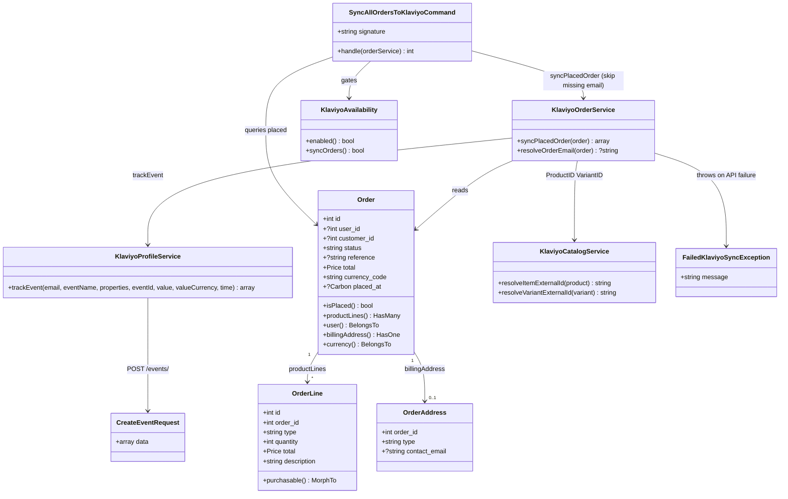

# One-Shot Klaviyo Order Sync Command

## Requirements

- Enable operators to sync all currently placed Lunar orders into Klaviyo in a single Artisan run so historical purchase data exists for segmentation and analytics after Mailchimp → Klaviyo migration
- Reuse the existing live order-event path (`Placed Order` + per-line `Ordered Product`) so identity and payload stay consistent with ongoing placement sync
- Keep the delivery minimal: one command, chunked inline processing, progress summary — no date filters, dry-run, queue coordinator, Bulk Events API, or payload enrichment
- Preserve chronology by sending each event’s Create Event `time` from the order’s `placed_at`
- Remain idempotent via existing stable `unique_id`s so accidental re-runs do not duplicate metrics

## Entities

## Approach

1. Command UX (Mailchimp parity, Lunar eligibility):
   - Add `klaviyo:sync-all-orders {--chunk=50}` in `packages/klaviyo`, modeled on `mailchimp:sync-all-orders` (confirm, progress bar, success/failure summary)
   - Eligible set: `Order::query()->whereNotNull('placed_at')` — not `status = completed`
   - Gate with `KlaviyoAvailability::enabled()` and `syncOrders()` (same pattern as product sync command)
   - Process **inline** in the Artisan process (call `KlaviyoOrderService` directly); do not fan out `SyncOrderToKlaviyo` or introduce a coordinator job

2. Shared event path extension:
   - Extend `KlaviyoProfileService::trackEvent` with optional `?DateTimeInterface $time = null`; when present, set Create Event `attributes.time` to ISO 8601
   - `KlaviyoOrderService::syncPlacedOrder` passes `$order->placed_at` as `time` for both Placed Order and Ordered Product calls
   - Keep existing properties, metric names from config, catalog ProductID/VariantID casing, and unique_id scheme unchanged (`(string) order.id` and `order:{id}:line:{lineId}`)
   - Do not add `backfill`, do not bump `api_revision`, do not enrich tax/shipping/discount/reference

3. Business logic and errors:
   - Per-order try/catch: record failure (order id, reference, message), continue; do not abort the whole run on one failure
   - Missing email is a **skip** (not a failure): `KlaviyoOrderService::syncPlacedOrder` returns `['skipped' => true, 'reason' => 'missing_email']` without throwing; command increments skipped and continues
   - Currency for `value_currency`: prefer `$order->currency?->code`, fall back to denormalized `$order->currency_code` (demo/legacy orders may lack a matching `currencies` row)
   - Return `FAILURE` if any order failed; otherwise `SUCCESS` (skips alone do not fail the run)
   - Ops note (docs/skill only): if Placed Order flows are live in Klaviyo, pause them during the one-time run

## Structure

### Inheritance Relationships

1. `SyncAllOrdersToKlaviyoCommand` extends `Illuminate\Console\Command`
2. `FailedKlaviyoSyncException` remains the existing package exception (no new exception type)
3. `Order` / `OrderLine` / `OrderAddress` remain existing Lunar core models — no schema changes

### Dependencies

1. `SyncAllOrdersToKlaviyoCommand` calls `KlaviyoAvailability` then `KlaviyoOrderService`
2. `KlaviyoOrderService` depends on `KlaviyoProfileService` and `KlaviyoCatalogService` (unchanged)
3. `KlaviyoProfileService` sends `CreateEventRequest` via `KlaviyoService` / `KlaviyoConnector`
4. `KlaviyoServiceProvider` registers the new command alongside existing Klaviyo commands

### Layered Architecture

1. Console Layer: `SyncAllOrdersToKlaviyoCommand` — gating, confirmation, chunking, progress, summary
2. Service Layer: `KlaviyoOrderService` — payload build + dual metric emit; `KlaviyoProfileService` — Create Event HTTP
3. HTTP Layer: Saloon `CreateEventRequest` / `KlaviyoConnector` — unchanged endpoint
4. Domain Layer: Lunar `Order` and relations — read-only for this feature
5. Support Layer: `KlaviyoAvailability`, `KlaviyoLogger` — gates and structured logs

## Operations

### Update Service Method - `KlaviyoProfileService::trackEvent`

1. Responsibility: Allow optional historical/accurate event timestamp on Create Event payloads
2. Signature change: add trailing parameter `?DateTimeInterface $time = null` after `$valueCurrency`
3. Logic:
   - After existing `value` / `value_currency` assignment, if `$time !== null`, set `$attributes['time']` to `$time->format(DATE_ATOM)` (or equivalent ISO 8601 with offset)
   - Leave behavior unchanged when `$time` is null (request-time default at Klaviyo)
4. Constraints: Do not add `backfill`; do not change unique_id / profile / metric construction
5. Call sites: Existing `TrackEventToKlaviyo` job remains valid (new param optional); order service will pass time

### Update Service Method - `KlaviyoOrderService::syncPlacedOrder`

1. Responsibility: Emit Placed Order + Ordered Product with chronological `time`
2. Logic:
   - After resolving `$email`: if missing, log warning and return `['skipped' => true, 'reason' => 'missing_email']` — do **not** throw
   - Resolve `$currency` as `$order->currency?->code ?? $order->currency_code` (never read `->code` on a null relation)
   - After resolving `$lines`, `$value`, `$currency`, compute `$eventTime = $order->placed_at` (Carbon|null)
   - Pass `$eventTime` into both `trackEvent` calls as `time:`
   - If `placed_at` is unexpectedly null on a queried placed order, still sync but omit `time` (null) — command query should prevent this
3. Constraints: Do not change Items/unique_id/ProductID/VariantID construction; do not add new properties

### Create Console Command - `SyncAllOrdersToKlaviyoCommand`

1. Responsibility: One-shot sync of all placed orders to Klaviyo
2. Location: `packages/klaviyo/src/Commands/SyncAllOrdersToKlaviyoCommand.php`
3. Signature: `klaviyo:sync-all-orders {--chunk=50 : Number of orders to process at a time}`
4. Description: Sync all placed orders from the database to Klaviyo as Placed Order / Ordered Product events
5. Method `handle(KlaviyoOrderService $orderService): int`:
   - If `! KlaviyoAvailability::enabled()` → error mentioning `KLAVIYO_ENABLED=true` → `FAILURE`
   - If `! KlaviyoAvailability::syncOrders()` → error mentioning `KLAVIYO_SYNC_ORDERS=true` → `FAILURE`
   - `$chunkSize = max(1, (int) $this->option('chunk'))`
   - `$query = Order::query()->whereNotNull('placed_at')`
   - `$totalOrders = (clone $query)->count()`; if 0 → info and `SUCCESS`
   - Info count; warn that this sends order events to Klaviyo; `confirm(..., true)` — if declined, cancel `SUCCESS`
   - Progress bar for `$totalOrders`
   - `$query->with(['user', 'billingAddress', 'currency', 'productLines.purchasable.product.variants'])->orderBy('id')->chunk($chunkSize, ...)`
   - For each order: try `$result = $orderService->syncPlacedOrder($order)` → if `($result['skipped'] ?? false)` then skipped++; else success++; catch `\Throwable` → failure++, push `{order_id, reference, error}`; always advance bar
   - Finish bar; print summary table (Total / Successfully Synced / Skipped / Failed)
   - If failures > 0: warn and show table of up to 10 errors; return `FAILURE`
   - Else return `SUCCESS` (skipped-only runs are successful)
6. Constraints: No queue dispatch; do not fire `OrderPlacedEvent`; do not import Mailchimp classes

### Update Provider - `KlaviyoServiceProvider::registerConsoleCommands`

1. Responsibility: Register the new Artisan command when running in console
2. Logic: Add `SyncAllOrdersToKlaviyoCommand::class` to the `$this->commands([...])` array

### Create/Update Tests - `tests/klaviyo`

1. Responsibility: Prove gates, eligibility path, and `time` on order events
2. Tests (Pest, follow existing Klaviyo test patterns / MockClient):
   - `klaviyo:sync-all-orders` fails when `enabled` false or `sync_orders` false
   - With enabled + sync_orders, a placed order with billing email triggers CreateEventRequest for Placed Order and Ordered Product including `attributes.time` matching `placed_at` (ATOM) and unchanged unique_ids / ProductID casing
   - Draft order (`placed_at` null) is not synced by the command query
   - Missing-email orders are skipped (not failed); command reports Skipped and still exits SUCCESS when no hard failures
   - Orders whose `currency` relation is null still sync using `currency_code` for `value_currency`
3. Use `Queue::fake()` where other suite tests do; this command must not push `SyncOrderToKlaviyo`

### Update Skill Doc - `.ai/skills/klaviyo/SKILL.md`

1. Responsibility: Document the new Artisan surface
2. Add under Artisan: `php artisan klaviyo:sync-all-orders --chunk=50` — requires `KLAVIYO_ENABLED` + `KLAVIYO_SYNC_ORDERS`; syncs all `placed_at` orders inline via `KlaviyoOrderService`; events include `time` from `placed_at`; idempotent via unique_id
3. Note optional: pause Placed Order flows in Klaviyo UI during a one-time historical run

## Norms

1. Package placement: All new code under `Lunar\Klaviyo\` in `packages/klaviyo`; tests under `tests/klaviyo`
2. Availability gates: Use `KlaviyoAvailability` helpers — do not raw-check config inconsistently in the command
3. Logging: Use `KlaviyoLogger` for service-level outcomes; command uses `$this->info` / `$this->error` / tables for operator UX
4. Exceptions: Reuse `FailedKlaviyoSyncException`; do not invent a second order-sync exception
5. PHP style: Explicit types, constructor promotion where applicable, curly braces, PHPDoc array shapes where already used in sibling methods
6. Naming: Metric property keys remain case-sensitive `ProductID` / `VariantID` / `OrderId` — never `ProductId`
7. No Mailchimp imports from Klaviyo package
8. Do not use Bulk Subscribe `historical_import` anywhere in this work
9. Pint / existing Pest patterns; register command only in `KlaviyoServiceProvider`

## Safeguards

1. Functional Constraints:
   - Only orders with non-null `placed_at` are eligible
   - Must reuse `KlaviyoOrderService::syncPlacedOrder` — no parallel payload builder
   - Must set Create Event `time` from `placed_at` when present
   - Must not change unique_id scheme or catalog identity algorithms
   - Out of scope: date/status filters, dry-run, resume flags, queue coordinator, Bulk Create Events, `backfill`, revision bump, Cancelled/Refunded metrics, DB sync ledger, property enrichment
2. Performance Constraints:
   - Process via `chunk()` with configurable size (default 50) to bound memory
   - Accept one HTTP Create Event call per Placed Order plus one per product line
3. Security Constraints:
   - Never log API keys; follow existing `KlaviyoLogger` practices
   - Command requires env-enabled flags before any API traffic
4. Integration Constraints:
   - Must not dispatch or listen via `OrderPlacedEvent` for backfill
   - Must not depend on queue workers for this command to complete
   - Live placement path continues to use `SyncOrderToKlaviyo` unchanged except for shared `time` improvement via the service
5. Business Rule Constraints:
   - Guest orders sync via billing `contact_email`; missing email → per-order **skip** (no API call, not counted as failure)
   - Cancelled/refunded/test orders with `placed_at` are included without special filters
   - Re-run is safe: Klaviyo unique_id first-wins
6. Exception Handling Constraints:
   - Per-order failures must not stop the chunk loop
   - Command exit code reflects whether any failures occurred
7. Technical Constraints:
   - API revision stays at package default (`2026-01-15` unless host overrides)
   - No new migrations or config keys required beyond existing `enabled` / `sync_orders`
8. Data Constraints:
   - `time` must be valid ISO 8601 datetime when sent
   - Event properties remain the current live set only
9. API Constraints:
   - Continue using `POST /api/events` via existing `CreateEventRequest`
   - Profile identifier remains email only for this path
