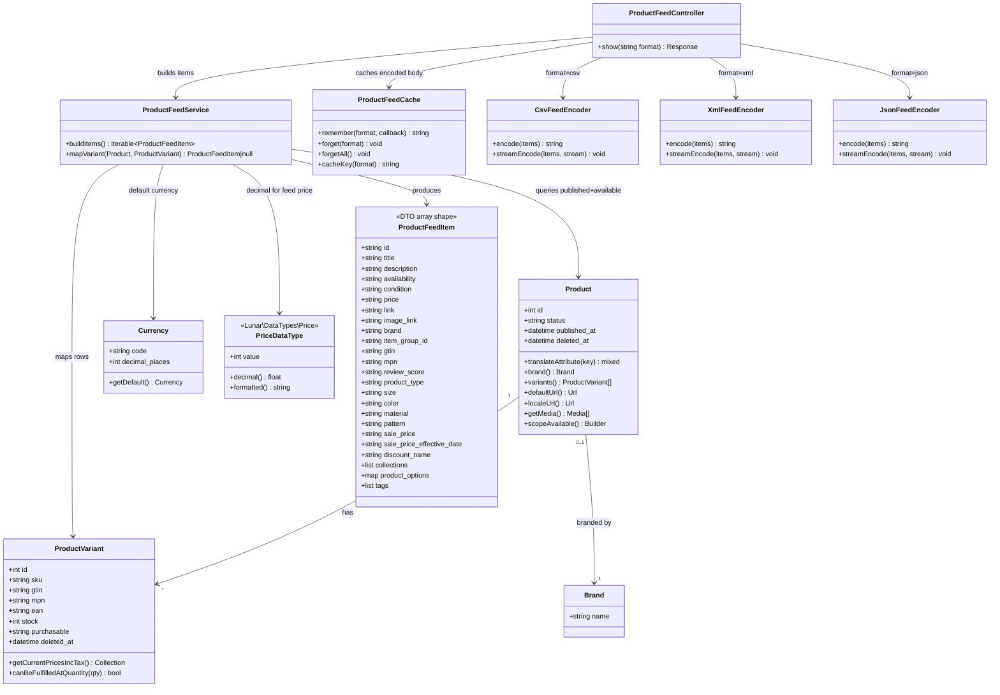

# Product Feed Endpoint (Meta/Google-Compatible)

## Requirements

- Provide a public, on-demand product data feed that external systems can pull without authentication.
- Serve the same catalog snapshot in three serializations by URL extension, with distinct consumers:
  - **CSV** → generic / Google-compatible tabular feed (also usable where Meta accepts CSV catalog upload/fetch)
  - **XML** → Google RSS product feed format (`g:` namespace) for Google Merchant Center scheduled fetch
  - **JSON** → custom integrators / internal tooling (not assumed to be directly consumable by Meta or Google)
- Expose Meta/Google-aligned product attributes (identity, title, description, price+currency, availability, condition, link, image, brand, identifiers) on CSV/XML so scheduled catalog fetches can use those formats without a transform middleman.
- Emit one feed row per purchasable variant (SKU), not only parent products.
- Exclude draft products and soft-deleted products/variants from the feed entirely.
- Inclusion vs availability (explicit):
  - A variant must be **purchasable** to appear in the feed.
  - If purchasable but currently unavailable because of stock → **include** with `availability=out_of_stock`.
  - If fundamentally not purchasable → **exclude** (do not emit a row).
- Skip variants that do not have a valid original/regular price in the default currency (do not emit `0.00` placeholders).
- Keep the surface thin: generate from Lunar catalog on demand (with response-body caching), no provider coupling (not Klaviyo/Mailchimp/Algolia), no admin UI or auth tokens in v1.
- Cache each format’s fully encoded response body (TTL, Laravel cache) so repeated crawler hits do not rebuild the full catalog every time; still no required prebuilt static file.

## Entities

## Approach

1. Package & API surface:
   - Add a thin `packages/product-feed` package (`Lunar\ProductFeed`) mirroring paypal/stripe: ServiceProvider + `loadRoutesFrom`, depends on `lunarphp/core` only.
   - Public route: `GET /feeds/products/{format}` where `format` ∈ `csv|xml|json`.
   - No auth middleware. Build catalog from Lunar on demand; serve via TTL-cached encoded bodies (see caching below).
   - Format roles:
     - **CSV** — Google Merchant tabular columns (`GoogleProductFeedAttributes`) plus Lunar `discount_name`.
     - **XML** — Google RSS 2.0 product feed with `xmlns:g="http://base.google.com/ns/1.0"`; **Google attributes only** (no `discount_name`, `collections`, `product_options`, `review_score`, `tags`).
     - **JSON** — richer custom-integrator payload: `price` / `sale_price` as `{ "amount": "251.00", "currency": "RON" }`; Lunar extras `discount_name` (only when sale active), `collections` (string array), `product_options` (object map), `review_score`, `tags` (string array).

2. Technical implementation:
   - **v1 feed context:** The feed represents the catalog visible to the default Lunar Channel and default Customer Group, priced in the default Currency. Establish that context (e.g. via `StorefrontSession`) before querying with Lunar’s existing availability scopes (`available()` / channel + customer-group rules), matching how storefront visibility works.
   - Query published, non-deleted products with non-deleted variants under that context; eager-load `variants.prices.currency`, `variants.values.option`, `brand`, `media`, `tags`, `collections.ancestors`, URL relations (`defaultUrl` / `localeUrl`). When the Review package is present (Product `getRatingAverage` macro), also eager-load `variants.reviews` to avoid N+1.
   - Map each variant to a shared attribute array; encode via format-specific encoders (XML/CSV filter to Google keys as defined).
   - Content-Types: `text/csv; charset=UTF-8`, `application/xml; charset=UTF-8`, `application/json`.
   - Availability dialect for CSV/XML (v1): Google-style `in_stock` / `out_of_stock`.
   - **Price:** Service maps original/regular default-currency price via `getOriginalPricesIncTax()` + `DataTypes\Price::decimal()` + currency code as `{amount} {CODE}` for CSV/XML (e.g. `150.00 RON`). **JSON** expands `price` to `{ "amount": "150.00", "currency": "RON" }`.
   - **Sale price:** Emit only when current discounted price is **strictly lower** than original (`getCurrentPricesIncTax()` value < original). CSV/XML use `{amount} {CODE}`; JSON uses `{ "amount", "currency" }`. Omit `sale_price` entirely when there is no active discount / prices are equal.
   - **Sale price effective date:** Google attribute on **CSV, XML, and JSON**. When `sale_price` is present and the discount has `starts_at`, emit `sale_price_effective_date` as `ISO8601/ISO8601` (start/end). Use discount `ends_at` when set; if open-ended (`ends_at` null), end = `starts_at + 10 years` so Google’s required range format is still valid.
   - **Discount name:** Lunar-only. Emit `discount_name` for **CSV and JSON** only when `sale_price` is present (active discount); **never** emit in XML; omit when no discount.
   - **Product type:** Google `product_type` = **main (root) collection name only** for the product’s first collection (NestedSet root ancestor, or the collection itself if top-level). Not a breadcrumb path.
   - **Collections (JSON only):** `collections` as a list of attached collection names (each collection’s own name, not breadcrumbs).
   - **Product options:** Map option names containing size/color/colour/material/pattern to Google attributes `size`, `color`, `material`, `pattern` for all formats. JSON also includes full `product_options` object `{ "Size (UK)": "UK 7", "Color": "Blue" }`. Do **not** emit a combined `product_options` text field in CSV/XML.
   - **Review score / tags:** Lunar extras for **JSON only** (`review_score`, `tags` array). Soft optional review score via `getRatingAverage()` when Review package is present.
   - `condition`: always `new`.
   - Unsupported or invalid `format`: HTTP 404.
   - **Response-body caching (v1):** Cache the **fully encoded string body** per format (not raw Eloquent / feed items). Use Laravel `Cache::remember` via a thin `ProductFeedCache` helper.
     - Config under `lunar.product-feed.cache`: `enabled` (default `true`), `ttl` seconds (default `3600`), `key_prefix` (default `lunar.product-feed`), optional `store` (`null` = default cache store).
     - Cache key: `{key_prefix}.{format}` (e.g. `lunar.product-feed.csv`).
     - When `enabled` is false, always rebuild (same as pre-cache behavior).
     - Invalidation in v1 is **TTL-only** (no product/discount event listeners yet). Expose `forget($format)` / `forgetAll()` so hosts or a later increment can flush on catalog changes.
     - When caching is enabled, also send `Cache-Control: public, max-age={ttl}` so CDNs/crawlers can reuse responses; when disabled, omit that header (or use `no-store` only if needed — prefer omit).
     - Do **not** use Algolia/Scout as the feed source; cache sits in front of the existing Lunar DB mapping path.
     - Headers that are request-time (e.g. CSV `Content-Disposition` filename with today’s date) stay outside the cached body.
   - **Chunked catalog query:** `ProductFeedService::buildItems()` must **not** `->get()` the full catalog. Use Eloquent `lazyById($chunkSize)` (config `lunar.product-feed.query.chunk_size`, default `100`) so only one product page (+ eager loads) is in memory at a time while yielding feed items. Public contract stays `iterable`.
   - **Streamed encoding / HTTP:**
     - Encoders implement `streamEncode(iterable $items, resource $stream): void` that writes the format incrementally to an open stream; `encode()` is a thin wrapper over `php://temp` + `streamEncode` (same bytes either path).
     - **Cache enabled:** on miss, build via `encode()` (chunked DB) then store/return the full string body as today (cache requires a complete string).
     - **Cache disabled:** return Laravel `response()->stream(...)` that `streamEncode`s to `php://output` so the client receives bytes while products are still being loaded/mapped — bounds PHP memory for large catalogs without a warm cache.

3. Business logic:
   - Include only products with `status = published` that pass Lunar availability for the default channel + default customer group.
   - Soft-deleted products and soft-deleted variants must never appear (rely on default Eloquent SoftDeletes scopes; do not `withTrashed()`).
   - Draft products (`status = draft`) must never appear.
   - **Purchasable gate (include/exclude):** Reuse Lunar purchasability — product must be purchasable for the default customer group (`canPurchaseProduct()` / `purchasableCustomerGroups`). Variant must be fundamentally purchasable for sale (exclude when variant purchasability is configured as not sellable, e.g. `purchasable = out_of_stock`). Non-purchasable → no feed row.
   - **Stock vs availability (for included rows only):** Temporary stock unavailability does **not** exclude the row. Use `canBeFulfilledAtQuantity(1)` only to set `availability`: true → `in_stock`, false → `out_of_stock`. Do not invent a parallel stock heuristic.
   - **Skip variants without a valid original/regular price** in the default currency (missing price → omit the row entirely; never emit `0.00 {CODE}`).
   - Row identity `id`: prefer non-empty variant `sku` (sanitize `/` → `-` if present for stability); else `variant-{id}`.
   - `item_group_id`: `(string) $product->id` so variants group under one product in catalogs.
   - Strip HTML from descriptions; fall back to title when empty.
   - Trim whitespace on mapped text fields (`title`, `description`, `brand`, identifiers, etc.) so trailing/leading spaces from CMS content do not leak into feed output.
   - **Product URL (`link`):** Use Lunar’s existing URL mechanism (`HasUrls` — `defaultUrl` / `localeUrl`) to resolve the product slug. Do **not** manually invent slug logic or hardcode `config('app.url').'/'.$slug` as the primary design (that is what marketing sync currently does as a shortcut). Turn the Lunar URL record into an absolute storefront link via package config (e.g. named Laravel route that accepts the slug, or an explicit absolute URL template). Lunar core stores SEO slugs, not full storefront URLs — absolute link assembly must go through that configured storefront URL mechanism on top of Lunar’s URL API. Variants with no resolvable product URL: skip the row or omit `link` only if still valid for the target format; prefer skip when `link` would be required for CSV/XML consumers.
   - `image_link`: primary product image URL via existing media API when present; omit empty optional Google/Lunar fields per format rules above.
   - `product_type`: main collection name only (see Approach).
   - `review_score` / `tags` / `collections` / `product_options`: JSON Lunar extras only (except Google-mapped size/color/material/pattern which appear in all formats).

## Structure

### Inheritance Relationships
1. `ProductFeedServiceProvider` extends Laravel `ServiceProvider` — merges config, loads routes, registers bindings.
2. Format encoders implement a shared `ProductFeedEncoder` interface (`encode(iterable $items): string`, `streamEncode(iterable $items, $stream): void`, `contentType(): string`).
3. `ProductFeedCache` is a plain package helper (no Eloquent); wraps Laravel Cache for encoded bodies.
4. No new Eloquent models — reuse Lunar `Product`, `ProductVariant`, `Brand`, `Currency`, `Url`, media, and `Lunar\DataTypes\Price`.

### Dependencies
1. `ProductFeedController` injects `ProductFeedService`, `ProductFeedCache`, and a format→encoder resolver/map.
2. `ProductFeedService` reads Lunar models, `Currency::getDefault()`, `StorefrontSession` (default channel + customer group), Lunar URL relations, pricing helpers (`getCurrentPricesIncTax`, `DataTypes\Price::decimal()`), and optionally Product `getRatingAverage()` when the Review package is installed.
3. `ProductFeedCache` wraps Laravel `Cache` facade (optional named store from config); stores encoded body strings only.
4. Encoders depend only on the flat `ProductFeedItem` attribute arrays (no Eloquent); write via `streamEncode` to a stream resource.
5. Package does not depend on Klaviyo, Mailchimp, or Algolia; Review is a soft optional integration (no hard composer require).

### Layered Architecture
1. Route layer: `routes/web.php` — public GET with `{format}` constraint.
2. Controller layer: resolve encoder → if cache enabled: `remember` + `encode` → string `Response`; if cache disabled: `response()->stream` + `streamEncode` → `StreamedResponse`. Headers: Content-Type (+ Cache-Control when caching enabled; CSV Content-Disposition).
3. Service layer: establish default feed context → **lazyById-chunked** available catalog → yield mapped items (skip unpriced / unlinkable as defined).
4. Encoder layer: CSV / Google RSS XML / JSON serialization via `streamEncode` / `encode`.
5. Cache layer: TTL store of encoded bodies per format (`ProductFeedCache`).
6. Data layer: existing Lunar core models (no new tables).

## Operations

### Create Package Scaffold - `packages/product-feed`
1. Responsibility: New Lunar package hosting the public feed.
2. Files:
   - `composer.json` — name `lunarphp/product-feed`, namespace `Lunar\ProductFeed\`, provider auto-discovery, require `lunarphp/core: self.version`.
   - Root monorepo `composer.json` — add path/replace/require entry consistent with other `lunarphp/*` packages.
   - `config/product-feed.php` — storefront URL resolution (named route and/or absolute URL template using Lunar slug), `route_prefix` default `feeds`, `cache` (`enabled`, `ttl`, `key_prefix`, optional `store`), and `query.chunk_size` (default `100`).
   - `src/ProductFeedServiceProvider.php` — `mergeConfigFrom`, `loadRoutesFrom`, bind encoder map + `ProductFeedCache`.
   - `routes/web.php` — register feed route.
3. Constraints: Do not modify Klaviyo/Mailchimp catalog code.

### Create Route - `GET /feeds/products/{format}`
1. Responsibility: Public entry point.
2. Definition:
   - `Route::get('feeds/products/{format}', [ProductFeedController::class, 'show'])->whereIn('format', ['csv', 'xml', 'json'])->name('product-feed.show');`
3. Middleware: web stack is fine; must remain unauthenticated (no `auth` middleware).
4. Constraints: Invalid format → Laravel 404 via `whereIn`.

### Create Cache Helper - `ProductFeedCache`
1. Responsibility: TTL cache for fully encoded feed bodies per format.
2. Methods:
   - `remember(string $format, callable $callback): string` — when caching disabled, invoke callback and return; when enabled, `Cache::store(...)->remember(cacheKey($format), ttl, $callback)`.
   - `forget(string $format): void` — forget one format key.
   - `forgetAll(): void` — forget `csv`, `xml`, and `json` keys.
   - `cacheKey(string $format): string` — `{key_prefix}.{format}`.
   - `isEnabled(): bool` / `ttl(): int` — read from config.
3. Constraints: Store only `string` bodies; never cache Eloquent models or item arrays.

### Create Controller - `ProductFeedController`
1. Responsibility: Orchestrate format selection, cache, and HTTP response (buffered or streamed).
2. Methods:
   - `show(string $format): \Symfony\Component\HttpFoundation\Response`
     - Logic:
       - Resolve encoder for `$format`; 404 if unknown.
       - Build common headers: `Content-Type`; CSV `Content-Disposition`; when cache enabled, `Cache-Control: public, max-age={ttl}`.
       - **If cache enabled:** `$body = $this->feedCache->remember($format, fn () => $encoder->encode($this->feedService->buildItems()));` return `response($body, 200, $headers)`.
       - **If cache disabled:** return `response()->stream(function () use ($encoder) { $out = fopen('php://output', 'wb'); $encoder->streamEncode($this->feedService->buildItems(), $out); }, 200, $headers)` — do not `fclose` `php://output`.
3. Dependency Injection: `ProductFeedService`, `ProductFeedCache`, encoder resolver.
4. Constraints: Cached value is the encoded body only; response headers are assembled per request; streamed and buffered paths must produce identical body bytes for the same catalog snapshot.

### Implement Service - `ProductFeedService`
1. Responsibility: Load eligible catalog and map to feed attribute arrays.
2. Core Methods:
   - `buildItems(): iterable`
     - Input Validation: none (public feed).
     - Business Logic:
       1. Set v1 feed context: default Channel + default Customer Group on `StorefrontSession`; prices use default Currency.
       2. Query products with `status = published` and Lunar availability for that context (e.g. `available()`), SoftDeletes excluding deleted products; further require purchasable for the default customer group (`purchasableCustomerGroups` / `canPurchaseProduct()`).
       3. Eager-load: `variants` (soft-delete scope excludes deleted variants), `brand`, media, `defaultUrl`/`localeUrl`, variant prices+currency, etc. (`feedEagerLoads()`).
       4. Iterate with `lazyById(max(1, (int) config('lunar.product-feed.query.chunk_size', 100)))` — **never** load the full catalog via `get()`.
       5. For each product, foreach variant: if not fundamentally purchasable, skip; else call `mapVariant` and yield only non-null results.
     - Return Value: `iterable` (generator) of feed item arrays.
   - `mapVariant(Product $product, ProductVariant $variant): ?array`
     - Precondition: caller already enforced purchasable gate (non-purchasable variants never reach here).
     - Resolve default-currency **original** price via `getOriginalPricesIncTax()`; **if none, return `null` (skip)**.
     - Resolve absolute `link` via Lunar URL API + package storefront URL config; **if required link cannot be resolved, return `null` (skip)** for CSV/XML safety.
     - Build Meta/Google-aligned fields:
       - `id` — SKU or `variant-{id}`
       - `title` — `trim(translateAttribute('name'))`
       - `description` — `trim(strip_tags(description))` or title when empty after trim
       - `availability` — from `canBeFulfilledAtQuantity(1)` → `in_stock` / `out_of_stock` (stock shortage only; row already passed purchasable gate)
       - `condition` — `new`
       - `price` — original/regular price via `getOriginalPricesIncTax()` formatted `{amount} {CODE}` using `Price::decimal()`
       - `sale_price` — only when `getCurrentPricesIncTax()` for default currency is strictly lower than original; same format
       - `sale_price_effective_date` — when sale_price set and discount has `starts_at` (`ISO8601/ISO8601`; open-ended → start + 10 years); all formats (CSV/XML/JSON)
       - `discount_name` — CSV/JSON only when sale_price set; never XML
       - `link` — absolute URL from Lunar slug + configured storefront URL mechanism
       - `image_link` — absolute image URL when available
       - `brand` — trimmed brand name when present
       - `item_group_id` — `(string) $product->id`
       - `gtin` — trimmed variant gtin/ean when present
       - `mpn` — trimmed variant mpn when present
       - `product_type` — main (root) collection name
       - `size` / `color` / `material` / `pattern` — from matching variant option names
       - `product_options` — JSON object map of all option name → value
       - `collections` — JSON list of attached collection names
       - `review_score` — JSON only when Product `getRatingAverage()` > 0
       - `tags` — JSON list of tag values
3. Dependency Injection: none required beyond facades/models; keep constructable.
4. Transaction Management: read-only; no DB writes.

### Implement Encoder Interface + Encoders
1. Interface `ProductFeedEncoder`:
   - `encode(iterable $items): string` — implement as temp-stream + `streamEncode` + `stream_get_contents` (identical output to streaming path).
   - `streamEncode(iterable $items, mixed $stream): void` — write complete document/body to an open writable stream resource; must not close the stream.
   - `contentType(): string`
   - `downloadFilename(): ?string` — optional download name; `null` means no `Content-Disposition` attachment
2. `CsvFeedEncoder`:
   - UTF-8 CSV with header row = `GoogleProductFeedAttributes::KEYS` + `discount_name`.
   - `streamEncode`: `fputcsv` header then rows onto `$stream`.
   - Content-Type: `text/csv; charset=UTF-8`
   - `downloadFilename()`: `{slug(app.name)}-product-feed-{Y-m-d}.csv`
   - Consumer intent: Google Merchant Center–compatible CSV (+ discount_name for operators).
3. `XmlFeedEncoder`:
   - RSS 2.0 document: `<rss version="2.0" xmlns:g="http://base.google.com/ns/1.0"><channel>…<item>…`
   - Emit only `GoogleProductFeedAttributes::KEYS` as `<g:{key}>` (plus conventional RSS `title`/`link`/`description` on the item).
   - Never emit `discount_name`, `collections`, `product_options`, `review_score`, or `tags`.
   - `streamEncode`: build via `XMLWriter` (memory or URI) and write completed document (or flush per item via `outputMemory(true)`) to `$stream` — result must match prior `encode()` bytes for the same items.
   - Content-Type: `application/xml; charset=UTF-8`
   - Consumer intent: Google RSS product feed (Merchant Center scheduled fetch).
4. `JsonFeedEncoder`:
   - JSON array of item objects including Google fields and Lunar extras (`discount_name`, `collections` array, `product_options` object, `review_score`, `tags` array).
   - Expand `price` and `sale_price` from `{amount} {CODE}` strings into `{ "amount": "...", "currency": "..." }` objects.
   - Omit `sale_price` / `discount_name` when not present on the mapped item (no active discount).
   - `streamEncode`: write `[`, then comma-separated `json_encode`d objects, then `]` to `$stream` (no full `$payload[]` accumulation required).
   - Content-Type: `application/json`
   - `downloadFilename()`: `null`
   - Consumer intent: custom integrators.
5. Constraints: Encoders must not change attribute semantics — only serialization. `encode()` and `streamEncode()` must produce the same body for the same item iterable.

### Wire Monorepo + Tests
1. Register package in root composer replace/require/autoload as siblings do.
2. Add Pest suite `tests/product-feed/` and phpunit.xml testsuite entry if required by repo convention.
3. Tests (Pest + RefreshDatabase):
   - Published available product with priced variant appears in csv/xml/json with expected Content-Type; CSV includes `Content-Disposition` filename with app name + current date.
   - Draft product does not appear.
   - Soft-deleted product does not appear.
   - Soft-deleted variant does not appear while sibling live variant does.
   - Variant without a valid default-currency current price does not appear.
   - Fundamentally non-purchasable product/variant does not appear.
   - Purchasable variant that cannot currently fulfill qty 1 still appears with `availability=out_of_stock`.
   - Invalid format returns 404.
   - Price string uses Lunar decimal + currency code (`{amount} {CODE}`) in CSV/XML; JSON uses `{amount, currency}` objects; with an active catalog discount, `price` stays original and `sale_price` is present only when lower; `discount_name` appears in JSON/CSV only when sale is active.
   - `product_type` is the main collection; JSON `collections` / `product_options` are structured; XML uses `g:size` / `g:color` etc.
   - With caching enabled (array/cache driver in tests): first request stores body; second identical request returns the same body; after `forgetAll()` (or cache disabled), a catalog change is reflected on the next request.
   - Distinct formats use distinct cache keys (csv body ≠ xml body).
   - With `query.chunk_size = 1` and multiple eligible products, all products still appear in the feed (lazyById pagination correctness).
   - With caching disabled, streamed responses still return identical feed content for csv/xml/json as the buffered path (spot-check via HTTP get).
   - `encode()` and `streamEncode()` produce the same bytes for a fixed item list (unit-level encoder check).
4. TestCase: use Core TestCase (or thin package TestCase), register `ProductFeedServiceProvider`, seed default Language/Currency/Channel/CustomerGroup as other package tests do.

## Norms

1. PHP 8.3+ / Laravel conventions of this monorepo: constructor promotion, explicit return types, curly braces always.
2. Namespace: `Lunar\ProductFeed\...`; config key prefix consistent with package merge path.
3. Prefer PHPDoc array shapes for feed item arrays over inventing heavy DTO classes unless clarity demands a readonly DTO.
4. Dependency injection via Laravel container; reuse Lunar facades already used elsewhere (`Currency`, `StorefrontSession`, Channel/CustomerGroup defaults).
5. Exception handling: invalid format handled by routing (404); do not invent a GlobalExceptionHandler for this package. Unexpected mapping errors should fail the request normally (reportable) rather than silently omitting the whole feed.
6. Logging: optional debug only; do not log full catalog payloads.
7. Descriptions: always `strip_tags` before output; trim whitespace on mapped text fields (`title`, `description`, `brand`, `gtin`, `mpn`, SKU-derived `id`).
8. Do not call `withTrashed()` on Product or ProductVariant queries in this feature.
9. Prefer Lunar primitives over reinventing: URL relations for slugs, `DataTypes\Price::decimal()` for amounts, `available()` / `canPurchaseProduct()` (or `purchasableCustomerGroups`) for visibility/purchasable inclusion, and `canBeFulfilledAtQuantity(1)` only for the `availability` attribute.
10. Do not couple to marketing packages or Algolia/Scout for feed generation; mapping inspiration from Klaviyo catalog is fine, code sharing is not required for v1.
11. Tests in Pest; follow existing `tests/{package}` layout.
12. Pint / existing code style; no drive-by refactors outside the new package and monorepo wiring.
13. Feed body caching uses Laravel `Cache` + package config only; do not introduce a second caching abstraction or HTTP kernel middleware for this package in v1.
14. Catalog iteration uses `lazyById` + configurable `query.chunk_size`; do not reintroduce full-catalog `get()` in `buildItems()`.
15. Prefer `streamEncode` as the single serialization implementation; keep `encode()` as a wrapper so cache and tests can still obtain a string.

## Safeguards

1. Functional Constraints:
   - Only `status = published` products that are available on the default Channel to the default Customer Group are included.
   - Soft-deleted products are excluded (default SoftDeletes scope).
   - Soft-deleted variants are excluded (default SoftDeletes scope).
   - Draft products are never included.
   - Variants without a valid original/regular price in the default Currency are skipped (no zero-price rows).
   - Non-purchasable products/variants are excluded from the feed.
   - Purchasable variants that are only stock-unavailable remain in the feed with `availability=out_of_stock`.
   - Supported formats limited to `csv`, `xml`, `json` with the consumer roles defined above.
   - Feed body is built from Lunar on demand; encoded bodies may be TTL-cached per format. No required prebuilt static file on disk.
   - Endpoint is public (no authentication).
2. Performance Constraints:
   - Eager-load relations to avoid N+1.
   - Cache fully encoded bodies per format when `lunar.product-feed.cache.enabled` is true (default TTL 3600s); disable via config for always-fresh generation.
   - Catalog query uses `lazyById` with `lunar.product-feed.query.chunk_size` (default 100) so Eloquent memory is bounded per chunk on every build (cache miss or cache disabled).
   - When cache is disabled, HTTP responses are streamed (`streamEncode` → `php://output`) so encoded output is not fully buffered in PHP before send.
   - When cache is enabled, miss path still materializes the full encoded string for storage (acceptable); Eloquent chunking still applies.
   - Invalidation is TTL-based (+ manual `forget` / `forgetAll`); event-driven flush remains a later increment.
3. Security Constraints:
   - Public read-only catalog data only (no customer, order, or PII fields).
   - Do not expose admin-only attributes or internal costs.
4. Integration Constraints:
   - CSV/XML emit Google Merchant attributes (`id`, `title`, `description`, `availability`, `condition`, `price`, `sale_price`, `sale_price_effective_date`, `link`, `image_link`, `brand`, `gtin`, `mpn`, `item_group_id`, `size`, `color`, `material`, `pattern`, `product_type`). CSV additionally includes `discount_name`. XML must not include Lunar-only fields.
   - `price` is always the regular/original amount; `sale_price` is only the active discounted amount when lower. Both must be `AMOUNT CURRENCY` with ISO 4217 code and `.` decimals, derived via Lunar `Price::decimal()` + currency code — not locale currency formatting.
   - XML must declare Google `g:` namespace (Google RSS feed).
   - JSON carries structured prices (`price`/`sale_price` objects) and Lunar extras for custom integrators; it is not a Meta/Google scheduled-feed format.
5. Business Rule Constraints:
   - One row per included non-deleted, purchasable, priced variant of each eligible published product.
   - Service → Encoder contract uses `iterable` (`buildItems(): iterable`, `encode` / `streamEncode`).
   - `condition` is always `new`.
   - v1 context is default Channel + default Customer Group + default Currency only.
6. Exception Handling Constraints:
   - Unknown format → 404.
   - No custom business exception hierarchy required for v1.
7. Technical Constraints:
   - New code lives in `packages/product-feed` (+ monorepo composer/phpunit wiring + tests).
   - No new database migrations.
   - No changes to Klaviyo/Mailchimp sync behavior.
   - Product links must be built from Lunar URL records + configured storefront URL mechanism, not ad-hoc slug concatenation as the designed approach.
8. Data Constraints:
   - Empty optional fields may be omitted from JSON objects / XML elements; CSV keeps stable Google (+ discount_name) headers with empty cells.
   - `id` must be stable and unique within the feed.
9. API Constraints:
   - Route: `GET /feeds/products/{format}`
   - Success: 200 + correct Content-Type + body
   - Invalid format: 404
